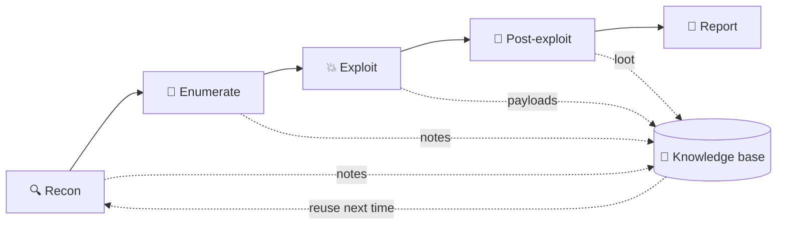

# 📝 LNX.8 · Documentation & Note-Taking

> [!abstract] Master Note of [[Branch Root Control]]
> The most underrated skill in security. A hacker who documents beats a smarter hacker who doesn't — because the win isn't finding a technique once, it's *never having to rediscover it*. Your notes are the difference between guessing and recalling.

## Why notes decide the outcome
- **Engagements** — record every host, credential, command, and finding *as you go*. The deliverable of a pentest is the **report**; disciplined notes make writing it possible (and repeatable when a client asks "how did you get in?").
- **Legal & scope safety** — timestamps and command logs prove you stayed in scope. If it isn't written down, it didn't happen.
- **CTFs** — you'll revisit a box hours later; notes on open ports, tried payloads, and dead ends stop you looping.
- **Research & learning** — turning "I read about SUID once" into a searchable, linked knowledge base is how a Crook compounds into a Root. *This vault is that principle applied.*



## A structured method — capture per target
1. **Scope & rules** — IPs/domains in scope, timing window, contacts. *Before anything else.*
2. **Recon** — Nmap output, open ports, service versions.
3. **Enumeration** — users, directories, interesting files, versions to research.
4. **Exploitation** — the exact payload/command that worked (copy-pasteable).
5. **Post-exploitation** — creds found, privesc path, loot locations, pivots.
6. **Screenshots** — proof for the report (`flameshot gui`, `scrot`, `gnome-screenshot`).

A simple, repeatable per-box skeleton:
```markdown
# 10.10.10.5 — "Blocky"
## Ports (nmap)
- 22 ssh OpenSSH 7.2 · 80 http Apache 2.4 · 3306 mysql
## Enumeration
- /wp-content/... → WordPress; creds in wp-config.php
## Foothold
- ssh notch:<pass from config>  → user.txt
## PrivEsc
- sudo -l → (ALL) NOPASSWD  → sudo su  → root.txt
## Loot
- notch:8bap... (mysql root)
```

## The tools
| Tool | Character |
| --- | --- |
| **Obsidian** | Markdown + **`**wikilinks**`** + a **graph view** — an interlinked *second brain* (exactly what you're reading). Local files, plugins, offline. The modern favourite. |
| **CherryTree** | Hierarchical, tree-structured notebook, rich text + per-node syntax highlighting; single encrypted file — a long-time pentest staple. |
| **Joplin** | Open-source Markdown notebooks with end-to-end encryption and sync. |
| **Notion** | Cloud, collaborative, database-style pages — great for teams, weaker for offline/air-gapped work. |
| **Standard editors** | `vim`/VS Code + plain Markdown, version-controlled with `git` — always available, zero setup. |
| **Sysreptor / Pwndoc** | Purpose-built pentest **reporting** platforms that turn findings into client deliverables. |

## Why a knowledge base makes a red teamer *fast*
The pro difference isn't memory — it's a **personal, searchable arsenal**:
- A **payload library** (reverse shells, SQLi strings, SUID one-liners) you paste in seconds instead of re-deriving.
- A **methodology checklist** so you never skip a step under time pressure.
- **Linked cross-references** — "this box's misconfig is the same class as one three engagements ago."
- **Report acceleration** — findings written once, reused as templates.

> [!tip] Crook → Root
> **Crook** keeps everything in their head and re-Googles the same command weekly. **Root** built a knowledge base years ago, links every new finding into it, and pastes a working payload from memory-on-disk while others are still searching. Document relentlessly — it's the cheapest force-multiplier in the field.

---
> 🔼 Up: [[Branch Root Control]]
