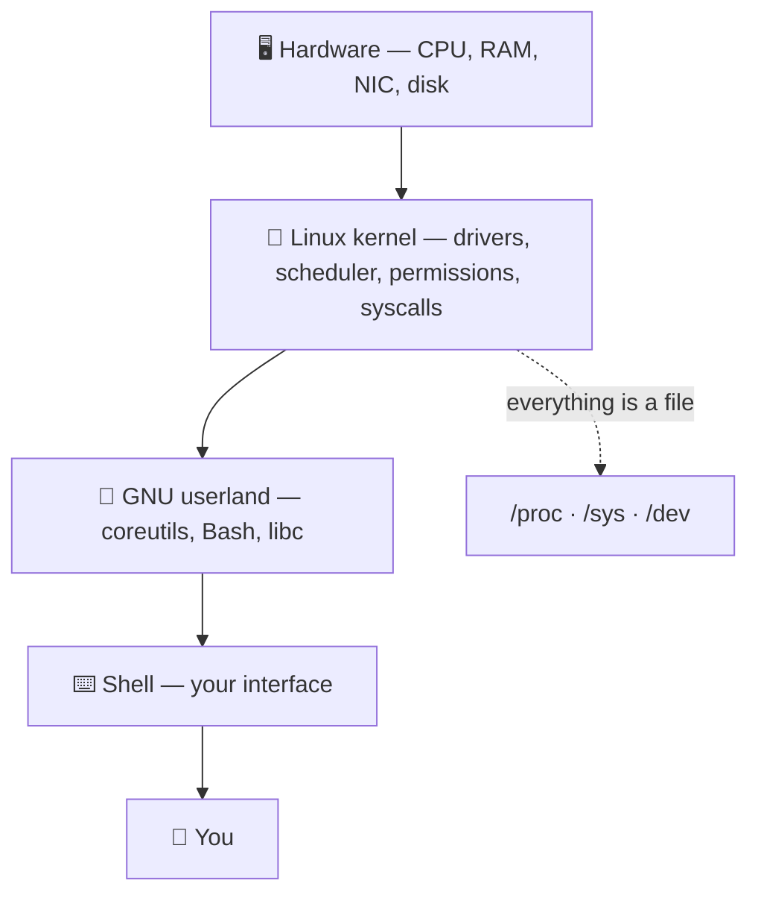

# 🐧 LNX.1 · Introduction & Distributions

> [!abstract] Master Note of [[Branch Foundations]]
> Before a single command, understand *why* nearly all offensive and defensive security runs on Linux — and which flavour to run, where, and on what hardware. This is the Crook's first step onto solid ground.

## What "Linux" actually is
"Linux" is precisely the **kernel** — the core that talks to hardware, schedules processes, and enforces permissions. A usable system wraps that kernel in the **GNU** userland (coreutils, Bash), a package manager, and optionally a desktop. A **distribution ("distro")** is a specific bundle of those pieces.



## Why Linux dominates cybersecurity
- **Open-source & auditable.** The entire kernel and userland source is public — you can read exactly what a tool does, patch it, and trust it. It's also free, so a full lab costs nothing.
- **Complete system control.** Linux hands you the whole machine: raw sockets, kernel modules, every process and file, and the almighty **`root`** account. Packet crafting, ARP spoofing, and Wi‑Fi monitor mode are impossible on a locked-down consumer OS.
- **The CLI *is* the system.** Everything is scriptable, pipeable, and remotable over **SSH**. Automation, chained tooling, and headless servers all flow from a first-class command line.
- **"Everything is a file."** Devices (`/dev/sda`), processes (`/proc`), and kernel state (`/sys`) are exposed as files, so a handful of tools (`cat`, `grep`, `find`) inspect the entire system.
- **It runs everything.** ~90% of the public cloud, most web servers, Android, routers, and IoT are Linux — so the systems you attack and defend *are* Linux.

## The security distributions
| Distro | Base · Package mgr | Release model | Character |
| --- | --- | --- | --- |
| **Ubuntu** | Debian · `apt` | Fixed (6-mo / LTS) | The friendly on-ramp — stable, huge community, the default for **servers** and beginners. Learn Linux here. |
| **Kali Linux** | Debian · `apt` | Rolling | The industry-standard pentest distro — 600+ tools preinstalled; the common language of CTFs and courses. |
| **Parrot OS** | Debian · `apt` | Rolling | Kali's lighter, privacy-focused cousin — sandboxing, anonymity tooling, gentler on low-spec hardware. |
| **Arch Linux** | Independent · `pacman` | Rolling | Minimal, build-it-yourself. Total control and bleeding-edge packages via the **AUR**; you learn the system by assembling it. |
| **BlackArch** | Arch · `pacman` | Rolling | Arch + **2800+** security tools as an overlay repo — the Arch user's pentest arsenal. |

> **Rolling vs fixed release:** a *rolling* distro (Arch, Kali) continuously ships the newest packages — latest tools, occasional breakage. A *fixed* release (Ubuntu LTS) freezes versions for stability — ideal for servers you can't babysit.

```shell-session
# The same job, three package managers:
$ sudo apt install nmap        # Debian / Ubuntu / Kali / Parrot
$ sudo pacman -S nmap          # Arch / BlackArch
$ sudo dnf install nmap        # Fedora / RHEL
```

## Where to run it — four installs
| Method | Best for | Trade-off |
| --- | --- | --- |
| **Bare-metal** | Daily driver, wireless & GPU work | Commit the whole disk |
| **VM** (VirtualBox/VMware) | Learning, disposable targets, snapshots | Hardware is emulated/limited |
| **Dual-boot** | Native performance + keep another OS | Reboot to switch |
| **WSL2** (on Windows) | Quick Linux CLI on a Windows host | No raw hardware, limited for offence |
| **Live USB** | Forensics, try-before-install, amnesic use | Nothing persists (by default) |

## Bare-metal vs virtual machine
Running your attack OS **natively on the hardware** instead of inside a VM matters more than beginners think:
- **Raw performance.** No hypervisor tax — full CPU, full RAM, no disk/IO translation. A long **Hashcat** crack or a big Nmap sweep runs meaningfully faster.
- **Direct hardware access** (the big one). A VM hides or emulates hardware; bare-metal gives the OS the *real* device:
  - **Wi‑Fi adapters** get true **monitor mode** and **packet injection** — essential for wireless attacks; USB pass-through to a VM is flaky and often breaks capture.
  - **GPUs** are fully available for password cracking; VM GPU pass-through is fragile and lossy.
  - **USB, Bluetooth, SDR, Proxmark** devices "just work" without pass-through gymnastics.
- **Trade-off:** VMs win on **snapshots, isolation, and disposability** — perfect for detonating malware or throwaway targets.

> [!info] The pro setup
> Often **both**: bare-metal Kali/Arch as the daily attack host for real wireless + GPU cracking, and VMs for sacrificial targets and risky samples. Use a VM to *learn* safely; go bare-metal when you need real hardware or maximum performance.

> [!tip] Crook → Root
> **Crook** installs Kali because a tutorial said so. **Root** picks the tool for the job — Kali/Parrot for a ready arsenal, Arch/BlackArch for a lean custom rig, Ubuntu for a rock-solid server — and can rebuild any of them from memory.

---
> 🔼 Up: [[Branch Foundations]]
