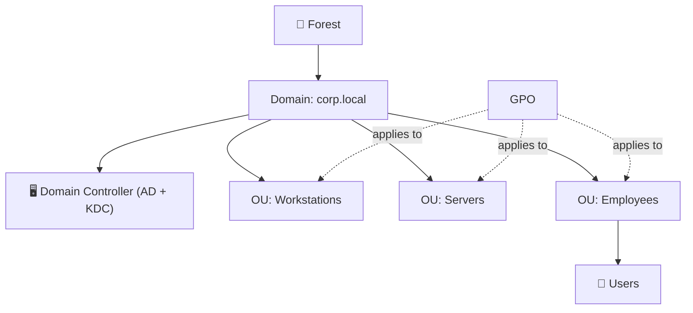
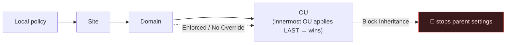
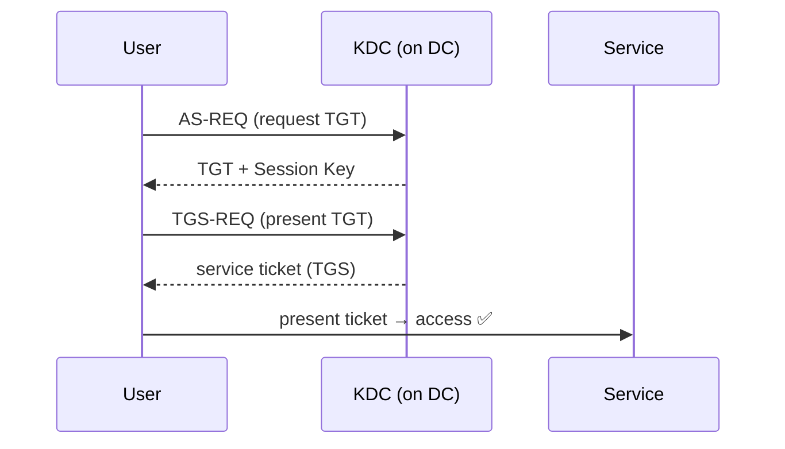
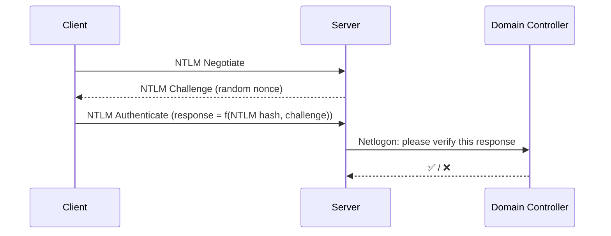
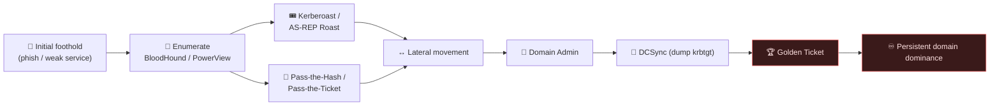
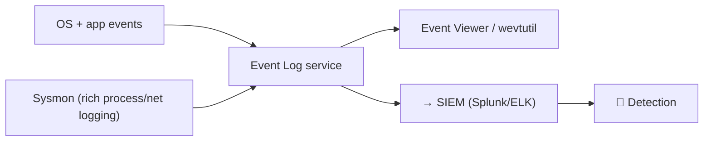
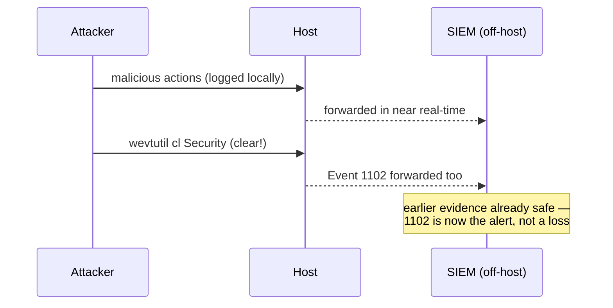

# 🪟 1.3 Windows & OS Internals Masterclass

> [!abstract] The Masterclass
> Windows dominates the enterprise, which makes it the primary battlefield. This chapter covers **Active Directory** — the identity system that holds the keys to the whole domain — and **Windows event logs** — the evidence trail defenders live by and attackers try to erase. Depth added here: forest/trust structure and GPO processing, a full Kerberos ticket walk-through against NTLM, every headline AD attack as attacker-steps *and* detections, and worked brute-force/log-clearing hunts. Together they frame the offense/defense loop that Phase 3 completes. **`#level/apprentice` → `#level/operator`**

> [!tip] Chapter Map
> **Active Directory** → **** · **** · **** · ****
> **Event Logs** → **** · **** · **** · ****

---

## Active Directory

**Active Directory (AD)** is the centralised identity and access-management system behind almost every corporate Windows network, served by one or more **Domain Controllers (DCs)** — a hierarchical, LDAP-queryable database of users, computers, groups, and policy. A foothold on one workstation becomes domain-wide control the moment AD is misconfigured, which is *always*, somewhere — that's why it's the prize in almost every internal engagement: compromise it once and you own every machine, user, and secret that trusts the domain.

### Core building blocks
- **Domain Controller** — runs AD services + the Kerberos **KDC**; authenticates users and enforces policy.
- **Organizational Units (OUs)** — containers to **apply policy** by role (a user is in **one** OU).
- **Security Groups** — **grant permissions** over resources (a user can be in **many**).
- **Group Policy Objects (GPOs)** — settings applied to OUs to set a security baseline.



#### Forests, trees, domains & trusts
The building blocks above live inside a bigger hierarchy a lot of junior defenders — and no small number of attackers — get wrong:

| Container | What it actually is | Security boundary? |
| --- | --- | --- |
| **Domain** | Administrative + replication boundary (`corp.local`) — its own database partition | No — often assumed, rarely true |
| **Tree** | Domains sharing a contiguous DNS namespace (`corp.local`, `eu.corp.local`), linked by automatic trusts | No |
| **Forest** | One or more trees sharing a common **schema**, **Configuration partition**, and **Global Catalog** | **Yes — the real boundary** |

The single most important AD fact to internalise: **the forest, not the domain, is the security boundary.** Enterprise/Schema Admins operate forest-wide, so compromising any one domain routinely escalates to every other domain in the forest via trust abuse (SID-history injection, attacking a trusting domain's `krbtgt`, etc.).

**Trust relationships** decide who can authenticate across a boundary, and direction is the part everyone gets backwards:

| Trust type | Created how | Transitive? | Direction rule of thumb |
| --- | --- | --- | --- |
| Parent-child | Automatic | Yes | Both ways within the tree |
| Tree-root | Automatic | Yes | Links trees inside one forest |
| Forest trust | Manual | Yes (within each forest) | One- or two-way between forests |
| External | Manual | **No** | Domain-to-domain, outside any forest — classic SID-history risk |
| Shortcut | Manual | Yes | Performance shortcut across a deep tree |

If **Domain A trusts Domain B**, users **from B** authenticate **into A** — trust and access run in opposite directions, a classic source of assessment mistakes.

#### OUs vs. security groups
These two get confused constantly because they solve *different* problems:

| Aspect | Organizational Unit (OU) | Security Group |
| --- | --- | --- |
| Purpose | Apply **GPOs**; delegate admin rights over a chunk of the tree | Grant **permissions** (show up in ACLs/DACLs) |
| Membership | A user/computer sits in **exactly one** OU | Can sit in **many** groups, nested arbitrarily |
| Appears on an ACL? | No — you never grant an OU a permission on a share | Yes — this is exactly what groups are for |
| Common mistake | Assuming moving a user between OUs changes *permissions* (it changes *policy*, not access) | Nesting groups five deep until nobody can reason about effective membership |

Gotcha: the default **Users** and **Computers** containers are *not* true OUs — no GPO can link to them directly, which is why hardening guides redirect new objects into real OUs (`redircmp` / `redirusr`) before applying baselines.

#### GPO processing order (LSDOU)
GPOs apply in a strict, memorisable order, and the *last* one applied wins on a setting conflict:



- **L**ocal → **S**ite → **D**omain → **O**U — applies outside-in, so the GPO linked to the *closest* OU wins ties.
- **Block Inheritance** stops parent GPOs applying to an OU — *unless* the parent is **Enforced (No Override)**, which always wins.
- **Security filtering** limits a GPO to specific users/computers/groups (needs `Apply Group Policy` + `Read`; default `Authenticated Users`).
- **WMI filtering** applies a GPO only where a WMI query is true (e.g., servers only, laptops only).
- **Loopback processing** (Merge/Replace) re-applies *user* settings by the *computer's* OU — the mechanism behind kiosk/Citrix/RDS hardening.

```powershell
gpupdate /force          # reapply GPOs immediately, both machine and user
gpresult /r               # Resultant Set of Policy — what actually applied, and why
```

### Kerberos authentication
Instead of sending credentials to every service, users get **tickets**:

The KDC issues a **Ticket Granting Ticket (TGT)** + session key; the user swaps the TGT for **service tickets** without re-sending their password.

```powershell
mstsc /v:10.10.10.5      # Remote Desktop to a host
```

To see what tickets you're actually holding at any point in that flow, `klist` lists every Kerberos ticket cached in the current logon session.

#### Step-by-step: AS-REQ → TGT → TGS → service access
The diagram above compresses four exchanges into one line each. Here's what actually happens — and **what's inside each ticket**, since that detail is exactly what makes half the attacks below possible:

1. **AS-REQ** — client sends the KDC's AS a username + a timestamp **encrypted with a key derived from the user's password hash** (*pre-authentication* — the one setting AS-REP Roasting needs disabled).
2. **KDC validates pre-auth** — derives the same key from the stored hash, decrypts the timestamp, checks it's recent: proof of password knowledge *without the password ever crossing the wire*.
3. **AS-REP** — KDC returns the **TGT**, encrypted with the **`krbtgt` account's** hash (client carries it, can't read or forge it), plus a session key encrypted with the *user's* key.
4. **TGS-REQ** — to reach a service (say `CIFS/fileserver.corp.local`), the client sends the KDC's TGS the TGT + a fresh authenticator + the target SPN.
5. **TGS-REP** — KDC decrypts the TGT (it holds `krbtgt`'s hash), rebuilds group memberships into a **PAC**, and issues a **service ticket encrypted with the target service account's own hash** — not the user's, not `krbtgt`'s.
6. **AP-REQ / AP-REP** — client presents the service ticket to the target service, which decrypts it with its *own* key, validates the PAC, and grants access — the KDC isn't even in the loop for this hop.

| Ticket | Encrypted with | Carries |
| --- | --- | --- |
| **TGT** | `krbtgt` account's hash | Client identity/realm, session key, ticket lifetime, **PAC** (user SID + group SIDs) |
| **Service ticket (TGS)** | Target **service account's** hash | Client identity, a new session key, a copy of the PAC, target SPN |

Default ticket lifetime is **10 hours**, renewable up to **7 days**; the KDC also tolerates roughly **5 minutes** of clock skew before rejecting a request outright — which is why a workstation with a badly drifted clock suddenly can't authenticate to anything.

#### NTLM vs. Kerberos
Windows still ships a second, older authentication protocol, and knowing when each fires matters for both sides:

| | NTLM | Kerberos |
| --- | --- | --- |
| Mechanism | Challenge-response | Ticket-based, issued by the KDC |
| Needs a live DC? | No — a cached hash is enough | Yes — the KDC must be reachable |
| Mutual authentication | No — the client never verifies the server | Yes — both sides prove identity |
| Typical trigger | Access **by IP address**, workgroup host, legacy app | Access **by hostname/SPN** to a domain resource |
| Headline attacks | NTLM relay, Pass-the-Hash, LLMNR/NBT-NS poisoning | Kerberoasting, AS-REP Roasting, ticket forgery |


**NTLMv1** (DES-based) is effectively broken and shouldn't exist in a modern estate; **NTLMv2** (HMAC-MD5) is the standard fallback but still *relayable* — a captured challenge-response is forwarded live to another server with `ntlmrelayx.py`, especially where **SMB signing** is disabled. Poisoning tools (`Responder`, `Inveigh`) answer LLMNR/NBT-NS broadcasts that should have failed, tricking victims into authenticating to the attacker instead.

**Defense:** disable NTLM domain-wide where feasible (Restrict NTLM GPOs), enforce **SMB signing** everywhere, disable LLMNR/NBT-NS via GPO, enable **Extended Protection for Authentication (EPA)**/channel binding so a relayed authentication can't be replayed elsewhere.

### Why AD is the ultimate target
A single foothold cascades into **domain dominance** because every major AD attack abuses a *legitimate* protocol feature, not a bug — there's rarely a patch that fixes any of these outright. Attacker steps first, then the defender's tell, for each:

#### Attack: Kerberoasting
**Idea:** any authenticated domain user can request a service ticket for *any* SPN-registered account — including ordinary users pressed into service (SQL, IIS app pools). The ticket is encrypted with the *service account's* password hash and cracks entirely offline.

**Attacker steps:**
1. Enumerate SPNs: `setspn -T corp.local -Q */*`, PowerView's `Get-DomainUser -SPN`, or Rubeus.
2. Request a TGS for each — no special rights needed (`Invoke-Kerberoast`, `Rubeus.exe kerberoast`).
3. Extract the encrypted blob as a `$krb5tgs$` hash.
4. Crack offline: `hashcat -m 13100 hashes.txt rockyou.txt`.
5. A cracked password = code execution as that (often over-privileged) service account.

**Detection:** Event ID **4769** spiking — one account requesting many SPNs fast, especially with encryption type **RC4 (0x17)** where AES is available (the tooling's default downgrade, and a strong tell).

**Defense:** 25+ character random passwords, or better, a **gMSA** (auto-rotated, effectively uncrackable) for every service account; enforce AES-only Kerberos; alert on 4769 volume + RC4 anomalies.

#### Attack: AS-REP Roasting
**Idea:** the mirror of Kerberoasting, aimed at step 1 of the walk-through above. Any account with **"Do not require Kerberos preauthentication"** set hands back an AS-REP to *anyone* who asks — no password needed — encrypted with that user's own hash.

**Attacker steps:**
1. Enumerate accounts with pre-auth disabled (`Get-DomainUser -PreauthNotRequired`, `Rubeus.exe asreproast`).
2. Request the AS-REP with no credentials at all.
3. Crack offline: `hashcat -m 18200 hashes.txt rockyou.txt`.

**Detection:** Event ID **4768** with pre-authentication type **0** is the anomaly — legitimate clients always show type **2** (encrypted timestamp).

**Defense:** keep pre-authentication enabled everywhere (it's normally off only through misconfiguration or stale legacy support); audit the domain for the flag; strong passwords as a backstop regardless.

#### Attack: Pass-the-Hash & Pass-the-Ticket
**Idea:** you don't need the plaintext password if you already hold what the protocol actually checks — the NTLM hash (**Pass-the-Hash**) or a live Kerberos ticket lifted straight out of memory (**Pass-the-Ticket**).

**Attacker steps (PtH):** local admin on one box → dump LSASS (`mimikatz sekurlsa::logonpasswords`, or exfil the memory dump for offline parsing to dodge live detection) → replay the hash with `impacket-psexec -hashes`, `pth-winexe`, or `sekurlsa::pth` — no cracking, ever.

**Attacker steps (PtT):** export a ticket from memory (`sekurlsa::tickets /export`, Rubeus `dump`) → inject into a fresh session (`kerberos::ptt`) → impersonate that user *or machine account* for the ticket's lifetime — how one compromised server pivots laterally "as itself."

**Detection:** **Sysmon 10** (ProcessAccess) catching a handle opened into `lsass.exe` is the single highest-value detection rule on the Windows estate. Also watch **4624** logon type **9 (NewCredentials)**, and one account hitting an unusual number of hosts in a tight window (lateral-movement fan-out).

**Defense:** **Credential Guard** (isolates secrets in a VBS enclave — blocks classic LSASS dumping outright), **LAPS** (unique, rotated local admin password per host, so one leaked hash doesn't unlock the fleet), tiered admin logon restrictions, and killing NTLM wherever it isn't strictly required.

#### Attack: DCSync
**Idea:** abuse the legitimate DC-to-DC **replication** protocol. Any principal holding `Replicating Directory Changes` + `Replicating Directory Changes All` — normally Domain/Enterprise Admins and DCs, but also a favourite **ACL backdoor** to plant quietly — can ask a DC for *any* account's hash, including `krbtgt`, from an ordinary workstation. No DC code execution required.

**Attacker steps:** obtain (or plant) an account with replication rights → `mimikatz "lsadump::dcsync /domain:corp.local /user:krbtgt"` → the DC hands over the hash believing it's talking to a peer → weaponise it (most often, straight into a Golden Ticket below).

**Detection:** Event ID **4662** on the DC, filtered to the `DS-Replication-Get-Changes` / `DS-Replication-Get-Changes-All` extended-right GUIDs, **originating from a non-DC host** — that combination is essentially never legitimate.

**Defense:** audit exactly who holds replication rights (`dsacls`, or let BloodHound draw the "DCSync" edge for you), treat every such account as **Tier 0**, alert on 4662 for those specific GUIDs.

#### Attack: Golden Ticket
**Idea:** the endgame. The `krbtgt` hash signs *every* TGT the domain issues. Steal it once (DCSync, `ntds.dit` extraction, full DC compromise) and an attacker can **forge** a valid TGT entirely offline: any username, any PAC group membership, any lifetime.

**Attacker steps:** obtain the `krbtgt` NTLM hash → forge offline: `mimikatz "kerberos::golden /user:fakeadmin /domain:corp.local /sid:S-1-5-21-... /krbtgt:<hash> /ticket:golden.kirbi"` → inject it (`kerberos::ptt golden.kirbi`) → instant, persistent Domain Admin that survives an ordinary password reset on the compromised account.

**Detection:** a TGS-REQ backed by a TGT for which **no matching 4768 was ever logged** (a golden ticket is forged, never actually issued); wildly abnormal ticket lifetimes (default is 10 hours — a 10-year ticket is not subtle); PAC signature validation failures where enforced.

**Defense:** rotate the `krbtgt` password **twice** (its *N-1* history matters — one rotation alone isn't enough) after any suspected DC compromise, guard Tier-0 access tightly enough that the hash never leaks in the first place, and watch for the signals above.

Chain any of the above with **BloodHound** — which graphs every user/group/ACL/session relationship to compute the shortest path to Domain Admin — and one low-privilege foothold becomes full domain compromise, often within minutes. LDAP (port 389) is how most of this gets queried — see **Networking (Ports and Services)**; Pass-the-Hash/Ticket tradecraft overlaps with **LoL(Living off the Land) Attacks**.



**Defense, in one line:** tier admin accounts (never DA on a workstation), strong service-account passwords/gMSAs, monitor DCs for anomalous ticket and replication requests, patch relentlessly, and enforce **MFA** on every privileged path.

---

## Windows Event Logs

Windows records almost everything into **event logs** (Event Viewer / PowerShell). They're the primary intrusion evidence — and exactly what attackers understand and try to clear.

### Log types
| Type | Usage |
| --- | --- |
| **System** | OS/hardware: startup, drivers, errors |
| **Security** | Auth, authorization, policy/account changes |
| **Application** | App-specific events |
| **Setup / Forwarded** | Install & subscribed events |

#### Where logs live, and how to query them
Every log is a `.evtx` file under `C:\Windows\System32\winevt\Logs\`, each record carrying a `<Provider>`, `<EventID>`, `<Channel>`, `<Computer>`, and an `<EventData>` payload. Beyond the four core types, "Applications and Services Logs" hosts per-feature channels — DNS Server, Task Scheduler, and, critically, **Sysmon** and **PowerShell/Operational** (both below). To centralise evidence without a full SIEM agent, **Windows Event Forwarding (WEF)** pushes events to a collector (WEC) over WinRM, so a copy survives even if the source is later wiped.

```powershell
wevtutil el                                   # list every log channel on the box
wevtutil qe Security /c:5 /rd:true /f:text     # last 5 Security events, newest first
```

### Key Security Event IDs
| ID | Meaning |
| --- | --- |
| **4624 / 4625** | Logon **success** / **failure** (brute-force signal) |
| **4634** | Logoff |
| **4720 / 4726** | Account **created** / **deleted** |
| **4724** | Password reset attempt |
| **4688** | New **process** created (gold with cmdline auditing) |
| **1102** | **Security log cleared** 🚩 (anti-forensics red flag) |
| **4648** | Logon using **explicit credentials** (e.g. `runas`) — lateral-movement smell |
| **4672** | **Special privileges** assigned to a new logon (admin-equivalent session) |
| **4768 / 4769** | Kerberos **TGT** / **service ticket** requested — watch pre-auth type & Kerberoasting volume |
| **4771** | Kerberos pre-authentication **failed** |
| **4776** | NTLM credential validation on a DC |
| **4728 / 4732 / 4756** | Member **added** to a global / local / universal security group |
| **4698 / 4699** | Scheduled task **created** / **deleted** (persistence) |
| **7045** | New **service installed** (System log — classic persistence/lateral movement) |
| **5140 / 5145** | Network **share** accessed / detailed share-file access |
| **4662** | Operation performed on an AD **object** (the signal DCSync detection hinges on) |
| **4103 / 4104** | PowerShell **module logging** / **script-block logging** — obfuscated payloads decode here |

#### Logon types (Event 4624 / 4625)
The `LogonType` field is the difference between "typed a password at the console" and "passed a hash from across the network" — buried in the same two Event IDs everyone already collects:

| Type | Name | Typical trigger |
| --- | --- | --- |
| 2 | Interactive | Physical console logon |
| 3 | Network | SMB share, mapped drive — most lateral movement lands here |
| 4 | Batch | Scheduled task |
| 5 | Service | Service start, using a service account |
| 7 | Unlock | Workstation unlock |
| 8 | NetworkCleartext | Basic auth — password sent in the clear to the box |
| 9 | NewCredentials | `runas /netonly` — creds used only for *outbound* connections |
| 10 | RemoteInteractive | RDP |
| 11 | CachedInteractive | Cached domain creds, DC unreachable |

#### Sysmon event IDs
Native auditing (4688, 4624…) tells you *that* something happened; **Sysmon** (free Microsoft Sysinternals driver + service) tells you *how* — full command lines, file hashes, parent/child trees that native logging doesn't capture:

| ID | Event | Why it matters |
| --- | --- | --- |
| 1 | Process creation | Full command line + hashes — richer than 4688 alone |
| 2 | File creation time changed | Timestomping (anti-forensics) |
| 3 | Network connection | Process ↔ IP:port mapping — spots C2 beacons |
| 5 | Process terminated | Lifecycle correlation |
| 6 | Driver loaded | Kernel tampering, EDR-killer drivers |
| 7 | Image/DLL loaded | DLL sideloading & injection |
| 8 | CreateRemoteThread | Classic process-injection primitive |
| **10** | **ProcessAccess** | A handle opened into another process — **LSASS access = credential dumping** |
| 11 | FileCreate | Dropped files, staging for exfil |
| 12 / 13 / 14 | Registry event | Persistence via Run keys, config tampering |
| 22 | DNS query | C2 domain resolution, DNS tunneling |

Sysmon Event ID 10 targeting `lsass.exe` is exactly the detection referenced under **Pass-the-Hash & Pass-the-Ticket** above — arguably the single most valuable rule you can write on a Windows estate.



```powershell
Get-WinEvent -FilterHashtable @{LogName='Security'; Id=4625} -MaxEvents 20   # failed logons
Get-WinEvent -FilterHashtable @{LogName='Security'; Id=1102}                  # log cleared?
```

### The attacker's view (bridge to Phase 3)
Attackers clear logs (`wevtutil cl Security` → generates the very-suspicious **1102**), tamper selectively, or disable **Sysmon/ETW** at the source. This is why **log integrity + off-host forwarding** matter — a failure mode catalogued in **9.  Security Logging and Monitoring Failures**.

#### Worked example: detecting a brute-force
The signal is a spike of **4625** grouped by source and target, not any single event in isolation:

```powershell
# Failed logons in the last 24h, grouped by source IP
Get-WinEvent -FilterHashtable @{LogName='Security'; Id=4625; StartTime=(Get-Date).AddHours(-24)} |
  ForEach-Object {
    [PSCustomObject]@{
      Time     = $_.TimeCreated
      Account  = $_.Properties[5].Value
      SourceIP = $_.Properties[19].Value
    }
  } | Group-Object SourceIP | Sort-Object Count -Descending | Select-Object Count, Name -First 10
```
Read it two ways: one IP failing against **many accounts** is **password spraying** (kept under the per-account lockout threshold to dodge 4740); one account failing repeatedly from **one source** is classic **brute force**. Either pattern followed by a **4624** from that source turns "suspicious" into "confirmed." In a SIEM: `count() by src_ip, TargetUserName having count > N in 5m`.

#### Worked example: detecting log clearing
`wevtutil cl Security` empties the Security log — and that action is itself logged as **Event ID 1102** (source `Microsoft-Windows-Eventlog`). A careful attacker also clears the **System** log, which records its own wipe as **Event ID 104** — most defenders alert only on 1102 and miss 104 entirely:

```powershell
Get-WinEvent -FilterHashtable @{LogName='Security'; Id=1102} -ErrorAction SilentlyContinue
Get-WinEvent -FilterHashtable @{LogName='System';   Id=104}  -ErrorAction SilentlyContinue
```


The real fix is architectural: **forward logs off-host continuously** (WEF, or any SIEM agent shipping near-real-time) so that by the time an attacker clears the local `.evtx`, the SIEM already holds an immutable copy — 1102/104 stop meaning "evidence gone" and start meaning "confirmed malicious action, with everything before it intact."

**Defense:** forward logs off-host to a SIEM immediately; deploy **Sysmon**; enable **PowerShell script-block logging**; alert on **1102** (and **104**), spikes of **4625**, and off-hours **4624**.

---

## 🔗 Related Master Notes & Deep-Dives
- **1.2 Linux and Command Line** — PowerShell/CMD fluency
- **1.6 Defensive Groundwork** — MFA & the controls AD relies on
- **Privilege Escalation** · **LoL(Living off the Land) Attacks** — local-to-domain escalation
- **9.  Security Logging and Monitoring Failures** — logging failures
- [[Branch OS Internals]] — domain hub
