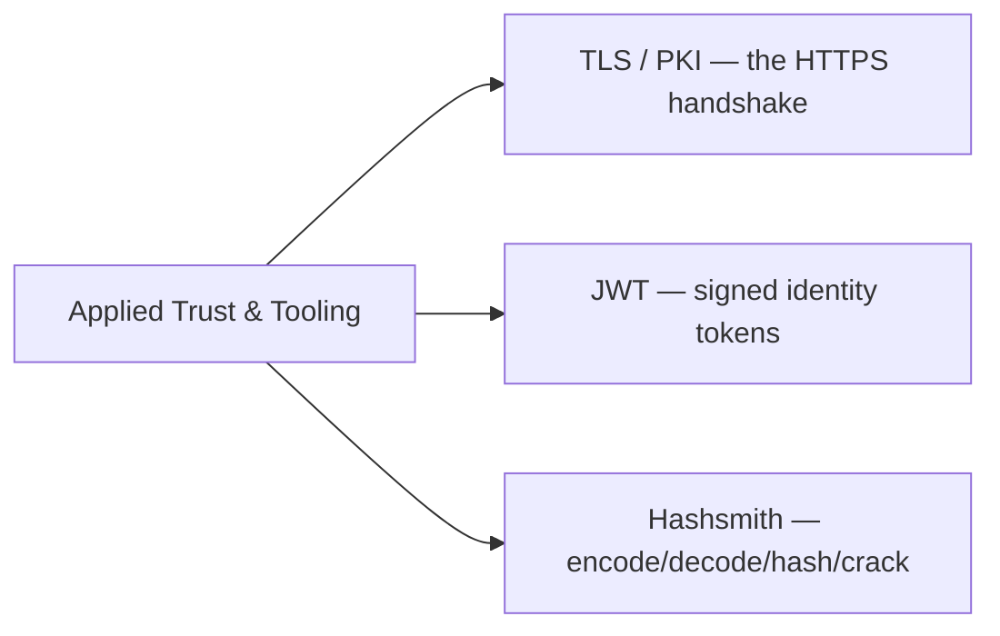

# 🛡️ Applied Trust & Tooling

> [!abstract] Branch ⑤ of [[Cryptography]]
> Where the primitives meet the real world: **TLS/PKI** secures every HTTPS connection, **JWTs** carry identity across APIs, and **Hashsmith** is the terminal multi-tool you'll reach for daily. This branch turns theory into the systems and commands an operator actually touches.

Every earlier branch shows up here at once: TLS uses asymmetric to agree a symmetric key and hashes to check integrity; a JWT is a signature problem; Hashsmith is how you manipulate all of it from a shell.

## The leaves in this branch
- ****TLS and PKI**** — the handshake, certificates, chains of trust, and how HTTPS actually protects a session.
- ****JWT Security**** — token structure, signing vs "alg:none", and the attacks on weak secrets.
- ****Hashsmith CLI**** — the project's encode/decode/hash/identify/crack CLI, used across the whole vault.

## 📄 Notes in this branch
- [[TLS and PKI]]
- [[JWT Security]]
- [[Hashsmith CLI]]

---
> 🔼 Up: [[Cryptography]]
