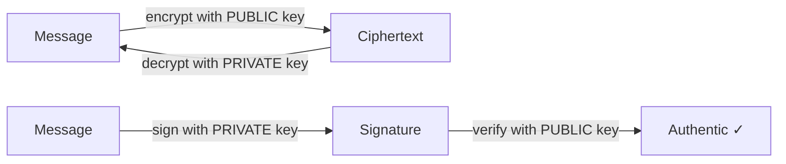

# 🗝️ Asymmetric Encryption

> [!abstract] Branch ③ of [[Cryptography]]
> A **key pair**: the **public key** encrypts (or verifies), the **private key** decrypts (or signs). It solves the key-distribution problem symmetric crypto can't, and it makes **digital signatures** possible. Slower than symmetric — so in practice it bootstraps a symmetric session key.

This is the maths behind HTTPS, SSH, PGP, and code signing. The public key can be shouted from the rooftops; security rests entirely on guarding the **private key**.

## The leaves in this branch
- ****RSA**** — the classic: key generation, the padding pitfalls, and CTF-favourite weak-key attacks.
- ****Diffie Hellman and ECC**** — agreeing a shared secret over a hostile network, and why elliptic curves won.
- ****Digital Signatures**** — authenticity + integrity + non-repudiation, and how they underpin certificates and JWTs.

> [!tip] Root move
> Hybrid encryption (asymmetric to exchange a key, symmetric for the data) is the model behind **TLS/PKI** — traced end to end in this branch's tooling leaf.

## 📄 Notes in this branch
- [[RSA]]
- [[Diffie Hellman and ECC]]
- [[Digital Signatures]]

---
> 🔼 Up: [[Cryptography]]
