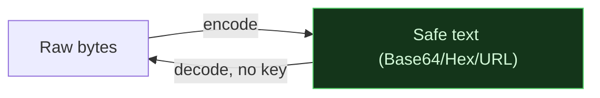

# 🔤 Encoding & Obfuscation

> [!abstract] Branch ① of [[Cryptography]]
> **Encoding** turns data into a different *representation* so it survives transport — it is **reversible with no key** and provides **zero secrecy**. Obfuscation stacks encodings to *slow down* a reader, not stop one. Getting this straight is the first thing that separates **Crook** ("Base64 is encryption!") from operator.

Encoding exists because channels are picky: email and URLs can't carry raw bytes, so we re-express them in a safe alphabet. Anyone can reverse it — that's the point. Treating it as protection is the classic beginner mistake and a real-world **A02 Cryptographic Failure**.

## The leaves in this branch
- ****Base64 and the Base Family**** — Base64/Base32/Base58, how the alphabet maps, and spotting it in the wild.
- ****Hexadecimal and Binary**** — hex, binary, ASCII, and the `xxd`/`hexdump` workflow.
- ****XOR and Classical Ciphers**** — XOR "encryption", ROT13/Caesar, and Vigenère — reversible obfuscation, not real crypto.

> [!tip] Root move
> In CTFs and malware triage you'll see **layered** encodings (Base64 → hex → gzip). Peel them one layer at a time; the **Hashsmith** CLI automates this with `decode --auto` and `--chain`.

## 📄 Notes in this branch
- [[Base64 and the Base Family]]
- [[Hexadecimal and Binary]]
- [[XOR and Classical Ciphers]]

---
> 🔼 Up: [[Cryptography]]
