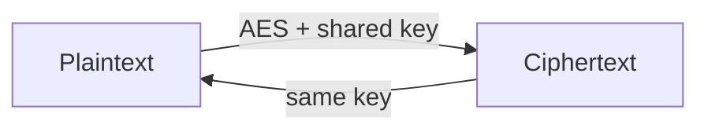

# 🔑 Symmetric Encryption

> [!abstract] Branch ② of [[Cryptography]]
> **One shared secret key** encrypts and decrypts. It is fast and ideal for bulk data — the hard problems are **distributing the key** safely and **choosing a mode** that doesn't leak. This branch is where Crook meets AES and Root learns why the *mode* matters more than the cipher.

The cipher (AES) is almost never the weak point — the **mode of operation** and key management are. Use an **authenticated** mode (AES-GCM); never hand-roll ECB.

## The leaves in this branch
- ****AES and Block Ciphers**** — the block-cipher workhorse, key sizes, and where it's used.
- ****Block Cipher Modes**** — ECB vs CBC vs CTR vs **GCM**, the "ECB penguin", and authenticated encryption.
- ****Stream Ciphers**** — ChaCha20 & RC4, keystreams, and the fatal nonce/keystream-reuse bug.

> [!tip] Root move
> Spotting **ECB** (identical plaintext blocks → identical ciphertext blocks) in a target is an instant finding — see ****Block Cipher Modes****.

## 📄 Notes in this branch
- [[AES and Block Ciphers]]
- [[Block Cipher Modes]]
- [[Stream Ciphers]]

---
> 🔼 Up: [[Cryptography]]
