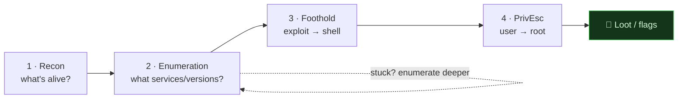

# 🚩 2.10 CTF Methodology Masterclass

> [!abstract] The Masterclass
> CTFs (and real engagements) reward *process* over luck. This chapter is a repeatable, universal workflow — **Recon → Enumeration → Foothold → Privilege Escalation** — plus per-category quick wins. Follow it methodically and you stop staring at a box wondering "what now?" It ties together every tool in Phase 2. **`#level/operator`**

> [!warning] Authorized Simulation context
> This methodology is for **CTF platforms (the lab, the lab), your own labs, and authorized engagements** only. Never point it at systems you don't own or have written permission to test.

> [!tip] Chapter Map
> **** · **** · **** · **** · **** · ****

---

## The Universal Workflow

Almost every boot-to-root box follows the same loop. When stuck, you've almost always **under-enumerated** — go back a step.



> **Golden rule:** *"Enumeration is 80% of the work."* Most failed attempts are missed enumeration, not missing skill.

---

## 1. Reconnaissance

Find the attack surface — what's alive and what ports are open (**Network Recon**).
```bash
nmap -sn 10.10.10.0/24                       # who's up (if scanning a range)
nmap -sV -sC -p- -T4 -oN nmap.txt 10.10.10.5  # ALL ports + versions + default scripts, saved
nmap -sU --top-ports 20 10.10.10.5            # top UDP services
```
Record everything (`-oN`/`-oA`). Every open port is a lead; note versions for **CVE lookup**.

---

## 2. Enumeration

Dig into each service. This is where the box is actually solved.

| Service (port) | Enumerate with |
| --- | --- |
| **HTTP/S (80/443)** | **walk the app**, **gobuster**/ffuf for content, check source, `robots.txt`, **vhosts** |
| **SMB (445)** | `enum4linux -a`, `smbclient -L //ip/`, `smbmap -H ip` |
| **FTP (21)** | anonymous login, `get` files |
| **SSH (22)** | version → CVE; note for later cred reuse |
| **DNS (53)** | zone transfer `dig axfr @ip domain` |
| **SNMP (161)** | `snmpwalk -c public -v1 ip` |

```bash
gobuster dir -u http://10.10.10.5 -w /usr/share/seclists/Discovery/Web-Content/raft-medium-directories.txt -x php,txt
enum4linux -a 10.10.10.5
```
Chase every finding: default creds, exposed configs, comments, backups, hidden params.

---

## 3. Foothold (Initial Access)

Turn a finding into code execution and a **shell**:
- Exploit a web vuln from **Web Exploitation** (**upload** a webshell, **SQLi**, **command injection**).
- Reuse or **brute-force** credentials found during enumeration.
- Run a public exploit (**searchsploit**) — **read it first**.
```bash
nc -lvnp 443                                  # your listener, then trigger the reverse shell
python3 -c 'import pty;pty.spawn("/bin/bash")' # upgrade to a proper TTY
```
Always **stabilise the shell** and grab the user flag before escalating.

---

## 4. Privilege Escalation

From your foothold user to **root/SYSTEM** (**Privilege Escalation**):
```bash
id; sudo -l                                   # what can I run as root?
find / -perm -4000 -type f 2>/dev/null         # SUID → GTFOBins
uname -a; cat /etc/os-release                   # kernel exploit matching
./linpeas.sh                                    # automate enumeration
```
Cross-reference SUID/sudo findings against **GTFOBins** (Linux) or check `whoami /priv` / **AD paths** (Windows). Grab the root flag.

---

## CTF Categories & Quick Wins

Beyond boot-to-root, jeopardy CTFs bucket into categories — attack each with the right reflex:

| Category | First moves |
| --- | --- |
| **Web** | **the exploitation arsenal** — source, cookies, params, **Burp** |
| **Crypto / Decoding** | identify the scheme, then **`hashsmith decode --auto`** / **`hashsmith crack`** (**Hashsmith**) — layered Base64/Hex and weak MD5/SHA hashes are classic |
| **Forensics** | `wireshark`/`tshark` on a `.pcap`, `strings`, `file`, carve artifacts |
| **Steganography** | **exiftool → binwalk → steghide → zsteg** |
| **Reversing** | `strings`, `ghidra`, `gdb`, decompile |
| **Pwn (binary)** | `checksec`, `pwntools`, buffer overflows (Phase 3) |
| **OSINT** | **dorks, reverse image search, metadata** |

> When a challenge gives you a blob of text or a suspicious hash, reach for ****Hashsmith**** first — its `decode --auto`, `identify`, and `crack` cover the overwhelming majority of crypto/decoding challenges in seconds.

---

## 🔗 Related Master Notes & Deep-Dives
- **2.6 Network Attacks and Recon** · **2.3 Web Exploitation** · **2.5 Tooling** — the phases in depth
- **2.9 Cryptography and Hashsmith** · **2.11 Steganography** — crypto & stego categories
- **Privilege Escalation** · **2.8 Vulnerability Research** — the final step & exploit sourcing
- [[Branch CTF & Steganography]] — domain hub
