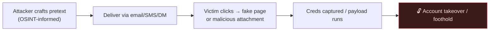

# 🎣 2.7 Social Engineering & Phishing Masterclass

> [!danger] Legal & Ethical Boundary — read first
> Phishing simulation may **only** target people and systems you are **explicitly authorised** to test — sanctioned security-awareness training or a red-team engagement with **written permission and defined scope**. Harvesting credentials from real, non-consenting people is a serious crime (fraud / unauthorised access). This chapter is for **defenders and authorised testers**: understand these techniques to run legitimate simulations and to *recognise and stop real attacks*. **`#level/apprentice`**

> [!abstract] The Masterclass
> Phishing is the leading initial-access vector in real breaches — the human is the softest target. This chapter covers the fundamentals, how an *authorized* simulation is built and delivered (SET), the credential-harvesting frameworks (GoPhish, Zphisher), and — the important half — **detection and defence**.

> [!tip] Chapter Map
> **** · **** · **** · ****

---

## Phishing Fundamentals

Phishing is a subset of **social engineering** where the medium is messages. It has spread from email across every channel:

| Variant | Channel |
| --- | --- |
| **Phishing** | email |
| **Smishing** | SMS / text |
| **Vishing** | voice call |
| **Quishing** | QR code |
| DM phishing | social-media direct messages |

The attacker's goal is to make the target **click, open, or reply** so they can steal information, money, or access. Attacks increasingly exploit urgency and authority.

### Awareness — the S.T.O.P. mnemonics
Security-awareness programmes teach users to pause. Ask before acting on a message:
- **S**uspicious? · **T**elling me to click something? · **O**ffering an amazing deal? · **P**ushing me to act *now*?

And then:
- **S**low down (scammers run on your adrenaline) · **T**ype the address yourself (don't use the link) · **O**pen nothing unexpected (verify first) · **P**rove the sender (check the real From address/number, not the display name).



---

## Building & Delivering a Simulation (SET)

An authorized simulation has two parts: a **trap** (a page/payload) and **delivery** (a convincing message). Research the target with **OSINT** first — the more the message fits the target's world, the more realistic the test.

### The trap — a fake portal that captures input
A simulation hosts a look-alike login page backed by a small script that records whatever is entered (for the *awareness report*, not real theft):
```shell-session
root@attack host:~# ./server.py
Starting server on http://0.0.0.0:8000
```
Browsing to `http://<attack host-ip>:8000` shows what the user will see; any credentials submitted appear in the console.

### Delivery — the Social-Engineer Toolkit (SET)
**[SET](https://github.com/trustedsec/social-engineer-toolkit)** (by TrustedSec) composes and sends the phishing email. A convincing send **spoofs a trusted sender** the target expects mail from:
```shell-session
root@attack host:~# setoolkit
set> 1        # Social-Engineering Attacks
set> 5        # Mass Mailer Attack
set:mailer> 1 # E-Mail Attack Single Email Address
```
SET then prompts for the routing and content, e.g.:
- **Send to:** `factory@wareville.thm`
- **From address / name:** `updates@flyingdeer.thm` / `Flying Deer` (impersonating a known partner)
- **SMTP server / port:** the target's mail server, `25`
- **Subject:** something plausible — *"Shipping Schedule Changes"*
- **Body:** a convincing message including the trap URL

> This whole flow is the *offense* a blue team must anticipate — note the tell-tales it relies on (spoofed From, urgency, a link) so you can build detections for them.

---

## GoPhish & Zphisher

### GoPhish — enterprise phishing *simulation*
**[GoPhish](https://getgophish.com/)** is the standard open-source framework for **authorized security-awareness campaigns**: a web dashboard to build email + landing-page templates, send campaigns, and **track** opens/clicks/submissions in real time. Because it reports *who clicked*, GoPhish is a **metrics tool for defenders** — pair every campaign with follow-up training for anyone who submits.

### Zphisher — how credential-harvesting kits work
**Zphisher** auto-generates fake login pages for popular services. Studying it (lab-only) shows defenders exactly what a low-effort, high-volume attack looks like:
```bash
git clone --depth=1 https://github.com/htr-tech/zphisher.git
cd zphisher && bash zphisher.sh
```
It walks through: pick a template (Instagram, Google…), pick a page variant, choose a **tunnel** (Cloudflared/LocalXpose) to expose it publicly, optionally **mask the URL**, then waits for submissions and logs the victim IP + credentials to `auth/`.

![[instagram-a44600e20.webp]]

> The tell-tales to train users on: a **look-alike tunnel domain** (`*.trycloudflare.com`), a **URL userinfo trick** (`get-unlimited-followers@realdomain`), and an **enticing pretext**.

---

## Defence & Detection

Understanding the offense exists to make you a better defender — this is the important half.

**For users**
- **Check the real domain**, not the page's look. Beware `@` in URLs and random tunnel subdomains.
- Never enter credentials after clicking an unsolicited link — navigate directly.
- Report suspicious messages; don't just delete them.

**For organisations**
- **Phishing-resistant **MFA**** (FIDO2/WebAuthn) — harvested passwords alone become useless, and it defeats real-time relay (Evilginx).
- **Email authentication:** deploy **SPF, DKIM, DMARC** so brand spoofing (the SET trick above) fails at the gateway.
- **Filtering:** block newly-registered domains and known tunnelling hosts.
- **Awareness training:** run *authorized* GoPhish simulations; coach the users who submit.
- **Certificate-transparency monitoring:** watch for look-alike domains of your brand in new TLS certs.

**For the blue team / IR**
- Hunt for credential-harvest kit paths (`auth/usernames.dat`) and known template hashes.
- Tie detections to logging — you can't respond to what you don't record (**A09**).

---

## 🔗 Related Master Notes & Deep-Dives
- **Network Attacks and Recon (OSINT & Google Dorking)** — where attackers gather pretext material
- **Defensive Groundwork (Multi-Factor Authentication)** · **Defensive Groundwork (Sessions (Cookies vs Tokens))** — the controls that blunt credential theft
- **OWASP Top 10 (A07 Identification and Authentication Failures)** — the auth weaknesses phishing exploits
- [[Branch Recon & Social Engineering]] — domain hub
