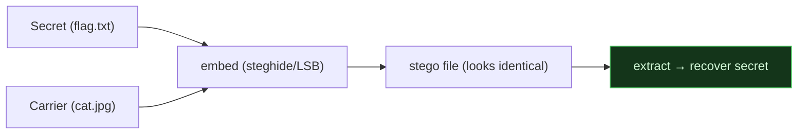
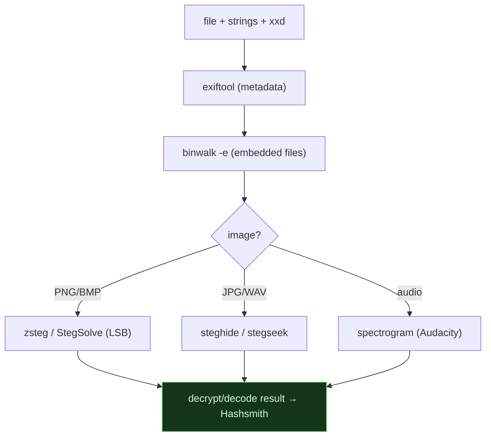

# 🖼️ 2.11 Steganography Masterclass

> [!abstract] The Masterclass
> **Steganography** hides data *inside* other data — a flag in an image's pixels, a zip appended to a PNG, a password in EXIF metadata. Where **cryptography** makes a message unreadable, steganography makes it *unnoticed*. This chapter is a practical toolkit — `exiftool`, `binwalk`, `steghide`, `zsteg` — and a repeatable workflow for the CTF stego category. **`#level/apprentice`**

> [!warning] Authorized Simulation context
> These techniques are for **CTF challenges, your own files, and authorized forensic analysis**. Extracting hidden data from files you don't own may be unlawful.

> [!tip] Chapter Map
> **** · **** · **** · **** · **** · **** · ****

---

## What is Steganography?

The classic carrier is an image, but data can hide in audio, video, PDFs, network traffic, and whitespace. The most common technical method is **LSB (Least Significant Bit)** — overwriting the lowest bit of each colour channel with secret data; the pixel changes so slightly the eye can't tell, but the hidden bits reassemble into a message.



Steganography ≠ encryption — but they're often **layered**: a flag is encrypted, then hidden. So stego extraction frequently hands you a blob you then run through **Hashsmith**.

---

## The First Moves (Every File)

Before any specialist tool, run the universal trio — they solve a surprising share of challenges instantly:
```bash
file mystery.png          # is it REALLY a PNG? (mismatched type = a clue)
strings -n 8 mystery.png  # printable strings ≥8 chars — flags hide in plain sight
xxd mystery.png | head     # inspect the magic bytes / header
```
```shell-session
$ strings -n 8 mystery.png | grep -i flag
FLAG{look_at_the_strings_first}
```

---

## Metadata — exiftool

Images and documents carry **EXIF/metadata** (camera, GPS, author, software — and sometimes a hidden field):
```bash
exiftool photo.jpg                       # dump all metadata
exiftool -Comment -UserComment photo.jpg  # common hiding fields
exiftool -all= clean.jpg                  # (defensive) strip all metadata
```
```shell-session
$ exiftool suspicious.jpg
Artist            : FLAG{exif_is_easy}
GPS Position      : 51 deg 30' N, 0 deg 7' W
Software          : Adobe Photoshop
```

---

## Embedded & Appended Files — binwalk

Files are often **concatenated** — a ZIP or another image glued onto the end of a PNG (the image still renders). **binwalk** finds and extracts them:
```bash
binwalk suspicious.png                 # list embedded file signatures
binwalk -e suspicious.png              # extract them (--dd to force)
foremost -i suspicious.png -o out/      # alternative carver
# manual: if binwalk shows an appended ZIP:
unzip suspicious.png                     # unzip reads from the archive at the tail
```
```shell-session
$ binwalk secret.png
DECIMAL   HEX        DESCRIPTION
0         0x0        PNG image, 800 x 600
1245      0x4DD      Zip archive data, "flag.txt"
```

---

## Image Steganography — steghide, zsteg, stegsolve

- **steghide** — embeds/extracts data in JPEG/BMP/WAV/AU, usually **passphrase-protected**:
  ```bash
  steghide info cover.jpg                          # is anything embedded?
  steghide extract -sf cover.jpg -p "password"     # extract with the passphrase
  steghide extract -sf cover.jpg -p ""             # try an empty passphrase first
  # brute-force the passphrase (authorized/CTF) with stegseek — very fast:
  stegseek cover.jpg /usr/share/wordlists/rockyou.txt
  ```
- **zsteg** — the go-to for **PNG/BMP LSB** data:
  ```bash
  zsteg suspicious.png          # scan all common LSB channels/bit-orders
  zsteg -a suspicious.png       # try everything
  zsteg -E "b1,rgb,lsb,xy" f.png  # extract a specific detected payload
  ```
- **StegSolve** (GUI) — flick through colour planes and bit layers visually to reveal hidden shapes/QR codes.

```shell-session
$ zsteg flag.png
b1,r,lsb,xy    .. text: "FLAG{lsb_in_the_red_channel}"
```

---

## Audio Steganography

Data hides in audio via LSB, or as an image drawn in the **spectrogram**:
- Open in **Audacity** / **Sonic Visualiser** → view the **Spectrogram** (hidden text/QR often appears as shapes).
- `steghide` also works on WAV/AU.
- `binwalk`/`strings` on the audio file for appended data.

---

## CTF Stego Workflow

A deterministic order that solves most stego challenges:



1. `file` / `strings` / `xxd` — the freebies.
2. `exiftool` — metadata.
3. `binwalk -e` — appended/embedded files.
4. Image? → `zsteg` (PNG) or `steghide`/`stegseek` (JPG/WAV) → StegSolve for visual layers.
5. Audio? → spectrogram.
6. Whatever you extract, if it's not the flag, it's probably encoded/encrypted → ****Hashsmith** `decode --auto`**.

---

## 🔗 Related Master Notes & Deep-Dives
- **2.10 CTF Methodology** — where stego fits in the wider CTF process
- **2.9 Cryptography and Hashsmith** — decoding/decrypting what you extract
- **1.2 Linux and Command Line** — `strings`, `file`, `xxd`, pipes
- [[Branch CTF & Steganography]] — domain hub
