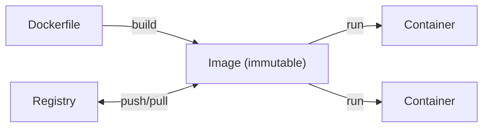
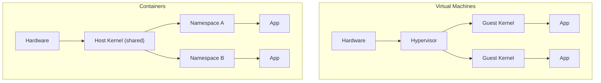
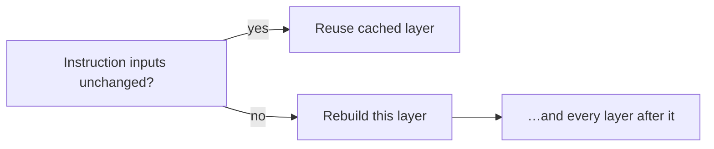
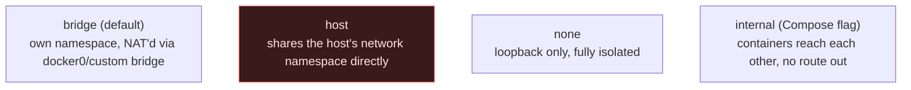
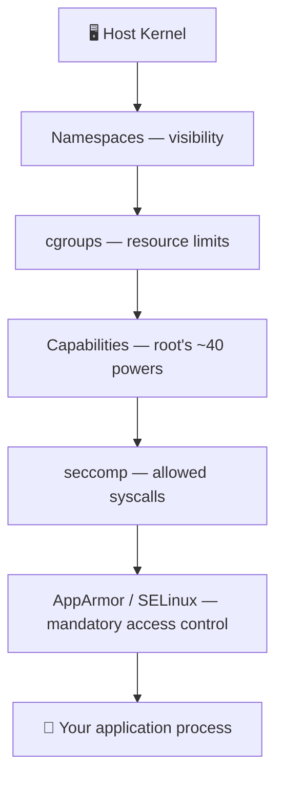
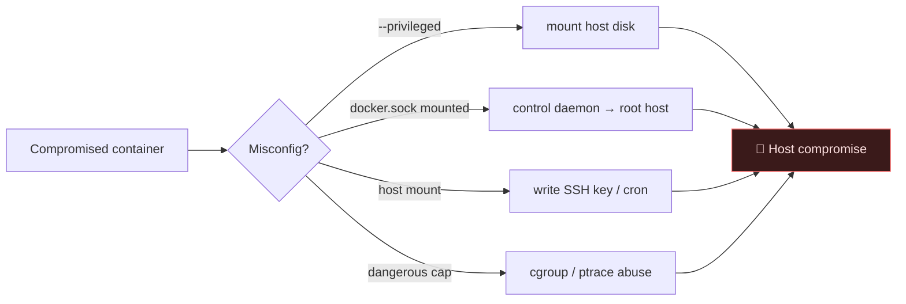
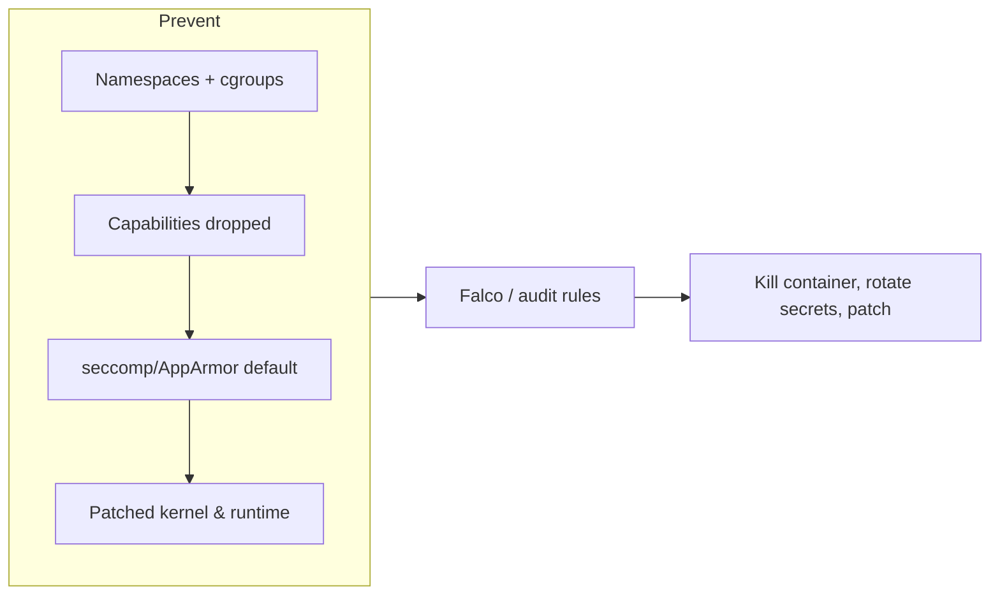

# 🐳 1.4 Docker & Containers Masterclass

> [!abstract] The Masterclass
> **Docker** packages an app and all its dependencies into a portable, disposable **container** — letting you spin up vulnerable targets, full multi-service apps, or clean tooling in seconds. This chapter covers fundamentals and secure orchestration in depth — image layers, the build cache, multi-stage builds, volumes, and networking modes — then the dangerous flip-side: how the isolation model (namespaces, cgroups, capabilities, seccomp) is actually built, how containers are broken out of it step by step, and how to harden and detect against every vector. **`#level/apprentice` → `#level/operator`**

> [!tip] Chapter Map
> **** · ****

---

## Docker and Compose Fundamentals



| Term | Meaning |
| --- | --- |
| **Image** | Immutable, layered template (from a `Dockerfile`) |
| **Container** | A running instance — an isolated process on your kernel |
| **Volume / Network** | Persistent storage / virtual network between containers |
| **Registry** | Versioned store for images (Docker Hub, GHCR, private ECR/Harbor) |
| **Tag** | A mutable pointer to a specific image digest (`myapp:1.2` vs `myapp:latest`) |
| **Layer** | One immutable, content-addressed filesystem diff inside an image |

> **Container ≠ VM.** A container shares the **host kernel**, isolated only by namespaces + cgroups. That efficiency is why escapes matter.

#### VMs vs Containers — Why the Isolation Model Matters
A **hypervisor** (VMware, KVM, Hyper-V) virtualizes *hardware*: each VM boots its own kernel, so a guest-kernel compromise is trapped inside that one guest. A **container runtime** virtualizes the *operating system* instead — every container on a host makes syscalls straight into the **same** kernel. That trade-off is the whole story in one table:

| | Virtual Machine | Container |
| --- | --- | --- |
| Isolation boundary | Hypervisor (hardware-level) | Kernel namespaces/cgroups (process-level) |
| Boot time | Seconds–minutes (own kernel) | Milliseconds (just a process) |
| Density per host | Tens | Hundreds–thousands |
| Blast radius of a kernel exploit | One VM | Potentially **every container on the host** |


This is *why* the **** section below exists at all: escaping a VM usually needs a hypervisor 0-day; "escaping" a container often just needs an operator's misconfiguration — no exploit required.

```bash
docker build -t myapp .    docker run -d -p 8000:8000 myapp
docker ps -a               docker exec -it web /bin/bash
docker logs -f web         docker inspect web        docker system prune -af
```

#### Image Layers, the Union Filesystem, and the Build Cache
An image isn't one file — it's a **stack of read-only layers**, each the filesystem *diff* produced by one Dockerfile instruction, glued together at runtime by a **union filesystem** (OverlayFS on Linux: every read-only layer is a `lowerdir`, plus one thin writable `upperdir` for the running container, merged into a single view at `merged`). Delete a file in a later layer and it isn't actually gone — a **whiteout marker** just hides it from the merged view; the bytes still sit in the earlier layer underneath, which is exactly why a secret "removed" in a later `RUN rm` still leaks.

Docker caches each layer by hashing the instruction **plus** its parent layer's hash (and, for `COPY`/`ADD`, the checksum of the files being copied in). On a rebuild, the first instruction whose inputs changed invalidates **every layer after it**:



That's why the hardened Dockerfile below copies `requirements.txt` and installs dependencies **before** copying application source — editing `main.py` a hundred times a day never re-triggers a slow `pip install`. Inspect the result with `docker history myapp` (layer-by-layer size, largest offenders first) or the third-party `dive myapp` (interactively browse exactly what each layer added or changed). BuildKit — the default builder since Docker 23 — adds `RUN --mount=type=cache,target=/root/.cache/pip`: a persistent cache **between** builds that is never baked into a shipped layer at all. `.dockerignore` (excluding `.git`, `.env`, `node_modules`) keeps the *build context* sent to the daemon small and secret-free in the first place.

> [!warning] Common pitfall
> `COPY . .` as the *first* instruction busts the cache on every source change, and if it runs before a later `RUN rm .env`, that secret is still recoverable forever via `docker history --no-trunc` or by `docker save`-ing the image and untarring the offending layer — the containerized form of **2. Cryptographic Failures**. A `.dockerignore` prevents the secret from ever entering a layer; a later `rm` never actually un-bakes it.

#### Multi-Stage Builds
A single-stage image ships **everything** used to build it — compilers, package caches, source, and any build-time secrets, whether you meant to ship them or not. A **multi-stage build** uses more than one `FROM` in the same Dockerfile; only the *final* stage's filesystem is shipped, so the toolchain never leaves the builder:

```dockerfile
# --- Stage 1 "builder": full Go toolchain, ~800MB, never shipped ---
FROM golang:1.22-alpine AS builder
WORKDIR /src
COPY go.mod go.sum ./
RUN go mod download                                   # cached unless go.mod/go.sum change
COPY . .
RUN CGO_ENABLED=0 GOOS=linux go build -ldflags="-s -w" -o /out/scanner .

# --- Stage 2 "final": just the static binary, ~5–20MB ---
FROM gcr.io/distroless/static-debian12
COPY --from=builder /out/scanner /usr/local/bin/scanner
USER nonroot                                            # distroless ships a built-in UID 65532
ENTRYPOINT ["/usr/local/bin/scanner"]
```
`CGO_ENABLED=0` produces a **statically linked** binary with no libc dependency, so it can run on a base with no shared libraries whatsoever; `-ldflags="-s -w"` strips debug symbols (smaller, and less information leakage if the binary is ever recovered). The security payoff outweighs the size drop: **distroless/`scratch` images ship no shell and no package manager**, so a remote-code-execution bug in this service hands an attacker a binary with nothing to pivot from — no `sh`, no `curl`, none of the **GTFOBins**-style living-off-the-land material a shell-carrying image would offer. Build the equivalent tool yourself in **Go for Security Tooling**.

### A hardened Dockerfile
```dockerfile
FROM python:3.12-slim
RUN groupadd -r app && useradd -r -g app app     # don't run as root
WORKDIR /app
COPY requirements.txt .
RUN pip install --no-cache-dir -r requirements.txt
COPY --chown=app:app . .
USER app                                          # drop privileges
HEALTHCHECK --interval=30s CMD curl -f http://localhost:8000/health || exit 1
CMD ["uvicorn", "main:app", "--host", "0.0.0.0", "--port", "8000"]
```
| Line | Why it matters |
| --- | --- |
| `python:3.12-slim` | Minimal base image — fewer packages installed means a smaller CVE surface than the full `python:3.12` image |
| `groupadd`/`useradd -r` | Creates a **non-login system account** dedicated to this app, not a real human user |
| `COPY requirements.txt .` before app source | Dependency layer only rebuilds when dependencies change — see **the build cache** above |
| `--no-cache-dir` | Doesn't persist pip's own download cache into the image layer — smaller image, nothing left to scavenge |
| `COPY --chown=app:app` | Files land already owned by the unprivileged user — no runtime `chown` step needed |
| `USER app` | From here on, every remaining instruction *and the running container itself* execute as this UID, never root |
| `HEALTHCHECK` | Lets Docker/Compose/an orchestrator detect a hung process and stop routing traffic to it |

> [!warning] Secrets never belong in an image
> `ENV API_KEY=...` / `COPY .env` bake secrets into layers forever (`docker history` reveals them) — the containerized form of **2. Cryptographic Failures**. Add a `.dockerignore` for `.git`/`.env`.

**Other footguns worth knowing:** `ADD` silently auto-extracts archives *and* can fetch remote URLs — surprising behaviour for something that looks like a plain "copy files" instruction; prefer `COPY` unless you specifically need that. Pinning the base (`python:3.12-slim`, or better, a digest: `@sha256:...`) avoids the silent drift of `:latest`, which is the Dockerfile-level form of **6. Vulnerable and Outdated Components** if the tag you rebuilt from quietly moved out from under you.

### A secure multi-service stack (FastAPI + PostgreSQL)
```yaml
services:
  api:
    build: ./api
    ports: ["127.0.0.1:8000:8000"]          # localhost only
    environment:
      DATABASE_URL: "postgresql://app:${POSTGRES_PASSWORD}@db:5432/appdb"
    depends_on: { db: { condition: service_healthy } }
    read_only: true
    cap_drop: ["ALL"]
    security_opt: ["no-new-privileges:true"]
    networks: [backend]
  db:
    image: postgres:16-alpine
    environment: { POSTGRES_PASSWORD: ${POSTGRES_PASSWORD}, POSTGRES_DB: appdb, POSTGRES_USER: app }
    volumes: ["db_data:/var/lib/postgresql/data"]
    healthcheck: { test: ["CMD-SHELL","pg_isready -U app"], interval: 10s, retries: 5 }
    networks: [backend]
networks: { backend: { internal: true } }     # 🔒 DB unreachable from host/internet
volumes: { db_data: {} }
```
| Directive | Hardening effect |
| --- | --- |
| `ports: ["127.0.0.1:8000:8000"]` | Binds *only* the loopback interface — unreachable from the LAN/Internet, reachable only via a reverse proxy on the same host |
| `${POSTGRES_PASSWORD}` interpolation | The secret comes from the environment (a local `.env`, never committed) rather than being hardcoded in the compose file itself |
| `depends_on.condition: service_healthy` | `api` won't start racing a `db` that's still initializing its data directory |
| `read_only: true` | The container's root filesystem is mounted immutable at runtime — an attacker can't drop a webshell to disk (add a `tmpfs: [/tmp]` mount if the app genuinely needs scratch space) |
| `cap_drop: ["ALL"]` | Strips **every** Linux capability, including the 14 Docker grants by default — see **Capabilities** below |
| `security_opt: ["no-new-privileges:true"]` | Blocks `setuid`/`setgid`/file-capability escalation for the container's whole lifetime, even against a stray SUID binary |
| `postgres:16-alpine` | Small, frequently-patched base image — less exposure to **6. Vulnerable and Outdated Components** |
| `networks: { backend: { internal: true } }` | A custom bridge with **no route to the outside world** — `db` can neither be reached from, nor reach out to, the Internet |

Secure by default: **`internal` network** (DB not exposed), localhost-only API port, **dropped capabilities**, `no-new-privileges`, read-only FS, and secrets via `.env`. Analyse logs with `docker compose logs -f api` — this is the container-native form of **log discipline** that prevents **9.  Security Logging and Monitoring Failures**.

#### Volumes vs Bind Mounts (and tmpfs)
`db_data` above is a **named volume** — Docker owns and manages its actual location (`/var/lib/docker/volumes/…`) and permissions for you. Contrast that with a **bind mount**, which maps an arbitrary *host path* straight into the container (`-v /home/alice/data:/var/lib/postgresql/data`):

| | Named volume | Bind mount | tmpfs |
| --- | --- | --- | --- |
| Managed by | Docker | You (host path) | Docker (RAM only) |
| Survives container removal | Yes | Yes — it's a host directory | No |
| Host filesystem exposure | Abstracted away | **Direct** — the exact host path | None, never touches disk |
| Best for | App data, DB storage | Dev-time source mounting, config injection | Scratch space under `read_only: true` |

The security delta is not academic: bind-mounting `/etc`, `/root`, `~/.ssh`, or `/var/run/docker.sock` into a container **is** an escape vector — see **Escape Vector 3** below — because the container's process simply inherits normal Linux file permissions on whatever host path you exposed. Default to named volumes for persistence, append `:ro` to any bind mount that doesn't need write access, and never bind-mount sensitive host paths into anything that runs untrusted code. Audit what's actually mounted with `docker volume ls`, `docker volume inspect db_data`, or `docker inspect --format '{{json .Mounts}}' <container>`.

#### Container Networking Modes
Compose's `networks: { backend: { internal: true } }` is one of **four** networking modes Docker supports, and picking the wrong one is itself a hardening decision:



| Mode | Isolation | Typical use | Flag |
| --- | --- | --- | --- |
| **bridge** | Own network namespace + virtual interface, NAT'd to the host | Default — most services | `--network bridge` (implicit) |
| **host** | **None** — shares the host's real network stack and ports | Max performance, rarely worth the risk | `--network host` |
| **none** | Total — no interfaces but loopback | Pure compute, no network needed | `--network none` |
| **internal** (Compose) | bridge, minus any route to the outside world | Backend tiers (DBs, caches) — exactly `db` above | `networks.<name>.internal: true` |

A Compose **user-defined bridge** like `backend` also gives free service-discovery DNS — `api` reaches Postgres by the hostname `db`, which is *why* `DATABASE_URL` above can say `@db:5432` instead of a hardcoded IP. `--network host` is a security smell precisely because it deletes the isolation boundary these modes exist to provide: the container can bind any host port and sniff the host's real interfaces as if it were just another host process. Enumerate what's configured with `docker network ls` and `docker network inspect backend`.

#### `docker logs`, Log Drivers, and Observability
By default every container's stdout/stderr is captured by the **`json-file`** log driver into `/var/lib/docker/containers/<id>/<id>-json.log` on the host. `docker logs -f web`, `--since 10m`, `--tail 200`, and `--timestamps` are your bread and butter; `docker compose logs -f api` does the same across a whole stack at once.

> [!warning] Common pitfall
> Unbounded `json-file` logs are a container-native disk-fill denial of service — a chatty process (or an attacker deliberately generating noise) can grow that log file until the host runs out of disk. Cap it with log options, daemon-wide in `/etc/docker/daemon.json` or per-service in Compose: `logging: { driver: json-file, options: { max-size: "10m", max-file: "3" } }`.

For real fleets, point the driver elsewhere entirely: `journald` (integrates with the host's `journalctl`), `syslog`, or `gelf`/`fluentd`/`awslogs` to ship straight to a central SIEM. That last option matters for the same reason off-host forwarding matters for **Windows event logs**: logs that only ever live on the box they describe can simply be deleted by whoever just compromised that box. Check what's actually configured with `docker inspect --format '{{.HostConfig.LogConfig}}' api`.

---

## Container Security and Escapes

A container is a normal Linux process fenced off by kernel features. Misconfigure the fence and an attacker escapes to the **host**, owning every other container. Nearly every vector below is, at its core, a textbook **5. Security Misconfiguration** — the fence was never actually locked in the first place.

> [!warning] Authorised use only — for recognising, preventing, and detecting escapes.

### The isolation model
| Mechanism | Isolates |
| --- | --- |
| **Namespaces** | what a process can *see* (PIDs, net, mounts, users) |
| **cgroups** | what it can *use* (CPU, memory) |
| **Capabilities** | splits root into ~40 discrete powers |
| **seccomp / AppArmor** | which **syscalls** are allowed |

All containers share **one host kernel** — a kernel exploit or a handed-back power collapses isolation. Each mechanism below is a *separate* fence; a working escape usually only needs **one** of them to be down.

#### Namespaces — What a Process Can See
Linux namespaces give a process its own *view* of a global resource. Docker uses (at least) PID, mount (`mnt`), network (`net`), UTS (hostname), IPC, and — if you turn it on — user (`userns`) namespaces. Inside a container your shell is PID 1 in its **own** PID namespace and can't see host processes at all; from the **host**, though, `ps aux` shows those exact same processes under their real host PIDs — a container hides things from itself, not from a host administrator. Compare namespace identities with `ls -la /proc/<pid>/ns/`: matching inode numbers between two processes means a shared namespace, i.e. no isolation on that axis.

The one namespace Docker does **not** enable by default is the **user namespace** — meaning "root" inside a container is, by default, the literal same UID 0 as host root, just capability-restricted rather than UID-restricted. `--userns-remap` (or rootless Docker) maps container UID 0 to an unprivileged host UID instead, so even a full capability/seccomp bypass still lands on an unprivileged host account. This is one of the single highest-value hardening switches in this entire section, and it's off by default.

#### cgroups — What a Process Can Use
**Control groups** meter and cap CPU, memory, PIDs, and block/network I/O per container: `docker run --memory=256m --cpus=0.5 --pids-limit=100 ...`. `--pids-limit` specifically stops one classic denial-of-service — a fork bomb inside one container starving the entire host's process table. Inspect live usage with `docker stats`, or read the raw controller files directly (`cat /sys/fs/cgroup/memory.max` on cgroup v2). Crucially, cgroups constrain **resource use**, not **capability** — a process can be fully resource-capped and still be root-equivalent and dangerous, which is exactly what the next two mechanisms actually govern.

#### Capabilities — Splitting Root into ~40 Pieces
Traditional UNIX root is all-or-nothing; Linux **capabilities** split that single bit into roughly 40 independent powers — `CAP_NET_ADMIN` (configure interfaces), `CAP_SYS_PTRACE` (attach to other processes), `CAP_SYS_MODULE` (load kernel modules), `CAP_DAC_READ_SEARCH` (bypass file-read permission checks), `CAP_SETUID`/`CAP_SETGID` (change your own UID/GID), and `CAP_SYS_ADMIN` (a notorious grab-bag of powerful, mostly mount-related operations). Docker's default set is a curated **14** of the roughly 40 — already narrower than bare root — but several of those defaults are still meaningful in an attacker's hands: `CAP_NET_RAW` alone permits packet sniffing and spoofing inside the container's own network namespace. List what a process actually holds with `cat /proc/self/status | grep Cap` (decode the hex with `capsh --decode=<hex>`) or `capsh --print`. The compose stack above does the textbook-correct thing — `cap_drop: ["ALL"]`, then add back only named exceptions such as `--cap-add NET_BIND_SERVICE` if binding a port below 1024 is genuinely required. The exact same logic, one layer further down the stack, governs **capability abuse for privilege escalation on a bare Linux host**.

#### seccomp and Mandatory Access Control
**seccomp** is a kernel-enforced syscall allow/deny-list; Docker's default profile blocks roughly 44 syscalls that are rarely needed by ordinary applications and frequently dangerous — `mount`, `umount2`, `reboot`, `swapon`, `kexec_load`, `keyctl`, `perf_event_open` — while permitting the ~300 that normal applications actually use. `--security-opt seccomp=unconfined` removes this fence entirely and is worth grep-ing for in any Dockerfile, CI config, or `docker run` wrapper you audit. **AppArmor** (Debian/Ubuntu, the `docker-default` profile, loaded automatically) or **SELinux** (RHEL/Fedora, the `container_t` type) add a second, independent **mandatory access control** layer on top of all of the above — even a capability or syscall you were granted can still be denied by policy. Inspect what's active with `docker inspect --format '{{.HostConfig.SecurityOpt}}' <container>`.



### Am I in a container?
```bash
cat /proc/1/cgroup | grep -i docker ; ls -la /.dockerenv
cat /proc/self/status | grep CapEff        # capabilities
ls -la /var/run/docker.sock                # socket present = near-instant escape
mount                                        # host mounts = escape vector
```
Read the output like an investigator, not a checklist-ticker: a hit in `/proc/1/cgroup` or the mere presence of `/.dockerenv` (a marker file Docker touches at container start, nothing more) confirms you're containerized; a non-trivial `CapEff` hex — decode it with `capsh --decode=<hex>` — tells you exactly which of the ~40 capabilities you're holding right now; a listed `docker.sock` or a sensitive host path in `mount`'s output tells you **which** escape vector below is available with zero further exploitation. Two more quick tells worth keeping in your back pocket: `systemd-detect-virt --container` names the runtime directly, and the first field of `/proc/1/sched` is usually the container's actual entrypoint process rather than `systemd`/`init`.

### Common escape vectors

Every vector below assumes the same starting point: an attacker already has code execution *inside* a container — via an **injected command**, a vulnerable dependency, or a malicious image — and is hunting for the operator's mistake that turns "I own a container" into "I own the host." Once that lands, the attacker's next moves are ordinary host-level **living-off-the-land** and **privilege escalation** technique — the container-specific part of the job is already done.

#### Escape Vector 1 — --privileged: The Master Key
`--privileged` grants **every** capability, disables the device-cgroup allowlist, and unconfines seccomp/AppArmor in a single flag — it doesn't weaken the fence, it removes it.
```bash
docker run --rm -it --privileged alpine sh
# --- inside the container ---
fdisk -l                                    # host block devices are directly visible
mkdir /mnt/host && mount /dev/sda1 /mnt/host
chroot /mnt/host /bin/bash                  # now root on the literal host filesystem
```
**Why it works:** with every capability and no device restrictions, the container can `mount` the host's real disk and `chroot` into it — no kernel bug required, just an operator's flag. **Detection:** `docker inspect --format '{{.HostConfig.Privileged}}' <id>` in fleet audits; Falco's built-in `Launch Privileged Container` rule. **Hardening:** ban `--privileged` by policy; if a workload genuinely needs elevated access (nested containers, specific hardware), grant only the precise `--device` and `--cap-add` it actually uses instead of the entire keyring.

#### Escape Vector 2 — Mounted docker.sock: Container-to-Daemon-to-Root
```bash
# container was started with: -v /var/run/docker.sock:/var/run/docker.sock
ls -la /var/run/docker.sock                                     # reachable socket
curl --unix-socket /var/run/docker.sock http://localhost/containers/json
docker -H unix:///var/run/docker.sock run -v /:/host --rm -it alpine chroot /host sh
```
**Why it works:** the daemon socket is **root-equivalent control of the entire Docker engine on the host** — it is not itself namespaced or sandboxed. Anything that can speak to it can simply ask the daemon to start a *new* container with the host's `/` bind-mounted in, then `chroot` into that. You never attacked the fence at all; you asked the guard to open the gate for you. **Detection:** Falco's `Docker or kubernetes client executed in container` rule; IaC scanning (`trivy config`, `checkov`) flagging `docker.sock` binds before they ever ship. **Hardening:** never mount `docker.sock` into anything that runs untrusted or Internet-facing code; where a tool genuinely needs it (CI runners, monitoring agents), front it with a `docker-socket-proxy` restricted to a read-only, allowlisted API subset.

#### Escape Vector 3 — Sensitive Host Mounts
```bash
# container started with: -v /root/.ssh:/root/.ssh -v /etc:/host_etc
cat /root/.ssh/id_rsa                                            # steal the host admin's private key
echo "attacker::0:0::/root:/bin/bash" >> /host_etc/passwd        # or plant a cron job instead
```
**Why it works:** a bind mount is just a host path made visible at another path — ordinary Linux file permissions apply, so whatever the container's (mapped) UID can read or write, the attacker who pops that container can too. **Detection:** `docker inspect --format '{{json .Mounts}}' <id>` in periodic audits; alert on any mount of `/`, `/etc`, `/root`, `/home`, or `/var/run/docker.sock`. **Hardening:** mount the narrowest path possible, append `:ro` wherever write access isn't required, and prefer **named volumes over host bind mounts** for anything holding secrets.

#### Escape Vector 4 — Dangerous Capabilities
`CAP_SYS_ADMIN` is the single most dangerous capability short of full `--privileged` — it's a grab-bag that includes mount-related operations. The classic cgroup v1 `release_agent` technique shows why (legacy cgroup v1 hosts only; shown here in illustrative form):
```bash
# container run with: --cap-add SYS_ADMIN
mkdir /tmp/cgrp && mount -t cgroup -o memory cgroup /tmp/cgrp && mkdir /tmp/cgrp/x
echo 1 > /tmp/cgrp/x/notify_on_release
host_path=$(sed -n 's/.*upperdir=\([^,]*\).*/\1/p' /etc/mtab)   # our overlay path, as seen from the host
echo "$host_path/cmd" > /tmp/cgrp/release_agent
printf '#!/bin/sh\nps aux > '"$host_path"'/output' > /cmd; chmod +x /cmd
sh -c "echo 0 > /tmp/cgrp/x/cgroup.procs"                        # fires the release_agent — runs AS HOST ROOT
cat /output                                                       # proof: a host-side process list
```
**Why it works:** `release_agent` is a cgroup v1 hook the kernel executes **on the host, as root**, whenever a cgroup with no remaining processes fires a release event — `CAP_SYS_ADMIN` is enough to mount a fresh cgroup hierarchy and point that hook at your own payload. **Detection:** Falco rules on `mount` syscalls originating inside containers, and on writes to `release_agent`/`notify_on_release`. **Hardening:** `cap_drop: ["ALL"]` then add back only named needs — the compose stack above already does this — and never re-add `SYS_ADMIN`, `SYS_MODULE`, or `SYS_PTRACE` without a specific, reviewed reason; it's the same SUID/capability logic that drives privilege escalation on bare Linux hosts, just one layer up the stack.

#### Escape Vector 5 — Kernel and Runtime CVEs
Sometimes the configuration is textbook-perfect and the attacker escapes anyway, because the **shared kernel itself** — the entire premise container isolation rests on — has a bug:
- **Dirty Pipe (CVE-2022-0847)** — a Linux pipe-buffer flaw that let an *unprivileged* process overwrite bytes in page-cache-backed files opened read-only, including through a `:ro` bind mount. No capability, no `--privileged`, no namespace misconfiguration needed — a correctly hardened container could still leak host-file write access.
- **runC CVE-2019-5736** — a malicious image could overwrite the **host's `runc` binary itself** via `/proc/self/exe` during container start, because `runc` briefly re-executes itself with host privileges; the next `docker`/`kubectl` invocation on that host then ran attacker code, as root, on the host.

**Detection:** these largely bypass configuration-based detection entirely — the real signal is **host kernel/runtime version** (vulnerability-scan the *host*, not only its images) plus whatever anomalous post-exploitation behaviour Falco or auditd can still catch downstream. **Hardening:** a disciplined patch cadence on the host kernel and container runtime is non-negotiable; for genuinely untrusted workloads (multi-tenant platforms, arbitrary user-submitted code), add a second isolation layer that doesn't share the host kernel at all — **gVisor** (a userspace kernel intercepting syscalls) or **Kata Containers** (a lightweight VM per "container") so a kernel 0-day only compromises a disposable sandbox instead of the real host.

### Hardening checklist
Never `--privileged`; never mount `docker.sock` unnecessarily; run non-root + `no-new-privileges`; `cap_drop: [ALL]`; `read_only` root FS; keep default seccomp/AppArmor; set resource limits; use internal networks; scan images (`trivy`); prefer rootless/gVisor/Kata for untrusted workloads. Detect with **Falco** and alert on `--privileged`/`docker.sock`/`--pid=host`.

| Control | How | Stops |
| --- | --- | --- |
| Never `--privileged` | Policy + code review | **Escape Vector 1** |
| Never mount `docker.sock` into untrusted containers | `docker-socket-proxy` if truly unavoidable | **Escape Vector 2** |
| Run non-root, `no-new-privileges` | `USER app`, `security_opt: [no-new-privileges:true]` | SUID/setuid escalation |
| `cap_drop: [ALL]`, add back by name | Compose or `--cap-drop`/`--cap-add` | **Escape Vector 4** |
| `read_only` root filesystem | `read_only: true` + `tmpfs` for scratch space | Persisted webshells/malware |
| Keep default seccomp/AppArmor | Never pass `unconfined` | Unknown/dangerous syscalls |
| Resource limits | `--memory`, `--cpus`, `--pids-limit` | Fork bombs, noisy-neighbour DoS |
| Internal/segmented networks | `networks.<name>.internal: true` | Lateral movement, data exfil |
| Scan images | `trivy image myapp` in CI | **6. Vulnerable and Outdated Components** |
| Sign/verify images | Docker Content Trust / `cosign` | **8.  Software and Data Integrity Failures** |
| Rootless / gVisor / Kata for untrusted workloads | Alternate runtime | **Escape Vector 5** |
| Detect at runtime | **Falco** rules below | All of the above, after the fact |

```yaml
# Minimal illustrative Falco rules — the loudest, highest-signal container alerts
- rule: Launch Privileged Container
  desc: Detect a container started with --privileged
  condition: container and container.privileged=true
  output: "Privileged container started (container=%container.name image=%container.image.repository)"
  priority: WARNING

- rule: Docker Socket Mounted In Container
  desc: Detect docker.sock bind-mounted into a container
  condition: container and fd.name = /var/run/docker.sock
  output: "docker.sock accessed from inside a container (container=%container.name)"
  priority: CRITICAL
```


---

## 🔗 Related Master Notes & Deep-Dives
- **1.5 Programming for Security** — build the services you containerize
- **1.2 Linux and Command Line** — the Linux fluency Docker assumes
- **Privilege Escalation** · **GTFOBins** — post-escape escalation on Linux
- **5. Security Misconfiguration** · **6. Vulnerable and Outdated Components** · **8.  Software and Data Integrity Failures** — the OWASP failure modes a misconfigured container embodies
- **LoL(Living off the Land) Attacks** — what an attacker does next, once the escape lands on the host
- [[DevSecOps]] — domain hub
