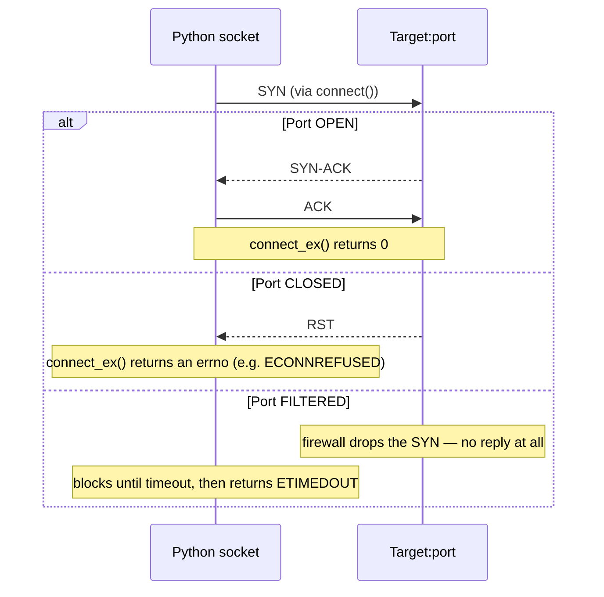
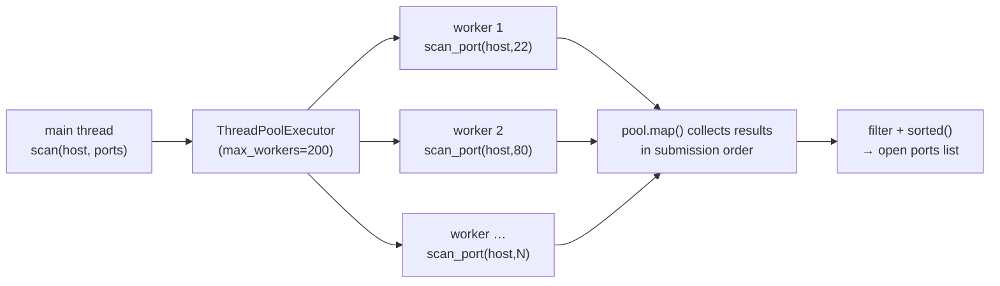
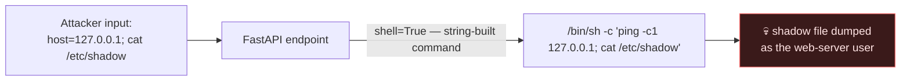
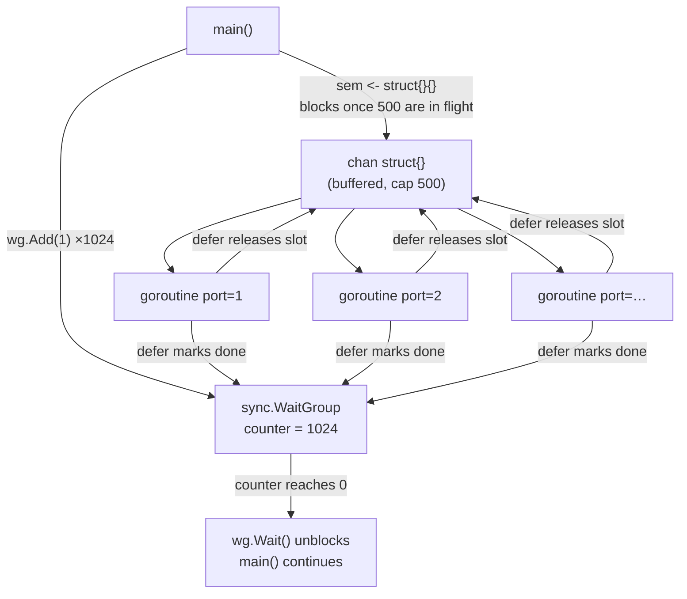
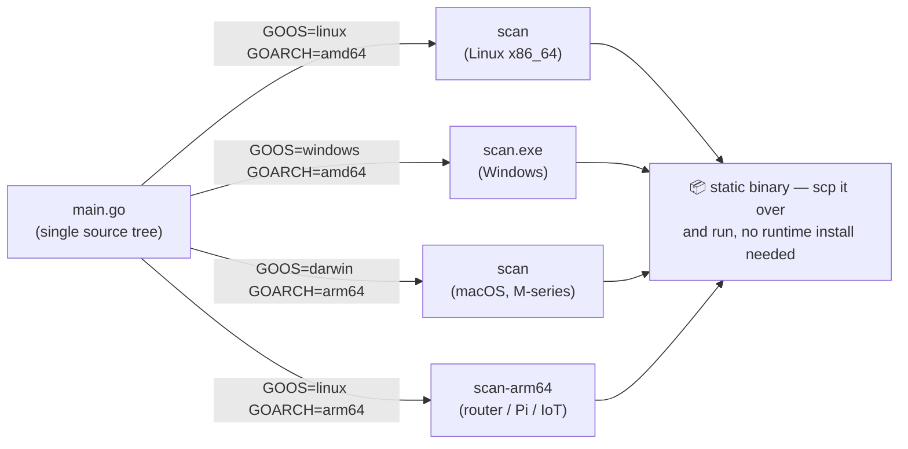

# 💻 1.5 Programming for Security Masterclass

> [!abstract] The Masterclass
> Stop using only other people's tools — write your own. This chapter shows how to leverage **Python** (fast to prototype, ubiquitous, huge ecosystem) and **Go** (static binaries, cross-compilation, massive concurrency) to automate recon, build custom CLI tools, and structure secure backend services — with real, runnable code, explained line by line and paired with the vulnerable-vs-fixed snippets that separate a working tool from a shippable one. **`#level/apprentice` → `#level/operator`**

> [!tip] Chapter Map
> **** · ****

---

## Python for Security

Python is the lingua franca of security: preinstalled on most Linux boxes (great for **living-off-the-land**), with libraries like `requests`, `scapy`, `pwntools`, and `impacket`.

What makes it the operator's default isn't raw speed — it's *iteration* speed. An idea goes from thought to running exploit in the same REPL session; the standard library already ships networking (`socket`), process control (`subprocess`), binary packing (`struct`), and cryptography (`hashlib`, `secrets`) for free, and `pip install requests scapy pwntools impacket` covers almost everything else. The one asterisk is the **GIL** (Global Interpreter Lock) — only one thread executes Python bytecode at any instant — but it barely matters for the tools below, because they're **I/O-bound**: a thread blocked inside `connect()` or `recv()` releases the GIL while it waits on the network, so hundreds of "threads" can sit on sockets in parallel even though only one of them is ever running Python code at once.

### Sockets — a threaded port scanner

#### How a TCP connect scan actually works
`socket.socket(socket.AF_INET, socket.SOCK_STREAM)` opens a TCP endpoint (`AF_INET` = IPv4, `SOCK_STREAM` = TCP, versus `SOCK_DGRAM` for UDP). Calling `.connect()` — or here, `.connect_ex()` — drives the OS through a full **three-way handshake**, and the outcome maps directly onto the port states **Nmap** reports:



`connect_ex()` is the variant built for scanning: instead of raising `ConnectionRefusedError` or `socket.timeout`, it returns the raw errno — `0` on success, non-zero otherwise — so the hot loop never needs a `try/except` per port. Because this is a full **userspace connect**, it's functionally identical to `nmap -sT` (TCP connect scan): noisier and slower than a raw **SYN scan** (`nmap -sS`, which never completes the handshake and needs raw-socket root privileges), but it requires zero elevated permissions — exactly why it's the version you can write in pure Python with no `sudo`.

```python
import socket
from concurrent.futures import ThreadPoolExecutor

def scan_port(host, port, timeout=0.5):
    with socket.socket(socket.AF_INET, socket.SOCK_STREAM) as s:
        s.settimeout(timeout)
        return port if s.connect_ex((host, port)) == 0 else None   # 0 == open

def scan(host, ports):
    with ThreadPoolExecutor(max_workers=200) as pool:
        return sorted(p for p in pool.map(lambda p: scan_port(host, p), ports) if p)

print(scan("127.0.0.1", range(1, 1025)))
```
This mirrors what **Nmap** does industrially.

#### Walk-through: what each line does
The shape of the fan-out — one `scan()` call, two hundred workers, up to 1024 sockets opened and closed in well under a second:



- `with socket.socket(...) as s:` — creates the socket and guarantees `close()` fires even on an exception. A leaked file descriptor per scanned port would exhaust the process's FD limit (`ulimit -n`, often 1024) after a surprisingly small number of ports.
- `s.settimeout(timeout)` — without this, a filtered port makes `connect()` block for the OS default (often minutes), and one unresponsive host would stall the whole scan. `0.5s` is a sane LAN default; raise it over a WAN or a jittery VPN pivot.
- `s.connect_ex((host, port))` — returns an integer instead of raising, so the loop body stays a one-liner.
- `ThreadPoolExecutor(max_workers=200)` — **bounds** concurrency. Spawning a raw `threading.Thread` per port with no cap against all 65535 ports would blow past the FD limit and the target's own accept-queue backlog almost immediately — which looks exactly like the SYN-flood pattern an IDS is tuned to catch.
- `pool.map(lambda p: scan_port(host, p), ports)` — `map` returns results in the same order as `ports`, even though workers finish in whatever order the OS schedules them.
- `sorted(p for p in ... if p)` — drops the `None` results (closed/filtered ports) and hands back a clean ascending list.

**Expected output** — against a bare Ubuntu box with only SSH running: `[22]`. Add a web server and it becomes `[22, 80]`.

**In the wild:** this exact pattern — thread-per-connection userspace connect scanning — is loud. Every attempt completes the handshake, so it lands in the target's own connection logs, and any stateful firewall sees a burst of SYN→SYN-ACK→ACK→immediate-close from one source IP across hundreds of ports inside a second. Real engagements throttle concurrency or spread source IPs specifically to dodge that signature — know the trade-off before cranking `max_workers` up "to go faster."

#### Beyond the standard library: scapy, pwntools, impacket
Sockets cover connect-based TCP/UDP work; three more specialist libraries cover what raw sockets don't — all dual-use, so only point them at hosts you're authorised to test:

| Library | One-line use-case |
| --- | --- |
| `scapy` | Hand-craft/sniff raw packets: `sr1(IP(dst=host)/TCP(dport=80,flags="S"), timeout=2)` sends one SYN and reads the flag back — `SA` open, `RA` closed |
| `pwntools` | Binary-exploitation glue: `p = remote(host, port); p.sendline(b"A"*72 + p64(ret_addr))` pads to a saved return address and overwrites it |
| `impacket` | Speaks Windows/**Active Directory** protocols natively: `secretsdump.py DOMAIN/user:pass@host` dumps SAM/NTDS hashes remotely |

### HTTP recon & a CLI tool
```python
import argparse, requests
ap = argparse.ArgumentParser(description="probe")
ap.add_argument("url"); ap.add_argument("-w","--wordlist", required=True)
args = ap.parse_args()
for word in (w.strip() for w in open(args.wordlist)):
    r = requests.get(f"{args.url}/{word}", timeout=3)
    if r.status_code != 404: print(f"[{r.status_code}] /{word}")
```
`argparse` gives you `--help`, flags, and validation for free — this automates **Content Discovery**.

#### Walk-through: what each line does
- `ap.add_argument("url")` — a **positional** argument; the caller must supply it as `python probe.py http://target`.
- `ap.add_argument("-w","--wordlist", required=True)` — an **optional-looking flag** (`-w`/`--wordlist`) that `argparse` still enforces as mandatory; omit it and the script exits with a usage message instead of a traceback.
- `(w.strip() for w in open(args.wordlist))` — a **generator expression**, not a list. It streams the wordlist one line at a time instead of loading it wholesale — the difference between this working and an `OutOfMemory` crash on a multi-hundred-megabyte content-discovery wordlist.
- `r.status_code != 404` — treats *everything but* 404 as a hit. That deliberately includes `403 Forbidden` — a path that exists but is blocked is still a finding worth noting.

Note the wordlist file handle from `open()` is never explicitly closed here — harmless in a short-lived script (the process exit reclaims it), but exactly the kind of shortcut you wouldn't take in the long-running service below.

#### A `requests` session banner-grabber
A plain `requests.get()` opens a fresh TCP (and, over HTTPS, TLS) connection for every call. A **`Session`** reuses the underlying connection via HTTP keep-alive — meaningfully faster when probing hundreds of paths on one host — and it persists cookies, so an earlier login step carries into every request that follows it:
```python
import requests
from typing import Optional

def grab_banner(url: str, session: Optional[requests.Session] = None) -> dict:
    """Fingerprint a web server: status code, Server header, and a defensive HSTS check."""
    s = session or requests.Session()
    s.headers.update({"User-Agent": "Mozilla/5.0 (compatible; recon-bot/1.0)"})
    r = s.get(url, timeout=5, allow_redirects=True)
    return {
        "status":  r.status_code,
        "server":  r.headers.get("Server", "<hidden>"),
        "powered": r.headers.get("X-Powered-By", "<none>"),
        "hsts":    "Strict-Transport-Security" in r.headers,   # a defensive check, not just recon
    }

if __name__ == "__main__":
    print(grab_banner("http://127.0.0.1:8000"))
    # e.g. {'status': 200, 'server': 'uvicorn', 'powered': '<none>', 'hsts': False}
```
The same function doubles as a defensive check — see **Reconnaissance** for the wider methodology this feeds into, and note that a missing `Strict-Transport-Security` header is itself a finding worth flagging.

#### A reusable argparse CLI skeleton
Splitting parser construction from the actual logic (`build_parser()` vs `run()`) makes the tool testable — you can call `run()` directly with a hand-built `Namespace` in a unit test, without ever invoking the real CLI or touching `sys.argv`:
```python
#!/usr/bin/env python3
"""skeleton.py — reusable CLI scaffold for security tooling."""
import argparse
import sys

def build_parser() -> argparse.ArgumentParser:
    p = argparse.ArgumentParser(
        prog="skeleton",
        description="Template CLI — swap run() for your own logic.",
    )
    p.add_argument("target", help="host, URL, or file to operate on")
    p.add_argument("-t", "--threads", type=int, default=50, help="worker count (default: 50)")
    p.add_argument("-o", "--output", type=argparse.FileType("w"), default=sys.stdout, help="write results here")
    p.add_argument("-v", "--verbose", action="store_true", help="print progress to stderr")
    return p

def run(args: argparse.Namespace) -> int:
    if args.verbose:
        print(f"[*] targeting {args.target} with {args.threads} threads", file=sys.stderr)
    print(f"result-for={args.target}", file=args.output)
    return 0

if __name__ == "__main__":
    parser = build_parser()
    sys.exit(run(parser.parse_args()))
```
`type=argparse.FileType("w")` auto-opens (or creates) the output path and fails fast with a clear error if it isn't writable; `action="store_true"` is the idiom for boolean switches like `-v`; returning an `int` and feeding it to `sys.exit()` makes the script well-behaved in shell pipelines and CI (`&&` chains, exit-code checks).

### Secure backends (FastAPI) & pitfalls
FastAPI is the modern default (async, typed); containerize it with **1.4 Docker and Containers**. **Secure-coding rules:** each one below is a real bug class that has shipped in production — shown as the mistake, then the fix.

#### Pitfall 1: shell injection via `subprocess`
**Never** `subprocess.run(cmd, shell=True)` on untrusted input → **Command Injection**. Pass an argument **list**, `shell=False`.

❌ Vulnerable:
```python
import subprocess

def ping(host):
    subprocess.run(f"ping -c 1 {host}", shell=True)
    # host = "8.8.8.8; cat /etc/shadow" → the shell happily runs both commands
```
✅ Fixed:
```python
import re
import subprocess

def ping(host: str):
    if not re.fullmatch(r"[a-zA-Z0-9.\-]{1,255}", host):
        raise ValueError("invalid host")
    subprocess.run(["ping", "-c", "1", host], shell=False)   # argv list — no shell ever parses it
```
The argument list alone stops metacharacter injection (`;`, `|`, `` ` ``); the regex allow-list is defense-in-depth on top of it, rejecting garbage before it ever reaches `exec()`.

#### Pitfall 2: insecure deserialisation
**Never** `eval()` / `pickle.loads()` untrusted data → **Insecure Deserialisation**.
❌ Vulnerable:
```python
import pickle

def load_session(data: bytes):
    return pickle.loads(data)
    # a crafted stream's __reduce__ method can call os.system() during unpickling — no exploit needed
```
✅ Fixed:
```python
import json

def load_session(data: bytes):
    return json.loads(data)   # JSON is pure data — no constructor or opcode ever executes
```
Pickle isn't just "a serialisation format that can be abused" — its wire format literally includes opcodes that instantiate arbitrary classes and call arbitrary callables. `json`/`msgpack`/protobuf carry data only; there's no code path from "bytes on the wire" to "code executes."

#### Pitfall 3: secrets in source
Secrets in **env vars**, never source (never commit `.env` — see **OSINT**).
❌ Vulnerable:
```python
DATABASE_URL = "postgresql://app:SuperSecret123@db:5432/appdb"
# committed to git → lives in `git log -p` forever, even after a later "removal" commit
```
✅ Fixed:
```python
import os

DATABASE_URL = os.environ["DATABASE_URL"]   # injected at runtime; .env stays in .gitignore
```
`os.environ["DATABASE_URL"]` (vs `.get(...)`) fails loudly at startup if the variable is missing — surfacing a misconfigured deployment immediately instead of a confusing `NoneType` error three requests later.

#### Pitfall 4: weak randomness
Use `secrets` (not `random`) for tokens.
❌ Vulnerable:
```python
import random

def generate_token():
    return "".join(random.choice("0123456789abcdef") for _ in range(32))
    # Mersenne Twister — observe ~624 outputs and every future value is predictable
```
✅ Fixed:
```python
import secrets

def generate_token():
    return secrets.token_hex(16)   # CSPRNG, seeded from the OS — safe for tokens, resets, CSRF
```
`random` is fine for simulations and games; it is a deterministic, *reversible* PRNG, never acceptable for anything security-sensitive (session IDs, password-reset tokens, API keys).

---

## Go for Security Tooling

Go compiles to a **single static binary** (no runtime deps), **cross-compiles** to any OS/arch, and makes **concurrency** trivial — why `ffuf`, `nuclei`, `subfinder`, and `gobuster` are written in Go.

#### Why static binaries and cross-compilation actually matter
A Go binary bakes every dependency into one file at compile time; with `CGO_ENABLED=0` it drops even the dynamic link to `libc`, so the *same* binary runs unmodified on Alpine/musl and Debian/glibc alike. Operationally, that collapses an entire class of deployment headache:

| | Python tool | Go tool |
| --- | --- | --- |
| Deploying to a new box | Needs `python3` + `pip install -r requirements.txt` present or reachable | `scp` one file, `chmod +x`, run |
| Version drift | f-strings need 3.6+, `match` needs 3.10+ — breaks on old interpreters | Compiled once; the target's installed runtime (if any) is irrelevant |
| Footprint on disk | Interpreter + `site-packages`, tens of MB | A single binary, a few MB (smaller yet with `-ldflags="-s -w"`) |
| Where it wins | Rapid prototyping, exploit glue, rich CTF/exploit libraries | Dropping a fast, dependency-free scanner or implant on an unknown target |

That's the practical reason the recon-tooling ecosystem (`ffuf`, `nuclei`, `subfinder`, `gobuster`, `amass`, `httpx`) consolidated on Go: build once on your own machine, and a single cross-compiled file follows you onto any box afterward — no interpreter negotiation, no missing package, no "works on my machine."

### Concurrency — a fast port scanner
Goroutines are lightweight threads; a buffered channel acts as a **semaphore** to bound concurrency:

#### Goroutines, channels, WaitGroup, and semaphores — the mental model
- **Goroutine** — a function running concurrently, scheduled **M:N** by the Go runtime onto a small pool of OS threads. It starts with roughly 2KB of stack (growing on demand) versus 1–8MB for a full OS thread, so launching a thousand of them, as the scanner below does, is routine rather than reckless.
- **Channel** — a typed, safe conduit between goroutines. Go's own mantra is *"don't communicate by sharing memory; share memory by communicating."* A channel of `struct{}` (the zero-byte empty type) carries no data at all — it's used purely as a signal.
- **`sync.WaitGroup`** — a counter with three operations: `Add(n)` increments it, `Done()` decrements it (always called via `defer`, so it fires even on an early return or panic), and `Wait()` blocks until the counter reaches zero. Without it, `main()` would return — and kill every in-flight goroutine — long before the scan finished.
- **Semaphore via buffered channel** — `make(chan struct{}, 500)` creates a channel with room for 500 unread values. `sem <- struct{}{}` succeeds instantly for the first 500 callers, then **blocks** the 501st until some other goroutine frees a slot with `<-sem`. That's a counting semaphore, built entirely from the language's own channel primitive — no extra library required.



```go
package main
import ("fmt"; "net"; "sync"; "time")
func main() {
    host := "scanme.nmap.org"
    var wg sync.WaitGroup
    sem := make(chan struct{}, 500)          // cap concurrency
    for port := 1; port <= 1024; port++ {
        wg.Add(1); sem <- struct{}{}
        go func(p int) {
            defer wg.Done(); defer func() { <-sem }()
            addr := fmt.Sprintf("%s:%d", host, p)
            if c, err := net.DialTimeout("tcp", addr, 500*time.Millisecond); err == nil {
                c.Close(); fmt.Printf("[+] %d open\n", p)
            }
        }(port)
    }
    wg.Wait()
}
```

#### Walk-through: what each line does
- `wg.Add(1); sem <- struct{}{}` — reserve a WaitGroup slot **and** a semaphore slot *before* launching the goroutine. Doing `Add` inside the goroutine is a race: `Wait()` could run before the increment ever happens and return early, having "finished" a scan that hasn't started.
- `go func(p int) { ... }(port)` — the port is passed as an **argument**, snapshotting its value per-call rather than reading the shared loop variable (more on exactly why below).
- `defer wg.Done(); defer func() { <-sem }()` — two deferred calls unwind **LIFO**: the semaphore release runs first (freeing a slot for the next queued port), then `wg.Done()`. The order doesn't affect correctness here, but it's worth internalising that defers always fire in reverse declaration order.
- `net.DialTimeout("tcp", addr, 500*time.Millisecond)` — Go's equivalent of Python's `connect_ex` + `settimeout`, bundled into one call; `err == nil` means the handshake completed.
- `c.Close()` — the same file-descriptor discipline as the Python version; skip it and a long scan leaks sockets until the OS starts refusing new ones.

**Expected output** against `scanme.nmap.org` (Nmap's own public test target — always safe and authorised to scan) typically looks like:
```
[+] 22 open
[+] 80 open
```
printed in whatever order goroutines finish — unlike Python's `pool.map`, which collects results before returning them in input order. Route results through a channel into a sorted slice if ordered output matters for your use case.

#### The pre-1.22 loop-variable footgun (and why this code avoids it)
Before Go 1.22 (2024), a `for` loop reused one shared loop variable across every iteration, so a goroutine that captured `port` directly — instead of receiving it as a parameter — could see the *final* value instead of its own:
```go
for port := 1; port <= 1024; port++ {
    go func() { fmt.Println(port) }()   // pre-1.22: every goroutine can print 1024
}
```
The scanner above sidesteps this entirely: `go func(p int) { ... }(port)` passes the value in, snapshotting a fresh copy of `p` on every call rather than reading the shared `port` variable. Go 1.22 changed the spec so each iteration gets its own variable, quietly closing the bug — but a scanner that silently rechecks port 1024 a thousand times instead of scanning 1–1024 is a genuinely common real-world failure on older toolchains, and passing the value explicitly remains the clearest, most portable style regardless of compiler version.

### CLI (flag) & cross-compilation
```go
host := flag.String("host", "127.0.0.1", "target"); flag.Parse()
```

#### A complete `flag`-based CLI
`flag.String`/`Int`/`Bool` return **pointers** — because `flag.Parse()` fills the values in *after* the variables are declared, Go needs an address to write through, which is why every use reads `*host` rather than `host`:
```go
package main

import (
    "flag"
    "fmt"
)

func main() {
    host := flag.String("host", "127.0.0.1", "target host or IP")
    ports := flag.String("p", "1-1024", "port range, e.g. 1-1024")
    workers := flag.Int("w", 500, "max concurrent workers")
    verbose := flag.Bool("v", false, "verbose output")
    flag.Parse()

    if *verbose {
        fmt.Printf("[*] target=%s ports=%s workers=%d\n", *host, *ports, *workers)
    }
    // ... feed *host / *ports into the scanner from the previous section
}
```
Run it as `go run . -host 10.10.10.5 -p 1-1024 -w 1000 -v`; `flag.Parse()` also wires up a free `-h`/`--help` that lists every registered flag with its default and description.

#### Levelling up with Cobra
`flag` is enough for a single-purpose tool. The moment you want **subcommands** — `tool scan ...`, `tool report ...`, the exact shape of `nuclei`, `subfinder`, and most serious multi-verb CLIs — reach for **Cobra**, the library behind `kubectl` and `hugo`:
```bash
go mod init gorecon && go get github.com/spf13/cobra@latest
```
```go
package main

import (
    "fmt"
    "github.com/spf13/cobra"
)

var threads int

var scanCmd = &cobra.Command{
    Use:   "scan [host]",
    Short: "Scan a host's TCP ports",
    Args:  cobra.ExactArgs(1),
    Run: func(cmd *cobra.Command, args []string) {
        fmt.Printf("scanning %s with %d workers\n", args[0], threads)
    },
}

func main() {
    scanCmd.Flags().IntVarP(&threads, "threads", "t", 500, "concurrent workers")
    root := &cobra.Command{Use: "gorecon"}
    root.AddCommand(scanCmd)
    root.Execute()
}
```
`gorecon scan 10.10.10.5 -t 1000` runs the subcommand; `gorecon scan --help` and `gorecon --help` are generated automatically, and every subcommand gets its own isolated flag set (`scanCmd.Flags()`) instead of one global namespace.

```bash
GOOS=windows GOARCH=amd64 go build -o scan.exe .          # Windows .exe from Linux
GOOS=linux   GOARCH=arm64 go build -o scan-arm64 .         # ARM
CGO_ENABLED=0 go build -ldflags="-s -w" -o scan .          # static, stripped
```
This portability is why red-team tooling favours Go — drop one binary on any target. Ship them in tiny `scratch`/`distroless` images (**1.4 Docker and Containers**).

#### Cross-compilation matrix


| GOOS | GOARCH | Typical target | Notes |
| --- | --- | --- | --- |
| `linux` | `amd64` | Standard servers, most VMs | The default engagement target |
| `linux` | `arm64` | Raspberry Pi, routers, IoT, AWS Graviton | Common on embedded/edge implants |
| `linux` | `386` | Legacy 32-bit appliances | Rare, but still seen on old kit |
| `windows` | `amd64` | Corporate desktops/servers | Produces a `.exe`; no MinGW needed |
| `darwin` | `arm64` | Apple Silicon Macs | M-series targets and dev machines |
| `darwin` | `amd64` | Intel Macs | Older Mac fleets |

`go tool dist list` prints every GOOS/GOARCH pair the toolchain supports — the full matrix goes well beyond this table.

### Python 🐍 vs Go 🐹
| Need | Reach for |
| --- | --- |
| Quick script, exploit PoC, rich libs (pwntools) | **Python** |
| Fast high-concurrency scanner, portable binary, implant | **Go** |
| Long-running secure API/backend service | **Go** (or Python + FastAPI if the team already knows Python) |
| One-off recon glue stitching together five other tools | **Python** |

Secure Go: always set server timeouts (DoS), use `os/exec` with an **arg slice** (avoid **Command Injection**), use `crypto/rand`.

#### Secure Go patterns
The same three bug classes from the Python pitfalls above have Go-native equivalents — and Go's standard library makes the fix a one-liner in every case.

❌ Vulnerable — no server timeouts (Slowloris-style DoS: one slow client holds a connection, and its worker, open forever):
```go
// import: "net/http"
http.ListenAndServe(":8080", handler)
```
✅ Fixed:
```go
// import: "net/http", "time", "log"
srv := &http.Server{
    Addr:         ":8080",
    Handler:      handler,
    ReadTimeout:  5 * time.Second,
    WriteTimeout: 10 * time.Second,
    IdleTimeout:  120 * time.Second,
}
log.Fatal(srv.ListenAndServe())
```

❌ Vulnerable — shelling out with untrusted input:
```go
// import: "os/exec"
out, _ := exec.Command("sh", "-c", "ping -c 1 "+userHost).CombinedOutput()
// userHost = "x; cat /etc/shadow" → both commands run inside the shell
```
✅ Fixed:
```go
// import: "os/exec"
out, _ := exec.Command("ping", "-c", "1", userHost).CombinedOutput()
// argv slice passed straight to execve() — no shell ever parses userHost
```

❌ Vulnerable — `math/rand` for anything security-sensitive:
```go
// import: "math/rand"
token := rand.Intn(1_000_000)
// a deterministic PRNG — never secure for tokens, session IDs, or password resets
```
✅ Fixed:
```go
// import: crand "crypto/rand", "encoding/hex"
b := make([]byte, 16)
_, _ = crand.Read(b)
token := hex.EncodeToString(b)   // CSPRNG, sourced from the OS — safe for session/reset tokens
```
Note the import alias (`crand "crypto/rand"`) — `math/rand` and `crypto/rand` share the package name `rand`, so importing both into one file requires renaming one of them. That naming collision is itself a small gift: it forces you to consciously pick which `rand` you mean.

---

## 🔗 Related Master Notes & Deep-Dives
- **1.4 Docker and Containers** — package and run your tools/services
- **Networking (Nmap (Network Mapper))** — the scanner your code imitates
- **Command Injection** · **Insecure Deserialisation** — bugs to avoid in your own code
- **Reconnaissance** — the discipline your scanners, banner-grabbers, and CLIs automate
- [[Tooling & Scripting]] — domain hub
