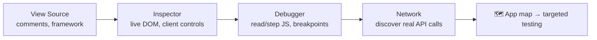
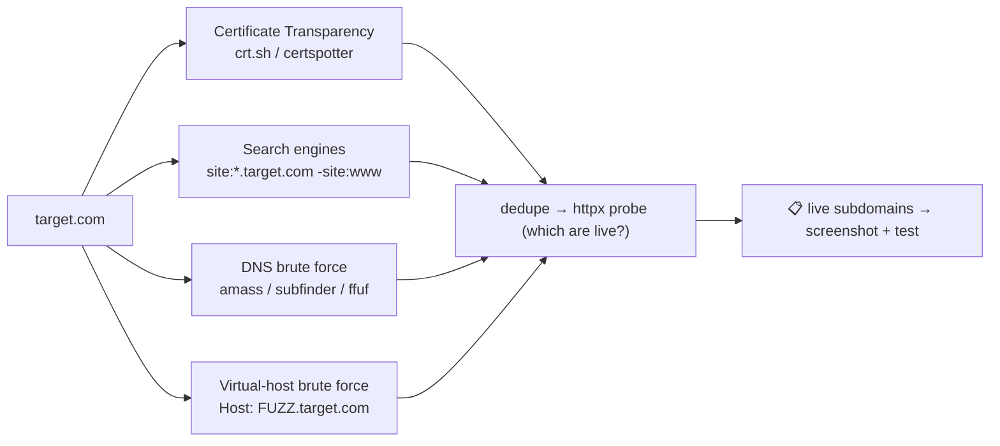
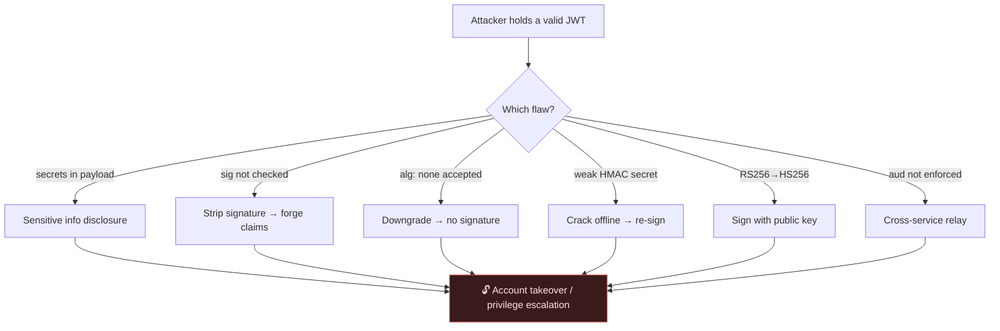

# 🕸️ 2.1 Web Fundamentals Masterclass

> [!abstract] The Masterclass
> Before you can exploit a web application you must be able to *read* it — its requests, its responses, its hidden content, and its authentication. This chapter is the reconnaissance-and-fundamentals half of web hacking: HTTP anatomy in depth, the browser dev-tools workflow, content & subdomain discovery pipelines, and the full JWT attack surface. It's the on-ramp to the **OWASP Top 10** and **Web Exploitation** chapters. **`#level/apprentice`**

> [!warning] Authorized Red-Team / Vulnerability-Assessment context
> Every technique here is for **authorized security testing** — labs, CTFs, bug-bounty scope, or engagements with written permission. The material is framed for **defensive architecture testing**: each recon method is paired with what a defender should therefore lock down.

> [!tip] Chapter Map
> **** · **** · **** · **** · ****

---

## Anatomy of an HTTP Transaction

A web app is a stack: **front-end** (HTML/CSS/JS in the browser) over **back-end** (web server, application code, database, WAF). Every interaction is a single HTTP request answered by a single HTTP response — and *every field in both* is something an assessor probes. The protocol foundations are in **the Networking Masterclass**; here we read it like an attacker.

### The full request/response, annotated
```http
POST /api/login HTTP/1.1              ← request line: METHOD  path  version
Host: target.thm                      ← which vhost (one IP can host many)
User-Agent: Mozilla/5.0               ← client fingerprint (spoofable)
Content-Type: application/json        ← how to parse the body
Cookie: session=eyJ...                ← state carried across stateless requests
Content-Length: 44

{"username":"admin","password":"hunter2"}   ← body (POST/PUT/PATCH only)
```
```http
HTTP/1.1 200 OK
Server: nginx/1.18.0                  ← version disclosure → known-CVE shortlist
Content-Type: application/json; charset=utf-8
Set-Cookie: session=…; HttpOnly; Secure; SameSite=Strict   ← the cookie's defenses
Cache-Control: no-store               ← keep sensitive responses out of caches
X-Frame-Options: DENY                 ← clickjacking defense
{"token":"eyJ..."}
```

### Methods — intent, and the abuse of each
The **request line** is `METHOD /path HTTP/version`. The method declares intent, and each carries a distinct security concern a tester checks for:

| Method | CRUD-ish | Attacker's angle | Defender's job |
| --- | --- | --- | --- |
| **GET** | Read | Params in the URL leak to logs, history, `Referer`; try tampering IDs → **IDOR** | Never put secrets/tokens in a URL |
| **POST** | Create | The main injection surface (body params) | Validate & sanitise every field |
| **PUT** | Replace | Overwrite a resource you shouldn't | Authorize *before* the write |
| **PATCH** | Partial update | Inject extra fields → **mass assignment** | Allow-list writable fields |
| **DELETE** | Delete | Destroy others' resources | Authorize the destructive action |
| **OPTIONS** | Discover | Enumerate the method/verb surface + CORS policy | Don't reveal more than needed |
| **TRACE** | Debug echo | Cross-Site Tracing (XST) to steal headers | Disable it |

```bash
curl -v https://target.thm            # full request + response headers
curl -sI https://target.thm           # headers only — fingerprint the stack fast
curl -X OPTIONS -i https://target.thm  # which methods are allowed here?
```

### Body formats and response headers
POST/PUT bodies come as `application/x-www-form-urlencoded` (`k1=v1&k2=v2`), `multipart/form-data` (file uploads — feeds **upload attacks**), `application/json`, or `application/xml` (the XML parser is the door to **XXE**). On the response side, the security-relevant headers a tester always inspects:

| Header | Why it matters |
| --- | --- |
| `Server` / `X-Powered-By` | Fingerprint → CVE lookup (**A06**) |
| `Set-Cookie` flags | `HttpOnly`+`Secure`+`SameSite` decide cookie-theft feasibility |
| `Location` | If user-controllable → **open redirect** |
| `Content-Security-Policy` | The main **XSS** mitigation |
| `Access-Control-Allow-Origin` | `*` with credentials = CORS misconfig |

> **Defensive architecture note:** strip/obscure `Server`, set all three cookie flags, validate any user-influenced `Location`, ship a strict CSP + HSTS, and HTML-escape all user data in the **response body**.

---

## Walking an Application

"Walking" an app means manually exploring it through the browser's own tools *before* firing any scanner — the highest-signal, lowest-noise recon there is. You build a mental map of the app: its pages, its JavaScript, its background API calls, and its assumptions.



### View source & the hidden clues
`Ctrl-U` shows the raw HTML/CSS/JS the browser received. Hunt for:
- **HTML comments** — dev notes, hidden endpoints, half-removed features, sometimes credentials.
- **Framework/version fingerprints** — meta tags, JS bundle names, `/static/` paths. A known framework + version = a shortlist of public CVEs.

### Inspector — the DOM is attacker-controlled
The Inspector shows the *live* DOM (after CSS/JS run), and you can edit it locally. The classic lesson: a client-side "paywall" that only *hides* premium content with CSS.

![[Pasted image 20251223080855.png]]

Right-click the blocking element → **Inspect**, find the `div.premium-customer-blocker`, and flip its `display: block` to `none`:

![[Pasted image 20251223080917.png]]

The content (and the flag) appears — proving the control was **client-side only**. This generalises to a rule you'll rely on constantly: *the client is fully attacker-controlled; never enforce authorization, price, or role in the browser.* Hidden form fields, disabled buttons, and `type=hidden` price inputs are all editable here.

### Debugger — reading and pausing JavaScript
The **Debugger** (Chrome: *Sources*) inspects and controls JS execution. Minified/**obfuscated** JS (variables renamed to gibberish, dummy code inserted, everything on one line) can be *Pretty-Print*'d (`{ }`) to restore formatting, then stepped through with **breakpoints** — pausing execution to freeze a page and read its logic. Here a `flash['remove']()` call wipes a popup; a breakpoint on that line freezes it in place so you can read what it was hiding:

![[Pasted image 20251223081950.png]]

> **On obfuscation & "web hacking" JS:** obfuscation *raises the effort* to read JS but is **not** a security control — a breakpoint, a deobfuscator site, or a JS beautifier recovers the logic. Never put secrets, API keys, or auth logic in client-side JS; it all ships to the attacker. Source maps (`.js.map`) often leak the original readable source entirely.

### Network — finding the real API
The **Network** tab logs every request the page makes, including background **AJAX/fetch** calls. For a single-page app (React/Vue/Angular) this is the fastest way to discover the *real* API endpoints — the front-end is just a client to the same API you'll test directly in **API Security**. Filter by `XHR`, watch the request/response, and note auth headers.

---

## Content Discovery

**Content** = everything *not* linked from the front page: staff portals, old versions, backups, config files, admin panels, `.git` directories. Three avenues: **manual**, **OSINT**, **automated**.

### Manual — the free, low-noise wins
| Source | What it leaks |
| --- | --- |
| `robots.txt` | Paths the owner *doesn't* want indexed — i.e. a curated map of what's sensitive |
| `favicon.ico` | Default framework favicons fingerprint the stack (hash → [OWASP favicon DB](https://wiki.owasp.org/index.php/OWASP_favicon_database)) |
| `sitemap.xml` | Every page the owner *does* list — including forgotten/legacy ones |
| `.git/`, `.env`, `*.bak` | Source code, credentials (see **OSINT**) |
| HTTP headers | `Server`, `X-Powered-By` → software + version |

![[Pasted image 20251223090036.png]]
![[Pasted image 20251223090211.png]]

```bash
curl https://target.thm/robots.txt
curl -s https://target.thm/images/favicon.ico | md5sum     # → look up the hash
curl -v http://target.thm                                    # read Server / X-Powered-By
```

### OSINT
- **Google Dorking** — `site:`, `inurl:`, `filetype:`, `intitle:` (full reference in **OSINT**).
- **Wappalyzer** — fingerprint frameworks/CMS/versions from the browser.
- **Wayback Machine** — resurrect old pages/endpoints still live behind the scenes.
- **GitHub** — search the target's org for leaked source, keys, `.env` files.
- **S3 buckets** — `{name}-assets.s3.amazonaws.com`; misconfigured ACLs expose files.

### Automated (fuzzing) — with real workflow
Brute-force paths/files against a **wordlist** (SecLists is the standard). Wordlist choice matters more than the tool: `common.txt` for a quick pass, `raft-large-directories.txt` for depth, tech-specific lists once you've fingerprinted the stack.
```bash
# Baseline directory fuzz
ffuf -w /usr/share/seclists/Discovery/Web-Content/common.txt -u https://target.thm/FUZZ
# Filter noise: hide 404s by size, and auto-calibrate against a bogus path
ffuf -w common.txt -u https://target.thm/FUZZ -mc 200,301,302,403 -fs 1234 -ac
# Recurse into discovered dirs, and fuzz an extension list
ffuf -w common.txt -u https://target.thm/FUZZ -recursion -e .php,.bak,.txt
```
Typical output — `admin [Status: 302]`, `backup [Status: 200]`, `.git [Status: 301]` — each a lead. See **Gobuster** for the alternative tool. *Defenders:* remove backups/config from web roots, return uniform 404s, and rate-limit so blind fuzzing is expensive and noisy in your logs.

---

## Subdomain Enumeration

Finding valid subdomains **expands the attack surface** — `dev.`, `staging.`, `vpn.`, `legacy.`, `api.` hosts are frequently weaker, unpatched, or forgotten. Four methods, best run as a pipeline:



- **Certificate Transparency (CT) logs** — every CA-issued TLS cert is publicly logged; passive and instant:
  ```bash
  curl -s "https://crt.sh/?q=%25.target.com&output=json" | jq -r '.[].name_value' | sort -u
  ```
- **Search-engine dorking** — `site:*.target.com -site:www.target.com`.
- **DNS brute force** — try thousands of candidate names against a wordlist:
  ```bash
  subfinder -d target.com -silent | tee subs.txt        # passive aggregation
  ffuf -w subdomains.txt -u https://target.com -H "Host: FUZZ.target.com" -fs 0
  ```
- **Virtual-host brute force** — fuzz the `Host:` header to find vhosts that share one IP but aren't in public DNS (internal apps).

Chain it: `subfinder`/`amass` → dedupe → `httpx` (which resolve and serve HTTP) → `gowitness`/`aquatone` (screenshot at scale). This feeds **Reconnaissance** and **OSINT**. *Defenders:* inventory every subdomain, retire dangling DNS records (they enable **subdomain takeover**), and keep non-prod hosts off the public internet.

---

## JWT Security

**JSON Web Tokens** are the dominant stateless-auth mechanism (concept in **Sessions: Cookies vs Tokens**). A JWT is `header.payload.signature`, each part Base64URL-encoded. Because it is **encoded, not encrypted**, and self-verifying, its entire security rests on the **signature** — which is exactly where implementations fail. Every item below is a finding you'd report in a **vulnerability assessment**, with its fix. `jwt_tool` and jwt.io are the standard analysis aids.



**1 — Sensitive information disclosure.** Claims are readable by anyone with the token. Developers who treat the payload like a server-side session leak password hashes, internal IPs, and hostnames:
```bash
curl -H 'Content-Type: application/json' -d '{"username":"user","password":"password1"}' http://target/api/example1
echo "eyJ...<payload-segment>" | base64 -d      # read the claims — never store secrets here
```

**2 — Signature not verified.** If an endpoint skips verification entirely, strip the third segment (leave the trailing dot) and forge any claim (`"admin":true`). Uncommon globally, but frequently missing on a *single* endpoint — test each one.
```
eyJ...header.eyJ...payload.        ← empty signature; if accepted = critical bug
```

**3 — `alg: none` downgrade.** The spec's `none` algorithm means "no signature." If the server doesn't pin the algorithm, set `"alg":"none"`, drop the signature, and the verifier returns true for any claims. **Fix:** allow-list the exact expected algorithm; explicitly reject `none`.

**4 — Weak symmetric secret.** HS256 security equals the secret's entropy. A weak secret cracks offline; then you re-sign arbitrary forged claims:
```bash
# save the token to jwt.txt, then:
hashcat -m 16500 -a 0 jwt.txt jwt.secrets.list     # wallarm/jwt-secrets wordlist
# jwt_tool automates crack + tamper:
python3 jwt_tool.py <JWT> -C -d jwt.secrets.list
```

**5 — Algorithm confusion (RS256 → HS256).** Downgrade an asymmetric algorithm to symmetric; vulnerable libraries then use the **public key** (which you can obtain) as the HMAC secret, letting you forge a valid signature:
```python
import jwt
public_key = open("server_public.pem").read()     # the server's known RSA public key
token = jwt.encode({"username":"user","admin":1}, public_key, algorithm="HS256")
```

**6 — Token lifetime.** No/oversized `exp` = a stolen token valid forever; JWTs can't be revoked server-side without a denylist. Choose `exp` per sensitivity (minutes for banking, not days), and pair short access tokens with rotating refresh tokens.

**7 — Cross-service relay (audience confusion).** One SSO issuer, many apps. If an app doesn't enforce the `aud` claim, a token minted (with `"admin":true`) for App A is replayed against App B → privilege escalation:

![[Pasted image 20260609133933.png]]

> **Secure JWT checklist:** pin the algorithm · reject `none` · strong random secret (or asymmetric keys, verify with the *public* key only) · verify `exp`, `aud`, `iss` server-side · never authorize on an unverified claim · keep lifetimes short. This is **OWASP A07** and API **API2**.

---

## 🔗 Related Master Notes & Deep-Dives
- **2.2 OWASP Top 10** — the vulnerability catalogue this recon feeds
- **2.3 Web Exploitation** — turning findings into exploits
- **2.4 API Security** — the API-specific counterpart
- **Networking (HTTP and the Web)** · **Defensive Groundwork (Sessions (Cookies vs Tokens))** — foundations
- **Gobuster** · **Burp Suite** · **OSINT** · **Reconnaissance** — tooling
- [[Web Security]] — domain hub
