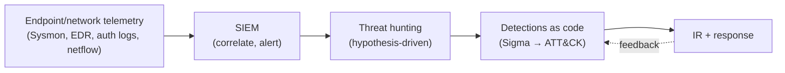

# 🛡️ 3.5 Advanced Defenses Masterclass

> [!abstract] The Masterclass
> This is the payoff chapter — where every offensive technique in Phase 3 becomes a **detection**. A master defender masters offense first (the whole point of Modules **3.1**, **3.3**, **3.4**) so they can build the telemetry, alerts, and hunts that catch it. This closes the Crook → Root loop: you now understand both sides of the fight. **`#level/root`**

> [!tip] Chapter Map
> **** · **** · **** · **** · **** · ****

---

## The Detection Mindset

Modern defense assumes the perimeter *will* be breached and focuses on **detecting the attacker inside**. Three principles:

- **Assume breach** — hunt for post-exploitation behaviour, not just perimeter blocks.
- **Behaviour over signatures** — **LOTL** uses *trusted* binaries, so you can't block by hash; you detect by **what they do** (a `certutil` that downloads an `.exe`, `rundll32` running from `C:\Users\Public`).
- **Detection engineering** — map coverage to **MITRE ATT&CK**, write detections as code, and measure them (the Pyramid of Pain: cost the attacker *TTPs*, not just IOCs).



---

## The Defensive Stack (EDR · SIEM · Threat Hunting)

| Layer | Role |
| --- | --- |
| **Telemetry** | The raw truth: **Sysmon** (process/network/image-load — Event IDs 1/3/7/11), Windows Security log, auth.log/auditd, **netflow/Zeek** |
| **EDR** | Endpoint Detection & Response — real-time process-tree, memory, and behavioural monitoring on every host; blocks and isolates |
| **SIEM** | Splunk/Elastic/Sentinel — centralises logs, correlates across hosts, runs detection rules, alerts |
| **NDR / NSM** | Network detection — beaconing, lateral movement, exfil patterns |
| **Threat hunting** | Proactive, hypothesis-driven search for what automated rules miss |
| **SOAR** | Automated response playbooks |

> The **non-negotiable foundation** is off-host, real-time log forwarding — it neutralises most of **anti-forensics** before it starts.

---

## Detecting Privilege Escalation

The escalations in **Module 3.1** all leave telemetry:

| Technique | Detection |
| --- | --- |
| **SUID/sudo abuse** | auditd on `execve` of shell-escape binaries via `sudo`; `sudo -l` enumeration bursts; a shell spawned as a child of a SUID binary |
| **LD_PRELOAD** | auditd on `sudo` with `LD_PRELOAD` set; unexpected `.so` writes to `/tmp` |
| **Cron/PATH hijack** | file-integrity monitoring (FIM) on cron scripts & `/etc/crontab`; writes to `PATH` dirs |
| **Kernel exploit** | a service/kernel Oops in `dmesg`; a child shell from an unexpected process; EDR memory anomalies |
| **Windows token impersonation (Potato)** | Sysmon EID 1 for `PrintSpoofer`/potato tooling; **Event ID 4673/4674** (privileged service called); a service account suddenly running `cmd`/`powershell` as SYSTEM |

```splunk
index=sysmon EventCode=1 (Image="*\\cmd.exe" OR Image="*\\powershell.exe")
ParentImage IN ("*\\w3wp.exe","*\\sqlservr.exe","*\\services.exe") User="NT AUTHORITY\\SYSTEM"
| stats count by Host, ParentImage, Image, User      // service account → SYSTEM shell
```

---

## Detecting Exploitation & Shellcode

Memory-corruption exploitation (**Module 3.3**) is noisy at the endpoint:
- **Repeated service crashes** — fuzzing/offset-finding shows up as recurring `SIGSEGV` / Windows WER crash events on the same process.
- **Anomalous child process** — a network daemon (`nginx`, `sqlservr`) spawning `cmd`/`/bin/sh` is a near-certain post-exploitation signal.
- **RWX memory / suspicious allocations** — shellcode needs executable memory; EDR flags `VirtualProtect`/`mprotect` making a region RWX, and ROP-like stack pivots.
- **Exploit-guard controls** — CFG, CET/shadow-stack, and EMET-style mitigations both *prevent* and *log* exploitation attempts.

```splunk
index=sysmon EventCode=1 ParentImage IN ("*\\nginx.exe","*\\httpd*","*\\sqlservr.exe")
Image IN ("*\\cmd.exe","*\\powershell.exe","*/sh","*/bash")
| stats count by Host, ParentImage, Image      // daemon spawning a shell = exploitation
```

---

## Detecting Living off the Land

Because LOLBins are trusted, detection is **behavioural** — correlate the tool with an anomalous action (the detections shipped alongside each technique in **Module 3.1**):

- **PowerShell** — `IEX(DownloadString)`, `-EncodedCommand`, `-Exec Bypass`; enable **Script-Block Logging (EID 4104)**, **Module Logging**, **AMSI**, and **Constrained Language Mode**.
- **certutil** — `-urlcache`/`-decode` (a certificate tool has no business downloading `.exe`s).
- **rundll32 / mshta / regsvr32** — running from `C:\Users\Public`/`Temp`, or with URLs/inline script.
- **wmic / schtasks** — remote `process call create`; new tasks with benign names (`WindowsUpdate`) running from user-writable paths.

```splunk
index=sysmon (EventCode=1 OR EventCode=4104)
(CommandLine="*DownloadString*" OR CommandLine="*-EncodedCommand*"
 OR (Image="*\\certutil.exe" AND CommandLine="* -urlcache *")
 OR (Image="*\\rundll32.exe" AND CommandLine="*\\Users\\Public\\*"))
| stats count values(User) values(ParentImage) by Host, Image, CommandLine
```
Parent-child anomalies are gold: `winword.exe → powershell.exe` is almost always malicious.

---

## Detecting Anti-Forensics

The paradox from **Module 3.4** — *removal is itself an artifact*:

| Anti-forensic move | Alert |
| --- | --- |
| Windows Security log cleared | **Event ID 1102** — one of the highest-fidelity alerts in the SOC |
| Linux log cleared/edited | **off-host forwarded copy** already has the entries; FIM on `/var/log`; sequence-number gaps |
| `wtmp`/`utmp` wiped | inode `ctime` anomaly; `last` output ends abruptly; forwarded auth events remain |
| auditd/Sysmon stopped | **service-stop event**, then telemetry silence — alert on the *absence* of expected heartbeat logs |
| Secure file deletion | USN journal / `$MFT` deletion record; EDR captured the file **hash on write**, before shredding |
| MAC/hostname masking | NAC/802.1X, switch port, and DHCP logs record both identities |

```splunk
index=wineventlog (EventCode=1102 OR EventCode=104)         // Security/System log cleared
| stats count by Host, User, _time
| eval severity="CRITICAL — audit log cleared"
```
> **Design principle:** make logs **immutable and off-host**, alert on **log-source silence**, and treat *any* clearing event as an incident. The attacker owns the endpoint; they don't own the SIEM.

---

## 🔗 Related Master Notes & Deep-Dives
- **3.1 Privilege Escalation & Living off the Land** · **3.3 Exploit Development** · **3.4 Anti-Forensics & ShadowStep** — the offense these detections counter
- **Windows and OS Internals (Windows Event Logs)** · **OWASP Top 10 (A09 Security Logging and Monitoring Failures)** — logging foundations
- **1.6 Defensive Groundwork** · **Docker and Containers (Container Security and Escapes)** — earlier defensive layers
- [[Defensive Security]] — domain hub
