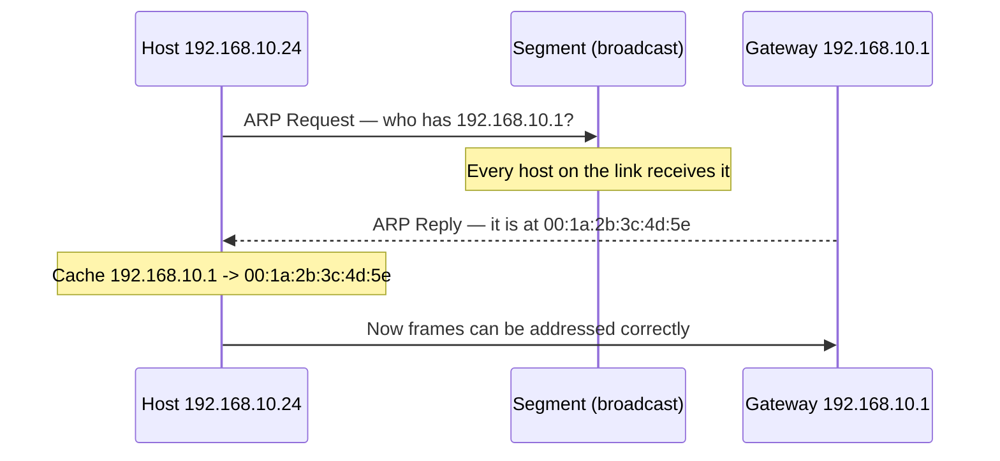
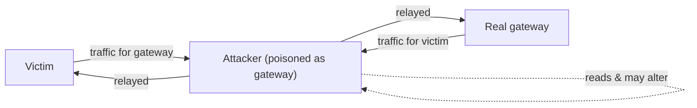

# 🧭 ARP & Neighbor Discovery

> [!abstract] Note of [[Switching & the Link Layer]]
> Before a host can send a frame to a neighbour, it must translate that neighbour's IP address into a hardware address — and the protocol that does this trusts any answer it receives. This note explains the resolution mechanism, why its trust model makes on-path attacks trivial on a local segment, and how to detect and prevent them.

## Parent Learning Order
Ethernet & Frame Structure -> MAC Addressing & Switch Operation -> ARP & Neighbor Discovery -> VLANs & Trunking -> Spanning Tree & Loop Prevention -> Link Layer Security Controls

## Start at Zero: The Missing Translation

A host that wants to send to `192.168.10.1` knows the destination *IP* address, but a frame needs a destination *hardware* address. Something must bridge Layer 3 to Layer 2. On IPv4 that something is **ARP (Address Resolution Protocol)**.

The exchange is two messages:

1. **ARP Request** — broadcast to the whole segment: "Who has `192.168.10.1`? Tell `192.168.10.24`." Every host receives it because it is addressed to `ff:ff:ff:ff:ff:ff`.
2. **ARP Reply** — a unicast answer from the owner: "`192.168.10.1` is at `00:1a:2b:3c:4d:5e`."

The asker caches the answer in its **ARP table** so it need not ask again for every frame.



```bash
ip neigh show
```

Expected excerpt:

```text
192.168.10.1 dev eth0 lladdr 00:1a:2b:3c:4d:5e REACHABLE
192.168.10.53 dev eth0 lladdr 00:0c:29:7b:2c:14 STALE
```

`REACHABLE` means the mapping was confirmed recently; `STALE` means it is cached but unverified and will be revalidated on next use. The table is the host's belief about who its neighbours are — and belief is exactly what an attacker manipulates.

## The Flaw: ARP Believes Anyone

ARP has no authentication. Three properties make it exploitable, and they are design characteristics rather than bugs:

- A host **accepts a reply it never requested**. Most implementations cache any ARP reply they see, whether or not they asked.
- A host **accepts an updated mapping** that overwrites an existing one, so a later reply wins.
- **Gratuitous ARP** — an unsolicited announcement of a mapping — is honoured, because it legitimately exists to update neighbours after a failover or address change.

Combine these and the attack writes itself. An attacker sends the victim a forged reply claiming the *gateway's* IP is at the *attacker's* MAC, and sends the gateway a forged reply claiming the *victim's* IP is at the *attacker's* MAC. Both caches are now poisoned, and both parties send their traffic to the attacker, who forwards it on to preserve connectivity. This is **ARP spoofing**, and it produces a full on-path position — the attacker reads and can modify every frame between victim and gateway.



Nothing appears broken to the victim — pages load, connections work — because the attacker relays. That silence is what makes it dangerous. The only visible symptom is in the ARP table: the gateway and some other host suddenly share one MAC address.

```bash
ip neigh show | sort -k5
```

Expected excerpt during an attack:

```text
192.168.10.1  dev eth0 lladdr 00:0c:29:de:ad:00 REACHABLE
192.168.10.53 dev eth0 lladdr 00:0c:29:de:ad:00 REACHABLE
```

Two different IP addresses resolving to the identical MAC (`00:0c:29:de:ad:00`) is the signature. A legitimate configuration essentially never does this, so it is a high-confidence indicator.

## IPv6: Neighbor Discovery Inherits the Problem

IPv6 does not use ARP. It uses **NDP (Neighbor Discovery Protocol)**, carried inside ICMPv6, with **Neighbor Solicitation** and **Neighbor Advertisement** messages that play the roles of request and reply. NDP is more capable — it also handles router discovery and address autoconfiguration — but it inherited ARP's core weakness: the messages are unauthenticated by default, so **Neighbor Advertisement spoofing** is the direct analogue of ARP spoofing.

```bash
ip -6 neigh show
```

Expected excerpt:

```text
fe80::1 dev eth0 lladdr 00:1a:2b:3c:4d:5e router REACHABLE
2001:db8:acad:1::53 dev eth0 lladdr 00:0c:29:7b:2c:14 STALE
```

The same detection logic applies: two IPv6 addresses resolving to one MAC is suspicious. IPv6 additionally exposes router advertisement spoofing, a related but distinct attack covered where addressing is discussed. The lesson is that "we use IPv6" does not escape the trust problem — it renames it.

## Detection and Prevention

**Detection** watches for the signatures above and for behavioural anomalies:

- Multiple IP addresses mapping to one MAC in the neighbour table.
- A flood of gratuitous ARP or unsolicited neighbour advertisements.
- The gateway's MAC changing unexpectedly.

A passive monitor can maintain a baseline of IP-to-MAC bindings and alarm on changes:

```bash
sudo arpwatch -i eth0
```

Expected excerpt (from its log):

```text
changed ethernet address for 192.168.10.1
   from 00:1a:2b:3c:4d:5e to 00:0c:29:de:ad:00
```

A "changed ethernet address" event for the gateway is the alert that matters most; gateways do not normally change hardware address.

**Prevention** is a link-layer control, because the attack is link-layer:

- **Dynamic ARP Inspection (DAI)** on switches validates every ARP reply against a trusted binding table — typically the one built by DHCP snooping — and drops replies that do not match. An attacker's forged mapping fails validation and never reaches the victim.
- **Static ARP entries** for critical mappings (a server's gateway) cannot be overwritten by a forged reply, but do not scale beyond a few high-value bindings.
- For IPv6, the equivalent switch feature inspects neighbour advertisements against the same trusted bindings.

DAI is the scalable answer, and it depends on the snooping binding table — which is why the link-layer controls in this branch reinforce each other rather than standing alone.

## Security Implications

ARP and NDP spoofing are the foundation of most local on-path attacks. Once an attacker sits between a victim and its gateway, everything downstream becomes possible: reading plaintext credentials, stripping transport security by tampering with the handshake, injecting content, redirecting name lookups, and harvesting authentication material. The position is the prize; the specific payload varies.

The scope of the attack is exactly one broadcast domain — it cannot cross a router, because ARP and NDP are link-local. This is why segmentation limits the blast radius: an attacker on the guest VLAN cannot poison the finance VLAN's gateway. It is also why a flat network is so dangerous, since a single foothold can position itself between any two hosts in the entire estate.

Transport-layer security is the backstop that survives an on-path attacker. Even with a perfect on-path position, an attacker cannot read a properly validated TLS session — they can only see metadata and attempt a downgrade that certificate validation and HSTS defeat. This is precisely why "the local network is hostile" is the correct assumption and why end-to-end encryption is not optional.

All poisoning and interception described here must be performed only on an isolated lab you own. ARP spoofing intercepts other parties' traffic and is unlawful on networks you are not authorized to test.

## Authorized Lab: Poison a Cache, Then Stop It

Use three lab VMs on one isolated segment: victim, gateway (or a second host acting as one), and attacker. Record baseline neighbour tables first.

1. On the victim, record the legitimate mapping:

```bash
ip neigh show | grep <gateway IP>
```

2. From the attacker, send forged ARP replies poisoning the victim's mapping of the gateway to the attacker's MAC, and the gateway's mapping of the victim likewise (an ARP-spoofing tool in your lab). Enable forwarding on the attacker so connectivity is preserved.
3. On the victim, re-check the neighbour table and confirm the gateway now resolves to the attacker's MAC. Note that connectivity still works — the attacker is relaying.
4. From the attacker, capture the victim's traffic to demonstrate the on-path position:

```bash
sudo tcpdump -i eth0 -nn host <victim IP> and not arp -c 10
```

Observe the victim's frames arriving at the attacker.
5. Prove that transport security holds: have the victim make an HTTPS connection and confirm the attacker sees only encrypted bytes and metadata, not plaintext content.
6. Apply the control. On the lab switch, enable DHCP snooping and Dynamic ARP Inspection so replies are validated against the trusted binding table. Restart the attack.
7. Confirm the forged replies are now dropped, the victim's neighbour table retains the correct gateway MAC, and the attacker no longer receives the victim's traffic.
8. Disable the attack, remove the lab controls if your baseline requires it, flush neighbour caches, and confirm both tables return to their step-1 state.

Expected interpretation:

```text
Baseline        -> gateway has its own unique MAC in the victim's table
Poisoned        -> gateway resolves to the attacker's MAC; two IPs share one MAC
Capture         -> attacker receives the victim's frames (on-path achieved)
HTTPS           -> content stays encrypted; the position is not the plaintext
DAI enabled     -> forged replies fail validation and never reach the victim
```

## Crook → Operator → Root Checkpoint

- **Crook:** Explain why ARP exists, describe the request/reply exchange, and state what an ARP table stores.
- **Operator:** Read a neighbour table, recognize the two-IPs-one-MAC signature of poisoning, and use a monitor to detect a gateway MAC change; explain why connectivity keeps working during the attack.
- **Root:** Explain why ARP's acceptance of unsolicited and overwriting replies makes on-path attacks trivial; describe how Dynamic ARP Inspection uses the snooping binding table to validate replies, why the attack is confined to one broadcast domain, and why transport-layer security is the backstop that survives an on-path adversary.

---
> 🔼 Up: [[Switching & the Link Layer]]
