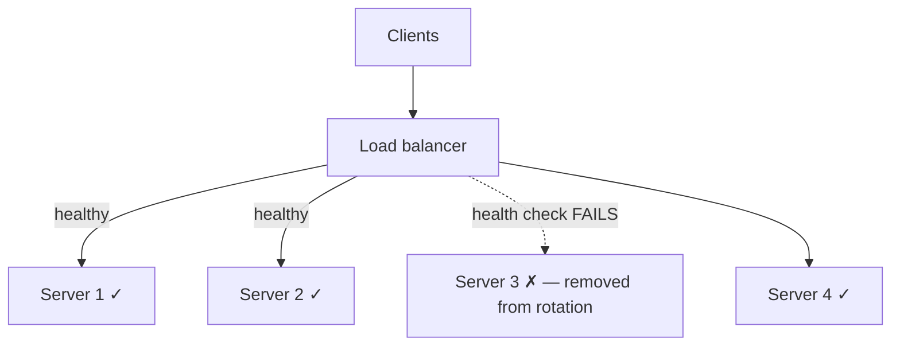

# ⚖️ Application Delivery & Load Balancing

> [!abstract] Note of [[Web & Application Protocols]]
> No serious web service runs on one server; requests are spread across many by a load balancer, and cached near users by a content delivery network. This note explains how traffic is distributed, how failures are detected and routed around, and why the delivery tier is simultaneously the front line of availability defense and a concentration of trust worth attacking.

## Parent Learning Order
HTTP Fundamentals -> HTTPS & the TLS Handshake -> Web Architecture & Proxies -> WebSockets & Real-Time Protocols -> REST & Modern API Transport -> Application Delivery & Load Balancing

## Start at Zero: One Name, Many Servers

A popular site receives far more requests than one machine can serve, and one machine is a single point of failure. The solution is to run many identical servers and place a **load balancer** in front that distributes incoming requests across them. Clients connect to one address; the load balancer decides which backend actually handles each request.

This delivers three things at once: **scale** (add servers to handle more load), **availability** (one server failing does not take down the service), and **maintainability** (servers can be updated one at a time behind the balancer). It is the reason a single hostname can serve millions of users.

Load balancers operate at one of two layers, and the distinction determines what they can do.

- A **Layer 4 load balancer** distributes by the transport five-tuple. It forwards TCP or UDP connections without looking inside, so it is fast and protocol-agnostic but cannot make decisions based on HTTP content — it does not see URLs, headers, or cookies.
- A **Layer 7 load balancer** understands HTTP. It can route by URL path, host, or header, terminate TLS, rewrite requests, and apply application-aware policy — at the cost of more processing per request.

```text
Layer 4:  connection -> [balancer picks a backend by 5-tuple] -> server   (fast, blind to HTTP)
Layer 7:  request    -> [balancer reads URL/headers, routes]  -> server   (smart, HTTP-aware)
```

## Distribution Algorithms and Health

How the balancer chooses a backend matters:

| Algorithm | Behaviour | Suits |
| --- | --- | --- |
| **Round robin** | Each backend in turn | Uniform servers and requests |
| **Least connections** | The backend with fewest active connections | Uneven request durations |
| **Weighted** | Proportional to server capacity | Mixed hardware |
| **Hash / IP hash** | Same client always to the same backend | When affinity is needed |

The indispensable companion to distribution is the **health check**. The balancer continuously probes each backend and stops sending traffic to any that fails, routing around it automatically. This is what turns many servers into a resilient service rather than a larger set of things that can break.



The health check is deceptively important. A **shallow** check (does the port answer?) can pass while the application behind it is broken — the balancer keeps sending traffic to a server that returns errors. A **deep** check (does a real request succeed end to end?) catches that but costs more and, if pointed at a shared dependency like a database, can make every backend fail its check at once when that dependency wobbles, taking the whole service out of rotation over a problem that was not the servers' fault. Designing the health check is a real engineering decision with availability consequences in both directions.

```bash
curl -s -o /dev/null -w '%{http_code} %{time_total}\n' https://<service>/healthz
```

Expected excerpt:

```text
200 0.043
```

A dedicated health endpoint that exercises the critical path without heavy side effects is the standard pattern.

## Session Affinity and TLS Termination

Two behaviours of the delivery tier have direct security weight.

**Session affinity (sticky sessions)** makes a balancer send a given client to the same backend repeatedly, usually because that backend holds the client's session in local memory. It works, but it undermines even distribution and resilience — if that backend fails, the client's session is lost. The better architecture stores session state externally (a shared store) so any backend can serve any request, removing the need for affinity. Affinity is often a sign that state was put in the wrong place.

**TLS termination** is where the balancer decrypts HTTPS. Terminating at the balancer lets it read and route by HTTP content and centralizes certificate management, but it means traffic from the balancer to the backends may be unencrypted on the internal network. Whether that is acceptable depends on the threat model for the internal segment. **Re-encryption** (TLS to the backend as well) closes that gap at a performance cost, and is standard where the internal network is not trusted — which, per the zero-trust argument, is increasingly the default.

## Content Delivery Networks

A **CDN (Content Delivery Network)** extends delivery geographically. It is a globally distributed set of caching servers that hold copies of content close to users, so a request is served from a nearby edge rather than the distant origin. This cuts latency, absorbs load, and — because the edge fleet is enormous — absorbs volumetric attacks that would overwhelm a single origin.

The CDN is also a security boundary. It is where TLS is often terminated, where a WAF frequently runs, and where DDoS mitigation lives. This concentrates protection at the edge, and it concentrates trust: the CDN sees plaintext, holds certificates, and is the effective front door. A compromise or misconfiguration at the CDN affects everything behind it, and an origin whose real address leaks can be attacked directly, bypassing all the edge protection — which is why origin-address concealment is part of CDN security.

## Security Implications

**The delivery tier is the primary availability defense.** Load balancing, health checking, CDN absorption, and rate limiting at the edge are what keep a service up under both load spikes and deliberate floods. Availability is a security property, and this tier is where it is engineered. A service without a delivery tier has no answer to a volumetric attack beyond hoping the origin holds.

**It concentrates trust, so it concentrates risk.** The balancer and CDN see decrypted traffic, hold certificates, and make routing decisions for everything behind them. They are the highest-value targets in the architecture precisely because compromising one yields visibility and control over all the backends. They deserve the strongest protection, not the least — yet management interfaces on delivery infrastructure are a recurring weak point.

**Health checks are an attack surface and a failure amplifier.** An attacker who can influence health-check results can remove healthy servers from rotation (a denial of service) or keep unhealthy ones in it. And a poorly designed deep check tied to a shared dependency can turn one dependency's hiccup into a total outage as every backend fails simultaneously. Health-check design is both a reliability and a security concern.

**TLS termination location is a deliberate trust decision.** Terminating at the edge for performance means trusting the internal path; re-encrypting to the backend extends the guarantee at a cost. This must be a conscious choice matching the internal network's threat model, not a default accepted without thought.

**The origin must be protected from direct access.** All the edge protection is worthless if an attacker can reach the origin directly. Restricting the origin to accept traffic only from the CDN or balancer — by network controls or authenticated headers — is what makes the delivery tier a real boundary rather than an optional detour.

All testing described here must target only infrastructure within an authorized scope. Probing health endpoints, load-testing, and attempting origin discovery are intrusive and require authorization.

## Authorized Lab: Distribute, Fail, and Route Around

Use a lab load balancer in front of several identical backend servers, all under your control.

1. **Observe distribution.** Send many requests through the balancer and, by having each backend identify itself in the response, confirm requests spread across backends per the configured algorithm.
2. **Trigger a failure.** Stop one backend and confirm the balancer's health check detects it and removes it from rotation, so subsequent requests avoid it with no client-visible error. Restart it and confirm it rejoins.
3. **Compare check depth.** Configure a shallow (port-only) health check, then break the application while leaving the port open, and confirm the balancer keeps sending traffic to the broken backend. Switch to a deep check that exercises the real path and confirm it now detects the failure.
4. **Demonstrate the deep-check risk.** Point the deep check at a shared dependency, then make that dependency fail, and confirm every backend drops out of rotation at once — showing how a deep check can amplify a single failure.
5. **Test TLS termination.** Terminate TLS at the balancer and capture traffic on the internal segment to the backend; confirm it is readable. Then enable re-encryption and confirm the internal traffic is now protected.
6. **Protect the origin.** Configure a backend to accept connections only from the balancer, then attempt to connect to it directly and confirm the attempt is refused — demonstrating why origin concealment matters.
7. **Cleanup.** Restore the baseline configuration, restart any stopped backends, and confirm normal distribution.

Expected interpretation:

```text
Distribution   -> requests spread across backends per algorithm
Backend down   -> health check removes it; clients see no error
Shallow check  -> port open but app broken; traffic still sent (false healthy)
Deep check on shared dep -> one dependency failure drops all backends at once
TLS termination-> internal hop readable unless re-encrypted
Origin locked  -> direct connection refused; the edge is a real boundary
```

## Crook → Operator → Root Checkpoint

- **Crook:** Explain why services run behind a load balancer, the three benefits it provides, and the difference between Layer 4 and Layer 7 balancing.
- **Operator:** Configure distribution and health checks, explain why a shallow check can report a broken server as healthy, and describe what a CDN does for latency, load, and attack absorption.
- **Root:** Explain why the delivery tier concentrates both trust and availability defense; analyze the trade-offs in health-check depth, TLS-termination location, and session affinity, and why protecting the origin from direct access is what makes the edge a genuine boundary.

---
> 🔼 Up: [[Web & Application Protocols]]
