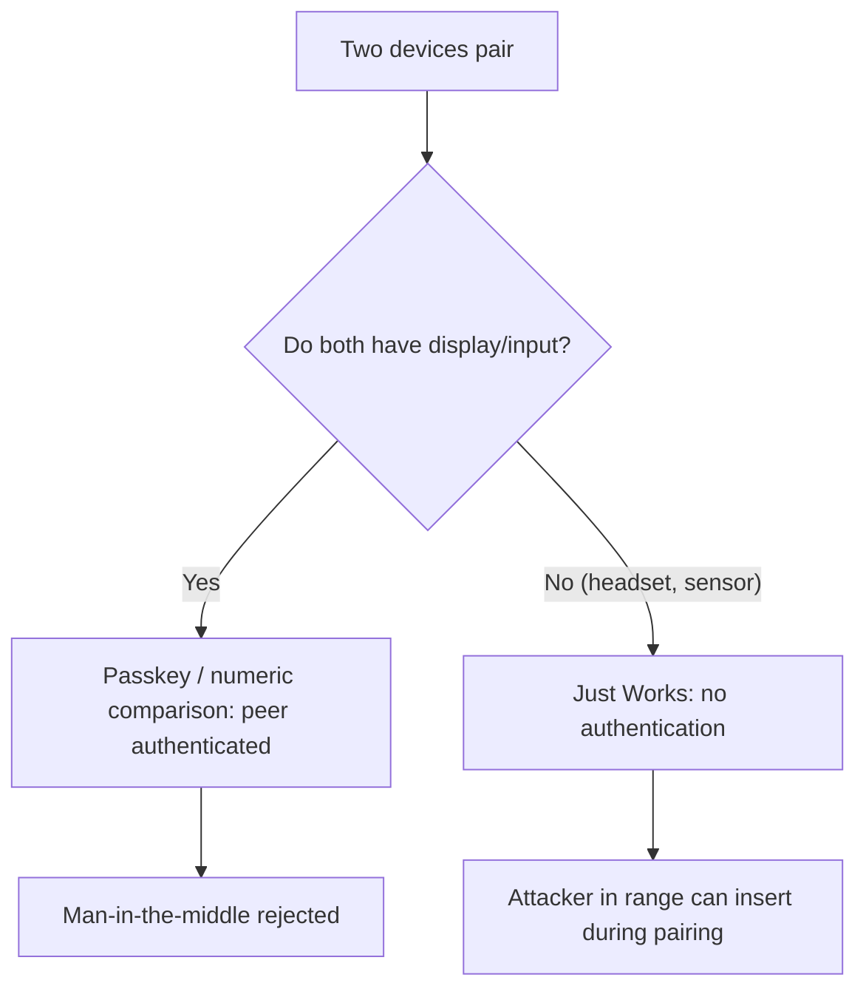

# 🎧 Bluetooth & Personal-Area Networks

> [!abstract] Note of [[Wireless Networking]]
> Short-range wireless connects the devices around a person — headphones, wearables, keyboards, sensors — and its security is shaped by a hard constraint: many of these devices are too small and cheap for strong, updatable protection. This note explains Bluetooth and its low-energy variant, the pairing that establishes trust, and why the personal-area network is a persistent, under-monitored attack surface.

## Parent Learning Order
Wireless Fundamentals & 802.11 -> Wi-Fi Security & WPA -> Wireless Attacks & Rogue Infrastructure -> Cellular & Long-Range Wireless -> Bluetooth & Personal-Area Networks -> Wireless Reconnaissance & Defense

## Start at Zero: The Network Around a Person

A **PAN (Personal-Area Network)** connects devices within a few metres of a person. **Bluetooth** is its dominant technology, and it comes in two quite different forms:

- **Bluetooth Classic** — higher throughput for continuous streams like audio, using more power.
- **Bluetooth Low Energy (BLE)** — designed for tiny, infrequent data from battery-constrained devices: wearables, sensors, beacons, medical devices, smart-home gadgets. BLE is why a fitness tracker runs for weeks on a tiny battery.

BLE's low-power design is the source of both its ubiquity and its security character. To sip power, it minimizes transmission and computation, which constrains how much cryptography it can afford — and the devices that use it are often cheap, single-purpose, and never updated. This produces the recurring embedded-security problem: **security is largely fixed at manufacture, on devices too constrained to improve it.**

Other PAN technologies fill specific niches — **Zigbee** and **Z-Wave** for low-power mesh home automation, **NFC** for centimetre-range tap interactions — but the security lessons generalize from Bluetooth: short range is not a security boundary, and constrained devices carry weak, static protection.

## Pairing: Establishing Trust

Before two Bluetooth devices communicate securely, they **pair** — exchanging keys to establish a trusted relationship. Pairing is where the security of the connection is decided, and its method depends on what interfaces the devices have.

| Pairing method | Requires | Security |
| --- | --- | --- |
| **Just Works** | No input/output | Weak — no authentication of the peer |
| **Passkey Entry** | A display and a keypad | Strong — a code confirms both ends |
| **Numeric Comparison** | Two displays | Strong — both users confirm a matching number |
| **Out of Band** | NFC or similar side channel | Strong — trust bootstrapped elsewhere |

The problem is visible immediately: **"Just Works" provides no authentication.** Devices with no display or keypad — a headset, a sensor, a beacon — cannot present or confirm a code, so they pair without verifying who they are pairing with. This is the personal-area equivalent of an open Wi-Fi network or 2G's one-way authentication: the client cannot verify the peer, so an attacker in range can insert themselves. And because so many BLE devices lack any interface, Just Works is extremely common.



## The Threats

**Interception during pairing.** If pairing is unauthenticated (Just Works) or uses a weak method, an attacker in range can perform a man-in-the-middle attack during the pairing exchange, ending up with keys to both sides. The window is the pairing moment, which is why pairing in a private location rather than a crowded one is a small but real precaution for sensitive devices.

**Tracking by address.** BLE devices advertise to be discovered, and if they use a static hardware address, they can be tracked as they move — a wearable broadcasting a constant identifier lets an observer follow the person wearing it. The fix is **address randomization**, rotating the advertised address so it cannot be correlated over time; well-designed devices use it, and cheap ones often do not.

**Implementation vulnerabilities.** Bluetooth stacks are complex and have had serious remotely exploitable flaws — vulnerabilities allowing code execution or interception simply from being in range, without pairing. Because the affected devices span everything from phones to embedded gadgets, and many never receive patches, these vulnerabilities have long tails. The constrained, unpatched-device problem means a flaw found today persists in the field for years.

**Range is greater than assumed.** "It's only a few metres" is a false comfort. With a directional antenna and amplification, an attacker can reach Bluetooth devices from far beyond the nominal range. Short range raises the effort but is not a boundary, exactly as Wi-Fi's walls are not a boundary.

## Security Implications

**The constrained-device problem defines PAN security.** Many Bluetooth and BLE devices cannot run strong cryptography, cannot be updated, and pair without authentication because they lack interfaces. Their security is set at manufacture and does not improve, and they are deployed in enormous numbers close to people and, increasingly, inside organizations (wireless peripherals, medical devices, building sensors). The realistic posture is to treat them as weakly secured, minimize what they can access, and monitor for anomalies — because hardening the devices is often impossible.

**Short range is not isolation.** The assumption that a Bluetooth device is safe because an attacker must be nearby fails against directional antennas and against the reality that "nearby" includes shared offices, public transit, and adjacent rooms. PAN devices in sensitive environments are an attack surface that physical proximity does not adequately bound.

**Wireless peripherals extend the keyboard-and-mouse trust boundary.** A wireless keyboard or mouse that pairs weakly or communicates without strong encryption can be injected into — an attacker sends keystrokes to a victim's machine, or captures them. This turns a convenience peripheral into an input channel to a workstation, which is why some high-security environments prohibit wireless peripherals entirely.

**The encryption backstop applies but is weaker here.** For data flowing over Bluetooth, the link's own encryption is the primary protection, and unlike Wi-Fi carrying general Internet traffic, there is often no additional end-to-end encryption layered on top — a Bluetooth headset's audio or a sensor's readings rely on the Bluetooth encryption alone. This makes the strength of pairing and link encryption more directly consequential than in a Wi-Fi context where TLS usually backs it up.

**Discoverability and pairing state are exposure.** A device left discoverable, or one that re-enters pairing mode readily, widens the window for attack. Keeping devices non-discoverable except when intentionally pairing, and pairing in controlled settings, are simple reductions of the exposure.

All scanning and testing described here must target only devices you own or are explicitly authorized to assess. Intercepting Bluetooth communications, attacking pairing, and injecting into peripherals belonging to others are unlawful.

## Authorized Lab: Discover and Assess Your Own Devices

Use a Bluetooth-capable host and BLE/Bluetooth devices you own. Scan and assess only your own devices.

1. **Scan for devices.** Enumerate nearby Bluetooth and BLE devices you own:

```bash
sudo hcitool lescan
```

Expected excerpt:

```text
LE Scan ...
AA:BB:CC:11:22:33 (unknown)
AA:BB:CC:11:22:33 MyFitnessBand
DE:AD:BE:EF:00:01 (unknown)
```

2. **Check address randomization.** Observe one of your devices over time and determine whether its advertised address stays constant (trackable) or rotates (randomized) — assessing the tracking exposure.
3. **Examine pairing methods.** For a device with no display (a headset or sensor), confirm it pairs via Just Works with no code confirmation; for one with a display, confirm it uses passkey or numeric comparison. Connect the pairing method to the authentication it does or does not provide.
4. **Inspect services.** For a BLE device you own, enumerate its advertised services and characteristics and consider what data it exposes and whether it requires authentication to read.
5. **Assess discoverability and update status.** Determine whether each device stays discoverable and whether it has any firmware-update capability, assessing the constrained-device posture.
6. **Plan segmentation.** For wireless peripherals or sensors in a hypothetical office, document how you would limit their access and monitor them given that their per-device security is largely fixed.
7. **Cleanup.** Stop scanning and return devices to non-discoverable where applicable.

Expected interpretation:

```text
Scan             -> nearby owned devices and their advertised identifiers
Static address   -> trackable over time; randomized address resists it
Just Works       -> no peer authentication; MITM window during pairing
BLE services     -> what data a device exposes and whether reads need auth
No update path   -> security fixed at manufacture; treat as weakly secured
```

## Crook → Operator → Root Checkpoint

- **Crook:** Explain what a personal-area network is, the difference between Bluetooth Classic and BLE, and what pairing establishes.
- **Operator:** Enumerate your own Bluetooth devices, identify pairing methods and address randomization, and explain why "Just Works" provides no authentication.
- **Root:** Explain how the constrained-device problem fixes PAN security at manufacture and why short range is not a boundary; connect weak pairing to the man-in-the-middle window and wireless-peripheral injection, and explain why the link encryption is more directly consequential here than where TLS backs it up.

---
> 🔼 Up: [[Wireless Networking]]
