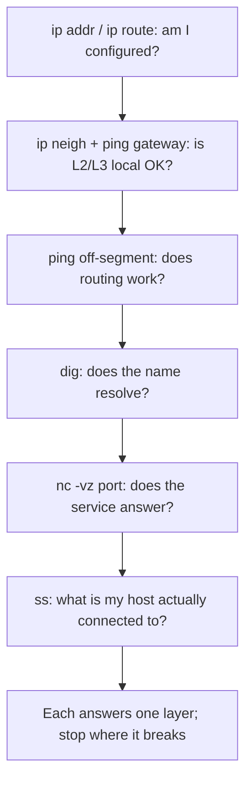

# 🧰 Connectivity Diagnostics

> [!abstract] Note of [[Network Analysis & Troubleshooting]]
> A handful of small tools answer most connectivity questions, and the skill is not running them but knowing which one answers which question and interpreting the result honestly. This note assembles the essential toolkit, maps each tool to the layer it tests, and stresses the recurring trap: a tool's silence means "no answer," not "no host."

## Parent Learning Order
Packet Capture & Analysis -> Structured Network Troubleshooting -> Traffic Analysis & Flow Inspection -> Performance & Latency Analysis -> Connectivity Diagnostics -> Protocol Debugging & Deep Inspection

## Start at Zero: The Right Tool for the Layer

Connectivity diagnostics is a small toolkit, and each tool answers a question at a specific layer. Knowing the map is most of the skill, because reaching for the wrong tool produces a confident answer to a question you did not ask.

| Question | Tool | Layer |
| --- | --- | --- |
| Is the host reachable at the IP layer? | `ping` | 3 |
| What path does traffic take? | `traceroute` / `mtr` | 3 |
| Does a name resolve, and to what? | `dig` / `nslookup` | 7 (DNS) |
| Is a specific port open? | `nc` / `nmap` | 4 |
| What are my own interfaces and routes? | `ip addr` / `ip route` | 2/3 |
| What connections does my host have? | `ss` / `netstat` | 4 |
| Who is my neighbour at the link layer? | `ip neigh` (ARP) | 2 |

These tools recur throughout the domain because they are the primitives of every diagnosis. This leaf consolidates them as a *toolkit* and, crucially, teaches honest interpretation — the failure mode is not running them wrong but reading them wrong.

## The Reachability Tools and Their Honest Limits

**ping** tests IP-layer reachability with ICMP echo. Its result is genuinely informative and genuinely limited:

```bash
ping -c 3 example.com
```

A successful reply proves the host is reachable and the round-trip works — Layers 1 through 3 in both directions. It proves **nothing** about whether any service is running. A host can answer ping perfectly with every application down.

Silence is the trap. `100% packet loss` does **not** mean "host down." It means "no ICMP echo reply was received," which has many causes: the host firewall drops ICMP, a device on the path filters it, the host genuinely is down, or the reply was lost. The professional habit — from the ICMP leaf and worth repeating because it is violated constantly — is to state "no ICMP response," change the probe rather than repeat it, and never conclude "host down" from ping alone.

**Test the actual service instead**, which is both more relevant and harder to filter:

```bash
nc -vz example.com 443
```

Expected excerpt:

```text
Connection to example.com (93.184.216.34) 443 port [tcp/*] succeeded!
```

An open port is positive proof the host is up *and* the service is listening — a stronger, more useful result than ping, because it tests what you actually care about. When ping fails but the port answers, the host was never down; ICMP was simply filtered. `nc -vz` (or `nmap -Pn`) is the correct tool once you suspect ICMP filtering.

**traceroute / mtr** reveal the path and where it breaks, with the same silence caveat: asterisks mean a hop did not reply, not that traffic stopped there, and only impairment persisting to the destination is real (the performance and ICMP leaves cover this).

## The Local-State Tools

Half of connectivity diagnosis is examining your *own* host's state before probing anything remote.

```bash
ip addr show          # my addresses and masks — am I configured correctly?
ip route              # my routes — where will traffic actually go?
ip neigh              # my resolved neighbours — did the gateway answer at Layer 2?
ss -tunp              # my connections and listeners — what am I actually talking to?
```

`ip route get <destination>` is the most under-used and most valuable, because it reports the exact decision the kernel will make for a destination without sending anything:

```bash
ip route get 8.8.8.8
```

Expected excerpt:

```text
8.8.8.8 via 192.168.1.1 dev eth0 src 192.168.1.24 uid 1000
```

This answers "how will my host actually try to reach this?" — which gateway, which interface, which source address — turning a routing question into a definite answer before any packet leaves. It is the fastest way to catch a wrong mask, a missing route, or a poisoned default.

**DNS diagnosis** is its own frequent culprit, and `dig` separates resolution from connectivity decisively:

```bash
dig +short example.com          # what does my resolver return?
dig @1.1.1.1 +short example.com  # what does a different resolver return?
```

If `ping <IP>` works but `ping <name>` fails, the fault is resolution, not connectivity — and comparing your resolver against a known-good one localizes it to your resolver versus the record itself, exactly as the DNS leaf details.

## Building a Diagnostic Sequence

The tools combine into the layered sequence from the troubleshooting leaf, each answering its layer's question in order:



The discipline is to run them in order and read each honestly, stopping at the first genuine break — and to remember that each tool answers exactly one question and no more.

## Security Implications

**The same tools are reconnaissance.** ping sweeps find live hosts, traceroute maps network topology, dig enumerates DNS records, and port checks find services — the exact first steps of an attacker's reconnaissance. The tools are neutral; authorization and intent separate diagnosis from an attack. Running them against systems you do not own is reconnaissance regardless of your motive, and it is logged.

**Honest interpretation resists both self-deception and manipulation.** The discipline of "silence means no answer, not no host" protects against wrong conclusions in troubleshooting and against an attacker who deliberately manipulates what your tools see — filtering ICMP to appear down, answering probes to appear present, or poisoning DNS so `dig` returns a false answer. A diagnostician who states evidence and its limits is harder to fool.

**Local-state tools detect compromise.** `ss -tunp` showing an unexpected listener or an outbound connection to an unfamiliar address is a compromise indicator, tying a connection to an owning process. Examining your own host's connections and listeners is both routine diagnosis and a basic security check, and it is often the fastest way to spot a foothold.

**Diagnostic output is evidence.** The results of these tools during an incident — what resolved to what, what was reachable, what connections existed — are forensic evidence, and they are perishable (connections close, caches expire, neighbours age out). Capturing diagnostic state promptly during an incident preserves evidence that is gone minutes later.

**Tool availability shapes response.** In a locked-down or compromised environment, the tools you can run are limited, and knowing multiple ways to answer the same question (ping versus port check, `dig` versus `getent`, `ss` versus `netstat`) is what lets you diagnose when your first choice is unavailable — a practical resilience that matters during an incident.

These tools are non-intrusive diagnostics on systems you administer. Directed at systems you do not own, they are reconnaissance requiring authorization.

## Authorized Lab: Build the Toolkit Reflex

Use a lab with a client, a target host running a service, and a controllable firewall.

1. **Map tools to layers.** For each tool in the table, run it against the lab and state which layer's question it answered.
2. **Demonstrate the ping trap.** Confirm `ping` reaches the target, then firewall-drop ICMP and confirm `ping` now reports 100% loss while `nc -vz` to the open port still succeeds — proving the host is up and ping's silence was filtering, not death.
3. **Use the right tool after filtering.** With ICMP filtered, use `nmap -Pn` / `nc -vz` to confirm reachability, articulating why these are correct once ICMP is unreliable.
4. **Separate DNS from connectivity.** Break DNS resolution and confirm `ping <IP>` works while `ping <name>` fails; use `dig` against two resolvers to localize the fault to the resolver versus the record.
5. **Predict routing without sending.** Use `ip route get` for several destinations and confirm it reports the exact gateway, interface, and source before any traffic — then introduce a wrong mask and confirm `ip route get` reveals the misrouting.
6. **Inspect local state.** Use `ss -tunp` to list your host's connections and listeners, then start a new connection and confirm it appears with its owning process — the compromise-detection use.
7. **Cleanup.** Restore firewall and DNS configuration.

Expected interpretation:

```text
Tool-to-layer   -> each answers one specific layer's question
Ping trap       -> 100% loss with an open port = ICMP filtered, host is up
Right tool      -> nc/nmap -Pn confirm reachability when ICMP is unreliable
DNS vs conn     -> IP works, name fails = resolution fault, localized with dig
ip route get    -> the exact forwarding decision, before sending anything
ss -tunp        -> connections tied to processes; a compromise-detection primitive
```

## Crook → Operator → Root Checkpoint

- **Crook:** Map the core tools to the layers they test, and explain what a successful ping does and does not prove.
- **Operator:** Choose the right tool for each question, use `nc`/`nmap -Pn` when ICMP is filtered, separate a DNS fault from a connectivity fault with `dig`, and predict routing with `ip route get` before sending traffic.
- **Root:** Explain why honest interpretation ("silence means no answer") resists both self-deception and an attacker manipulating your tools; argue why the diagnostic toolkit is also reconnaissance and why local-state tools like `ss` are compromise-detection primitives whose output is perishable evidence.

---
> 🔼 Up: [[Network Analysis & Troubleshooting]]
