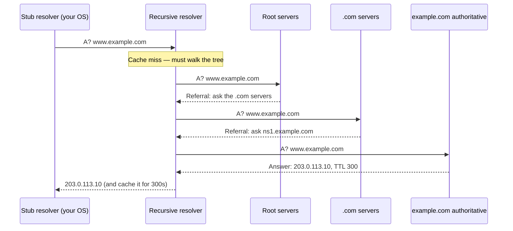

# 🔎 DNS Resolution & Records

> [!abstract] Note of [[Core Network Services]]
> Almost every network action begins with a name lookup, which makes DNS the most consequential dependency in any network and the first thing to check when "nothing works." This note builds the hierarchy, the delegation model, the record types, and the caching behaviour that explains why DNS changes take time and why stale answers cause outages.

## Parent Learning Order
DNS Resolution & Records -> DNS Security & Encrypted Transports -> Local Name Resolution & Service Discovery -> Network Time Synchronization -> Email Transport Protocols -> Network Management Protocols

## Start at Zero: A Distributed Database of Names

People use names; the network uses addresses. **DNS (Domain Name System)** is the distributed database that translates between them. "Distributed" is the essential word: no single server holds the mapping for the whole Internet. Instead, authority is **delegated** down a hierarchy, and each level knows only who to ask next.

Read a domain name **right to left**, because that is the order of delegation:

```text
www . shop . example . com .
 |     |       |        |   |
 |     |       |        |   root (the trailing dot, usually implied)
 |     |       |        top-level domain (TLD)
 |     |       second-level domain — where an organization's authority usually begins
 |     subdomain
 hostname
```

Three roles participate in every lookup:

- A **stub resolver** is the client library in your operating system. It knows almost nothing and asks a recursive resolver.
- A **recursive resolver** does the actual work: it walks the hierarchy, caches results, and returns a final answer. This is what your DHCP lease or configuration points you at.
- **Authoritative servers** hold the real records for a zone and answer for it definitively. They do not walk the hierarchy; they simply state what they own.

A **zone** is a portion of the namespace under one administrative control. Delegation happens when a zone's authoritative server says "I don't hold that subdomain — ask these other servers," creating a child zone.

## Walking the Hierarchy



Two properties of this walk matter enormously.

**Referrals, not answers.** The root and TLD servers never know the final address. They only know who is authoritative one level down. This is what makes the system scale — the root does not need to know about every hostname on the Internet, only about TLDs.

**Caching collapses the work.** The recursive resolver caches every answer and every referral for the duration of its **TTL (Time To Live)**. The full walk happens rarely; most queries are answered from cache in microseconds. This is why DNS can serve enormous query volumes with modest infrastructure.

## Record Types

A DNS record maps a name to data of a specific type.

| Type | Purpose | Example value |
| --- | --- | --- |
| **A** | Name → IPv4 address | `203.0.113.10` |
| **AAAA** | Name → IPv6 address | `2001:db8::10` |
| **CNAME** | Alias to another name | `shop.example.com. → lb.example.net.` |
| **MX** | Mail servers for a domain, with priority | `10 mail.example.com.` |
| **NS** | Delegates a zone to authoritative servers | `ns1.example.com.` |
| **TXT** | Arbitrary text; carries SPF, DKIM, DMARC, verification | `"v=spf1 include:..."` |
| **PTR** | Address → name (reverse lookup) | `10.113.0.203.in-addr.arpa. → www.example.com.` |
| **SRV** | Service location: host, port, priority, weight | `_ldap._tcp` → host and port |
| **SOA** | Zone authority and timing parameters | Serial, refresh, expiry |
| **CAA** | Which certificate authorities may issue for this domain | `0 issue "letsencrypt.org"` |

Two of these carry frequent misunderstandings.

**CNAME has strict rules.** A name with a CNAME cannot have other record types alongside it, which is why a CNAME cannot exist at the apex of a zone (the apex must carry SOA and NS records). Providers offer non-standard workarounds; understanding the underlying constraint explains why they exist.

**PTR records are not automatic.** Reverse lookups live in a separate delegated tree (`in-addr.arpa`), controlled by whoever holds the address block — usually your provider, not you. A forward record does not create a reverse record, which is why reverse lookups so often fail or return provider-generated names.

## Querying Directly

```bash
dig www.example.com A +noall +answer
```

Expected excerpt:

```text
www.example.com.    300    IN    A    203.0.113.10
```

The four columns are name, **TTL in seconds**, class, type, and value. Trace the full delegation path:

```bash
dig +trace www.example.com
```

Expected excerpt:

```text
.                    518400 IN NS a.root-servers.net.
com.                 172800 IN NS a.gtld-servers.net.
example.com.         172800 IN NS ns1.example.com.
www.example.com.     300    IN A  203.0.113.10
```

Each block is one referral step — this is the sequence diagram made concrete, and it is the definitive tool for diagnosing where a delegation breaks.

Query a specific server to bypass caching:

```bash
dig @ns1.example.com www.example.com A +norecurse
```

Asking the authoritative server directly with `+norecurse` gets the truth, unmediated by any cache. Comparing that against what your resolver returns is how you determine whether a problem is a stale cache or a genuinely wrong record.

### The failure TTL explains

You change a record's address, and some users reach the new server while others still hit the old one for hours. Nothing is broken. The old answer was cached with a TTL, and every resolver holding it will keep serving it until that TTL expires. The professional practice is to **lower the TTL well in advance** of a planned change — to 60 seconds a day beforehand — make the change, confirm propagation, then raise it again. Lowering the TTL *after* the change is too late, because caches already hold the old value with the old, long TTL.

Distinguish the two cases directly:

```bash
dig @<your resolver> www.example.com A +noall +answer    # what clients see
dig @ns1.example.com www.example.com A +noall +answer    # what is actually configured
```

Different answers mean caching. Identical wrong answers mean the record itself is wrong.

## Security Implications

**DNS is a universal dependency, so DNS failure looks like total failure.** When resolution breaks, users report that "the Internet is down" even though routing and connectivity are perfect. Conversely, controlling DNS answers means controlling where a victim connects, without touching routing or the network path. The layered diagnostic habit — confirm connectivity, then confirm resolution separately — resolves this class of confusion quickly.

**Cache poisoning targets the resolver.** If an attacker can get a forged answer accepted into a recursive resolver's cache, every client using that resolver is directed to the attacker's address until the TTL expires. Classic attacks exploited predictable query identifiers and source ports; source-port randomization and query-ID entropy made off-path poisoning much harder, and cryptographic validation addresses it properly.

**Zone transfers leak the map.** A zone transfer returns every record in a zone. If an authoritative server permits transfers to arbitrary clients, it hands over a complete inventory of hostnames — internal systems, development environments, infrastructure naming conventions. Transfers should be restricted to designated secondary servers.

```bash
dig @ns1.example.com example.com AXFR
```

Expected excerpt when correctly restricted:

```text
; Transfer failed.
```

That failure is the correct, secure result.

**Records are reconnaissance.** MX records name mail infrastructure, TXT records reveal which third-party services a domain uses, SRV records expose service locations and ports, and CNAMEs pointing at decommissioned cloud resources enable subdomain takeover. Record hygiene — removing entries for services no longer in use — is a genuine security control, not housekeeping.

**DNS logs are among the highest-value telemetry available.** Nearly every network action begins with a lookup, so resolver logs capture intent even when the subsequent traffic is encrypted. They reveal connections to newly registered domains, algorithmically generated names, and tunnelling patterns.

All enumeration described here must target only domains and servers within an authorized scope. DNS queries are logged by resolvers and authoritative operators, and zone-transfer attempts against systems you do not own are unauthorized access attempts.

## Authorized Lab: Watch a Name Resolve, Then Break It

Use a lab resolver and an authoritative server for a zone you control (`lab.internal` or similar). Record baseline answers first.

1. **Trace a full resolution.** Flush the resolver cache, then run `dig +trace` for a name in your zone. Identify each referral step and the final authoritative answer.
2. **Prove caching.** Query the same name twice and compare the query times reported by `dig`:

```bash
dig www.lab.internal | grep "Query time"
dig www.lab.internal | grep "Query time"
```

Expected excerpt:

```text
;; Query time: 42 msec
;; Query time: 0 msec
```

The second is served from cache. Watch the TTL count down on successive queries, confirming it is a live countdown, not a static value.

3. **Demonstrate the stale-answer problem.** With a long TTL configured, change the A record on the authoritative server. Confirm the authoritative server returns the new value while your resolver still returns the old one, and that this persists until the TTL expires.
4. **Demonstrate the fix.** Lower the TTL, wait for the old TTL to expire, then make another change and confirm it propagates quickly. Articulate why lowering the TTL after a change would not have helped.
5. **Test zone transfer.** Attempt `dig @<your authoritative server> lab.internal AXFR`. If it succeeds, observe the full record inventory returned, then restrict transfers to designated secondaries and confirm the attempt now fails.
6. **Break resolution deliberately.** Point the client at a non-existent resolver. Confirm that `ping <IP address>` still works while `ping <hostname>` fails — isolating the failure to name resolution rather than connectivity.
7. **Cleanup.** Restore the original records, TTLs, resolver configuration, and transfer restrictions; confirm baseline answers return.

Expected interpretation:

```text
+trace          -> referrals down the hierarchy; only the last server gives the answer
Query time 0    -> cached; the TTL is a live countdown
Changed record  -> authoritative differs from resolver until the old TTL expires
AXFR permitted  -> full hostname inventory disclosed
IP works, name fails -> the fault is resolution, not connectivity
```

## Crook → Operator → Root Checkpoint

- **Crook:** Explain the delegation hierarchy right to left, the three resolver roles, and what a TTL controls.
- **Operator:** Use `dig` with `+trace` and `+norecurse` to distinguish a stale cache from a wrong record; plan a record change around TTL so it propagates predictably, and isolate a resolution failure from a connectivity failure.
- **Root:** Explain why referral-based delegation is what makes DNS scale; describe cache poisoning and the entropy defenses that made off-path attacks impractical, and argue why zone-transfer restriction, record hygiene, and resolver logging are each security controls rather than operational chores.

---
> 🔼 Up: [[Core Network Services]]
