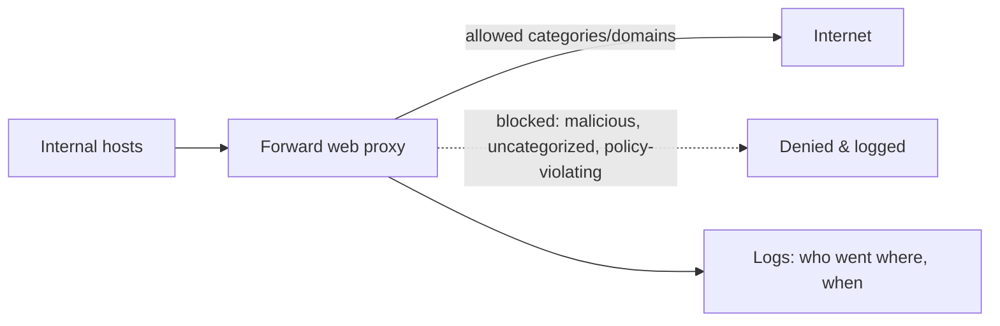

# 🚪 Egress Control & Web Proxies

> [!abstract] Note of [[Network Security Architecture]]
> Most networks guard the front door and leave the back door wide open — outbound traffic is trusted by default. But every breach that matters ends in data leaving or an attacker's server being contacted, and both are outbound. This note argues egress control as a first-class defense and covers the web proxy that enforces it.

## Parent Learning Order
Firewall Architecture & Policy -> Network Segmentation & Zero Trust -> VPNs & Encrypted Tunnels -> Intrusion Detection & Network Monitoring -> Egress Control & Web Proxies -> Network Access Control

## Start at Zero: The Neglected Direction

Firewall attention overwhelmingly goes to **ingress** — keeping bad traffic out. Outbound traffic, **egress**, is usually permitted by default: internal hosts may connect anywhere on the Internet. This asymmetry feels natural and is a serious gap.

Consider what depends on outbound connectivity from inside the network:

- **Data exfiltration** — stolen data has to *leave*, which is an outbound transfer.
- **Command and control** — malware connects *out* to its operator's server for instructions; it rarely accepts inbound connections, precisely because outbound is unfiltered.
- **Tool download** — an attacker with a foothold pulls additional tools from the Internet.
- **Beaconing** — implants check in on a schedule, all outbound.

The pattern is unmistakable: **the damaging phases of an attack are outbound.** An attacker can often get in through many routes, but everything they do afterward — receiving commands, downloading tools, stealing data — requires talking to the outside. Controlling egress attacks the attacker at the step they cannot avoid.

**Egress filtering** applies the default-deny principle to outbound traffic: permit only the outbound connections the business actually needs, and deny the rest. A network that only allows outbound to the specific services it uses gives malware nowhere to call and data no way out.

## Why Default-Allow Egress Persists

If egress control is so valuable, why is it rare? The honest answer is that it is operationally hard. Modern applications, updates, cloud services, and SaaS make an enormous and shifting set of outbound connections, and cataloguing all legitimate destinations is difficult and never finished. A too-strict egress policy breaks things constantly and generates support load, so organizations default to allow-all for outbound and accept the risk — usually without having decided to.

The practical path is incremental: start by blocking the outbound protocols and destinations known to be unnecessary and abused (direct outbound on unusual ports, connections to known-bad destinations, protocols that should only go through a proxy), then tighten toward allowlisting as you learn the legitimate traffic. Even partial egress control — forcing web traffic through a proxy, blocking direct outbound DNS except from the resolver, denying outbound on ports with no business use — removes the easiest exfiltration and C2 paths.

## The Web Proxy as Enforcement Point

Because most legitimate outbound traffic is web traffic, a **forward web proxy** is the natural place to enforce and observe egress. All outbound web requests are directed through it, and it becomes a control and visibility chokepoint.



A web proxy provides several controls at once:

- **URL and category filtering** — block known-malicious domains, newly registered domains, and policy-violating categories.
- **Logging** — a record of every outbound web request: who connected to what, when. This is high-value telemetry, capturing intent even for connections that were allowed.
- **Malware scanning** — inspecting downloaded content before it reaches the endpoint.
- **Authentication** — tying outbound requests to a user identity, so logs attribute activity to a person, not just an address.

The proxy is where the earlier NAT-gateway concept meets security: rather than merely translating outbound addresses, it decides and records what may leave.

```bash
# a proxy access log entry
grep exfil-domain /var/log/squid/access.log
```

Expected excerpt:

```text
1690984922.431 512 10.0.5.22 TCP_DENIED/403 3821 CONNECT known-bad.example:443 alice DENIED-CATEGORY-MALWARE
```

That single line is egress control working: an internal host's outbound connection to a known-bad destination was denied, logged, and attributed to a user — the exact event that, unlogged and unblocked, would be an exfiltration channel.

## The Encryption and Tunnelling Challenge

Egress control faces the same encryption problem as detection. A proxy can filter by destination domain (visible via SNI or the CONNECT request) even when it does not decrypt, which catches connections to known-bad domains. But it cannot see *inside* an encrypted tunnel to an allowed destination, so an attacker who exfiltrates over HTTPS to an allowed cloud service, or tunnels data inside DNS or another permitted protocol, evades content inspection.

This is why egress control layers with the other controls rather than standing alone:

- **Domain and category filtering** catches connections to known-bad or uncategorized destinations regardless of encryption.
- **Behavioural analysis** catches the *shape* of exfiltration — unusual volume, timing, or destination — even when content is opaque, exactly as network detection does.
- **DNS filtering** (from the DNS-security material) catches tunnelling and blocks resolution of malicious domains before a connection is even attempted.
- **Data Loss Prevention (DLP)** inspects content, where visible, for sensitive data patterns leaving the network.

No single layer is sufficient; together they make exfiltration and C2 meaningfully harder.

## Security Implications

**Egress control is the highest-value neglected control.** Because every serious attack has an outbound phase, filtering egress disrupts attacks at a step they cannot skip. It will not prevent initial compromise, but it can prevent that compromise from becoming a breach — the C2 never connects, the data never leaves. For the effort, few controls offer as much containment, which is why it appears repeatedly as a recommendation and rarely as a deployed reality.

**It contains, aligning with assume-breach.** Egress control accepts that attackers will get in and focuses on stopping what they do next. This is the same containment logic as segmentation and zero trust, applied to the network's outbound edge, and it composes with them — a segmented network with egress control confines an attacker both laterally and outward.

**The proxy is a chokepoint of both control and risk.** Routing all outbound web traffic through one point centralizes enforcement and visibility, and centralizes trust — the proxy sees every destination and, if decrypting, all content. It is a high-value target and a potential bottleneck, and it must be protected and made resilient accordingly.

**Logs are the payoff even for allowed traffic.** Egress logs record intent. When an incident is discovered, the proxy log answers "what did this host contact and when" — often the fastest way to scope a compromise and find the C2 domain. This investigative value exists even when the traffic was permitted, which is why logging egress is worthwhile independent of blocking.

**Attackers adapt to egress control, which is the point.** They tunnel over allowed protocols, use allowed cloud services as C2, and blend with normal traffic — but each adaptation costs them effort and increases their detectable footprint. Forcing an attacker to exfiltrate slowly over an allowed channel to avoid volume alarms is a win; it buys detection time and shrinks what they can take.

All egress configuration and testing described here must target only networks within an authorized scope. Deploying egress controls affects every outbound connection, and testing exfiltration paths must be confined to an authorized lab.

## Authorized Lab: Close the Back Door

Use a lab with internal hosts, a forward proxy, and a simulated external "attacker server," all under your control.

1. **Baseline default-allow.** With unrestricted egress, from an internal host connect outbound to an arbitrary external destination and transfer data, confirming exfiltration and C2 paths are wide open.
2. **Force traffic through the proxy.** Configure the network so outbound web traffic must use the proxy, and block direct outbound web connections. Confirm direct connections now fail and proxied ones succeed.
3. **Apply category and domain filtering.** Block a category and a specific known-bad domain, then attempt to reach them and confirm the proxy denies and logs the attempt, attributed to the user.
4. **Demonstrate exfiltration over an allowed channel.** Exfiltrate data over HTTPS to an *allowed* destination and confirm the proxy permits it (content is encrypted) — showing the limit of destination filtering.
5. **Catch it behaviourally.** Detect that same exfiltration by its volume, timing, or the fact that DNS filtering blocks the tunnelling variant — demonstrating why layers are needed.
6. **Add outbound default-deny.** Move to permitting only required outbound destinations and confirm that a novel outbound connection (simulated C2) is now blocked because it is not on the allowlist.
7. **Review the logs.** Use the proxy logs to reconstruct which host contacted which destinations, demonstrating the investigative value even for allowed traffic.
8. **Cleanup.** Restore the baseline egress policy.

Expected interpretation:

```text
Default-allow egress -> exfiltration and C2 paths wide open
Proxy enforced       -> direct outbound blocked; web traffic observable and controllable
Category/domain block-> known-bad destinations denied, logged, attributed
HTTPS to allowed dest-> permitted; destination filtering cannot see inside
Behavioural + DNS    -> catch what content filtering misses
Outbound default-deny-> novel C2 connection blocked because not allowlisted
```

## Crook → Operator → Root Checkpoint

- **Crook:** Explain why the damaging phases of an attack are outbound and what egress filtering is; describe what a forward web proxy controls and records.
- **Operator:** Configure a proxy to filter and log outbound web traffic, explain why destination filtering works on encrypted traffic while content inspection does not, and read a proxy log to attribute a denied connection.
- **Root:** Argue egress control as a high-value containment aligned with assume-breach; explain why it must layer with behavioural analysis, DNS filtering, and DLP to counter tunnelling over allowed channels, and why egress logs are investigative gold even for permitted traffic.

---
> 🔼 Up: [[Network Security Architecture]]
