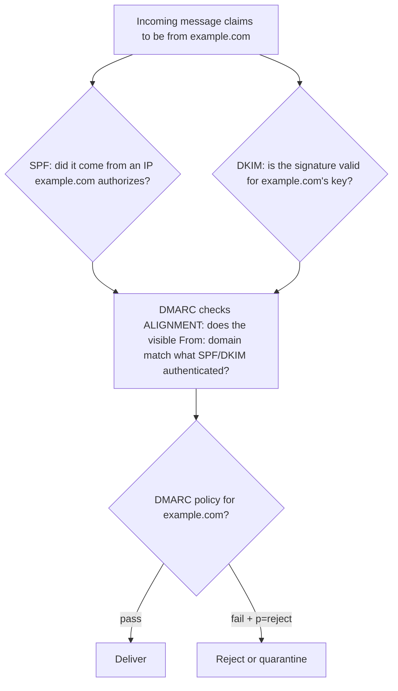

# ✉️ Email Transport Protocols

> [!abstract] Note of [[Core Network Services]]
> Email was designed to move plain text between trusting hosts, with no authentication of who sent anything. Everything that makes email trustworthy today — sender verification, encryption in transit — was bolted on afterward through DNS records. This note explains the transport protocols and the three-record authentication stack that decides whether a message is spoofed.

## Parent Learning Order
DNS Resolution & Records -> DNS Security & Encrypted Transports -> Local Name Resolution & Service Discovery -> Network Time Synchronization -> Email Transport Protocols -> Network Management Protocols

## Start at Zero: Two Directions, Different Protocols

Email uses different protocols for sending and retrieving, and confusing them is the most common beginner error.

| Protocol | Direction | Port(s) | Role |
| --- | --- | --- | --- |
| **SMTP** | Sending / relaying | 25, 587, 465 | Moves mail from client to server and server to server |
| **IMAP** | Retrieval | 143, 993 | Reads mail, leaving it on the server across devices |
| **POP3** | Retrieval | 110, 995 | Downloads mail to one device, historically deleting it from the server |

**SMTP (Simple Mail Transfer Protocol)** is the transport. It carries mail in two distinct situations: from a user's client to their mail server (**submission**), and between mail servers across the Internet (**relay**). The port distinction matters:

- **Port 25** is server-to-server relay. Clients should not use it, and providers commonly block outbound 25 from ordinary networks to limit spam.
- **Port 587** is authenticated submission — the port a mail client uses to send, with credentials and STARTTLS encryption.
- **Port 465** is submission over implicit TLS.

**IMAP** and **POP3** only retrieve; they never send. IMAP keeps mail on the server and syncs state across devices (read/unread, folders), which is why it dominates today. POP3's download-and-delete model suited a single device with intermittent connectivity and is now uncommon.

## SMTP Is a Conversation in Cleartext

SMTP is a human-readable, line-based protocol. Watching an exchange reveals both how it works and how little it originally verified:

```text
S: 220 mail.example.com ESMTP ready
C: EHLO client.example.net
S: 250-mail.example.com
S: 250-STARTTLS
S: 250 AUTH LOGIN PLAIN
C: MAIL FROM:<alice@example.net>
S: 250 OK
C: RCPT TO:<bob@example.com>
S: 250 OK
C: DATA
S: 354 Start mail input; end with <CRLF>.<CRLF>
C: From: "Alice" <alice@example.net>
C: Subject: Hello
C: 
C: Message body here.
C: .
S: 250 OK queued as 8A2F1C
```

The critical observation is that **the sender addresses are just typed in**. The `MAIL FROM` (the envelope sender) and the `From:` header are asserted by the sending client and, in classic SMTP, verified by nothing. Anyone who can speak SMTP to a server can claim to be anyone. This is the original sin of email, and every authentication technology below exists to constrain it.

Note also `250-STARTTLS`: the server offers to upgrade the plaintext connection to TLS. **STARTTLS is opportunistic** — if the upgrade is stripped by an on-path attacker, many servers silently fall back to cleartext rather than fail, which is a real weakness in server-to-server mail confidentiality.

## The Three-Record Authentication Stack

Because SMTP verifies no sender, three DNS-published mechanisms were layered on to answer "is this message really from who it claims?" They work together, and understanding what each one checks is the core of email security.



**SPF (Sender Policy Framework)** is a DNS TXT record listing which mail servers are authorized to send for a domain. The receiving server checks whether the connecting IP is on that list.

```bash
dig example.com TXT +short | grep spf
```

Expected excerpt:

```text
"v=spf1 include:_spf.provider.example ip4:203.0.113.0/24 -all"
```

`-all` means "reject anything not listed." SPF's limitation: it checks the *envelope* sender, not the `From:` header the user sees, and it breaks when mail is forwarded, because the forwarding server's IP is not in the original domain's SPF record.

**DKIM (DomainKeys Identified Mail)** cryptographically signs the message with a private key; the public key is published in DNS. The receiver verifies the signature, proving the message was authorized by the domain and not altered in transit. Unlike SPF, DKIM survives forwarding, because the signature travels with the message.

**DMARC (Domain-based Message Authentication, Reporting and Conformance)** ties the two together and adds the piece both lack: **alignment**. It requires that the domain authenticated by SPF or DKIM matches the domain in the visible `From:` header — closing the gap where a message could pass SPF for one domain while displaying a different domain to the user. DMARC also publishes a **policy** (what to do on failure) and a **reporting** address (where to send authentication statistics).

```bash
dig _dmarc.example.com TXT +short
```

Expected excerpt:

```text
"v=DMARC1; p=reject; rua=mailto:dmarc@example.com; adkim=s; aspf=s"
```

`p=reject` instructs receivers to reject failing mail; `p=none` only monitors. The three build on each other: SPF and DKIM authenticate, DMARC enforces alignment and policy. A domain with all three at enforcement is hard to spoof; a domain with none can be impersonated by anyone.

## Security Implications

**Spoofing is trivial without the authentication stack, and these records are the defense.** An attacker sends mail claiming `From: ceo@example.com`. If example.com publishes no SPF, DKIM, or DMARC, receiving servers have no basis to reject it, and it lands looking authentic. Publishing DMARC at `p=reject` with aligned SPF and DKIM is what prevents direct domain impersonation. This is a configuration control living entirely in DNS, and its absence is a common, high-impact finding.

**The authentication stack does not stop all phishing.** It prevents spoofing of *your exact domain*. It does nothing about **lookalike domains** (`example-support.com`), display-name spoofing (a friendly name of "CEO" from an unrelated address), or compromised legitimate accounts sending real authenticated mail. DMARC is necessary and insufficient — it closes one specific, important gap and must be paired with user awareness and content filtering.

**Cleartext transport exposes mail.** SMTP, IMAP, and POP3 all began as plaintext, leaking message contents and, worse, credentials to anyone on the path. The encrypted variants (587/465 with TLS, 993, 995) are mandatory for client connections. Server-to-server STARTTLS remains opportunistic and downgradable, which is why standards like MTA-STS exist to require TLS for mail to a domain and prevent silent fallback.

**Open relays are a legacy catastrophe.** A misconfigured SMTP server that relays mail for anyone becomes a spam and phishing cannon attributed to your infrastructure. Servers must relay only for authenticated users or known internal networks. Testing your own server for open relay is basic hygiene:

```bash
swaks --to test@external.example --from spoofed@other.example --server <your server>
```

A properly configured server rejects relay for a sender and recipient both external to it.

**Email headers are forensic evidence.** The `Received:` chain records each server that handled a message, and the authentication results record how SPF, DKIM, and DMARC evaluated. Reading full headers is how phishing is investigated — the visible `From:` is the least trustworthy line in the message, and the headers reveal the true path and authentication verdicts.

All testing described here must target mail infrastructure within an authorized scope. Sending spoofed mail, relay testing, or probing servers you do not own can constitute abuse and is out of bounds without explicit authorization.

## Authorized Lab: Spoof a Domain, Then Stop It

Use a lab with your own mail server and a controlled domain, isolated from real mail delivery.

1. **Watch an SMTP conversation.** Connect to your lab mail server and conduct the exchange manually, observing that sender addresses are simply typed and accepted:

```bash
swaks --to bob@lab.internal --from alice@lab.internal --server <lab server> --show-raw-out
```

2. **Spoof with no authentication.** With SPF, DKIM, and DMARC absent, send a message claiming `From: ceo@lab.internal` from an unauthorized host. Confirm it is accepted and appears authentic in the recipient's mailbox.
3. **Publish SPF.** Add an SPF record authorizing only your legitimate mail host with `-all`. Resend from the unauthorized host and confirm the receiver now marks or rejects it on SPF failure.
4. **Add DKIM.** Configure signing on the legitimate host and publish the public key. Confirm a legitimate message carries a valid signature and that a modified message fails verification.
5. **Enforce with DMARC.** Publish a DMARC record at `p=reject` with alignment. Confirm that a spoofed message failing alignment is now rejected, and inspect the authentication-results headers to see each verdict.
6. **Test for open relay.** Attempt to relay mail with both sender and recipient external to your server, and confirm it is refused.
7. **Demonstrate the residual gap.** Send from a lookalike domain you also control (`lab-support.internal`) and confirm it passes its own authentication while still being a phishing attempt — showing what DMARC does not cover.
8. **Cleanup.** Remove test records and messages, restore the baseline configuration, and confirm legitimate mail still flows.

Expected interpretation:

```text
No authentication -> spoofed From: accepted and looks genuine
SPF -all          -> unauthorized sending IP rejected (but envelope, not header)
DKIM              -> tamper-evident signature survives forwarding
DMARC p=reject    -> enforces From: alignment; direct domain spoofing blocked
Open relay test   -> a sound server refuses external-to-external relay
Lookalike domain  -> passes its own auth; DMARC never claimed to stop this
```

## Crook → Operator → Root Checkpoint

- **Crook:** Distinguish SMTP from IMAP/POP3 by direction, explain the port 25 versus 587 distinction, and state why classic SMTP lets anyone claim any sender.
- **Operator:** Read SPF, DKIM, and DMARC records from DNS and explain what each verifies; read message headers to determine how a message authenticated and test a server for open relay.
- **Root:** Explain how SPF, DKIM, and DMARC compose, why alignment is the piece SPF and DKIM individually lack, and precisely which impersonation techniques the stack stops versus leaves open; describe why opportunistic STARTTLS is downgradable and what requires TLS for server-to-server mail.

---
> 🔼 Up: [[Core Network Services]]
