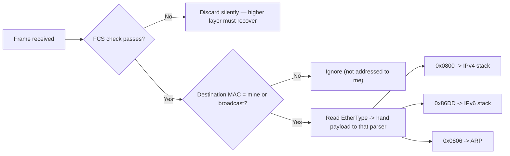

# 🧬 Ethernet & Frame Structure

> [!abstract] Note of [[Switching & the Link Layer]]
> Ethernet is the container every packet on a wired segment travels inside, and its fields decide who receives a frame, what it contains, and whether it survived transit intact. This note dissects the frame byte by byte, then shows why three of its properties — a forgeable source, an unauthenticated type field, and a fixed size limit — shape both operations and attacks.

## Parent Learning Order
Ethernet & Frame Structure -> MAC Addressing & Switch Operation -> ARP & Neighbor Discovery -> VLANs & Trunking -> Spanning Tree & Loop Prevention -> Link Layer Security Controls

## Start at Zero: The Envelope for the Local Hop

At the link layer, data does not travel as a "packet" — that word belongs to Layer 3. It travels as a **frame**: a structured sequence of bytes with a header, a payload, and a trailer, addressed to a device on *this segment only*. Every time a packet crosses a router, the old frame is discarded and a new one is built for the next hop. The IP addresses inside survive end to end; the frame around them is disposable and rebuilt at every link.

**Ethernet** is the dominant framing standard for wired networks. Understanding its layout is not trivia — it is the difference between reading a capture fluently and staring at hex.

```text
+----------+----------+----------+--------+--------------------+-----+
| Preamble | Dst MAC  | Src MAC  | Type/  | Payload            | FCS |
| + SFD    | 6 bytes  | 6 bytes  | Length | 46 - 1500 bytes    | 4 B |
| 8 bytes  |          |          | 2 B    |                    |     |
+----------+----------+----------+--------+--------------------+-----+
```

| Field | Size | Purpose |
| --- | --- | --- |
| Preamble + SFD | 8 bytes | Clock synchronization; a fixed bit pattern telling the receiver a frame is starting. Not shown by capture tools. |
| Destination MAC | 6 bytes | The hardware address of the intended recipient on this link |
| Source MAC | 6 bytes | The hardware address of the sender — **written by the sender, verified by no one** |
| EtherType / Length | 2 bytes | If ≥ 0x0600, identifies the payload protocol; if smaller, it is a length (older 802.3 framing) |
| Payload | 46–1500 bytes | The packet being carried, plus padding if under 46 |
| FCS | 4 bytes | Frame Check Sequence — a CRC over the frame for error detection |

> [!tip] The analogy, and where it breaks
> A frame is like a courier bag with a to/from label and a tamper seal. The label maps well to the addresses and the seal to the FCS. It breaks on the "from" line: a courier company verifies its sender, but Ethernet has no such check — the source address is whatever the sender chose to write, which is the root of a whole class of link-layer attacks.



Read the diagram as the receiver's decision order: integrity is checked first (a corrupt frame is dropped before anything else looks at it), then addressing decides whether to process it at all, and only then does the EtherType select which upper-layer parser receives the payload.

## The EtherType: The Demultiplexing Key

When a frame arrives, the receiver must decide what to do with the payload. The **EtherType** is that instruction.

| EtherType | Payload |
| --- | --- |
| `0x0800` | IPv4 |
| `0x86DD` | IPv6 |
| `0x0806` | ARP |
| `0x8100` | 802.1Q VLAN tag (a shim; the real EtherType follows) |
| `0x88CC` | LLDP (link-layer discovery) |

Without this field a receiver would have a payload and no parser for it. The `0x8100` value is special: it does not name a protocol but signals that a four-byte VLAN tag is inserted before the real EtherType, which is why a tagged frame is four bytes larger and why segmentation is possible at all.

## The FCS: Detection, Not Correction

The **Frame Check Sequence** is a 32-bit CRC computed over the addresses, type, and payload. The receiver recomputes it and compares. A mismatch means the frame was corrupted in transit, and the frame is silently **discarded** — Ethernet detects errors but does not correct them. Recovery is left to a higher layer: TCP will retransmit, UDP will not.

This has a direct operational consequence. A cable, port, or transceiver going bad manifests as rising FCS error counters and as performance that degrades rather than fails. TCP hides the loss by retransmitting, so users report "slowness," not "errors," and the true cause is invisible unless you read interface statistics.

```bash
ip -s link show eth0
```

Expected excerpt:

```text
2: eth0: <BROADCAST,MULTICAST,UP,LOWER_UP> mtu 1500
    RX:  bytes packets errors dropped  missed   mcast
    918273645 1204837     42       0       0    9821
    TX:  bytes packets errors dropped carrier collsns
    412938471  874622      0       0       0        0
```

The `errors` count of 42 under RX is the finding. On a healthy modern link this should be zero or nearly so. A steadily climbing value points at physical-layer trouble — a marginal cable, a dirty fibre connector, a failing port, or a duplex mismatch — well before it becomes a hard outage. `mcast` counting multicast frames is normal and not an error.

## Frame Size, MTU, and the 46-Byte Floor

The payload must be **at least 46 bytes**; shorter payloads are padded. This minimum exists because of how collision detection worked on the original shared medium: a frame had to be long enough to still be transmitting when a collision from the far end arrived. Modern switched full-duplex links have no collisions, but the minimum persists for compatibility.

The **maximum** standard payload is 1500 bytes — the Ethernet **MTU**. This single number ripples upward: it is why TCP advertises a maximum segment size of 1460 (1500 minus 20 bytes of IP and 20 of TCP header), and why every discussion of fragmentation traces back here.

**Jumbo frames** raise the payload ceiling to around 9000 bytes, used in storage and data-centre networks to cut per-frame overhead. They must be enabled consistently on every device in the path; a single device with a standard MTU in the middle silently drops the oversized frames, producing exactly the intermittent, size-dependent failures that are so hard to diagnose.

```bash
ip link show eth0 | grep -o 'mtu [0-9]*'
```

Expected output:

```text
mtu 1500
```

## Security Implications

Three properties of the frame create or shape attacks.

**The source address is forgeable.** Nothing in Ethernet authenticates the sender's MAC address. A host can transmit frames claiming any source it likes, which underpins MAC spoofing — to impersonate another device, to evade a MAC-based access control, or to poison a switch's learning. Because the field is a plain six bytes the sender writes, "the frame came from this MAC" is never a trustworthy statement on its own.

**The frame is readable by anyone who receives it.** Ethernet provides no confidentiality. On a shared medium, or when a switch is forced to flood, any station on the segment can read frame contents. This is why plaintext protocols leak and why link-layer encryption (MACsec) exists for high-assurance segments.

**Malformed frames probe parser behaviour.** Deliberately crafted frames — oversized, undersized, with inconsistent length and type fields, or with unusual tag stacking — test how a device's parser handles the unexpected. Divergent handling between an inspection device and the destination is an evasion opportunity, the same principle that makes fragment and tag ambiguity dangerous higher up the stack.

Frame crafting and interface manipulation described here belong on an isolated lab you control. Capturing frames exposes other parties' traffic, and injecting crafted frames on a network you do not own affects every device on the segment.

## Authorized Lab: Read a Frame Down to the Bytes

Use one lab VM. No second host is required for the capture portion.

1. Capture two frames with link-layer detail and hex output:

```bash
sudo tcpdump -i eth0 -e -XX -c 2 icmp &
ping -c 2 <gateway>
```

2. In the hex dump, locate the first 12 bytes after the frame start — six for destination MAC, six for source — then the two-byte EtherType.

Expected excerpt:

```text
00:1a:2b:3c:4d:5e > 00:50:56:aa:bb:cc, ethertype IPv4 (0x0800), length 98:
        0x0000:  0050 56aa bbcc 001a 2b3c 4d5e 0800 4500
        0x0010:  0054 39a1 4000 4001 ...
```

3. Read the bytes against the field map:

```text
0050 56aa bbcc   -> destination MAC (the gateway)
001a 2b3c 4d5e   -> source MAC (this host)
0800             -> EtherType: IPv4 follows
4500...          -> the IPv4 header begins (4 = IPv4, 5 = header length)
```

4. Inspect error counters before and after generating traffic:

```bash
ip -s link show eth0
```

Confirm the `errors` field is stable. On a healthy virtual link it stays at zero.

5. Observe the size floor by noting that a tiny ICMP payload still produces a frame of at least 64 bytes on the wire (60 bytes of frame plus 4-byte FCS), because of the 46-byte payload minimum plus headers.

6. Stop the capture. Nothing persists, so no cleanup beyond ending the process.

Expected interpretation:

```text
First 6 bytes  -> who receives this frame on this link (the gateway, not the destination host)
Next 6 bytes   -> claimed sender, unverified
EtherType 0800 -> the parser to hand the payload to
Stable errors  -> the physical layer is healthy; rising errors would precede an outage
```

## Crook → Operator → Root Checkpoint

- **Crook:** Name the fields of an Ethernet frame in order, explain what the EtherType is for, and state why a frame is rebuilt at every hop while the packet inside is not.
- **Operator:** Read a hex frame dump and identify each field; use interface statistics to distinguish a physical-layer problem from congestion, and explain why the symptom of rising FCS errors is "slowness."
- **Root:** Explain why the source MAC being unauthenticated enables spoofing and learning-table poisoning; describe how MTU inconsistency and jumbo-frame mismatches produce size-dependent failures, and why divergent frame-parser behaviour between devices is an evasion surface.

---
> 🔼 Up: [[Switching & the Link Layer]]
