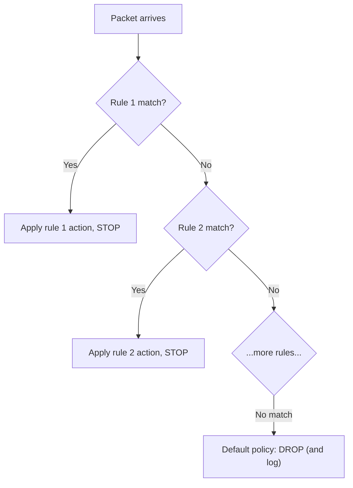

# 🧱 Firewall Architecture & Policy

> [!abstract] Note of [[Network Security Architecture]]
> A firewall is a policy decision made on every packet, and the quality of that decision depends far more on how the rules are written than on the product. This note traces firewalls from simple packet filters to application-aware inspection, and then focuses on the discipline of policy — default-deny, rule ordering, and the reviews that keep a rule base from rotting into a liability.

## Parent Learning Order
Firewall Architecture & Policy -> Network Segmentation & Zero Trust -> VPNs & Encrypted Tunnels -> Intrusion Detection & Network Monitoring -> Egress Control & Web Proxies -> Network Access Control

## Start at Zero: A Decision on Every Packet

A **firewall** enforces a policy about which traffic may pass a boundary. For every packet or connection, it asks a question — "does a rule permit this?" — and either forwards or drops. That is the entire concept; everything else is how sophisticated the question can be and how well the rules are written.

Firewalls evolved through generations, each seeing more:

| Generation | Decides on | Sees | Limitation |
| --- | --- | --- | --- |
| **Packet filter** | Individual packets, five-tuple | Addresses, ports, flags | No memory of connections |
| **Stateful firewall** | Connections | Connection state, related flows | No understanding of content |
| **Next-generation (NGFW)** | Applications and users | Application identity, user, content | Complexity, performance, TLS blindness |

A **packet filter** examines each packet in isolation against static rules. It is fast and simple but stateless — it cannot tell a reply to a request your host made from an unsolicited packet crafted to look like one, so permitting return traffic requires broad, abusable rules.

A **stateful firewall** tracks connections in a table. When it permits an outbound flow, it records the five-tuple and automatically allows the matching return traffic. This makes policy both tighter and simpler — "permit outbound HTTPS" and replies are handled implicitly — and it is the baseline for any serious firewall today.

A **next-generation firewall** goes further, identifying the *application* regardless of port (recognizing that traffic on 443 is a file transfer, not web browsing), tying decisions to *user identity*, and inspecting *content*. This power comes at the cost of complexity, performance, and a hard dependency on being able to see inside TLS — which, as encryption becomes universal, is an increasing blind spot.

## Stateful Inspection in Practice

The stateful model is worth seeing concretely, because it is where most policy lives.

```bash
sudo nft list ruleset
```

Expected excerpt:

```text
table inet filter {
  chain input {
    type filter hook input priority filter; policy drop;
    ct state established,related accept
    ct state invalid drop
    iif "lo" accept
    tcp dport 22 ip saddr 10.0.0.0/8 accept
    tcp dport 443 accept
  }
}
```

Read this top to bottom, because that is how it executes:

- **`policy drop`** is the foundation — **default deny**. Anything not explicitly permitted is dropped. This is the single most important property of a sound firewall: the rule base states what is *allowed*, and everything else is denied by default. The opposite (default allow, block known-bad) is unwinnable, because you cannot enumerate all bad traffic.
- **`ct state established,related accept`** is the stateful heart: return traffic for existing connections is permitted because a connection exists, not because an address is trusted. `related` covers helper flows like an FTP data connection tied to a control connection.
- **`ct state invalid drop`** discards packets that match no known connection and are not a valid new one — a cheap, high-value rule.
- **`tcp dport 22 ip saddr 10.0.0.0/8 accept`** permits SSH only from internal addresses. Restricting by both port and source is far stronger than by port alone.

Rules are evaluated **in order**, and the first match wins. This makes ordering a correctness property: a broad `accept` placed above a specific `drop` renders the drop dead, silently permitting what you meant to block. Auditing a rule base means reading it as the firewall does — sequentially — not as a set.

## Where Firewall Policy Goes Wrong

**Rule bloat.** Rules accumulate over years. Each is added for a reason; few are ever removed. The result is a rule base nobody fully understands, containing overlapping, redundant, and contradictory entries. A rule that overlaps a broader one above it never fires; a rule for a decommissioned service is a hole nobody remembers opening. Periodic rule review — removing unused rules, tightening broad ones, confirming each still has a justification — is what keeps the policy an asset rather than an accumulating liability.

**Overly broad rules.** `permit any any` on a segment, or a rule allowing an entire `/8` where a `/24` was intended, authorizes vastly more than the author realized. Because address ranges hide their size in the notation, reviewing a rule base by expanding every range to its literal extent reveals the gap between intent and effect.

**Any-any-any at the bottom that should be a deny.** A rule base without an explicit final deny relies on the default, which is fine only if the default is drop. Making the final deny explicit — and logging it — turns "everything else" into visible, investigable events.



## Security Implications

**Default-deny is the difference between a firewall and a suggestion.** A default-allow posture requires enumerating all malicious traffic, which is impossible, so it always leaks. Default-deny requires enumerating legitimate traffic, which is finite and knowable. Every sound firewall policy is a default-deny with an explicit allowlist, and inverting that is the most consequential mistake in firewall design.

**A firewall is not a complete boundary.** It enforces policy on traffic that passes through it, and does nothing about traffic that goes around it — an unmanaged wireless access point, a VPN that tunnels past it, a compromised host initiating outbound connections the policy permits. The firewall is one layer; treating it as the security boundary invites bypass. This is a central motivation for segmentation and zero trust, covered next.

**Logging is half the value.** A firewall that drops silently prevents an attack but records nothing. A firewall that logs its denies turns every blocked attempt into telemetry — reconnaissance scans, policy violations, and misconfigurations all surface in the deny log. Logging the final default-deny rule specifically captures everything the explicit rules did not anticipate.

**Egress is as important as ingress, and more neglected.** Most firewall attention goes to inbound rules, but outbound control catches data exfiltration, malware calling home, and connections to known-bad destinations. A default-deny *outbound* policy — permitting only necessary outbound traffic — is one of the highest-value and least-common controls, and it is where the egress-control material extends this note.

**Complexity is itself a risk.** Next-generation features add power and add ways to misconfigure. A firewall with hundreds of application-aware rules, user mappings, and inspection profiles has a large surface for the one mistake that opens a hole. Simplicity in the rule base is a security property.

All firewall configuration and testing described here must target only systems within an authorized scope. Modifying rules on a shared firewall affects every flow it governs, and probing a firewall's policy is reconnaissance that is logged.

## Authorized Lab: Build a Default-Deny Policy

Use a lab firewall (a Linux host with nftables is ideal) between two segments you control.

1. **Start with default-deny.** Configure the input and forward policies to drop, with no allow rules, and confirm all traffic is blocked — the correct starting point.
2. **Add stateful return handling.** Add the `established,related accept` rule and one specific allow (SSH from an internal address). Confirm that outbound-initiated connections get their replies automatically, and that the permitted service works only from the intended source.
3. **Demonstrate ordering.** Place a broad `accept` above a specific `drop` and confirm the drop never fires; then reorder and confirm the drop now takes effect. This makes first-match-wins concrete.
4. **Demonstrate rule bloat.** Add several overlapping and redundant rules, then audit the base by testing which rules actually fire for representative traffic, identifying the dead and redundant ones.
5. **Log the denies.** Add logging to the default-deny path, generate some blocked traffic (a scan from the other segment), and confirm each blocked attempt appears in the log — turning silent drops into telemetry.
6. **Add egress control.** Set the outbound policy to default-deny and permit only required outbound traffic. Confirm that an unexpected outbound connection (simulating malware calling home) is now blocked and logged.
7. **Cleanup.** Restore the baseline ruleset and confirm expected connectivity.

Expected interpretation:

```text
Default-deny      -> nothing passes until explicitly allowed; the sound foundation
Stateful accept   -> replies permitted by connection state, not by trusting an address
Rule order        -> first match wins; a broad accept above a drop kills the drop
Bloat audit       -> overlapping and dead rules revealed by testing what actually fires
Logged denies     -> blocked attempts become investigable telemetry
Egress deny       -> outbound malware/exfil connection blocked, not just inbound attacks
```

## Crook → Operator → Root Checkpoint

- **Crook:** Explain what a firewall decides on every packet and the difference between a stateless packet filter and a stateful firewall; state why default-deny is the sound posture.
- **Operator:** Read a stateful ruleset, explain the `established,related` rule and first-match-wins ordering, and diagnose a dead rule caused by a broader rule above it.
- **Root:** Explain why default-allow is unwinnable and default-deny is finite; argue why egress control and deny-logging are high-value and neglected, and why a firewall is one layer rather than a complete boundary — motivating segmentation and zero trust.

---
> 🔼 Up: [[Network Security Architecture]]
