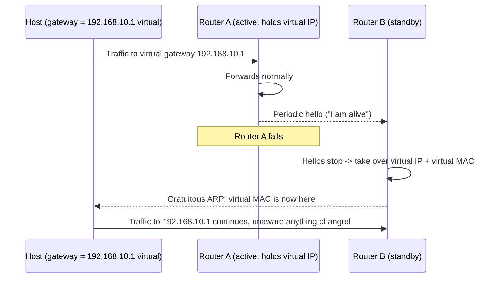

# 🔀 First-Hop Redundancy & Gateway Failover

> [!abstract] Note of [[Routing & the Network Layer]]
> A host has one default gateway, so if that gateway fails, the host is cut off from everything beyond its segment — no matter how redundant the rest of the network is. This note explains how two routers share a single virtual gateway so the failure is invisible to hosts, and why the protocol that provides this resilience is also a clean path to an on-path position.

## Parent Learning Order
IP Forwarding & the Routing Table -> Static Routing & Default Gateways -> Interior Gateway Protocols -> BGP & Internet Routing -> First-Hop Redundancy & Gateway Failover -> Routing Security & Path Validation

## Start at Zero: The Single Point of Failure Hosts Cannot See Past

A host learns exactly one default gateway. Every packet it sends off-segment goes to that one address. This creates a problem that all the redundancy in the core cannot solve: if the host's gateway router fails, the host is isolated from everything beyond its own subnet, even though other routers are sitting right there, healthy, on the same segment.

The naive fix — give hosts two gateways — does not work well, because hosts do not fail over gateways quickly or reliably on their own, and reconfiguring thousands of hosts when a router changes is untenable. The problem must be solved by the routers, transparently, so the host keeps using one unchanging gateway address while the routers arrange who actually answers for it.

This is what a **FHRP (First-Hop Redundancy Protocol)** does. The two dominant protocols are **VRRP (Virtual Router Redundancy Protocol)**, an open standard, and **HSRP (Hot Standby Router Protocol)**, a vendor equivalent. They differ in detail but are identical in concept.

## The Virtual Gateway

The mechanism is elegant: two or more physical routers cooperate to present a single **virtual IP address** and a single **virtual MAC address** as the gateway. Hosts are configured with the virtual IP as their default gateway and never know that more than one router exists.

- One router is elected **active** (or **master**) and actually forwards traffic sent to the virtual gateway. It answers ARP for the virtual IP with the virtual MAC.
- The other is **standby** (or **backup**), monitoring the active router through periodic hello messages and ready to take over.
- If the standby stops hearing the active router's hellos, it concludes the active has failed and **assumes the virtual IP and virtual MAC** itself.



The critical detail is the **virtual MAC**. Because the standby takes over not just the virtual IP but the same virtual MAC, the host's ARP cache is still correct after failover — the gateway is still at the same MAC address, just reachable through a different physical router now. The host does not need to re-resolve ARP, which is what makes failover fast and transparent. The standby sends a gratuitous ARP so the switches update which port leads to the virtual MAC, and traffic continues within seconds.

Inspect a VRRP instance on a Linux router running keepalived:

```bash
sudo journalctl -u keepalived --no-pager | tail -4
```

Expected excerpt:

```text
Keepalived_vrrp: VRRP_Instance(VI_1) Entering MASTER STATE
Keepalived_vrrp: VRRP_Instance(VI_1) setting protocol VIPs.
Keepalived_vrrp: Sending gratuitous ARP on eth0 for 192.168.10.1
```

`Entering MASTER STATE` followed by the gratuitous ARP is a failover in the logs: this router has taken over the virtual IP and told the segment where it now lives.

## Election, Preemption, and Tracking

Which router is active is decided by a configurable **priority** — highest wins. Two refinements matter operationally.

**Preemption** decides what happens when a failed higher-priority router returns. With preemption enabled, it reclaims the active role; without it, the current active keeps the role to avoid a second disruption. The choice trades a brief extra failover against always running on the preferred router.

**Interface tracking** addresses a subtle failure. The gateway router can be perfectly healthy on the segment side while its *uplink* — the path to the rest of the network — has failed. Without tracking, it keeps the active role and forwards host traffic into a dead uplink, a black hole. Tracking lets the router lower its own priority when its uplink fails, triggering failover to the standby whose uplink still works. Omitting tracking is a classic design gap: the FHRP protects against the router dying but not against the router becoming useless.

## Security Implications

The property that makes FHRP transparent — routers claim the gateway role by announcement — is also its vulnerability. FHRP hello messages are, in default or weak configurations, unauthenticated.

**Malicious active takeover.** An attacker on the segment who speaks the FHRP protocol can advertise a higher priority than the legitimate routers, win the election, and become the active router. The virtual gateway now resolves to the attacker, and every host's off-segment traffic flows through the attacker's device — a clean on-path position for the entire subnet, achieved by winning a protocol election rather than poisoning individual ARP caches. It is more elegant than ARP spoofing and affects every host at once, because the hosts were designed to trust whoever holds the virtual gateway.

**Denial of service through instability.** An attacker who repeatedly claims and releases the active role, or floods hello messages, causes constant failovers. Each failover briefly disrupts traffic, and continuous failover makes the gateway unusable — a denial of service against the segment's only exit.

The controls parallel the other Layer 2 and routing defenses:

- **FHRP authentication** requires a shared key on hello messages, so an attacker cannot participate in the election. This is the direct fix and its absence is a common finding.
- **Control-plane filtering** on switches can restrict which ports may source FHRP messages, keeping the protocol to the intended router ports — the same philosophy as passive interfaces for routing protocols and BPDU Guard for spanning tree.
- **Monitoring** for unexpected mastership changes turns a takeover attempt into a detectable event; an election won by an unknown device is an alarm.

The recurring theme across this branch holds here too: transport-layer encryption survives an FHRP takeover. The attacker gains an on-path position, but a validated TLS session across the compromised gateway remains confidential. The gateway is a place traffic passes through, not automatically a place its contents are exposed.

All FHRP configuration and takeover testing described here must be confined to an isolated lab you own. Winning a gateway election on a production segment redirects every host's traffic and disrupts connectivity for the whole subnet.

## Authorized Lab: Fail Over, Then Hijack the Gateway

Use two lab routers and a host on a shared segment, plus an uplink each router can reach. Record baseline priorities and state.

1. **Configure a virtual gateway** shared by both routers with different priorities, and point the host's default gateway at the virtual IP. Confirm one router is active and the other standby.
2. **Verify transparency.** From the host, confirm off-segment connectivity and note the gateway MAC in `ip neigh` — it is the virtual MAC.
3. **Test failover.** Disable the active router. Observe the standby enter master state (in its logs) and send a gratuitous ARP; confirm the host's connectivity survives with only a brief interruption and that its ARP entry for the gateway is unchanged, because the virtual MAC moved with the role.
4. **Test interface tracking.** Re-enable both routers, configure the active to track its uplink, then fail only the active router's *uplink* (not the router). Confirm it lowers priority and yields to the standby whose uplink is healthy — proving the design covers a useless-but-alive gateway.
5. **Demonstrate a takeover.** From the host (emulating an attacker) speaking the FHRP protocol, advertise a priority higher than both routers. Confirm the attacker becomes active and that the host's gateway traffic now flows to the attacker, while connectivity still appears normal.
6. **Apply the control.** Enable FHRP authentication with a shared key on the legitimate routers. Repeat the takeover attempt and confirm the unauthenticated attacker can no longer participate in the election.
7. **Cleanup.** Restore baseline priorities and configuration, confirm the intended router is active, and verify host connectivity over the legitimate gateway.

Expected interpretation:

```text
Virtual gateway  -> host uses one unchanging gateway IP and MAC
Active fails     -> standby takes the virtual MAC; ARP cache stays valid; failover is fast
Uplink tracking  -> a healthy router with a dead uplink correctly yields
Malicious priority -> attacker wins the election; whole subnet's traffic redirected
Authentication   -> keyless attacker cannot join the election; takeover fails
```

## Crook → Operator → Root Checkpoint

- **Crook:** Explain why a single default gateway is a single point of failure that host-side redundancy cannot fix, and what a virtual gateway is.
- **Operator:** Read FHRP state and logs to identify the active router and a failover event; explain why the shared virtual MAC keeps failover transparent and why interface tracking is needed for a router that is alive but cut off from its uplink.
- **Root:** Explain how an unauthenticated FHRP election lets an attacker become the active gateway for an entire subnet in one move; justify authentication and control-plane filtering as the controls, and explain why transport encryption remains the backstop against the resulting on-path position.

---
> 🔼 Up: [[Routing & the Network Layer]]
