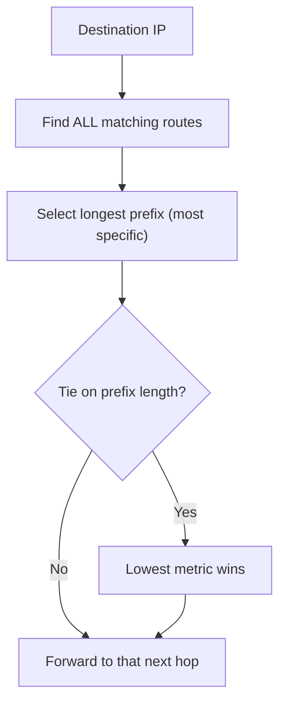

# 🚦 IP Forwarding & the Routing Table

> [!abstract] Note of [[Routing & the Network Layer]]
> Every device that touches an IP packet makes the same decision: consult a table, pick the most specific matching route, and send the packet to the next hop. This note builds that decision from first principles, explains longest-prefix match rigorously, and shows why a single injected route can silently redirect traffic while everything still appears to work.

## Parent Learning Order
IP Forwarding & the Routing Table -> Static Routing & Default Gateways -> Interior Gateway Protocols -> BGP & Internet Routing -> First-Hop Redundancy & Gateway Failover -> Routing Security & Path Validation

## Start at Zero: Every Host Routes

Routing is not something only routers do. Every device with an IP stack consults a routing table for every packet it sends, to answer one question: **is this destination directly reachable, or must I hand the packet to a gateway?**

The decision uses the destination IP and the host's own routes. If the destination falls within a directly connected network, the host delivers it at the link layer. Otherwise it forwards the packet to the **next hop** — a gateway — trusting that gateway to move it closer. The gateway then repeats the identical decision with its own table. Routing is this decision, made independently, hop after hop, with no single device knowing the whole path.

```bash
ip route
```

Expected excerpt:

```text
default via 192.168.10.1 dev eth0 proto dhcp metric 100
192.168.10.0/24 dev eth0 proto kernel scope link src 192.168.10.24
10.8.0.0/24 via 192.168.10.254 dev eth0 proto static metric 50
```

Three route types appear here, and reading them fluently is the whole skill:

- **`192.168.10.0/24 dev eth0 scope link`** — a directly connected network. `scope link` means these destinations are reachable without a gateway; the kernel added this automatically when the interface got its address.
- **`default via 192.168.10.1`** — the route of last resort, `0.0.0.0/0`, matching anything not matched more specifically. Its next hop is the gateway.
- **`10.8.0.0/24 via 192.168.10.254`** — a specific route to a particular network through a different next hop, added by an administrator (`proto static`).

## Longest-Prefix Match: The One Rule

When several routes match a destination, the router does **not** pick the first, the cheapest, or the newest. It picks the one with the **longest prefix** — the most specific route, the one with the most network bits fixed. Metric only breaks ties between routes of equal prefix length.

Consider a destination `10.8.0.50` against this table:

```text
0.0.0.0/0        via 192.168.10.1     (prefix length 0)
10.0.0.0/8       via 192.168.10.200   (prefix length 8)
10.8.0.0/24      via 192.168.10.254   (prefix length 24)
10.8.0.50/32     via 192.168.10.99    (prefix length 32)
```

All four match `10.8.0.50` — the default matches everything, `/8` matches all of `10.x`, `/24` matches `10.8.0.x`, and `/32` matches this exact host. Longest-prefix match selects the `/32`. Ask the kernel to confirm the decision without sending anything:

```bash
ip route get 10.8.0.50
```

Expected excerpt:

```text
10.8.0.50 via 192.168.10.99 dev eth0 src 192.168.10.24
```

`ip route get` is the single most valuable routing diagnostic: it reports the exact decision the kernel will make for a destination, resolving all the overlapping routes for you. Trace several destinations and the rule becomes concrete:

```text
10.8.0.50   -> via .99   (matched the /32, most specific)
10.8.0.77   -> via .254  (matched the /24)
10.9.0.5    -> via .200  (matched the /8)
8.8.8.8     -> via .1    (matched only the default)
```



## RIB and FIB: Knowledge versus Action

Two tables lurk behind "the routing table."

The **RIB (Routing Information Base)** is the full collection of everything the device has learned — from connected interfaces, static configuration, and every routing protocol running. It may contain several routes to the same destination from different sources, each with a preference.

The **FIB (Forwarding Information Base)** is the distilled result: the single best route to each destination, installed into the fast-path forwarding hardware or kernel structure that actually moves packets. `ip route` on Linux shows what is effectively the FIB; a full router distinguishes the two explicitly.

The distinction matters during troubleshooting. A route can exist in the RIB — the device *knows* it — yet not be in the FIB because a more preferred route won, so the device does not *use* it. "The route is there but traffic doesn't take it" is almost always a RIB/FIB or longest-prefix issue, not a broken route.

## Security Implications

The forwarding rule that makes routing work is exactly what makes route injection dangerous.

**More specific always wins, silently.** Because longest-prefix match unconditionally prefers the most specific route, an attacker or a misconfiguration that installs a `/32` or a narrow prefix for a target captures that traffic, overriding every broader legitimate route. Nothing errors. The victim's connectivity continues, because the attacker forwards the traffic onward after inspecting it. Detection cannot rely on "is it reachable" — it is — but must watch for unexpected specific routes and for path changes. This is the local, small-scale version of the redirection that, at Internet scale, is BGP hijacking.

**A poisoned default is a total redirect.** The default route handles everything not matched specifically, so changing it — via a rogue DHCP lease, a forged router advertisement, or local compromise — sends a host's entire off-segment traffic through an attacker. The blast radius of a single wrong default route is the host's whole external world.

**Source-based trust rides on routing assumptions.** Controls that trust "internal" source addresses assume packets from those addresses actually originated internally and followed expected paths. Routing manipulation and source spoofing break that assumption, which is why routing integrity and ingress filtering are security controls, not merely operational ones.

Inspecting and modifying routing tables must be confined to systems within an authorized scope. Routing tables reveal internal topology, and altering a route on a shared device affects everyone whose traffic it carries.

## Authorized Lab: Watch the Most Specific Route Win

Use one lab host, or a host plus a lab router for the forwarding portion. Record the baseline table first.

1. Display the baseline table and confirm you can explain every line's type (connected, default, static).
2. Add overlapping routes of increasing specificity toward a lab destination through different (lab) next hops:

```bash
sudo ip route add 10.8.0.0/8   via <next hop A>
sudo ip route add 10.8.0.0/24  via <next hop B>
sudo ip route add 10.8.0.50/32 via <next hop C>
```

3. Query the decision for several destinations and confirm longest-prefix match each time:

```bash
ip route get 10.8.0.50
ip route get 10.8.0.77
ip route get 10.9.0.5
```

Expected excerpt:

```text
10.8.0.50 via <next hop C>   # /32 wins
10.8.0.77 via <next hop B>   # /24 wins
10.9.0.5  via <next hop A>   # /8 wins
```

4. **Simulate injection.** Add a single more-specific route for a destination currently using the default, and confirm `ip route get` immediately shows the new next hop — with no error and no change to the default route, which is still present and still correct.
5. **Simulate a poisoned default.** Change the default route to a lab next hop and confirm every off-segment `ip route get` now points there. Observe that a directly connected destination is unaffected, because it matches a more specific connected route.
6. **Cleanup.** Delete every route added during the lab, restore the original default, and confirm `ip route` and a few `ip route get` queries match the baseline exactly.

Expected interpretation:

```text
Overlapping routes -> the most specific is always chosen, regardless of order added
Injected /32       -> silently overrides the default with no visible failure
Poisoned default   -> redirects the host's entire off-segment world
Connected route    -> immune, because it is more specific than any injected default
```

## Crook → Operator → Root Checkpoint

- **Crook:** Explain that every host routes, not just routers, and describe the direct-versus-gateway decision a host makes for each packet.
- **Operator:** Read a routing table and classify each route; use `ip route get` to predict the exact next hop for any destination and explain the choice by longest-prefix match.
- **Root:** Distinguish the RIB from the FIB and explain "the route is known but not used"; describe why longest-prefix match lets an injected specific route redirect traffic invisibly, and why a poisoned default route has a host-wide blast radius.

---
> 🔼 Up: [[Routing & the Network Layer]]
