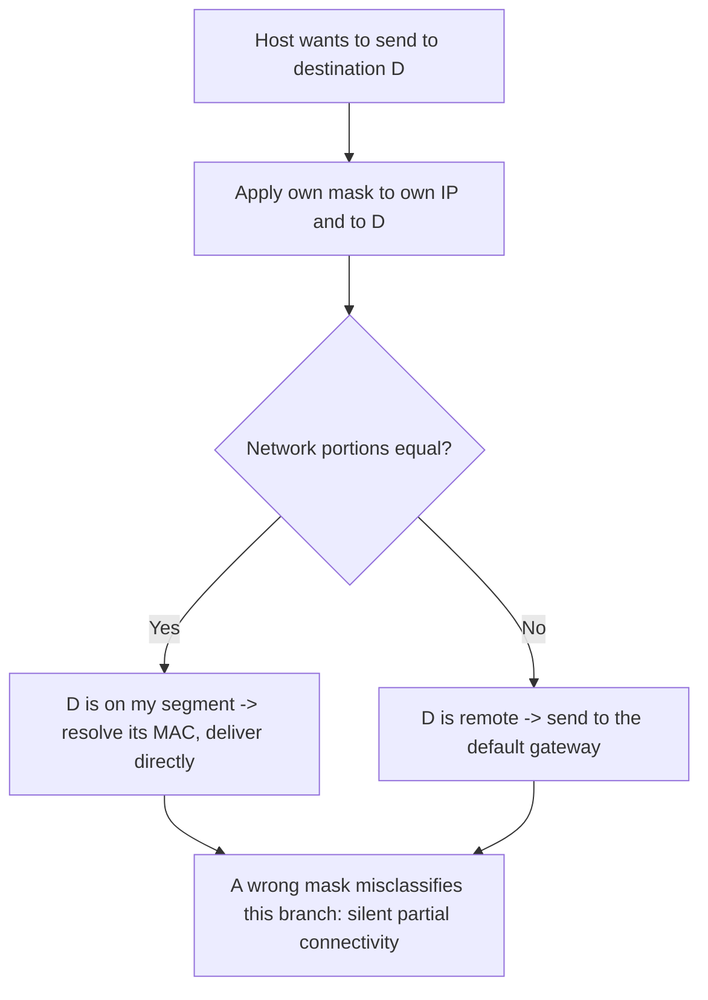

# 🏷️ IPv4 Addressing

> [!abstract] Note of [[Addressing & Subnetting]]
> An IPv4 address is 32 bits with an internal split that the dotted-decimal notation actively hides. This note rebuilds the address from its binary form, explains which ranges are special and why, and shows how to read an address configuration as a statement about scope, reachability, and trust.

## Parent Learning Order
IPv4 Addressing -> Subnetting & CIDR -> VLSM & Route Summarization -> IPv6 Addressing -> Address Assignment & DHCP -> NAT & Address Translation

## Start at Zero: Thirty-Two Bits Wearing a Disguise

An **IPv4 address** is a 32-bit number. It identifies a network *interface*, not a device — a host with three interfaces has three addresses, and a single interface can hold several.

For human convenience the 32 bits are split into four 8-bit groups called **octets**, each written in decimal from 0 to 255 and separated by dots.

```text
192      .168      .10       .24
11000000 .10101000 .00001010 .00011000
```

The dotted notation is a display convention, nothing more. Every meaningful operation — determining which network an address belongs to, calculating a range, deciding whether two hosts are neighbours — happens on the binary form. Learners who never look at the bits end up memorizing tables they cannot generalize; learners who do can derive every table on demand.

![[Pasted image 20251017110201.png]]

An address alone is incomplete. It must be paired with a **subnet mask**, which declares how many leading bits identify the *network* and how many trailing bits identify the *host within it*. `192.168.10.24` tells you almost nothing; `192.168.10.24/24` tells you the host lives on the network `192.168.10.0` alongside up to 253 neighbours.

This pairing is the foundation of every forwarding decision a host makes. When your host wants to send to a destination, it applies its own mask to both its address and the destination's. If the network portions match, the destination is a neighbour and is reached directly at the link layer. If they differ, the packet goes to the default gateway. That single comparison is why a wrong mask produces the classic symptom of "some things work and some do not" — the host is misclassifying which destinations are local.



The diagram shows why the mask is not cosmetic: it is the input to the local-versus-remote decision made for every single packet. Change the mask and you change which destinations the host believes it can reach without a router.

> [!tip] The analogy, and where it breaks
> An address is often compared to a postal address, with the network as the street and the host as the house number. It works for the hierarchy. It breaks because a street has a fixed length while a network prefix can be any number of bits, and because a house cannot silently move to another street while keeping its number — an interface can be re-addressed instantly.

## Classes: History You Still Need to Read

Original IPv4 divided the space into **classes**, with the leading bits determining a fixed network/host split.

| Class | Leading bits | First octet | Default mask | Networks | Hosts each |
| --- | --- | --- | --- | --- | --- |
| A | `0` | 1–126 | `/8` | 126 | 16,777,214 |
| B | `10` | 128–191 | `/16` | 16,384 | 65,534 |
| C | `110` | 192–223 | `/24` | 2,097,152 | 254 |
| D | `1110` | 224–239 | — | Multicast | — |
| E | `1111` | 240–255 | — | Reserved | — |

Classful addressing was abandoned in the 1990s because the granularity was catastrophic: an organization needing 300 addresses had to choose between two Class C blocks or one Class B block wasting 65,000 addresses. **CIDR** replaced it with arbitrary prefix lengths.

You still need the table for two reasons. First, defaults in older equipment and some tooling still reflect classful assumptions, producing surprising behaviour when a mask is omitted. Second, the terminology persists in conversation — someone saying "a class C" almost always means "a /24," and understanding the shorthand prevents miscommunication. What you must *not* do is reason about modern networks classfully; the class of an address tells you nothing about its actual prefix length today.

## Special Ranges and What They Signal

Certain blocks carry meaning beyond being addresses. Recognizing them on sight is a practical skill during any investigation.

| Range | Name | Meaning |
| --- | --- | --- |
| `0.0.0.0/8` | This network | `0.0.0.0` as a source means "unconfigured"; as a bind address means "all interfaces" |
| `10.0.0.0/8` | Private (RFC 1918) | Large enterprise internal space |
| `127.0.0.0/8` | Loopback | Never leaves the host; `127.0.0.1` is localhost |
| `169.254.0.0/16` | Link-local (APIPA) | Self-assigned; **DHCP failed** |
| `172.16.0.0/12` | Private (RFC 1918) | `172.16` through `172.31` — container defaults |
| `192.168.0.0/16` | Private (RFC 1918) | Home and small office |
| `100.64.0.0/10` | Carrier-grade NAT | Provider-side shared space, not customer-assignable |
| `224.0.0.0/4` | Multicast | One-to-many group delivery |
| `255.255.255.255` | Limited broadcast | This segment only; never routed |

Three of these are diagnostic gold.

An interface holding a `169.254.x.x` address is telling you, unambiguously, that it asked for a lease and received no answer. That is a DHCP or link problem, not a routing problem, and it is a complete diagnosis on its own.

An address in `100.64.0.0/10` means you are behind carrier-grade NAT and share a public address with other customers — inbound connections are impossible without provider cooperation, and any address-based reputation applies to strangers as well as you.

A service bound to `0.0.0.0` is listening on **every** interface, which is very different from `127.0.0.1`. Confusing the two is one of the most common ways a service intended for local use becomes network-reachable.

## Reading a Real Configuration

```bash
ip -4 addr show
ip route
```

Expected excerpt:

```text
1: lo: <LOOPBACK,UP,LOWER_UP> mtu 65536
    inet 127.0.0.1/8 scope host lo
2: eth0: <BROADCAST,MULTICAST,UP,LOWER_UP> mtu 1500
    inet 192.168.10.24/24 brd 192.168.10.255 scope global dynamic eth0
       valid_lft 84213sec preferred_lft 84213sec

default via 192.168.10.1 dev eth0 proto dhcp metric 100
192.168.10.0/24 dev eth0 proto kernel scope link src 192.168.10.24
```

Every field here is a claim you can verify:

- `192.168.10.24/24` — the address and prefix. Network is `192.168.10.0`, broadcast `192.168.10.255`, usable hosts `.1` through `.254`.
- `scope global` — routable beyond this host, unlike `scope host` on loopback.
- `dynamic` with `valid_lft` — this address came from DHCP and expires. A lease that is about to expire and cannot be renewed is a future outage you can see coming.
- `proto kernel scope link` on the second route — the kernel added this automatically when the address was configured. It is what tells the host that `192.168.10.0/24` is directly reachable without the gateway.

### The failure this output diagnoses

Compare with a broken host:

```text
2: eth0: <BROADCAST,MULTICAST,UP,LOWER_UP> mtu 1500
    inet 192.168.10.24/16 brd 192.168.255.255 scope global eth0

default via 192.168.10.1 dev eth0
192.168.0.0/16 dev eth0 proto kernel scope link src 192.168.10.24
```

The mask is `/16` where the network is genuinely `/24`. Communication with `192.168.10.x` works perfectly, because those are neighbours under either mask. Communication with `192.168.50.x` fails silently — the host believes those addresses are local, so it attempts address resolution on the segment instead of sending to the gateway, and nothing answers. The symptom is partial connectivity with no error message, and the cause is invisible unless you compare the mask against the actual network design.

The troubleshooting step is to compare your mask with the gateway's view:

```bash
ip route get 192.168.50.10
```

Expected excerpt on the broken host:

```text
192.168.50.10 dev eth0 src 192.168.10.24 uid 1000
```

The absence of `via 192.168.10.1` is the finding. The host intends to deliver directly rather than route, which for an off-segment destination is always wrong.

## Security Implications

Addressing decisions are security decisions, in three specific ways.

**Address ranges imply trust that they should not.** Many controls are written as "allow from the internal range," which treats RFC 1918 space as trustworthy. It is not — private addresses are equally available to a compromised endpoint, a guest device, or a container. Source address is an identifier, not an authentication, because nothing in IPv4 verifies it. Any control whose entire basis is a source range is one spoofed or relocated host away from failing.

**Address size determines blast radius.** A `/16` handed out where a `/24` would do puts 65,000 potential neighbours in one broadcast domain. Every link-layer attack — address resolution poisoning, rogue lease servers, name-resolution spoofing — operates within that domain. Sizing a network is therefore a containment decision made years before the incident.

**Address assignment is attribution.** Investigating an event means mapping an address to a host to a user at a specific time. Dynamic assignment without retained lease logs makes that mapping impossible after the lease expires, and translation at a boundary destroys it entirely unless both sides are logged. Deciding to keep those records is what makes later attribution feasible.

Any address enumeration or scanning must remain within an authorized scope; sweeping ranges you have not been permitted to test is out of bounds regardless of whether the addresses are private.

## Authorized Lab: Make a Mask Mistake on Purpose

Use two lab VMs on the same isolated segment, plus a router providing a second segment. Record baseline output for every command first.

1. Baseline on Host-A: `ip -4 addr show`, `ip route`, and `ip route get <off-segment address>`. Confirm the off-segment lookup shows `via <gateway>`.
2. Confirm connectivity to both a local neighbour and an off-segment host.
3. Break the mask deliberately:

```bash
sudo ip addr flush dev eth0
sudo ip addr add 192.168.10.24/16 dev eth0
sudo ip route add default via 192.168.10.1 dev eth0
```

4. Re-test. The local neighbour still responds; the off-segment host does not. Confirm with `ip route get <off-segment address>` that no `via` appears.
5. Inspect the neighbour table to see the mechanism directly:

```bash
ip neigh show
```

Expected excerpt:

```text
192.168.50.10 dev eth0  FAILED
192.168.10.1 dev eth0 lladdr 00:1a:2b:3c:4d:5e REACHABLE
```

The `FAILED` entry is the proof: the host attempted link-layer resolution for an address that is not on the link, because the wrong mask told it that address was a neighbour.

6. Restore the correct configuration and confirm the baseline returns:

```bash
sudo ip addr flush dev eth0
sudo ip addr add 192.168.10.24/24 dev eth0
sudo ip route add default via 192.168.10.1 dev eth0
```

7. Verify `ip route get` again shows `via <gateway>` and both connectivity tests pass.

Expected interpretation:

```text
Correct mask -> off-segment destinations route through the gateway
Wrong mask   -> host attempts direct delivery, neighbour resolution FAILS, silent partial outage
Restored     -> baseline behaviour returns, confirming the mask was the sole cause
```

## Crook → Operator → Root Checkpoint

- **Crook:** Convert an address between dotted-decimal and binary, explain why an address is meaningless without a mask, and identify loopback, link-local, and private ranges on sight.
- **Operator:** Read `ip addr` and `ip route` output to state a host's network, broadcast, usable range, and lease status; diagnose a mask error from partial connectivity and a `FAILED` neighbour entry.
- **Root:** Explain why classful reasoning is obsolete but its vocabulary persists; justify why source-address-based trust is not authentication, and describe how address sizing and lease retention decided in advance determine both blast radius and post-incident attribution.

---
> 🔼 Up: [[Addressing & Subnetting]]
