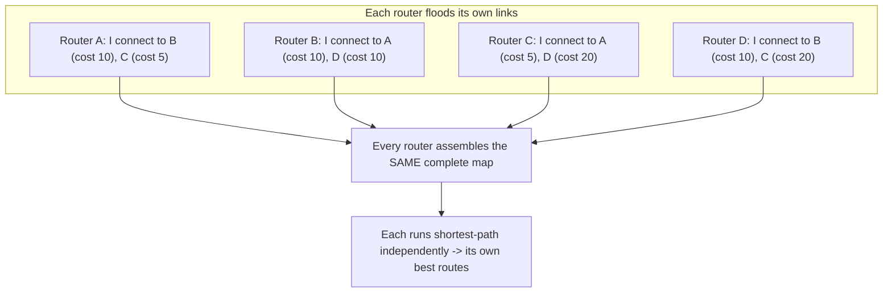

# 🗺️ Interior Gateway Protocols

> [!abstract] Note of [[Routing & the Network Layer]]
> When a network grows past the point where humans can maintain every route, routers must describe reality to each other and compute paths automatically. This note explains the two families that do this inside one organization, how link-state routing builds a shared map, and why a protocol that trusts its neighbours is a protocol an attacker can lie to.

## Parent Learning Order
IP Forwarding & the Routing Table -> Static Routing & Default Gateways -> Interior Gateway Protocols -> BGP & Internet Routing -> First-Hop Redundancy & Gateway Failover -> Routing Security & Path Validation

## Start at Zero: Why Routers Must Talk

Static routing fails at scale for one reason: it cannot react to change. When a link goes down, someone must notice and reconfigure. **Dynamic routing** removes the human from the loop — routers exchange information about the networks they can reach, and when the topology changes, they recompute paths automatically within seconds.

An **IGP (Interior Gateway Protocol)** is a dynamic routing protocol used *within* a single administrative domain — one company, one campus, one autonomous system. It contrasts with an exterior protocol used *between* organizations, covered separately. "Interior" means all the routers trust each other because they belong to the same owner, and that trust assumption is central to both how IGPs work and how they fail.

Two philosophies exist for how routers share what they know.

## Distance Vector: Routing by Rumour

A **distance-vector** protocol has each router tell its neighbours the entire list of destinations it can reach and how far away each is (the "distance," usually a hop count). A router does not know the topology; it only knows what its neighbours told it, and it trusts them. **RIP (Routing Information Protocol)** is the classic example.

The mental model is rumour propagation: "I heard network X is 3 hops away," passed router to router, each adding its own distance. This is simple to implement and simple to reason about, but it has serious weaknesses:

- **Slow convergence.** Changes propagate one router at a time, so a large network can take a long time to stabilize after a failure.
- **Limited scale.** RIP caps distance at 15 hops; 16 means unreachable. This deliberately bounds a problem below but also bounds the network's size.
- **Count-to-infinity.** Under certain failures, routers can keep incrementing a distance toward the cap while bad routing information circulates, misdirecting traffic until the cap is reached.

RIP survives in small and legacy networks for its simplicity, but its convergence behaviour makes it unsuitable for anything large. It is worth understanding mainly because its failure modes illuminate why link-state routing was invented.

## Link-State: Routing by Shared Map

A **link-state** protocol takes the opposite approach. Each router describes only its *own* directly connected links and floods that description to every other router. Every router thus receives everyone's descriptions and independently assembles an identical **map** of the entire topology. It then runs a shortest-path calculation over that map to compute its own best route to each destination. **OSPF (Open Shortest Path First)** is the dominant example.



The advantages follow directly from every router having the whole map:

- **Fast convergence.** A change is flooded everywhere quickly, and each router recomputes locally.
- **Loop-free by construction.** Because every router computes over the same consistent map, they agree on paths and do not form the loops that plague distance-vector rumour.
- **Scales well** through hierarchy: OSPF divides a network into **areas** so that detailed maps stay local and only summaries cross area boundaries, keeping the computation and the map size manageable in large networks.

Cost is configurable and typically reflects link bandwidth, so the "shortest" path is the fastest, not merely the fewest hops. **EIGRP** is a third protocol, historically vendor-specific, that blends distance-vector mechanics with faster convergence and richer metrics; conceptually it sits between the two families.

Inspect learned routes on a Linux router running a routing daemon:

```bash
ip route show proto ospf
```

Expected excerpt:

```text
10.0.20.0/24 via 10.0.255.2 dev eth1 proto ospf metric 20
10.0.30.0/24 via 10.0.255.6 dev eth2 proto ospf metric 30
```

`proto ospf` marks these as learned dynamically rather than configured by hand. The metrics reflect the computed path cost, and if a link fails, these entries update automatically as the protocol reconverges — the behaviour static routing cannot provide.

## Neighbor Relationships and Convergence

Link-state protocols form **adjacencies** with neighbours before exchanging maps. Routers discover each other with hello messages, verify compatible parameters, synchronize their map databases, and only then trust each other's link descriptions. Hello messages continue as a heartbeat; when they stop, the neighbour is declared down and the topology is recomputed.

This adjacency step is where an operator spends troubleshooting time. Two routers that should be neighbours but are not adjacent — because of mismatched parameters, an interface problem, or an authentication failure — will not exchange routes, and destinations behind the missing neighbour become unreachable while both routers appear healthy in isolation.

## Security Implications

Every IGP shares one assumption: **the routers speaking the protocol are trustworthy.** That assumption is the vulnerability.

**Unauthenticated updates let an attacker inject routes.** If routing updates are not authenticated, a device on a segment where a routing protocol runs can inject false link information. In a link-state protocol, false link descriptions corrupt every router's map; in distance-vector, false distances propagate as rumour. The attacker can advertise an attractive path to a target network, drawing traffic through their device for an on-path position, or advertise unreachability to blackhole a destination. Because the network reconverges around the false information, everything continues to "work" — traffic simply flows through the wrong place.

**Passive interface configuration limits exposure.** Routing protocols should run only on links between trusted routers. An interface facing endpoints has no business sending or accepting routing updates, and configuring it as **passive** — or not enabling the protocol on it at all — removes an entire injection surface. A protocol running on a user-facing segment is an open invitation to inject.

**Authentication is the direct control.** Modern IGPs support cryptographic authentication of their messages, so a router accepts updates only from peers that share a key. This defeats update injection from an unauthenticated device. It is standard hardening and its absence is a common finding, because protocols often work fine without it — until someone abuses the gap.

**Convergence itself is a target.** Flooding rapid, conflicting updates can force constant recomputation, degrading the network without injecting any single false route — a denial of service against the control plane rather than the data plane. Rate limits and dampening exist to blunt this.

All routing-protocol configuration and testing described here must occur only on an isolated lab or authorized infrastructure. Injecting routing updates on a production network can redirect or blackhole traffic for every system that depends on the affected paths.

## Authorized Lab: Converge, Fail Over, and Inject

Use three or four lab routers (virtualized routers running an OSPF daemon are ideal) arranged with at least one redundant path, plus a host on each end.

1. **Bring up OSPF** on the inter-router links, leaving host-facing interfaces passive. Confirm adjacencies form and that each router learns the remote networks with `ip route show proto ospf`.
2. **Verify path selection.** Confirm end-to-end connectivity and, using `ip route get`, identify which path traffic takes and why (lowest cost).
3. **Test convergence.** Disable the active link. Watch the routes update automatically to the redundant path within seconds, and confirm connectivity survives with only a brief interruption — the behaviour static routing cannot match. Restore the link.
4. **Demonstrate injection without authentication.** From a router (or a host emulating one) on an unauthenticated segment, advertise a false, attractive route to a target network. Confirm traffic is redirected through the injecting device with no error visible to the end hosts.
5. **Apply the controls.** Enable cryptographic authentication on the routing adjacencies and set host-facing interfaces passive. Repeat the injection and confirm the false updates are now rejected because the injector lacks the key.
6. **Cleanup.** Restore the baseline configuration, confirm adjacencies and learned routes match the starting state, and verify end-to-end connectivity over the intended path.

Expected interpretation:

```text
Adjacency formed  -> routers exchange maps and learn remote networks automatically
Link failure      -> routes reconverge to the backup path in seconds, unlike static
Unauthenticated   -> a false route is injected and silently redirects traffic
Authenticated     -> updates from a keyless device are rejected; injection fails
Passive interfaces-> the protocol never listens on user-facing segments
```

## Crook → Operator → Root Checkpoint

- **Crook:** Explain why routers need to exchange routing information, and the difference between "routing by rumour" (distance-vector) and "routing by shared map" (link-state).
- **Operator:** Read dynamically learned routes, verify adjacencies, and demonstrate automatic convergence after a link failure; explain why an adjacency that fails to form makes destinations unreachable while both routers look healthy.
- **Root:** Explain how unauthenticated updates let an attacker inject routes for interception or blackholing in both protocol families; justify passive interfaces and cryptographic authentication as the controls, and describe how flooding updates attacks the control plane itself.

---
> 🔼 Up: [[Routing & the Network Layer]]
