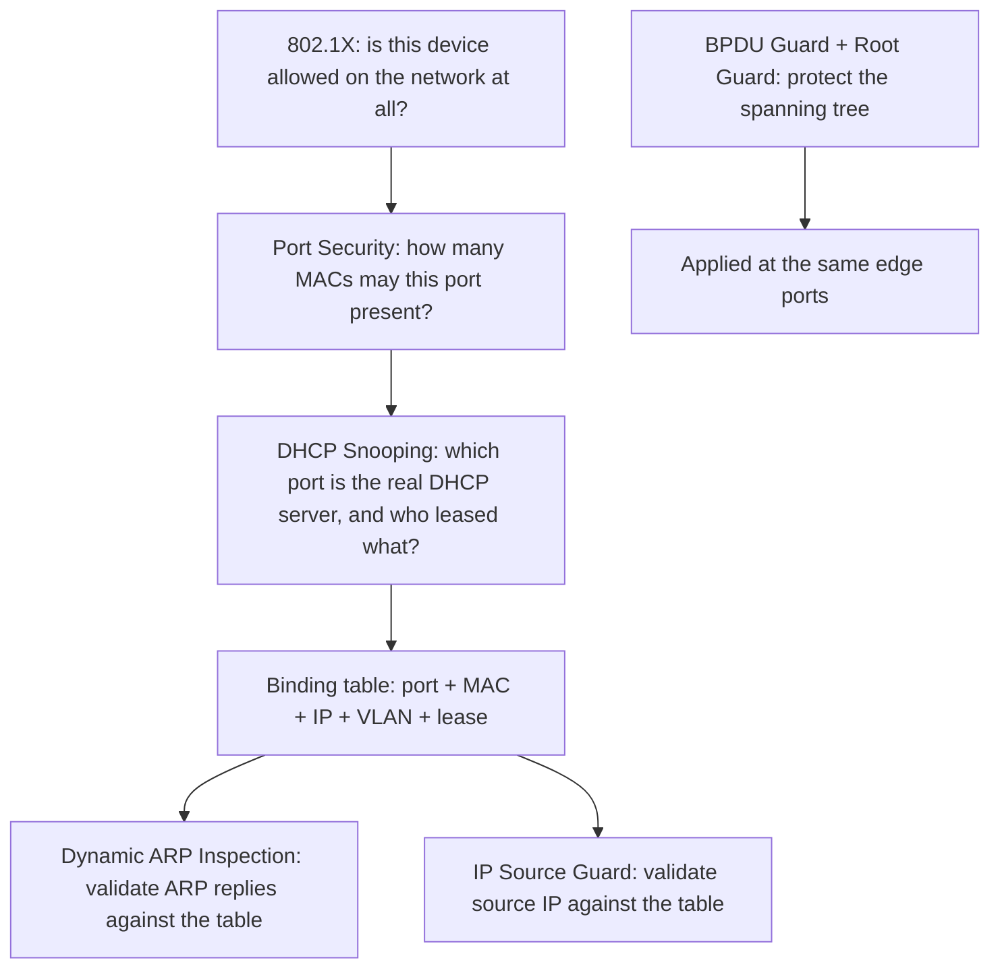

# 🛡️ Link Layer Security Controls

> [!abstract] Note of [[Switching & the Link Layer]]
> Every attack in this branch exploits the same fact — Layer 2 protocols trust whatever they are told. This note assembles the controls that replace that trust with verification, shows how they build on one another around a single binding table, and explains the order in which to deploy them so each reinforces the next.

## Parent Learning Order
Ethernet & Frame Structure -> MAC Addressing & Switch Operation -> ARP & Neighbor Discovery -> VLANs & Trunking -> Spanning Tree & Loop Prevention -> Link Layer Security Controls

## Start at Zero: The Common Root Cause

The link-layer attacks covered in this branch look different but share one weakness:

| Attack | Exploits | The lie it tells |
| --- | --- | --- |
| MAC flooding | Finite CAM table | Thousands of fake source addresses |
| ARP spoofing | Unauthenticated replies | "The gateway is at my MAC" |
| Rogue DHCP | Unauthenticated offers | "I am your DHCP server" |
| VLAN hopping | Trunk negotiation, native VLAN | "My port is a trunk" |
| STP takeover | Unauthenticated BPDUs | "I am the root bridge" |

The pattern is always the same: a device asserts something, and the network believes it without proof. The controls in this note are, at heart, a single idea applied in several places — **establish a trusted record of what should be true, then reject anything that contradicts it.** That trusted record is the DHCP snooping binding table, and it is the keystone the other controls lean on.

## The Control Stack



Read the diagram top to bottom as a sequence of questions, each narrowing trust. The binding table in the middle is what makes the lower controls possible — DAI and IP Source Guard have nothing to validate against without it.

### 802.1X — Authenticate the Device

**802.1X** is port-based network access control. Before a port carries any normal traffic, the connecting device must authenticate to an authentication server (typically RADIUS) using credentials or a certificate. Until it does, the port passes only the authentication exchange and nothing else.

This is the strongest control because it addresses the root problem directly: an unauthorized device never reaches the segment, so it cannot flood, spoof, or inject anything. Where 802.1X is deployed and enforced, most of the other attacks become impossible from an unauthenticated port. Its cost is operational — every device needs a credential or a handled exception (printers, cameras, and other things that cannot authenticate need MAC Authentication Bypass or a guarded guest path, and those exceptions are where 802.1X deployments leak).

### Port Security — Cap the Addresses

**Port security** limits how many MAC addresses a port may learn, and acts when the limit is exceeded — restrict (drop excess), shut down (disable the port), or protect (silently drop). A limit of one or two on an access port defeats MAC flooding outright, because the flood depends on presenting thousands of source addresses through one port.

```text
switchport port-security
switchport port-security maximum 2
switchport port-security violation restrict
switchport port-security mac-address sticky
```

`sticky` learns the current addresses and pins them, so the port also resists a device being swapped for another. This is inventory enforcement as much as attack prevention.

### DHCP Snooping — Establish the Truth

**DHCP snooping** classifies ports as trusted or untrusted. Only trusted ports (facing the real DHCP server or the uplink toward it) may send DHCP server messages; offers arriving on untrusted ports are dropped. This defeats rogue DHCP.

Its more important output is the **binding table** it builds by watching legitimate DHCP exchanges: for each client it records port, MAC, IP, VLAN, and lease time. This table is the trusted record of "who legitimately has which IP behind which port," and it is what the next two controls validate against.

```bash
# conceptual view of the binding table a switch maintains
show ip dhcp snooping binding
```

Expected excerpt:

```text
MacAddress          IpAddress      Lease(sec)  Type          VLAN  Interface
00:0C:29:4A:9B:31   192.168.10.24  84213       dhcp-snooping 10    Gi0/3
00:0C:29:7B:2C:14   192.168.10.25  84102       dhcp-snooping 10    Gi0/4
```

### Dynamic ARP Inspection — Validate Neighbours

**DAI** intercepts every ARP reply on untrusted ports and checks it against the binding table. A reply claiming `192.168.10.1 is at <attacker MAC>` is dropped if the table does not have that IP-to-MAC-to-port binding. This defeats ARP spoofing, and it works only because DHCP snooping supplied the table.

### IP Source Guard — Validate Source Addresses

**IP Source Guard** filters traffic by source IP against the same binding table, dropping frames whose source IP does not match the address leased to that port. This prevents a host from spoofing another's IP address, closing off address-based impersonation.

## The Deployment Order Matters

These controls are not independent; several depend on the binding table, so the sequence of deployment is:

1. **DHCP snooping first** — it builds the binding table everything else needs.
2. **Dynamic ARP Inspection and IP Source Guard next** — they consume the table.
3. **Port security** — independent, deployable at any point, defeats flooding.
4. **BPDU Guard and Root Guard** — on the same access ports, protecting the spanning tree.
5. **802.1X** — the strongest, deployed as the program matures, subsuming much of the rest.

Deploying DAI before DHCP snooping means DAI has an empty table and either blocks all ARP (an outage) or trusts everything (no protection). The dependency is why "turn on ARP inspection" is not a standalone action.

## MACsec — Encrypt the Link

The controls above prevent forgery but do not provide confidentiality; a device with physical access to a link can still read frames. **MACsec (802.1AE)** adds hop-by-hop encryption and integrity at Layer 2, so frames on the wire are unreadable and tamper-evident between two MACsec peers. It is used on high-assurance segments and between infrastructure devices where physical interception is part of the threat model. Unlike the forgery-prevention controls, MACsec addresses the "the frame is readable by anyone who receives it" property directly.

## Security Implications

**Layered controls fail independently, which is the point.** An attacker who somehow presents a valid MAC still faces DAI validating their ARP; one who forges an ARP reply still faces IP Source Guard on their traffic; one who reaches the port at all still faces 802.1X. Each control assumes the others might be bypassed, and together they make a link-layer foothold expensive rather than free.

**Unmanaged switches and exceptions are the gaps.** These controls live on managed switches. A consumer switch plugged in downstream of a protected port creates an unprotected micro-segment behind it, and any device on that switch bypasses the port-level controls. Similarly, every 802.1X exception and every trusted port is a deliberate hole that must be justified and monitored. Attackers look for exactly these gaps because the controls themselves are sound.

**Monitoring the controls is as important as enabling them.** A DAI drop, a port-security violation, or a BPDU Guard shutdown is a security event — it means something asserted a lie and was caught. Feeding these events to central logging turns the controls from silent prevention into active detection, and a spike in violations is often the first sign of an intrusion attempt on the wired network.

**These controls protect the wired edge, not the whole problem.** They do nothing for wireless association, nothing for an already-compromised authorized host, and nothing above Layer 2. They are one necessary layer, and treating them as sufficient is its own mistake.

All configuration and validation described here must be performed on an isolated lab or on production infrastructure you are explicitly authorized to change; enabling these controls incorrectly (DAI without snooping, aggressive port security) can itself cause outages.

## Authorized Lab: Build the Stack, Attack Each Layer

Use a managed lab switch (or a virtualized equivalent), a DHCP server, a client, and an attacker VM. Record the baseline configuration.

1. **No controls.** Confirm each attack works: MAC-flood the table and intercept, run a rogue DHCP server and win a lease, and ARP-spoof the client's gateway. Establish that the segment is fully exposed.
2. **Enable DHCP snooping**, marking only the real server's port trusted. Repeat the rogue DHCP attack and confirm the offer is dropped. Inspect the binding table and confirm the client's legitimate lease is recorded.
3. **Enable Dynamic ARP Inspection** on untrusted ports. Repeat the ARP spoof and confirm the forged reply is dropped and logged, and the client's gateway mapping stays correct.
4. **Enable IP Source Guard.** Have the attacker attempt to send traffic with a spoofed source IP and confirm it is dropped.
5. **Enable port security** with a low maximum on the attacker's port. Repeat the MAC flood and confirm the port restricts or shuts down instead of learning thousands of addresses.
6. **Enable BPDU Guard** on access ports. Have the attacker inject a BPDU and confirm the port is disabled immediately.
7. **Review the evidence.** Collect the DAI drops, port-security violations, and BPDU Guard events, and confirm each attack left a distinct, attributable log entry.
8. **Cleanup.** Restore the baseline configuration, re-enable any disabled ports, and confirm normal connectivity for the legitimate client.

Expected interpretation:

```text
No controls   -> every link-layer attack succeeds
DHCP snooping -> rogue offers dropped; binding table now populated
DAI           -> forged ARP dropped, validated against the binding table
IP Source Guard-> spoofed source IP dropped
Port security -> flood cannot present many MACs through one port
BPDU Guard    -> BPDU on an access port disables it instantly
Logs          -> each caught lie is an attributable security event
```

## Crook → Operator → Root Checkpoint

- **Crook:** State the common weakness all link-layer attacks share, and name the control that stops each one.
- **Operator:** Explain what the DHCP snooping binding table contains and which controls depend on it; deploy the controls in the correct order and verify each by repeating the attack it stops.
- **Root:** Explain why 802.1X is the strongest control and where its exceptions leak; justify the deployment order from the binding-table dependency, describe what MACsec adds that the forgery-prevention controls do not, and argue why monitoring control violations turns prevention into detection.

---
> 🔼 Up: [[Switching & the Link Layer]]
