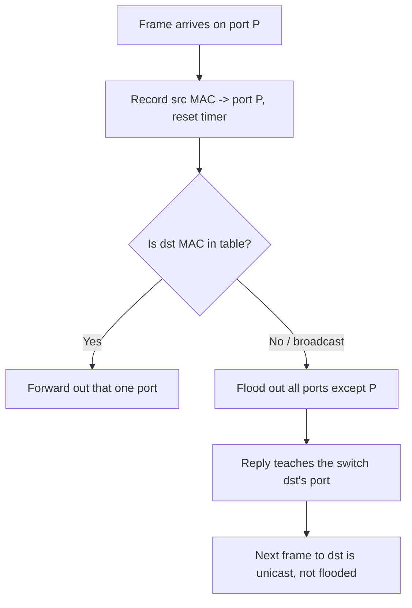

# 🎚️ MAC Addressing & Switch Operation

> [!abstract] Note of [[Switching & the Link Layer]]
> A switch is a device that learns where things are by watching, remembers it in a finite table, and forwards accordingly. This note explains the hardware address, the learning algorithm, the three forwarding decisions, and why the finiteness of that table turns a switch into a wiretap when an attacker fills it.

## Parent Learning Order
Ethernet & Frame Structure -> MAC Addressing & Switch Operation -> ARP & Neighbor Discovery -> VLANs & Trunking -> Spanning Tree & Loop Prevention -> Link Layer Security Controls

## Start at Zero: What a MAC Address Is

A **MAC (Media Access Control) address** is a 48-bit identifier assigned to a network interface, written as six hex pairs: `00:1a:2b:3c:4d:5e`. It identifies a device on a local segment, and unlike an IP address it is not hierarchical and does not describe location — it is a flat name.

The 48 bits have structure:

- The first three bytes are the **OUI (Organizationally Unique Identifier)**, assigned to the hardware vendor. `00:50:56` belongs to one virtualization vendor, `00:0c:29` to another. This is why a MAC often reveals what *kind* of device you are looking at.
- Two bits in the first byte are flags. The **I/G bit** distinguishes unicast (0) from multicast/broadcast (1). The **U/L bit** marks whether the address is universally assigned by the vendor (0) or locally administered (1).

That U/L bit matters for a practical reason: a locally administered address is one that software set rather than the hardware vendor. A host deliberately changing its MAC — for privacy, or to evade a control — typically sets a locally administered address, and the U/L bit being 1 is a soft signal that an address was assigned by software.

The broadcast address `ff:ff:ff:ff:ff:ff` means "every device on this segment," and is how protocols reach hosts whose address is not yet known.

```bash
ip link show eth0
```

Expected excerpt:

```text
2: eth0: <BROADCAST,MULTICAST,UP,LOWER_UP> mtu 1500
    link/ether 00:0c:29:4a:9b:31 brd ff:ff:ff:ff:ff:ff
```

The `00:0c:29` prefix identifies the interface as virtual, and `brd ff:ff:ff:ff:ff:ff` is the broadcast address for the link.

## How a Switch Learns

A switch has no map of the network when it powers on. It builds one by **observing the source address of every frame** and recording which physical port that frame arrived on, into a structure called the **MAC address table** or **CAM (Content-Addressable Memory) table**.

The algorithm is three rules:

1. **Learn** — record `source MAC → arrival port` for every frame, refreshing a timer.
2. **Forward** — if the destination MAC is in the table, send the frame out that one port only.
3. **Flood** — if the destination MAC is unknown, or is broadcast/multicast, send the frame out every port except the one it arrived on.

Entries **age out** after a default of about five minutes of silence, so a device that stops transmitting is eventually forgotten and must be relearned.



The diagram shows why the first frame to a new destination is flooded but the conversation quickly becomes point-to-point: the reply teaches the switch where the destination lives. This is the entire efficiency argument for switches over hubs — a hub floods everything forever, a switch floods only until it has learned.

Inspect the table on a Linux bridge (the software equivalent of a switch):

```bash
sudo bridge fdb show br0
```

Expected excerpt:

```text
00:0c:29:4a:9b:31 dev eth1 master br0
00:0c:29:7b:2c:14 dev eth2 master br0
33:33:00:00:00:01 dev eth1 self permanent
```

Each line maps a hardware address to the port (`dev`) behind which it was learned. The `33:33:...` entry is an IPv6 multicast address and is expected.

## The Finite Table Is the Vulnerability

A CAM table holds a fixed number of entries — thousands to tens of thousands depending on hardware. That limit is the attack surface.

In **MAC flooding**, an attacker transmits a torrent of frames with fabricated, random source addresses. The switch dutifully learns each one, and the table fills. Once full, the switch can no longer record legitimate `MAC → port` mappings. Its only safe behaviour for an unknown destination is to flood — so it begins flooding traffic for legitimate destinations out every port.

The consequence is that a switched network degrades into a hub: the attacker now receives copies of frames destined for other hosts, defeating the confidentiality that switching provided. This is a passive-interception attack achieved entirely by exhausting a data structure, and no packet was "hacked" — the switch behaved exactly as designed under conditions it was not sized for.

```text
Normal:   Host A -> Switch -> only Host B's port receives A's frames to B
Flooded:  table full -> Switch floods -> attacker's port receives A's frames to B too
```

The defence is not encryption of the frame; it is limiting how many addresses a port may present. **Port security** caps the MAC count per port and takes action — restrict, shut down, or alarm — when the cap is exceeded. A cap of one or two on an access port makes flooding impossible, because the flood requires presenting thousands of source addresses through a single port.

## Security Implications

**MAC-based access control is weak.** Some networks permit or deny devices by MAC address. Because the source address is attacker-chosen, an attacker who observes an allowed address can simply adopt it. MAC filtering raises effort marginally and provides no real authentication; treat it as inventory hygiene, not a control.

**MAC addresses enable tracking, and randomization defeats it.** A stable hardware address lets a network — or an eavesdropper — recognize a returning device across time and location. Modern clients randomize their MAC per network specifically to prevent this, which is why the U/L bit is increasingly set on ordinary devices and why MAC-based device inventories drift.

**Flooding is loud but effective.** MAC flooding generates enormous frame volume and is trivially visible to anyone watching table utilization or port statistics. Its value to an attacker is the brief window of interception before detection, which is precisely why proactive port-security limits, rather than reactive alerting, are the right control.

**Table state is forensic evidence.** The CAM table at a point in time places a hardware address behind a physical port, which can locate a rogue device. But entries age out in minutes, so this evidence is perishable and must be captured promptly during an incident.

All flooding, spoofing, and table manipulation described here must be confined to an isolated lab you own. Exhausting a production switch's table degrades service for every user on it and exposes their traffic.

## Authorized Lab: Watch Learning, Then Break It

Use three lab VMs connected to a software bridge you control (a Linux bridge stands in for a hardware switch).

1. Create the bridge and attach the three interfaces. Confirm an empty forwarding database:

```bash
sudo bridge fdb show br0 | grep -c "master br0"
```

2. From Host-A, ping Host-B once. Inspect the database and confirm both addresses are now learned behind their respective ports.
3. Capture on Host-C's interface while Host-A pings Host-B:

```bash
sudo tcpdump -i eth0 -nn -c 20 'not arp'
```

Under normal switching, Host-C should see almost none of the A-to-B traffic, because the bridge forwards it only to B's port.

4. Now flood the table. From Host-C, generate frames with many random source addresses to fill the forwarding database (a MAC-flooding tool or a crafted-frame script in your lab). Watch the entry count climb toward the table limit.
5. Repeat the capture on Host-C during an A-to-B ping. Once the table is saturated, Host-C begins receiving the A-to-B frames, because the bridge is now flooding unknown-destination traffic.
6. Apply the control: set a per-port MAC limit on the bridge port facing Host-C. Restart the flood and confirm the port restricts or disables rather than accepting thousands of addresses.
7. Clear the flooded entries, remove the port limit and bridge configuration created for the lab, and confirm normal switching returns — Host-C again sees none of the A-to-B traffic.

Expected interpretation:

```text
Before flood -> switching isolates A-to-B; C sees nothing
Table full   -> switch floods; C intercepts A-to-B (interception via exhaustion)
Port limit   -> the flood cannot present thousands of MACs through one port
After cleanup-> isolation restored, proving the flood was the sole cause
```

## Crook → Operator → Root Checkpoint

- **Crook:** Explain what a MAC address is and how it differs from an IP address; describe the switch's learn/forward/flood algorithm in plain language.
- **Operator:** Read a forwarding database, interpret an OUI and the U/L bit, and explain why the first frame to a new host is flooded while the rest of the conversation is unicast.
- **Root:** Explain how MAC flooding converts a switch into a wiretap by exhausting the CAM table; justify why port-security limits defeat it where encryption does not, and why MAC-based access control provides no real authentication.

---
> 🔼 Up: [[Switching & the Link Layer]]
