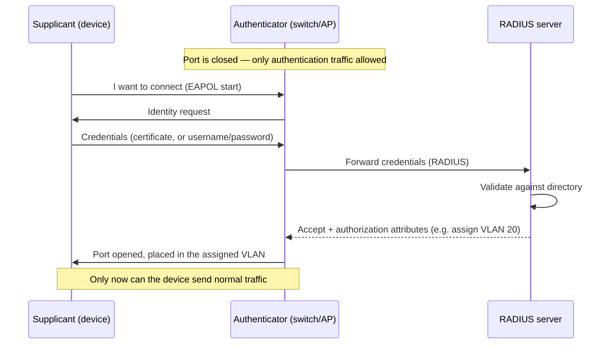

# 🎟️ Network Access Control

> [!abstract] Note of [[Network Security Architecture]]
> Every control in this branch assumes a device is on the network before deciding what it may do. Network Access Control asks the prior question: should this device be admitted at all? This note covers authenticating devices at the point of connection, checking their health before granting access, and why the port a cable plugs into is the earliest place to enforce trust.

## Parent Learning Order
Firewall Architecture & Policy -> Network Segmentation & Zero Trust -> VPNs & Encrypted Tunnels -> Intrusion Detection & Network Monitoring -> Egress Control & Web Proxies -> Network Access Control

## Start at Zero: Who Gets On the Network?

Firewalls, segmentation, and detection all operate on traffic from devices that are *already connected*. But an unmanaged laptop plugged into a conference-room jack, or an attacker's device connected to an exposed port, is on the network before any of those controls apply. **NAC (Network Access Control)** closes that gap by deciding, at the moment of connection, whether a device may join at all — and if so, with what access.

NAC answers three questions before a device gets meaningful network access:

1. **Authentication** — who or what is this device? Prove it.
2. **Posture** — is this device healthy and compliant? Check it.
3. **Authorization** — given who it is and its state, what may it access? Assign it.

This is the network's admission control, and it is the earliest possible enforcement point — earlier than the firewall, because it acts before the device can send traffic anywhere.

## 802.1X: Authenticating at the Port

The standard mechanism for wired and wireless authentication is **802.1X**, which enforces authentication at the switch port or wireless association *before* the port carries any normal traffic.

Three roles participate:

- The **supplicant** — the device requesting access, running client software that provides credentials.
- The **authenticator** — the switch or wireless access point controlling the port. It relays credentials but does not decide.
- The **authentication server** — typically a **RADIUS** server, which validates the credentials and tells the authenticator the verdict.



The critical property is in the first note: **the port passes only authentication traffic until the device authenticates.** An unauthenticated device connected to an 802.1X port cannot reach anything — it cannot flood, spoof, scan, or inject, because the port will not carry its traffic. This is why 802.1X was described in the link-layer branch as the strongest link-layer control: it prevents the unauthorized device from participating at all, making most link-layer attacks impossible from that port.

The RADIUS server can return **authorization attributes**, not just accept/reject — most powerfully, a **VLAN assignment**. This means the network can place a device into the correct segment *based on its identity*: a finance laptop into the finance VLAN, an unrecognized device into a quarantine VLAN, a contractor into a restricted one. Access control and segmentation combine at the moment of connection.

## Posture Assessment: Healthy Enough to Join?

Authentication proves identity; it says nothing about the device's *state*. A properly authenticated laptop can still be missing security patches, running no antivirus, or already compromised. **Posture assessment** checks the device's health before granting full access:

- Is the operating system patched?
- Is endpoint protection running and current?
- Is disk encryption enabled?
- Does it meet configuration policy?

A device that fails posture can be **quarantined** — placed in a restricted VLAN with access only to remediation resources (patch servers, update services) until it becomes compliant, then re-evaluated. This turns admission into a health gate: the network refuses to fully admit a device that would be a risk, and helps it become admissible rather than simply rejecting it.

## Handling the Devices That Cannot Authenticate

A real network is full of devices that cannot run 802.1X supplicant software — printers, IP cameras, badge readers, sensors, medical and industrial equipment. NAC must handle them, and how it does is a recurring weak point.

**MAC Authentication Bypass (MAB)** admits such a device based on its hardware address being on an approved list. The weakness is immediate: MAC addresses are forgeable, so an attacker who learns an approved printer's MAC can spoof it and inherit the printer's access. MAB is a necessary accommodation and a weak authenticator, so devices admitted by MAB should be placed in tightly restricted segments where a spoofed identity gains little.

This ties directly to segmentation and zero trust: because MAB and unmanaged devices are weakly authenticated, they belong in constrained segments, and their access should be minimized — a device that can only be weakly identified should be able to reach very little.

## Security Implications

**NAC is the earliest enforcement point, which makes it uniquely valuable and uniquely bypassable.** Enforcing at the port stops an unauthorized device before it does anything, which is the strongest position. But NAC deployments are riddled with exceptions — MAB devices, ports where 802.1X is not enforced, guest networks, exempted equipment — and each exception is a bypass. Attackers specifically look for the unmanaged printer's port or the conference room jack without enforcement, because those are where NAC's strong guarantee has a hole. The control is only as good as its exception handling.

**802.1X converts network access from location to identity.** Without it, plugging into a port grants network access — location equals trust, the model zero trust rejects. With it, access requires proving identity, and the identity determines the segment. This is a concrete step toward zero trust at the network layer: being physically connected grants nothing until you authenticate.

**RADIUS is critical infrastructure.** Every authentication decision flows through it, so its availability and integrity are foundational — if RADIUS is down, either no one can connect (fail closed, secure but disruptive) or everyone connects unauthenticated (fail open, available but insecure), and which behaviour is configured is a significant security decision. RADIUS itself must be protected and redundant.

**Posture assessment is a point-in-time check that can go stale.** A device compliant at connection can become non-compliant minutes later — disable its antivirus, or be compromised. Posture at admission is necessary but not sufficient; continuous posture evaluation, re-checking during the session, is the stronger model and aligns with zero trust's continuous verification rather than a one-time gate.

**Physical access still matters.** NAC raises the bar for connecting a rogue device, but an attacker who can reach a port that an authorized device uses — unplugging a authenticated printer and connecting through its MAB exception, or using a device already authenticated — can still gain access. NAC is a strong control, not an absolute one, and it pairs with physical security and constrained segmentation for weakly authenticated devices.

All NAC configuration and testing described here must target only networks within an authorized scope. Bypassing NAC, spoofing MAB identities, or connecting unauthorized devices requires explicit authorization and belongs in a controlled lab.

## Authorized Lab: Admit, Quarantine, and Bypass

Use a lab with an 802.1X-capable switch, a RADIUS server, a compliant client, a non-compliant client, and a device representing a printer.

1. **Baseline without NAC.** Plug a device into a port with no 802.1X and confirm it gets full network access immediately — location equals trust.
2. **Enable 802.1X.** Configure the port for 802.1X against RADIUS. Connect the compliant client with valid credentials and confirm it authenticates and is placed in the correct VLAN. Connect an unauthorized device and confirm the port carries only authentication traffic — it can reach nothing.
3. **Dynamic VLAN assignment.** Configure RADIUS to return different VLANs by identity, and confirm two different authenticated identities land in different segments from the same physical port.
4. **Posture check.** Configure posture assessment, connect the non-compliant client, and confirm it is placed in a quarantine VLAN with access only to remediation resources; make it compliant and confirm it is re-evaluated into full access.
5. **MAB and its weakness.** Configure MAB for the printer and confirm it is admitted by MAC address. Then spoof the printer's MAC from another device and confirm it inherits the printer's access — demonstrating MAB's weakness and why MAB devices belong in restricted segments.
6. **Test a bypass.** Identify a port or path without enforcement (simulating a common exception) and confirm it grants access without authentication — demonstrating that NAC is only as strong as its exceptions.
7. **RADIUS failure behaviour.** Take RADIUS offline and observe whether the switch fails open or closed, and articulate the security implication of each.
8. **Cleanup.** Restore the baseline configuration.

Expected interpretation:

```text
No NAC          -> connecting grants access; location equals trust
802.1X          -> unauthenticated device reaches nothing; identity required first
Dynamic VLAN    -> identity determines segment from the same port
Posture fail    -> quarantined to remediation until compliant
MAB spoofed     -> attacker inherits the printer's access; MAB is weak
Unenforced port -> access without auth; NAC is only as strong as its exceptions
```

## Crook → Operator → Root Checkpoint

- **Crook:** Explain the question NAC answers that other controls assume, and the three roles in 802.1X; state why an unauthenticated 802.1X port grants no access.
- **Operator:** Configure 802.1X with RADIUS and dynamic VLAN assignment, explain posture-based quarantine, and describe why MAB is a necessary but weak accommodation.
- **Root:** Explain why NAC is the earliest enforcement point and simultaneously bypassable through its exceptions; argue how 802.1X converts access from location to identity as a step toward zero trust, and why point-in-time posture and fail-open/closed RADIUS behaviour are consequential design decisions.

---
> 🔼 Up: [[Network Security Architecture]]
