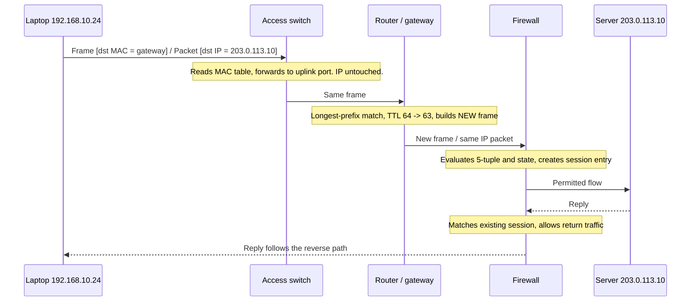

# 🔀 Network Devices & Traffic Paths

> [!abstract] Note of [[Network Foundations]]
> Devices are best understood not by their marketing category but by the forwarding decision they make and the header they read to make it. This note walks a packet from a laptop to a remote server, naming every device that touches it, what each one rewrites, and what each one can therefore observe, log, or block.

## Parent Learning Order
Network Types & Topologies -> The OSI Model -> The TCP-IP Model -> Encapsulation & Protocol Data Units -> Network Devices & Traffic Paths -> Reachability Testing & ICMP

## Start at Zero: One Question per Device

Every forwarding device answers a single question, and the question determines which header it reads.

| Device | Reads | Question it answers | Domain it defines |
| --- | --- | --- | --- |
| **Hub** | Nothing | None — repeat to all ports | One collision domain, one broadcast domain |
| **Switch** | Link-layer destination | Which port leads to this hardware address? | One collision domain **per port**, one broadcast domain per VLAN |
| **Router** | Destination IP | Which interface and next hop lead to this network? | Separates broadcast domains |
| **Firewall** | Headers plus connection state | Is this flow permitted by policy? | Enforces a trust boundary |
| **Load balancer / proxy** | Transport and often application data | Which backend should serve this request? | Terminates and re-originates flows |
| **Access point** | Link-layer, over radio | Which associated station receives this frame? | Bridges radio to wired segment |

A **hub** is obsolete but pedagogically vital: it repeats every incoming signal to every other port, so all attached devices share bandwidth and every device can see every frame. Switches replaced hubs because that is both slow and indiscreet — and the fact that modern networks do *not* broadcast everything is exactly why an attacker on a switched network must actively manipulate forwarding to see traffic that is not theirs.

## The Switch: Learning Where Things Are

A switch builds a **MAC address table** (also called a CAM table) by observing the *source* address of every frame it receives and recording which port it arrived on. Forwarding then follows three rules:

- **Known unicast** — the destination is in the table: forward out that one port only.
- **Unknown unicast** — the destination is not in the table: flood out every port except the arrival port, and learn from the reply.
- **Broadcast or multicast** — flood within the VLAN.

Entries age out after a few minutes, which is why a silent device eventually becomes "unknown" again.

Two consequences follow directly. First, a switch's table has finite capacity. If it is deliberately filled with fabricated source addresses, the switch has nowhere to record legitimate entries and begins flooding — degrading, from an observer's perspective, into a hub. This is **MAC flooding**, and it is defeated by port security limits rather than by encryption. Second, the switch makes decisions using a field that is trivially forged, because link-layer addresses carry no authentication whatsoever.

**VLANs** partition one physical switch into multiple independent broadcast domains. A port is either an **access port** carrying one VLAN untagged, or a **trunk port** carrying several VLANs with an 802.1Q tag identifying each. Traffic cannot pass between VLANs without a routing decision, which is precisely what makes the VLAN a policy boundary — provided the inter-VLAN routing device actually applies policy.

## The Router: Choosing a Network

A router forwards based on the destination IP address, selecting the entry in its routing table with the **longest matching prefix**. A `/32` host route beats a `/24` subnet route, which beats the `0.0.0.0/0` default route. When two routes have identical prefix length, the lower metric wins.

For every forwarded packet, the router:

1. Verifies the link-layer frame and strips it.
2. Decrements the TTL; if it reaches zero, discards the packet and returns an ICMP Time Exceeded message.
3. Recomputes the IP header checksum, since TTL changed.
4. Looks up the next hop and the outgoing interface.
5. Resolves the next hop's hardware address and builds a **new** link-layer frame.

Step 5 is the one beginners overlook. The IP addresses are untouched end-to-end; the hardware addresses are replaced at every hop. This is why traceroute works, why a capture shows the gateway's address rather than the server's, and why link-layer attacks are inherently local while IP-layer attacks can be remote.



Read the diagram by asking, at each arrow, *what changed?* Between the laptop and the switch, nothing changed — a switch does not rewrite. Between the router's ingress and egress, the frame is entirely new and the TTL is one lower. At the firewall, nothing in the packet changed, but state was created, and that state is what allows the reply back in.

## The Firewall: State Is the Point

A **stateless** filter evaluates each packet independently against rules. It cannot distinguish a reply to a request your host made from an unsolicited packet crafted to look like one, so permitting return traffic requires broad rules that are easy to abuse.

A **stateful** firewall tracks connections. When an outbound flow is permitted, it records the five-tuple and the expected state, then allows matching return traffic automatically. This makes policy both tighter and simpler: permit outbound HTTPS, and replies are handled implicitly.

Inspect this on a Linux host:

```bash
sudo nft list ruleset | head -20
sudo conntrack -L 2>/dev/null | head -5
```

Expected excerpt:

```text
table inet filter {
  chain input {
    type filter hook input priority filter; policy drop;
    ct state established,related accept
    iif "lo" accept
    tcp dport 22 accept
  }
}

tcp  6 431999 ESTABLISHED src=192.168.10.24 dst=203.0.113.10 sport=52418 dport=443
     src=203.0.113.10 dst=192.168.10.24 sport=443 dport=52418 [ASSURED] mark=0
```

The `ct state established,related accept` line is the whole stateful model in one rule: return traffic is not permitted by address, it is permitted because a tracked connection exists. The conntrack entry shows both directions of the flow and the timeout; `[ASSURED]` means traffic has been seen in both directions, so the entry will survive table pressure.

The security lesson is about **failure modes**. Connection-tracking tables are finite. Under enough half-open connections they fill, and the device must either drop new legitimate flows or start evicting entries — turning a security control into an availability problem. This is why SYN flood mitigation exists at all, and why "the firewall is up" is not the same statement as "the firewall is enforcing policy."

## Proxies and Load Balancers: The Flow Is Broken Deliberately

A proxy or load balancer terminates the client's connection and originates a new one to the backend. There are two independent TCP connections and, if TLS is terminated, two independent encrypted sessions.

This has consequences that surprise people during investigations. The backend server sees the proxy's address as the client, not the real user, unless an application-layer header such as `X-Forwarded-For` carries the original — and that header is attacker-controllable unless the proxy overwrites it. Server logs that trust it uncritically will attribute activity to whatever address an attacker chose. Meanwhile, the proxy is the only place where the true client address and the request content are both visible, making its logs uniquely valuable and uniquely worth protecting.

## Reading the Path from Your Own Host

```bash
ip route get 203.0.113.10
```

Expected excerpt:

```text
203.0.113.10 via 192.168.10.1 dev eth0 src 192.168.10.24 uid 1000
    cache
```

This is the routing decision made explicit for one destination: which gateway, which interface, and which source address will be used. It answers "how will this host actually send that packet" without sending anything.

```bash
traceroute -n 203.0.113.10
```

Expected excerpt:

```text
 1  192.168.10.1     0.512 ms  0.489 ms  0.501 ms
 2  10.255.0.1       2.118 ms  2.087 ms  2.201 ms
 3  * * *
 4  198.51.100.9    12.402 ms 12.388 ms 12.511 ms
 5  203.0.113.10    13.004 ms 12.947 ms 13.020 ms
```

The row of asterisks at hop 3 is the field most often misread. It does not mean the packet stopped there. It means that hop did not return a Time Exceeded message — commonly because the device is configured not to, or rate-limits ICMP. Traffic clearly continued, since hops 4 and 5 replied. Concluding "the network breaks at hop 3" from this output is a classic false conclusion; the correct reading is "hop 3 is silent, and the path is intact."

## Security Implications

Each device is simultaneously a control point and a target.

A switch decides forwarding from unauthenticated link-layer fields, so link-layer integrity controls — port security, DHCP snooping, dynamic ARP inspection, 802.1X — are what make its decisions trustworthy. Without them, an attacker on the segment influences forwarding directly.

A router's table can be poisoned if routing protocol updates are accepted without authentication. The consequence is silent redirection: traffic still arrives, so nothing appears broken, but it travelled through somewhere it should not have.

A firewall enforces the boundary but also holds the state that describes every flow crossing it, making it both the highest-value log source and a target for resource exhaustion.

Every device is also a **management surface**. Administrative interfaces reachable from ordinary user segments are a recurring finding, because compromising the device that enforces segmentation removes segmentation entirely. Management belongs in its own restricted path.

Enumeration of network devices must stay inside an authorized scope; probing infrastructure generates telemetry and, in the case of unstable devices, can affect availability.

## Authorized Lab: Attribute Every Change to a Device

Build a three-segment lab you fully control: two host VMs and a router VM with a firewall, each host on its own virtual switch.

1. From Host-A, run `ip route get <Host-B address>` and record the gateway and source address chosen.
2. Capture on Host-A's interface while pinging Host-B:

```bash
sudo tcpdump -i eth0 -nn -e -c 4 icmp
```

Record the destination hardware address and the TTL.

3. Capture simultaneously on Host-B's interface. Compare the two captures.
4. Confirm three findings: the IP addresses are identical in both captures; the hardware addresses are completely different; the TTL at Host-B is one lower than at Host-A.
5. On the router, add a rule dropping ICMP between the two subnets. Repeat the ping and observe it fail while `ip route get` still reports a valid path — proving that a route and a permission are different things.
6. Replace the drop with a reject and repeat. Observe the difference between silence and an explicit ICMP administratively-prohibited message.
7. Remove both lab rules and confirm the baseline ping succeeds again.

Expected interpretation:

```text
Same IPs, different MACs   -> the router rebuilt the frame; the switch did not
TTL decremented by one     -> exactly one routing decision occurred
Route present, ping fails  -> policy denied, topology unchanged
Drop vs reject             -> silence looks like a dead host; reject identifies the control
```

## Crook → Operator → Root Checkpoint

- **Crook:** State which header each device reads and what question it answers; explain why a switch creates one broadcast domain per VLAN while a router separates them.
- **Operator:** Use `ip route get`, a two-sided capture, and `traceroute` to describe a packet's path; explain why the hardware addresses differ at each end while the IP addresses do not, and why asterisks in traceroute are not a failure.
- **Root:** Explain how MAC table exhaustion degrades a switch's behaviour, how connection-tracking limits turn a firewall into an availability risk, and why a proxy's logs are the only reliable source of true client attribution once `X-Forwarded-For` is attacker-influenced.

---
> 🔼 Up: [[Network Foundations]]
