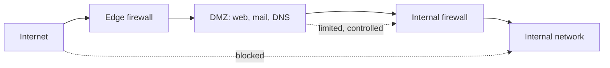

# 🧭 Network Segmentation & Zero Trust

> [!abstract] Note of [[Network Security Architecture]]
> The old model trusted anything inside the perimeter, and attackers learned to get inside once and roam freely. This note traces the shift from perimeter trust to segmentation to zero trust — a progression driven entirely by the goal of containing an attacker who is already in, since assuming breach is now the only realistic posture.

## Parent Learning Order
Firewall Architecture & Policy -> Network Segmentation & Zero Trust -> VPNs & Encrypted Tunnels -> Intrusion Detection & Network Monitoring -> Egress Control & Web Proxies -> Network Access Control

## Start at Zero: Why the Castle Fell

The traditional model was a **hard perimeter with a soft interior** — a firewall at the edge, and inside it a large trusted network where systems reached each other freely. The metaphor was a castle with a moat: strong walls, and once inside, free movement.

This model has a fatal flaw that defined a generation of breaches. Once an attacker gets inside — through a phished credential, a vulnerable public service, a malicious email, a rogue device — the flat trusted interior lets them move freely from the initial foothold to the actual target. This is **lateral movement**, and it is the phase where a minor intrusion becomes a major breach. The perimeter did nothing to stop it, because inside the perimeter everything was trusted.

The entire evolution of network security architecture is a response to this single problem: **how do you contain an attacker who is already inside?**

## Step One: Segmentation

**Segmentation** divides the flat interior into zones separated by controls, so that compromising one zone does not grant access to the others. Instead of one trusted network, there are many smaller ones with firewalls, ACLs, or VLANs between them, and traffic crossing a zone boundary is subject to policy.

The classic pattern is the **DMZ (demilitarized zone)** — a segment for public-facing servers, positioned so that neither the Internet nor those servers can reach the internal network directly.



The logic: a public web server *must* be reachable from the Internet, so it is exposed — but it lives in the DMZ, and even if compromised, the internal firewall stops it from reaching internal systems. The DMZ absorbs the risk of exposure and contains it.

Beyond the DMZ, segments separate by function and sensitivity: user workstations, servers, management interfaces, guest and IoT devices, and regulated data each in their own zone. The key questions are always the same — which systems must communicate, on which ports, and everything else is denied at the boundary. Segmentation converts lateral movement from a free Layer 2 hop into a routed event that a firewall can deny and a sensor can observe.

## Step Two: Microsegmentation

Segmentation with a handful of zones still leaves large trusted areas — a compromised server can still reach every other server in its zone. **Microsegmentation** pushes the boundaries down to individual workloads: each server, or even each application, has its own policy governing exactly what it may talk to.

The shift is from "which network zone are you in?" to "which specific workload are you, and what is that workload allowed to do?" A database accepts connections only from its specific application servers, on its specific port, and nothing else — not even other databases in the same zone. This is enforced by host-based firewalls, hypervisor policy, or software-defined networking rather than by physical topology, so it follows workloads even as they move.

Microsegmentation dramatically shrinks the blast radius: a compromised workload can reach only what its policy explicitly permits, which for a well-defined workload is very little.

## Step Three: Zero Trust

**Zero trust** completes the progression by discarding network location as a basis for trust entirely. Its principle is stated as **"never trust, always verify"** — and more precisely, *assume the network is already compromised.* No connection is trusted because of where it originates; every access is authenticated, authorized, and encrypted regardless of whether it comes from the "internal" network or the Internet.

The consequences are structural:

- **Identity replaces location.** Access decisions are based on verified identity of the user and device, not on being on a trusted subnet. Being inside the network grants nothing.
- **Every request is verified.** Authentication and authorization happen per-access, continuously, not once at a perimeter.
- **Least privilege is enforced per resource.** A verified identity gets access only to the specific resources it needs, not to a network segment.
- **Encryption is assumed everywhere**, because the network — internal included — is treated as hostile. This is the architectural reason the internal path is no longer trusted, and why re-encryption to backends became standard.

```text
Perimeter model:  trusted if inside the network
Segmentation:     trusted within your zone
Microsegmentation: trusted only for explicitly permitted workload flows
Zero trust:        trusted for nothing by location; every access verified by identity
```

Zero trust is a direction of travel, not a product. It is implemented incrementally — strong identity, device posture checking, per-application access instead of network-level VPN access, pervasive encryption, and continuous verification — and most organizations are somewhere along the path rather than at its end.

## Security Implications

**Assume breach is the honest premise.** Every step of this evolution accepts that prevention will sometimes fail and an attacker will get in. The design goal shifts from keeping attackers out to **limiting what they can do once in**. This is realistic in a way perimeter trust was not, and it reframes success as containment and detection rather than an unbreachable wall.

**Containment is measured by blast radius.** The value of segmentation, microsegmentation, and zero trust is directly the reduction in how far one compromised element reaches. A flat network has a blast radius of everything; a microsegmented one confines a compromise to a single workload's permitted flows. This is the concrete metric by which an architecture's containment is judged.

**Segmentation must survive valid credentials.** An attacker who phishes a credential is, from the network's view, a legitimate user. Segmentation that only stops unauthenticated traffic does nothing against them. This is exactly why zero trust adds per-resource authorization and least privilege — so that a stolen credential grants access only to what that identity legitimately needs, not to a whole segment.

**The controls compose with everything below.** Segmentation is enforced by the firewalls, VLANs, and routing from earlier branches; zero trust adds identity and encryption on top. A zero-trust architecture does not replace network controls — it layers identity-based verification over them, and a failure at any layer (a flat VLAN, a permissive inter-zone rule, weak identity) undermines the whole.

**Complexity and operations are the real cost.** Fine-grained policy means more policy to define, maintain, and troubleshoot. Microsegmentation and zero trust demand accurate knowledge of what should talk to what — which many organizations lack — and a wrong policy blocks legitimate work. The migration is as much an operational and discovery effort as a technical one, and rushing it produces outages that discredit the approach.

All architecture testing described here must be confined to systems within an authorized scope. Probing segment boundaries and attempting lateral movement are intrusive and require explicit authorization.

## Authorized Lab: Contain a Compromise

Use a lab with three segments — a DMZ, an internal server zone, and a workstation zone — separated by a firewall you control.

1. **Establish a flat baseline.** Temporarily allow all inter-segment traffic. From a "compromised" host in the DMZ, confirm you can reach internal servers and workstations freely — demonstrating unrestricted lateral movement.
2. **Apply segmentation.** Configure the firewall so the DMZ can reach only the specific internal services it legitimately needs, and workstations cannot be reached from the DMZ at all. Repeat the lateral-movement attempt and confirm it is now contained to the permitted flows.
3. **Measure the blast radius.** From the compromised DMZ host, enumerate what is now reachable and confirm it is a small, explicit set rather than the whole network.
4. **Apply microsegmentation.** Add host-based policy so a specific internal database accepts connections only from its application server, and confirm that even another host within the internal zone cannot reach the database.
5. **Test against valid credentials.** Give the "attacker" valid credentials for one workstation and confirm that network segmentation alone still limits reach; then add a per-resource authorization check and confirm the credential grants access only to that identity's permitted resources — the zero-trust addition.
6. **Confirm internal encryption.** Verify that traffic between internal systems is encrypted, so an attacker with a foothold on the segment cannot read it — the assume-hostile-network premise made concrete.
7. **Cleanup.** Restore the baseline firewall and host policies.

Expected interpretation:

```text
Flat network    -> DMZ compromise reaches everything: unrestricted lateral movement
Segmentation    -> movement contained to explicitly permitted inter-zone flows
Microsegmentation-> even same-zone hosts cannot reach the database
Valid credential-> segmentation limits reach; per-resource authz limits it further
Internal encryption -> a foothold on the segment cannot read others' traffic
```

## Crook → Operator → Root Checkpoint

- **Crook:** Explain the perimeter model's flaw, what lateral movement is, and why segmentation contains it; describe the purpose of a DMZ.
- **Operator:** Configure segmentation to contain a compromise, measure the resulting blast radius, and explain how microsegmentation shrinks it to individual workloads.
- **Root:** Explain the progression from perimeter to zero trust as successive answers to "contain an attacker already inside"; argue why segmentation must survive valid credentials and how zero trust's identity-based, least-privilege, encrypt-everything model achieves that, and why it composes with rather than replaces network controls.

---
> 🔼 Up: [[Network Security Architecture]]
