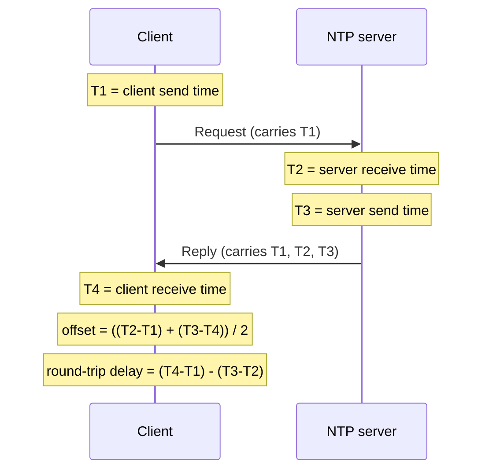

# ⏰ Network Time Synchronization

> [!abstract] Note of [[Core Network Services]]
> Accurate time is invisible until it is wrong, at which point authentication fails, logs become uncorrelatable, and certificates are rejected. This note explains how networks agree on time, why the protocol became a favourite amplification weapon, and why time is a genuine security dependency rather than a convenience.

## Parent Learning Order
DNS Resolution & Records -> DNS Security & Encrypted Transports -> Local Name Resolution & Service Discovery -> Network Time Synchronization -> Email Transport Protocols -> Network Management Protocols

## Start at Zero: Why Clocks Drift and Why It Matters

Every computer has a clock, and every clock drifts. The oscillators that keep time are imperfect and temperature-sensitive, so an unsynchronized machine gains or loses seconds per day. Independently drifting clocks across a network make it impossible to say which of two events happened first — and a surprising amount of security infrastructure depends on exactly that ability.

**NTP (Network Time Protocol)** keeps clocks synchronized across a network to within milliseconds. It is not merely setting the clock; it continuously *disciplines* it, adjusting the rate to compensate for measured drift so time advances smoothly rather than jumping.

Time sources are organized by **stratum**, a distance-from-truth measure:

- **Stratum 0** — a reference clock itself: an atomic clock or GPS receiver. Not on the network directly.
- **Stratum 1** — a server directly attached to a stratum 0 source.
- **Stratum 2** — synchronized to a stratum 1 server, and so on down.

Each level is one step further from the authoritative source, and the number increases with distance. A stratum of 16 conventionally means "unsynchronized." The hierarchy exists so that a small number of high-quality reference clocks can serve time to the entire Internet through layers of redundancy.

## How Synchronization Actually Works

NTP's cleverness is measuring and removing network delay. A simple "what time is it?" would be wrong by however long the reply took to arrive. NTP exchanges **four timestamps** to solve this:



From the four timestamps the client computes two values: the **offset** (how far its clock differs from the server's) and the **round-trip delay**. The formula assumes the network delay is roughly symmetric — that the request and reply took about the same time. This assumption is usually fine and is the one thing an attacker manipulating path delay can exploit to skew a target's clock even without forging any packet contents.

Inspect synchronization state:

```bash
chronyc tracking
```

Expected excerpt:

```text
Reference ID    : C0A80A01 (ntp.internal.example)
Stratum         : 3
System time     : 0.000034 seconds fast of NTP time
Last offset     : +0.000012 seconds
RMS offset      : 0.000089 seconds
Root delay      : 0.004120 seconds
```

`Stratum : 3` places this host three hops from a reference clock. The offset in microseconds indicates healthy synchronization; an offset growing into seconds is the warning sign that synchronization is failing. Check the sources feeding it:

```bash
chronyc sources -v
```

Expected excerpt:

```text
MS Name/IP address     Stratum Poll Reach LastRx Last sample
^* ntp1.internal.example      2   10   377    412   +14us[+18us] +/- 2.1ms
^+ ntp2.internal.example      2   10   377    408   -9us[-9us]   +/- 2.4ms
```

The `^*` marks the currently selected source; `^+` marks acceptable alternates. `Reach 377` is an octal reachability register — all-ones means the last eight polls all succeeded. Multiple sources exist so that one lying or failing server can be outvoted rather than believed.

## Security Implications

**Time is a hard authentication dependency, and Kerberos is the sharpest example.** Kerberos tickets carry timestamps and are rejected if the client and server clocks differ by more than a tolerance (commonly five minutes). A host whose clock has drifted past that window cannot authenticate at all — not "less securely," but not at all. In practice, a mysterious inability to log in across a domain is frequently a time problem, and it is one of the most common real-world consequences of NTP failure. Certificate validation is similar: a wrong clock makes valid certificates appear expired or not-yet-valid, breaking TLS.

**Log correlation collapses without synchronized time.** Incident investigation reconstructs a sequence of events from logs across many systems. If those systems disagree about the time, the sequence cannot be reliably ordered — an event on one host cannot be placed before or after an event on another. This directly undermines forensics, and it means an attacker who can skew clocks degrades the defender's ability to reconstruct what happened. Consistent, synchronized, and ideally UTC time across an estate is a prerequisite for meaningful security monitoring, not a nicety.

**NTP was a premier amplification weapon.** Older NTP servers supported a `monlist` command that returned a long list of recent clients in response to a tiny request — an amplification factor in the hundreds. Combined with UDP's spoofable source (port 123), attackers used open NTP servers to direct massive reflected floods at victims. The response was to disable the offending commands by default, and modern servers do not expose them. It remains a canonical example of why any UDP service must consider amplification, and why running old server software is dangerous beyond its own vulnerabilities.

```bash
ntpq -c rv <server> 2>/dev/null || echo "monlist/mode6 disabled — good"
```

**Time manipulation is an attack in itself.** An attacker who can control or spoof a target's time source can push its clock forward or backward. Backward, and expired certificates or credentials become valid again, and time-based one-time passwords can be replayed. Forward, and valid material expires prematurely, causing denial of service. Because classic NTP is unauthenticated, an on-path attacker can manipulate it; **NTS (Network Time Security)** adds cryptographic authentication to NTP to prevent forged time, and authenticated time sources matter most for the systems whose security depends on time — domain controllers, certificate authorities, logging infrastructure.

**Redundancy and sanity limits are the practical defenses.** Configuring multiple independent sources lets a client detect and reject an outlier rather than believe a single manipulated server. A maximum-adjustment limit (a "panic" threshold) refuses to accept a time change so large it is implausible, preventing a single bad answer from wrenching the clock. Both are standard configuration on a well-run time client.

All testing described here must be confined to systems within an authorized scope. Manipulating a time source affects authentication and logging for every system that trusts it, and amplification testing directs traffic at third parties.

## Authorized Lab: Skew a Clock, Watch Authentication Fail

Use a lab with a time server, a client, and — for the authentication portion — a service that depends on time (a Kerberos KDC and a domain-joined client is the clearest demonstration).

1. **Baseline.** Confirm the client is synchronized with `chronyc tracking` and `chronyc sources`, and confirm a time-dependent operation (a Kerberos authentication, or a TLS handshake against an internal certificate) succeeds.
2. **Observe the exchange.** Capture NTP traffic and identify the request/reply on UDP 123:

```bash
sudo tcpdump -i eth0 -nn -c 4 'udp port 123'
```

3. **Skew the clock.** Stop the time daemon and manually set the client's clock outside the authentication tolerance — more than five minutes off for the Kerberos case.
4. **Observe the consequence.** Retry the time-dependent operation and confirm it now fails. For Kerberos, expect a clock-skew error; for TLS, a certificate validity error. This demonstrates that time is a hard dependency, not a soft one.
5. **Recover.** Restart the time daemon, watch the client discipline its clock back toward correct time, and confirm the operation succeeds again once the offset is within tolerance.
6. **Demonstrate outlier rejection.** Configure the client with several sources, then have one source (in the lab) return a badly wrong time. Confirm the client rejects the outlier rather than following it, and that a sanity limit refuses an implausibly large jump.
7. **Cleanup.** Restore correct time configuration and confirm `chronyc tracking` shows a small offset and the expected stratum.

Expected interpretation:

```text
Synchronized     -> time-dependent authentication succeeds
Clock skewed     -> Kerberos/TLS fails outright; time is a hard dependency
Recovered        -> operation works again once offset is within tolerance
Multiple sources -> a single lying server is outvoted, not believed
Sanity limit     -> an implausible jump is refused, blunting manipulation
```

## Crook → Operator → Root Checkpoint

- **Crook:** Explain why clocks drift, what NTP does beyond setting the clock, and what stratum measures.
- **Operator:** Read `chronyc` output to confirm synchronization, identify the selected source and its stratum, and recognize a growing offset as impending failure; explain the four-timestamp offset calculation and its symmetry assumption.
- **Root:** Explain why time is a hard dependency for Kerberos, certificates, and log correlation; describe how NTP amplification worked and why old software is dangerous, and how time manipulation enables replay or denial of service — and why NTS, multiple sources, and sanity limits are the defenses.

---
> 🔼 Up: [[Core Network Services]]
