# 🌐 Networking

> [!abstract] The Domain
> How data moves — models and encapsulation, addressing and segmentation, the protocols both sides target, and the evidence that proves what actually happened on the wire. Part of the domain map at [[Cyber Security]].

```mermaid
flowchart LR
    F["Foundations: models & devices"] --> A["Addressing: identity & boundaries"]
    A --> L["Link layer: switching & local trust"]
    L --> R["Network layer: routing & path integrity"]
    R --> T["Transport: connections & state"]
    T --> S["Services: the infrastructure protocols"]
    S --> W["Web & application protocols"]
    W --> SA["Security architecture: the design layer"]
    SA --> WL["Wireless: the uncontainable medium"]
    WL --> AN["Analysis: proving what happened"]
```

## 🗺️ Zero-to-Mastery Learning Path

1. [[Network Foundations]]
2. [[Addressing & Subnetting]]
3. [[Switching & the Link Layer]]
4. [[Routing & the Network Layer]]
5. [[Transport Layer & Sockets]]
6. [[Core Network Services]]
7. [[Web & Application Protocols]]
8. [[Network Security Architecture]]
9. [[Wireless Networking]]
10. [[Network Analysis & Troubleshooting]]

---
> 🌐 Back to the domain map: [[Cyber Security]]
