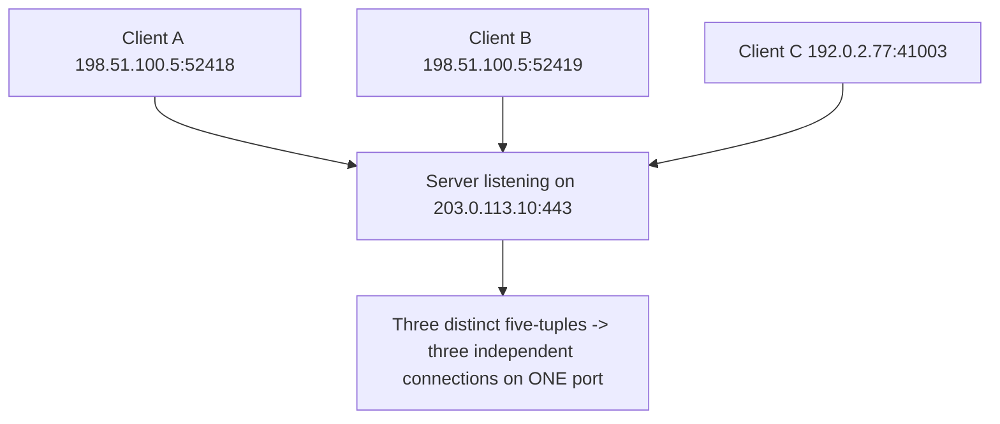

# 🔢 Ports & Sockets

> [!abstract] Note of [[Transport Layer & Sockets]]
> An IP address gets data to a machine; a port gets it to the right program on that machine. This note builds the socket abstraction from that need, explains the five-tuple that makes thousands of simultaneous connections possible, and shows why the difference between binding to one interface and binding to all of them is one of the most consequential single characters in system configuration.

## Parent Learning Order
Ports & Sockets -> TCP Connections & State -> TCP Reliability & Congestion Control -> UDP & Connectionless Transport -> QUIC & Modern Transport -> Transport Layer Threats & Controls

## Start at Zero: The Problem an Address Cannot Solve

A packet arrives at `192.168.10.24`. That machine is running a web server, an SSH daemon, a database, and a dozen background processes. The IP address identified the *host*, but nothing so far identifies which *program* should receive the data.

A **port** solves this. It is a 16-bit number — 0 to 65535 — carried in the transport header, naming a communication endpoint on the host. The receiving kernel reads the destination port and delivers the payload to whichever program registered an interest in it. This is called **demultiplexing**, and it is the transport layer's defining job.

Ports are divided by convention:

| Range | Name | Meaning |
| --- | --- | --- |
| 0–1023 | **Well-known** | Standard services. On Unix-like systems, binding these historically requires elevated privilege. |
| 1024–49151 | **Registered** | Assigned to specific applications by convention (3306 MySQL, 5432 PostgreSQL) |
| 49152–65535 | **Ephemeral** | Temporary source ports the kernel assigns to outbound connections |

The privileged-port convention below 1024 exists so that an unprivileged user cannot start a rogue service on port 22 and impersonate the real SSH daemon. It is a weak control by modern standards — it says nothing about services on high ports, and containers complicate it — but it explains why web servers start as root and then drop privileges after binding.

Ports worth recognizing on sight:

| Port | Service | | Port | Service |
| --- | --- | --- | --- | --- |
| 22 | SSH | | 443 | HTTPS |
| 25 | SMTP | | 445 | SMB |
| 53 | DNS | | 3306 | MySQL |
| 80 | HTTP | | 3389 | RDP |
| 123 | NTP | | 5432 | PostgreSQL |
| 161 | SNMP | | 5985 | WinRM |

A port number is a **convention, not a guarantee**. Nothing forces a web server onto 80 or prevents SSH from listening on 4443. Service identification must ultimately come from interacting with the service, not from assuming the port's usual meaning — which is exactly why version detection exists as a separate step from port discovery.

## The Socket and the Five-Tuple

A **socket** is the programming abstraction for a communication endpoint: the object a program reads from and writes to. Concretely, a connection is uniquely identified by five values together — the **five-tuple**:

```text
(protocol, source IP, source port, destination IP, destination port)
```

This is the mechanism that lets one server handle thousands of simultaneous clients on a single port. Every connection to a web server has the same destination IP and destination port (443), but each client contributes a different source IP and source port, so every five-tuple is unique and the kernel can keep the conversations separate.



Note clients A and B: the *same* machine, the *same* server, the *same* port — distinguished only by the ephemeral source port. That single differing value is what allows a browser to open many parallel connections to one site. It also bounds concurrency: a client has roughly 64,000 ephemeral ports per destination tuple, and exhausting them causes connection failures that look like server problems but are local.

Two socket roles exist:

- A **listening socket** waits for incoming connections. It is bound to an address and port and has no peer yet.
- An **established socket** represents one accepted connection, with all five tuple values fixed.

## Reading Socket State

```bash
ss -tulnp
```

Expected excerpt:

```text
Netid State   Local Address:Port   Peer Address:Port  Process
tcp   LISTEN  0.0.0.0:22           0.0.0.0:*          users:(("sshd",pid=812,fd=3))
tcp   LISTEN  127.0.0.1:5432       0.0.0.0:*          users:(("postgres",pid=1104,fd=5))
tcp   LISTEN  [::]:443             [::]:*             users:(("nginx",pid=1520,fd=6))
udp   UNCONN  0.0.0.0:123          0.0.0.0:*          users:(("chronyd",pid=740,fd=5))
```

The flags: `-t` TCP, `-u` UDP, `-l` listening only, `-n` numeric (no name lookup), `-p` show the owning process.

The **most important column is the local address**, and it carries the lesson of this note:

- **`0.0.0.0:22`** — bound to *every* IPv4 interface. Reachable from any network the host is attached to, subject only to firewall policy. This service is exposed.
- **`127.0.0.1:5432`** — bound to loopback only. Reachable exclusively from processes on this host. No network exposure at all, regardless of firewall rules.
- **`[::]:443`** — the IPv6 equivalent of all-interfaces. On most systems this also accepts IPv4 connections via dual-stack mapping, so it is exposed on both families.

The difference between `0.0.0.0` and `127.0.0.1` is the difference between a database anyone on the network can attempt to reach and one only local processes can touch. A database that should be local-only but is bound to `0.0.0.0` is one of the most common and most serious misconfigurations in practice — and no firewall rule is needed to fix it, only a correct bind address. **Bind address is the primary exposure control; the firewall is the secondary one.**

Inspect established connections rather than listeners:

```bash
ss -tnp state established
```

Expected excerpt:

```text
Recv-Q Send-Q   Local Address:Port      Peer Address:Port  Process
     0      0   192.168.10.24:52418     93.184.216.34:443  users:(("firefox",pid=4412,fd=91))
```

`Recv-Q` and `Send-Q` are queue depths. Persistently non-zero values are diagnostic: a large `Send-Q` means data is queued locally and not being acknowledged — the peer or the path is the problem. A large `Recv-Q` means data has arrived but the local application is not reading it fast enough — the application is the problem, not the network.

### The failure this diagnoses

```text
bind: Address already in use
```

Two programs cannot hold the same address-and-port combination. This error means something is already bound there — often a previous instance that did not exit cleanly, or a socket lingering in `TIME-WAIT`. Find the holder rather than guessing:

```bash
sudo ss -tlnp '( sport = :8080 )'
```

Expected excerpt:

```text
tcp LISTEN 0.0.0.0:8080 users:(("old-app",pid=3311,fd=7))
```

The output names the process and PID holding the port, converting a vague error into a specific action.

## Security Implications

**Every listening socket is attack surface.** A port that accepts connections is code that parses untrusted input. Enumerating listeners and justifying each one is among the highest-value hardening activities available, and it is entirely local — no scanning required. The correct question for each is not "is it firewalled?" but "does this need to listen on the network at all?"

**Bind address beats firewall rules for exposure control.** A service bound to loopback cannot be reached remotely even if the firewall is misconfigured, disabled, or bypassed by a rule ordering mistake. Defense in depth means doing both, but the bind address is the stronger and simpler guarantee.

**Port numbers are not identity.** An attacker running a service on an unexpected port evades controls that reason by port number, and a defender who assumes port 80 is HTTP will misread a tunnel. Conversely, a service moved to a non-standard port is not hidden — it is trivially found by scanning and version detection. "Security by unusual port" is not a control.

**Socket state is forensic evidence.** The five-tuple plus owning process ties a network conversation to a specific program and user at a specific time. During incident response, capturing established connections and their owning processes is time-critical: sockets close, and the mapping is lost. `ss -tnp` output is often the fastest way to identify which process is communicating with an unexpected destination.

**Ephemeral port exhaustion is a real availability limit.** A host opening connections faster than they close can exhaust its ephemeral range, causing new connections to fail while the network is perfectly healthy. It presents as an application outage and is diagnosed by counting sockets, not by testing connectivity.

Enumerating sockets on systems you administer is ordinary operations. Scanning ports on hosts you do not own requires authorization, and is covered by the scoping rules of whatever engagement you are operating under.

## Authorized Lab: Prove That Bind Address Is the Control

Use two lab VMs on a segment you control: a server and a client.

1. **Bind to loopback.** On the server, start a simple service listening on `127.0.0.1:8080` (any minimal test server will do). Confirm the binding:

```bash
ss -tlnp '( sport = :8080 )'
```

Expected excerpt:

```text
tcp LISTEN 127.0.0.1:8080 users:(("testsrv",pid=2201,fd=3))
```

2. From the server itself, connect to `127.0.0.1:8080` and confirm it works.
3. From the **client**, attempt to connect to the server's network address on port 8080. It fails — connection refused or timed out — with **no firewall rule involved at all**.
4. **Rebind to all interfaces.** Stop the service and restart it bound to `0.0.0.0:8080`. Confirm with `ss` that the local address changed.
5. From the client, retry the connection. It now succeeds. Nothing about the firewall, the network, or the client changed — only the bind address.
6. **Add the secondary control.** With the service still on `0.0.0.0`, add a firewall rule denying port 8080 from the client. Confirm the connection fails again, demonstrating layered control.
7. **Observe the five-tuple.** Open three simultaneous connections from the client and inspect them on the server:

```bash
ss -tnp state established '( sport = :8080 )'
```

Confirm three rows sharing a destination address and port but differing in source port — three unique five-tuples on one listening port.

8. **Cleanup.** Stop the test service, remove the firewall rule, and confirm `ss -tlnp` no longer lists port 8080.

Expected interpretation:

```text
Bound to 127.0.0.1 -> unreachable from the network, no firewall needed
Bound to 0.0.0.0   -> reachable from every attached network
Firewall added     -> secondary layer; the bind address was the primary one
Three connections  -> one listening port, three five-tuples, fully separated
```

## Crook → Operator → Root Checkpoint

- **Crook:** Explain why an IP address alone cannot deliver data to the right program, what a port is, and the difference between a listening and an established socket.
- **Operator:** Read `ss` output to identify exposed versus loopback-only services and their owning processes; diagnose "address already in use" by finding the holder, and interpret `Recv-Q`/`Send-Q` to distinguish an application problem from a network one.
- **Root:** Explain the five-tuple as the mechanism enabling massive concurrency on one port and the source of ephemeral exhaustion; argue why bind address is a stronger exposure control than firewall policy, and why port numbers are a convention that neither identifies nor hides a service.

---
> 🔼 Up: [[Transport Layer & Sockets]]
