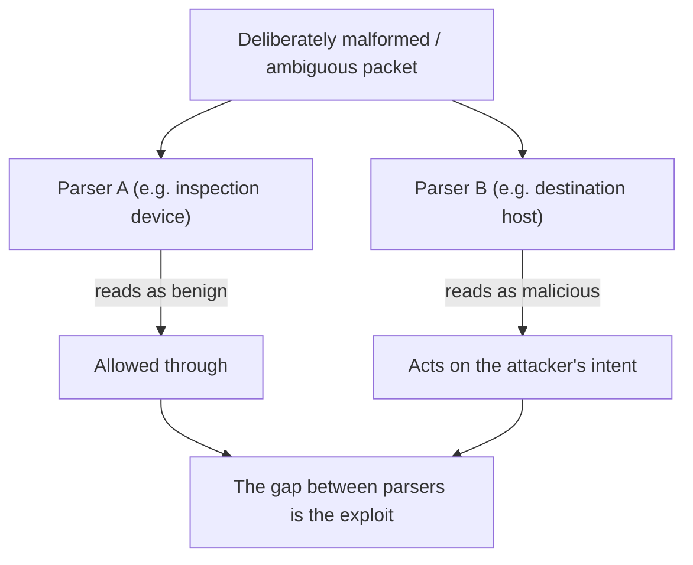

# 🔬 Protocol Debugging & Deep Inspection

> [!abstract] Note of [[Network Analysis & Troubleshooting]]
> The hardest network problems are not "is it connected?" but "why does this protocol behave wrongly?" — and answering that means reading the protocol at the byte level and knowing its rules well enough to see the violation. This final leaf of the domain brings every layer together: deep inspection is where knowing how a protocol *should* work becomes the tool for seeing how it did.

## Parent Learning Order
Packet Capture & Analysis -> Structured Network Troubleshooting -> Traffic Analysis & Flow Inspection -> Performance & Latency Analysis -> Connectivity Diagnostics -> Protocol Debugging & Deep Inspection

## Start at Zero: When Connectivity Is Fine but Behaviour Is Wrong

The diagnostics so far answer whether traffic can flow. But a whole class of problems has perfect connectivity and wrong *behaviour*: a TLS handshake that fails for one client, an application that works for small responses and hangs for large, an authentication that succeeds then immediately breaks, a protocol negotiation that silently degrades. Ping succeeds, the port answers, the name resolves — and it still does not work.

These require **protocol debugging**: reading the actual protocol exchange at the byte level and comparing it against how the protocol is *supposed* to behave. This is the capstone skill of the domain because it demands everything — you cannot debug a protocol you do not understand, so every earlier branch (how TCP establishes state, how TLS handshakes, how DNS delegates, how HTTP frames a message) becomes the reference against which you read the capture.

**Deep packet inspection** is examining not just headers but the full protocol semantics — dissecting each field, following state across packets, and recognizing where the exchange deviates from the specification. Wireshark's dissectors do the parsing; the analyst supplies the knowledge of what *should* happen.

## Reading a Protocol Against Its Rules

The method is always the same: capture the exchange, dissect it, and compare against the protocol's defined behaviour, looking for the first deviation.

```bash
tshark -r handshake.pcap -Y 'tls.handshake' -T fields \
  -e frame.number -e tls.handshake.type -e tls.handshake.version
```

Expected excerpt:

```text
1    1    0x0303       # ClientHello
2    2    0x0303       # ServerHello
2    11   0x0303       # Certificate
5    15                # CertificateVerify
```

Debugging a failed TLS handshake means knowing the expected sequence (ClientHello → ServerHello → Certificate → key exchange → Finished, from the HTTPS leaf) and finding where the capture diverges. If the ServerHello never appears, the server rejected the ClientHello — perhaps no shared cipher, a mismatch visible by comparing the client's offered ciphers against the server's configuration. If it fails after the Certificate, it is validation — the deviation localizes the cause to a specific step, and the fix follows from which step failed.

Wireshark's **Expert Information** automates spotting many deviations — retransmissions, out-of-order segments, malformed fields, resets — flagging where a capture departs from healthy behaviour:

```bash
tshark -r capture.pcap -q -z expert
```

Expected excerpt:

```text
Errors (2)
    Malformed Packet (Exception occurred)
Warnings (14)
    TCP Retransmission
    TCP Previous segment not captured
Notes (31)
    TCP Dup ACK
    TCP Zero Window
```

Each entry is a lead. `TCP Zero Window` means a receiver's buffer filled and it told the sender to stop — an endpoint-side bottleneck, from the transport branch. `TCP Previous segment not captured` means the capture itself missed packets (a capture-point problem, from the capture leaf) or genuine loss. Reading these correctly requires knowing what each protocol event means — the Expert flags where to look, but the analyst's protocol knowledge interprets it.

## Malformed Packets: The Security Frontier

Deep inspection is where a critical security concept becomes concrete: **implementations disagree about how to parse the same bytes, and that disagreement is an attack surface.** This theme recurred through the whole domain — IP fragment reassembly, HTTP request smuggling, VLAN tag stacking, IDS-versus-host normalization — and here is where it is directly observed.



A malformed or ambiguous packet — inconsistent length fields, overlapping fragments, unusual option encodings, conflicting headers — may be read one way by a security device and another way by the target. The attacker crafts input that the inspector deems safe and the target deems actionable, evading the control. Deep inspection is how both attackers find these discrepancies and defenders detect their exploitation, and it is why robust implementations **normalize** input — reducing it to a single canonical interpretation — before acting or forwarding.

Debugging malformed traffic also arises innocently: a buggy implementation emits packets that violate the spec, and a strict peer rejects them while a lenient one accepts them, producing "works with A, fails with B" mysteries. The resolution is the same — read the bytes, compare against the spec, and identify who is wrong.

## Security Implications

**Deep inspection is the analytical endpoint of both troubleshooting and security.** The ability to read a protocol at the byte level, know its rules, and identify a deviation is what solves the hardest operational problems and what detects the most sophisticated attacks. Protocol-manipulation attacks — smuggling, evasion, exploitation of parser differences — are visible only to someone who can inspect the protocol deeply, which is why this skill sits at the top of the domain.

**Parser discrepancies are a pervasive, structural vulnerability class.** From fragments to HTTP to TLS, the pattern "two implementations parse the same bytes differently" appears at every layer, and each instance is exploitable. Understanding this as one recurring class — not a series of unrelated bugs — is a root-level insight: wherever data crosses between two parsers, verify they agree, because the gap is where evasion lives.

**Normalization is the defense, and it has a cost.** Reducing input to a canonical form before acting removes parser ambiguity, which is why inspection devices, proxies, and robust servers normalize aggressively. The cost is that normalization is itself complex code parsing untrusted input, and normalizers have had their own vulnerabilities — the defense against parser bugs is more parsing. This tension is honest and unavoidable.

**Deep inspection has a privacy and trust dimension.** Reading protocols deeply means reading content, so where it is applied to decrypted traffic it carries the same concentration-of-trust concerns as TLS inspection from the security-architecture branch. The capability to inspect deeply is a capability to surveil, and it is governed accordingly.

**This is where the whole domain converges.** Every branch built toward this: you cannot debug a protocol without understanding the models (foundations), addressing (addressing), the link and network layers (switching, routing), the transport (transport), the services and applications (services, web), the security architecture that inspects it, and the wireless and analysis techniques to capture it. Protocol debugging is the domain using all of itself at once, which is why it is the final leaf.

**The encryption backstop appears one last time.** Deep inspection reads cleartext protocols in full and encrypted ones only at their unencrypted edges (handshake, SNI, metadata). The same fact that makes deep inspection powerful against plaintext makes it an argument for encryption — and the same metadata that survives encryption is what deep inspection still yields against a TLS or QUIC flow. The domain closes where it repeatedly landed: secure the payload, because inspection — friendly or hostile — reads whatever is not encrypted.

All deep inspection described here must target only traffic you are authorized to examine. Crafting malformed packets and inspecting protocol content are intrusive and sensitive, confined to authorized systems, and captured content may require careful handling.

## Authorized Lab: Find the Deviation

Use a lab with a client, a server, and the ability to introduce protocol-level faults, plus captures to analyze.

1. **Debug a failed handshake.** Configure a TLS server and client with no shared cipher so the handshake fails. Capture and dissect it, and confirm you can localize the failure to the exact step (ServerHello never sent) and explain it by comparing offered versus accepted ciphers.
2. **Read Expert Information.** Capture a transfer over a lossy link and run the Expert analysis; interpret each flagged event (retransmission, dup ACK, zero window) by what it means at the transport layer, distinguishing a path problem from an endpoint bottleneck.
3. **Diagnose a capture-point artifact.** Deliberately capture at a point that misses some packets and confirm Expert reports "previous segment not captured" — recognizing this as a capture problem, not necessarily network loss.
4. **Observe a protocol violation.** Use a tool or a deliberately buggy configuration to emit packets that violate a protocol's rules, and confirm a strict peer rejects them while a lenient one accepts — the "works with A, fails with B" pattern, resolved by reading the bytes against the spec.
5. **Demonstrate a parser discrepancy.** In the lab, craft an ambiguous message (for example conflicting length indicators) and confirm two different parsers interpret it differently — making the evasion surface concrete — then confirm that a normalizing intermediary removes the ambiguity.
6. **Tie it together.** Take one hard "connectivity is fine but it does not work" symptom and solve it end to end using deep inspection, narrating which earlier branch's knowledge each step required.
7. **Cleanup.** Delete lab captures containing sensitive content.

Expected interpretation:

```text
Failed handshake  -> deviation localized to the exact step; cause follows from which
Expert Info       -> each flag interpreted by its protocol meaning
Missing segments  -> a capture-point artifact, not necessarily loss
Protocol violation-> strict vs lenient peers; resolved by reading bytes vs spec
Parser discrepancy-> two parsers disagree = evasion surface; normalization removes it
```

## Crook → Operator → Root Checkpoint

- **Crook:** Explain what protocol debugging addresses that connectivity testing does not, and why you cannot debug a protocol you do not understand.
- **Operator:** Dissect a protocol exchange, compare it against the protocol's expected behaviour to find the first deviation, and interpret Wireshark Expert Information by each event's protocol meaning.
- **Root:** Explain parser discrepancy as a pervasive structural vulnerability class spanning fragments, HTTP, and TLS, why normalization is the defense and its cost; articulate how deep inspection is the domain using all of itself at once, and how the encryption backstop appears here one final time.

---
> 🔼 Up: [[Network Analysis & Troubleshooting]]
