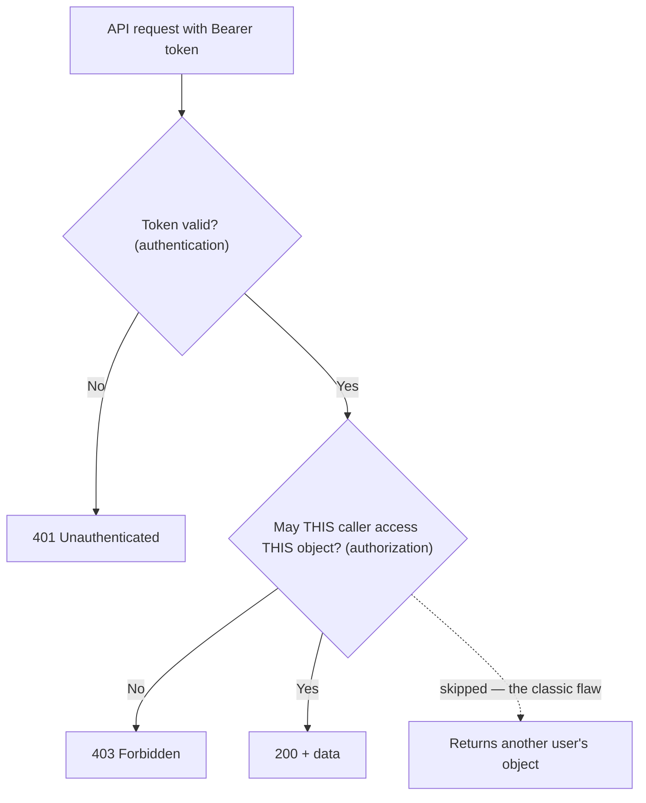

# 🔗 REST & Modern API Transport

> [!abstract] Note of [[Web & Application Protocols]]
> APIs are how programs talk over HTTP, and the transport style shapes what a client can request, how errors surface, and where authorization must live. This note covers REST as the dominant style and the two major alternatives, focusing on the transport and networking concerns — the vulnerability catalogue for each belongs to the API-security material in the offensive and appsec domains.

## Parent Learning Order
HTTP Fundamentals -> HTTPS & the TLS Handshake -> Web Architecture & Proxies -> WebSockets & Real-Time Protocols -> REST & Modern API Transport -> Application Delivery & Load Balancing

## Start at Zero: An API Is a Contract Between Programs

A web page is for humans; an **API (Application Programming Interface)** is for programs. Instead of returning HTML to render, an API returns structured data — usually JSON — that another program parses and acts on. The transport is still HTTP, so everything from the HTTP branch applies; what differs is that the consumer is code, which changes the design pressures.

**REST (Representational State Transfer)** is the dominant style, and it is a set of conventions layered on HTTP rather than a separate protocol. Its core idea is to model everything as a **resource** identified by a URL, and to use HTTP methods as the verbs acting on those resources.

```text
GET    /api/orders          -> list orders
POST   /api/orders          -> create an order
GET    /api/orders/42       -> retrieve order 42
PUT    /api/orders/42       -> replace order 42
PATCH  /api/orders/42       -> modify order 42
DELETE /api/orders/42       -> delete order 42
```

This is why the HTTP method semantics from earlier matter concretely: in REST, GET must be safe and idempotent, DELETE must be idempotent, and the whole design relies on those promises so that caches and clients can reason about requests. A REST API that deletes on GET breaks the model at a fundamental level.

REST leans on HTTP's own machinery rather than reinventing it:

- **Status codes** carry outcome: 200 success, 201 created, 400 bad input, 401 unauthenticated, 403 unauthorized, 404 not found, 429 rate-limited.
- **Content negotiation** via the `Accept` header lets a client request a format and the server respond with `Content-Type` describing what it sent.
- **Statelessness** is preserved: each request carries everything needed to process it, typically including an authentication token, because the server remembers nothing between requests.

```bash
curl -s https://api.example.com/orders/42 \
  -H 'Authorization: Bearer eyJhbGci...' \
  -H 'Accept: application/json'
```

Expected excerpt:

```text
HTTP/2 200
content-type: application/json

{"id":42,"status":"shipped","total":51.25}
```

The `Authorization: Bearer` header carries the token that identifies the caller. Because the API is stateless, that token accompanies **every** request — there is no session the way a cookie-based web app has one. This is the central transport difference and it drives the security model.



The diagram isolates the single most damaging API mistake: performing the authentication check (is the token valid?) but skipping the per-object authorization check (does this caller own this object?). The dashed path is broken object-level authorization, and it is where most real API breaches occur.

## The Alternatives and Why They Exist

REST is not the only style, and each alternative arose to fix a specific REST limitation.

**GraphQL** addresses over- and under-fetching. In REST, an endpoint returns a fixed shape, so a client often gets more than it needs (over-fetching) or must make several requests to assemble what it needs (under-fetching). GraphQL exposes a single endpoint where the client sends a **query describing exactly the fields it wants**, and the server returns precisely that. The transport consequence is distinctive: it is typically one URL, usually POST, so REST-style controls that key on method and path — per-endpoint rate limits, path-based WAF rules, method restrictions — largely do not apply. Security must understand the query, not the URL.

**gRPC** optimizes service-to-service communication. It uses HTTP/2 as transport and a compact binary serialization (Protocol Buffers) instead of JSON, with a defined schema. It is fast and strongly typed, ideal between backend microservices, but the binary framing means ordinary HTTP tooling cannot read it without the schema, and it depends on HTTP/2 features that not all intermediaries handle.

| Style | Transport | Shape | Best for |
| --- | --- | --- | --- |
| **REST** | HTTP, any version | JSON, resource per URL | Public APIs, broad compatibility |
| **GraphQL** | HTTP, one endpoint, usually POST | Client-specified query | Rich clients avoiding over/under-fetch |
| **gRPC** | HTTP/2, binary | Schema-defined messages | Internal service-to-service |

The networking takeaway is that **the transport style determines where and how controls apply.** A rate limit that works per-REST-endpoint does not translate to GraphQL's single endpoint; an inspection tool that reads JSON cannot read gRPC without the schema. Choosing a style is partly choosing a security posture.

## Versioning and Evolution

APIs have consumers who cannot be updated in lockstep, so they must evolve without breaking existing clients. Versioning appears in the path (`/v2/orders`), a header, or a media type. The networking-relevant point is that **multiple versions run simultaneously**, and an old version left running is an old attack surface — deprecated API versions with weaker validation or authentication are a recurring finding. Retiring versions is a security activity, not just maintenance.

## Security Implications

**Authorization must be enforced per request, on the server, for every object.** Because APIs are stateless and each request carries a token, the server must verify on **every** request both that the token is valid (authentication) and that this caller may access *this specific resource* (authorization). The most common and damaging API flaw is checking authentication but not object-level authorization — accepting a valid token and then returning object 42 without confirming the caller owns object 42. The transport delivers the token; the application must still ask "may *this* caller see *this* thing," every time. No network control substitutes for that check.

**The token is a bearer credential and must be protected in transit and at rest.** A `Bearer` token grants access to whoever holds it — there is no further proof of identity. Intercept it and you are the user. This makes TLS non-negotiable for APIs and makes token leakage (in logs, in URLs, in referrer headers) directly equivalent to account compromise. Tokens belong in the `Authorization` header, never in the URL where they land in logs and history.

**Rate limiting is essential and style-dependent.** Because APIs are consumed by programs, they are trivially hammered — for credential stuffing, scraping, or denial of service. Rate limiting per client and per operation is a core control, and it must be designed for the transport style: per-endpoint for REST, per-query-cost for GraphQL (where one crafted query can demand enormous work), per-method for gRPC.

**Error responses leak, and verbose APIs leak more.** APIs returning detailed errors, internal identifiers, or full object graphs hand attackers a map. Responses should return only what the caller needs and errors should be informative to a legitimate developer without revealing internal structure.

**Schema and discovery are double-edged.** GraphQL introspection and gRPC schemas make APIs self-documenting, which helps legitimate developers and attackers equally. Disabling introspection in production and controlling schema exposure limits the reconnaissance an attacker gets for free.

All API testing described here must target only systems within an authorized scope. Enumerating objects, testing authorization, and rate-limit probing are intrusive and require explicit authorization.

## Authorized Lab: Exercise the Transport Styles

Use a lab exposing a REST API, and if available a GraphQL endpoint, with token authentication under your control.

1. **Map REST to methods.** Exercise GET, POST, PUT, and DELETE against a resource and confirm each behaves per its HTTP semantics; confirm a GET does not change state and a repeated PUT is idempotent.
2. **Observe stateless auth.** Make a request without a token (expect 401), then with a valid token (expect 200). Confirm the token is required on every request, with no session persisting between them.
3. **Test object-level authorization.** Authenticate as one user and request another user's object by ID. If the API returns it, you have found the classic broken-object-authorization condition; confirm a correct implementation returns 403 or 404. Articulate that the token was valid — the missing check was ownership.
4. **Contrast GraphQL controls.** If available, send two very different GraphQL queries to the single endpoint and confirm that path- and method-based controls cannot distinguish them, so control must inspect the query itself. Send a deliberately expensive nested query and observe the disproportionate server work, motivating query-cost limiting.
5. **Test rate limiting.** Send rapid repeated requests and confirm the API returns 429 once a limit is reached; confirm the limit is scoped sensibly per client.
6. **Check token handling.** Confirm the token is accepted in the `Authorization` header and, critically, that placing it in the URL causes it to appear in server logs — demonstrating why it must not go there.
7. **Cleanup.** Remove test objects and restore any rate-limit or auth configuration changed during the lab.

Expected interpretation:

```text
Methods         -> REST relies on HTTP method semantics; GET stays safe, PUT idempotent
Stateless auth  -> token required every request; no server-side session
Cross-object    -> valid token, missing ownership check = broken object authorization
GraphQL         -> one endpoint defeats path/method controls; inspect the query and its cost
429             -> rate limiting scoped per client is a core API control
Token in URL    -> leaks into logs; belongs only in the Authorization header
```

## Crook → Operator → Root Checkpoint

- **Crook:** Explain what an API is and how REST models resources with URLs and HTTP methods; state why REST relies on the safe/idempotent method contract.
- **Operator:** Make authenticated REST requests and read status-code outcomes; explain why the token accompanies every request and why REST-style controls do not translate directly to GraphQL's single endpoint.
- **Root:** Explain why per-request, per-object authorization is the API's essential control and why no network layer substitutes for it; describe how transport style dictates where rate limiting and inspection apply, and why deprecated versions and verbose errors are transport-level attack surface.

---
> 🔼 Up: [[Web & Application Protocols]]
