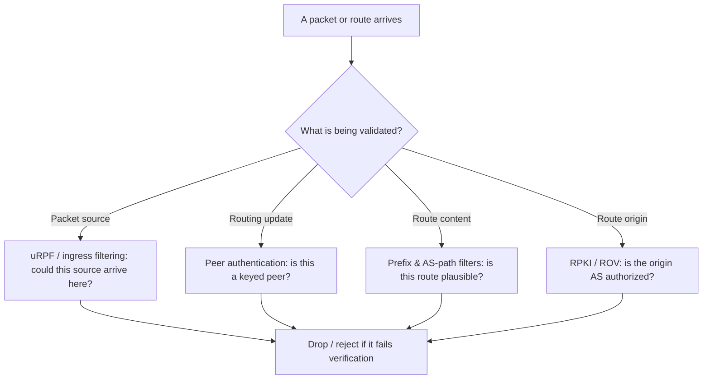

# 🔒 Routing Security & Path Validation

> [!abstract] Note of [[Routing & the Network Layer]]
> Every attack in this branch redirects traffic without breaking it, and every defense rests on the same idea: do not trust a route, a source address, or a path without verification. This note assembles the routing-layer controls into a coherent posture, from filtering forged sources at the edge to validating route origin, and explains why "it still works" is the wrong test for routing integrity.

## Parent Learning Order
IP Forwarding & the Routing Table -> Static Routing & Default Gateways -> Interior Gateway Protocols -> BGP & Internet Routing -> First-Hop Redundancy & Gateway Failover -> Routing Security & Path Validation

## Start at Zero: The Shared Weakness

The network layer was designed to move packets, not to prove anything about them. Two assumptions baked into IP are the root of routing insecurity:

1. **A packet's source address is whatever the sender wrote.** Nothing in IP verifies it.
2. **A routing advertisement is believed because it was received.** The protocols trust their peers.

Everything in this note follows from attacking or defending those two assumptions. The controls fall into two groups: **validating where a packet came from** (source and path validation) and **validating what a route claims** (origin and update authentication). A mature routing posture applies both, because they cover different attacks.

The unifying diagnostic insight: **a compromised route usually preserves connectivity.** Traffic reaches its destination, so uptime monitoring stays green. The evidence of compromise is in the *path* and the *origin*, not in reachability. Any detection strategy that only asks "can I reach it?" is blind to the entire class.

## Source Validation: Ingress Filtering

**IP source address spoofing** is the foundation of reflection and amplification denial-of-service attacks and of hiding an attacker's origin. Because the source address is unverified, a host can send packets claiming to be from anywhere. In an amplification attack, the attacker spoofs the *victim's* address as the source of requests to servers that reply with much larger responses, drowning the victim in traffic it never asked for.

**Ingress filtering** (the practice codified as BCP 38) directly attacks spoofing: a network drops packets whose source address could not legitimately have originated from the direction they arrived. A packet arriving on a customer link with a source address that does not belong to that customer is discarded at the edge, before it can be used to spoof.

The router-level mechanism is **uRPF (unicast Reverse Path Forwarding)**. For each arriving packet, the router checks its own routing table: *if I had to send a reply to this source address, would I send it back out the interface this packet arrived on?* If not, the source is implausible and the packet is dropped.

```text
Strict uRPF:  the reverse route must point back out the exact arrival interface
Loose uRPF:   the source must merely exist somewhere in the routing table
```

Strict mode is stronger but breaks under asymmetric routing, where the return path legitimately differs from the arrival path; loose mode tolerates asymmetry at the cost of catching fewer spoofs. The choice depends on whether the network's routing is symmetric, which is why deployment requires understanding the traffic, not just enabling a feature.

```bash
# conceptual: strict reverse-path filtering on a Linux router
sysctl net.ipv4.conf.eth1.rp_filter
```

Expected output:

```text
net.ipv4.conf.eth1.rp_filter = 1
```

A value of 1 enables strict reverse-path filtering on that interface; 2 is loose mode; 0 is off. On an edge interface facing untrusted networks, this drops packets with implausible source addresses automatically.

Ingress filtering is one of the few controls where deploying it protects *others* more than yourself — it stops *your* network from being used to attack someone else. This is precisely why it is under-deployed and why coordinated efforts exist to encourage it: the benefit is collective.

## Route and Update Validation

The second group verifies routing information rather than packets.

**Authenticate routing updates.** Interior protocols support cryptographic authentication so a router accepts updates only from peers sharing a key, defeating update injection from an unauthenticated device. This was covered for IGPs and FHRPs; the principle is uniform — a routing peer must prove it is a legitimate peer.

**Filter what you accept and announce.** Prefix filters and AS-path filters limit which routes a router will believe from a neighbour and which it will pass on. This is the practical backbone of inter-domain routing security: even without cryptographic path validation, disciplined filtering blocks most leaks and hijacks, because a network that only accepts the prefixes a neighbour is known to own rejects a claim to unrelated space.

**Validate route origin.** RPKI and Route Origin Validation let a network reject announcements whose origin AS is not the authorized one, addressing the origin half of hijacking. Its limitation — it does not validate the full path — is the reason filtering remains necessary alongside it, and the reason path validation is an active frontier.

**Prefer static on critical, trusted paths.** Where a path is few and stable, a static route participates in no protocol and cannot be poisoned by a forged update. Determinism is itself a control for a small number of high-value paths, accepting the loss of automatic failover in exchange for zero protocol attack surface.



## Detection: Watch the Path, Not the Reachability

Because routing attacks preserve connectivity, detection must observe path and origin.

- **Route monitoring** compares live announcements of your prefixes against expected origin and paths, alarming when your address space is originated by an unexpected AS or when the path to a critical destination changes abruptly.
- **Traffic-path telemetry** — traceroute baselines, flow records, latency shifts — reveals when traffic that should take one path suddenly takes another, even when it still arrives.
- **Control-plane logging** captures adjacency changes, mastership changes, and route-table churn; an unexpected new neighbour or a flood of updates is a control-plane event worth investigating.

The mindset shift is the deliverable: replace "is the destination up?" with "is the destination reached the way it should be, from the origin it should be, over the path it should be?" A green uptime dashboard is consistent with an active interception.

## Security Implications

**Defense in depth is mandatory because each control has a gap.** Ingress filtering stops spoofing but not route injection; authentication stops injection but not a compromised legitimate peer; origin validation stops the common hijack but not a forged path; filtering catches implausible routes but depends on accurate intent data. No single control is sufficient, and the attacker's job is to find the layer you skipped.

**The encryption backstop is the constant.** Across this entire branch — ARP, STP, FHRP, IGP, BGP — the recurring conclusion is that transport-layer encryption survives an on-path adversary. Routing security reduces the *likelihood* and *scope* of interception; end-to-end encryption removes the *payoff*. A defender needs both: routing integrity so traffic is not silently redirected and denied, and encryption so that redirection which does occur yields metadata rather than content.

**Availability is a shared responsibility.** Ingress filtering protects others; a network that skips it contributes to global attack capacity. Origin validation and route hygiene similarly protect the commons. Routing security has an unusual property among controls: a meaningful fraction of its benefit accrues to parties other than the deployer, which is exactly why coordinated frameworks exist to raise the collective baseline.

All configuration and testing described here must be performed only on isolated infrastructure you own or are explicitly authorized to modify. Filtering and validation changes on production routers affect every flow they carry, and a misapplied strict-mode filter can silently drop legitimate asymmetric traffic.

## Authorized Lab: Spoof, Filter, and Detect

Use a lab with at least two routers, an "internal" host, and an "external" segment. Record baseline configuration and a baseline traceroute for a known path.

1. **Demonstrate spoofing.** From the external segment, send packets with a forged source address belonging to the internal network. Confirm they are accepted and forwarded, showing the default lack of source validation.
2. **Enable strict uRPF** on the external-facing interface. Repeat the spoofed packets and confirm they are now dropped because the reverse route does not point back out that interface. Verify with the interface's drop counters.
3. **Show the asymmetric-routing pitfall.** Introduce a legitimate asymmetric path and confirm strict uRPF now drops some *legitimate* traffic; switch to loose mode and confirm the legitimate traffic passes while obvious spoofs are still caught. This demonstrates why mode choice requires knowing the traffic.
4. **Inject a route** (from the IGP lab) and confirm traffic is redirected while end-to-end connectivity is preserved — reinforcing that reachability is not integrity.
5. **Detect it by path, not reachability.** Compare a fresh traceroute against the baseline and confirm the path changed even though the destination is still reachable. This is the detection signal a reachability check would miss.
6. **Apply route authentication** and confirm the injection is rejected, then confirm the traceroute returns to the baseline path.
7. **Cleanup.** Remove filters, injected routes, and authentication changes as needed to restore the baseline, and confirm both connectivity and the baseline path.

Expected interpretation:

```text
No source validation -> forged-source packets accepted and forwarded
Strict uRPF          -> spoofs dropped; but legitimate asymmetric traffic also dropped
Loose uRPF           -> asymmetry tolerated; obvious spoofs still caught
Route injected       -> traffic redirected yet still reachable (integrity != reachability)
Path comparison      -> the changed traceroute is the detection signal, not an outage
Authentication       -> injection rejected; path returns to baseline
```

## Crook → Operator → Root Checkpoint

- **Crook:** State the two IP assumptions that make routing insecure, and explain why "the destination is reachable" does not prove the route is trustworthy.
- **Operator:** Configure and reason about ingress filtering with strict versus loose reverse-path checking, and detect a redirected path by comparing traceroute and telemetry against a baseline rather than testing reachability.
- **Root:** Assemble the routing-security controls into a defense-in-depth posture, explaining the gap each one leaves and why encryption is the invariant backstop; justify why ingress filtering and origin validation protect the commons, and why that shared-benefit structure explains their under-deployment.

---
> 🔼 Up: [[Routing & the Network Layer]]
