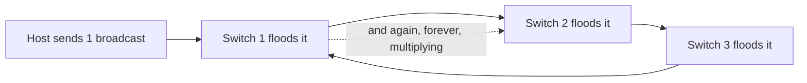

# 🌲 Spanning Tree & Loop Prevention

> [!abstract] Note of [[Switching & the Link Layer]]
> A single physical loop in a switched network does not slow it down — it melts it, in seconds, because Layer 2 has no equivalent of the TTL that saves Layer 3. This note explains why loops are catastrophic, how Spanning Tree prevents them by disabling links, and why the protocol that saves the network is itself an attack surface.

## Parent Learning Order
Ethernet & Frame Structure -> MAC Addressing & Switch Operation -> ARP & Neighbor Discovery -> VLANs & Trunking -> Spanning Tree & Loop Prevention -> Link Layer Security Controls

## Start at Zero: Why a Loop Is Fatal at Layer 2

Redundant links are good engineering — two paths between switches survive a cable failure. But redundancy at Layer 2 creates a **loop**, and a loop is catastrophic, because the Ethernet frame has no field that limits how long it may circulate.

Recall from Layer 3 that an IP packet carries a **TTL** that every router decrements, so a routing loop eventually discards the packet. The Ethernet frame has **no such field**. A frame that enters a loop circulates forever.

Now recall the switch's forwarding rule: a broadcast frame is flooded out every port. Follow one broadcast into a loop:



Switch 1 floods the broadcast to Switch 2, which floods it to Switch 3, which floods it back to Switch 1, which floods it again — and every switch is doing this simultaneously for every broadcast. The frame count doubles at each pass. Within seconds the links are saturated, switch CPUs are pinned, and the network is unusable. This is a **broadcast storm**, and it is the single most destructive Layer 2 failure.

There is a second symptom: **MAC table instability**. As the same frame's source address arrives on different ports around the loop, each switch repeatedly relearns that address on a different port, corrupting its forwarding table and misdirecting even unicast traffic.

## Spanning Tree: Break the Loop Deliberately

**STP (Spanning Tree Protocol)** solves this by computing a loop-free logical topology over a physically looped network, then **disabling** the links that would create loops — holding them in reserve to activate if an active link fails.

The algorithm elects and calculates:

1. **Root bridge** — one switch is elected the reference point, chosen by the lowest **bridge ID** (a configurable priority plus its MAC address). All path calculations are relative to it.
2. **Root ports** — each non-root switch selects its single lowest-cost port toward the root.
3. **Designated ports** — one port per segment is chosen to forward.
4. **Blocked ports** — every remaining redundant port is put into a blocking state, logically cut to break the loop while remaining physically connected.

Switches exchange **BPDUs (Bridge Protocol Data Units)** to run this election and to detect topology changes. If an active link fails, the BPDUs stop arriving on that path, and a blocked port is transitioned back to forwarding to restore connectivity.

```bash
sudo mstpctl showbridge br0 2>/dev/null || brctl showstp br0
```

Expected excerpt:

```text
br0
 bridge id              8000.000c294a9b31
 designated root        8000.000c290011aa
 root port                 2                path cost           4
 ...
 eth1 (1)  state forwarding
 eth2 (2)  state forwarding
 eth3 (3)  state blocking
```

`eth3` in `blocking` is Spanning Tree doing its job: that port is physically connected but logically disabled to break a loop. If `eth1` failed, `eth3` would transition through listening and learning to forwarding, restoring the redundant path.

**RSTP (Rapid Spanning Tree)** is the modern version, converging in seconds rather than the original's ~30–50 seconds, and is what virtually all current equipment runs. The concepts are identical; only the convergence speed and port-state names differ.

## The Convergence Cost

STP trades capacity and speed for safety. Two consequences matter operationally.

First, blocked links carry no traffic. Half your redundant bandwidth may sit idle waiting for a failure. Technologies like link aggregation and multi-chassis designs exist partly to use those links, but plain STP leaves them dark.

First-time forwarding is also **delayed**. When a device connects to a port, classic STP holds the port in listening and learning states before forwarding, to be sure it is not creating a loop. That delay — tens of seconds on classic STP — breaks things that expect instant connectivity, such as a host trying to obtain a DHCP lease the moment its link comes up. The fix for edge ports is **PortFast** (or RSTP edge ports), which skip the delay for ports known to face endpoints rather than switches. And PortFast is precisely where the security problem enters, because a port that forwards immediately is also a port that trusts quickly.

## Security Implications

Spanning Tree assumes every device speaking BPDUs is a trustworthy switch. It has no authentication, so an attacker who sends BPDUs can manipulate the topology.

**Root bridge takeover.** The root is elected by lowest bridge ID. An attacker sends BPDUs advertising a bridge ID lower than any legitimate switch, wins the election, and becomes the root. Because all paths are recalculated toward the root, traffic between switches is redirected to flow through the attacker's device — a network-wide on-path position achieved without touching a single host. It also destabilizes the network during the reconvergence.

**BPDU flooding.** An attacker floods malformed or rapidly changing BPDUs, forcing constant recalculation. The network never stabilizes, producing a denial of service.

The controls are targeted at the edge, where untrusted devices connect:

- **BPDU Guard** disables any access port that receives a BPDU at all. An endpoint port should never see a BPDU, so receiving one means either a misplaced switch or an attack — and the port shuts down immediately. This single control defeats both root takeover and BPDU flooding from an access port.
- **Root Guard** prevents a port from accepting superior BPDUs that would make a neighbour the root, protecting the intended root placement on infrastructure links.
- **BPDU Guard is paired with PortFast**: the same edge ports that skip the forwarding delay are the ones that must never accept a BPDU. The two features are deployed together as standard edge hardening.

A network without BPDU Guard on its access ports is one crafted BPDU away from either an outage or an interception, and the attack requires only a device that can speak Spanning Tree — which any laptop can.

All BPDU injection and topology manipulation described here must be confined to an isolated lab you own. Sending BPDUs on a production network can trigger a network-wide reconvergence or outage affecting every connected system.

## Authorized Lab: Cause a Storm Safely, Then Prevent It

Use three lab switches (virtualized is ideal, since a real storm is destructive) and a traffic-generating host. Snapshot the lab so a storm is trivially recoverable.

1. **Baseline with STP on.** Cable the three switches in a triangle (a physical loop). With Spanning Tree enabled, confirm one port is in `blocking` and the network is stable. Send a broadcast and confirm it does not multiply.
2. Inspect the tree and identify the root bridge and the blocked port with the `showstp` command above.
3. **Demonstrate the danger.** Disable Spanning Tree on all three switches. Send a single broadcast frame and immediately watch interface counters:

```bash
watch -n1 'ip -s link show eth1 | sed -n "3,4p"'
```

The packet counters climb explosively as the broadcast multiplies around the loop. Re-enable STP (or restore the snapshot) the moment the effect is clear — do not let it run.
4. **Root takeover.** With STP restored, from the host send BPDUs advertising a superior (lower) bridge ID. Observe the root bridge change to the attacker and paths recalculate.
5. **Apply the control.** Enable BPDU Guard on the access port facing the host. Repeat the BPDU injection and confirm the port is disabled immediately upon receiving a BPDU, with a log entry recording the event.
6. Re-enable the port, restore the baseline configuration, and confirm one port is blocking, the intended switch is root, and the network is stable.

Expected interpretation:

```text
STP on, loop present -> one port blocks; broadcasts do not multiply
STP off, loop present -> single broadcast multiplies into a storm within seconds
Superior BPDU        -> attacker becomes root; inter-switch traffic redirected
BPDU Guard           -> access port shuts down on any BPDU; attack neutralized at the edge
```

## Crook → Operator → Root Checkpoint

- **Crook:** Explain why a Layer 2 loop is catastrophic while a Layer 3 loop is merely wasteful, and what a broadcast storm is.
- **Operator:** Read Spanning Tree state to identify the root bridge and blocked ports, explain what a blocked port is doing, and describe why PortFast exists and what it risks.
- **Root:** Explain how an attacker takes over the root bridge with a superior BPDU and what that achieves; justify why BPDU Guard on access ports defeats both root takeover and BPDU flooding, and why it is deployed together with PortFast.

---
> 🔼 Up: [[Switching & the Link Layer]]
