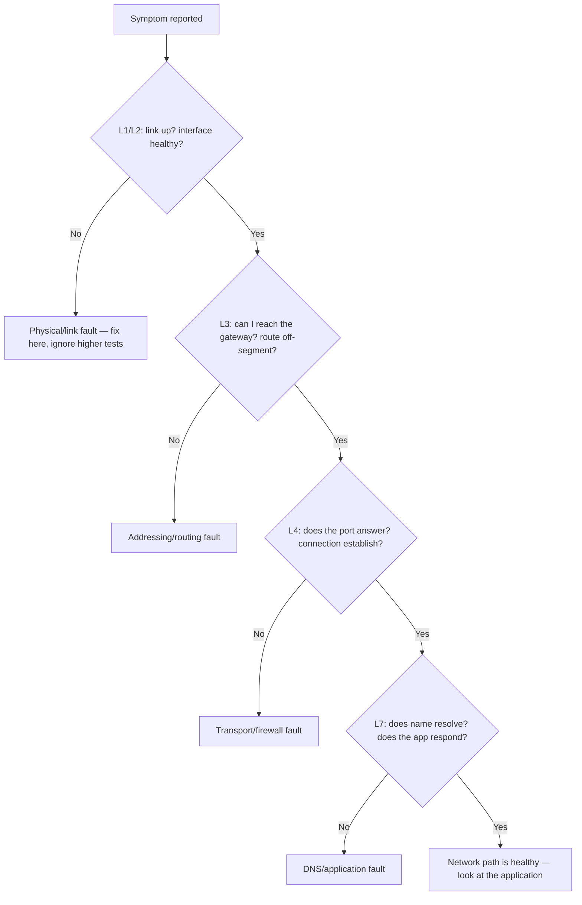

# 🧩 Structured Network Troubleshooting

> [!abstract] Note of [[Network Analysis & Troubleshooting]]
> Most network problems are solved slowly by guessing and quickly by method. This note turns the OSI model into a diagnostic procedure — isolate the fault to a layer, prove the cause with evidence, and avoid the traps that make smart people waste hours: assuming instead of testing, and changing several things at once.

## Parent Learning Order
Packet Capture & Analysis -> Structured Network Troubleshooting -> Traffic Analysis & Flow Inspection -> Performance & Latency Analysis -> Connectivity Diagnostics -> Protocol Debugging & Deep Inspection

## Start at Zero: Method Beats Intuition

A user reports "the website is down." An unstructured responder starts guessing — restart the browser, reboot the router, blame the ISP — and may stumble onto the answer or waste an hour. A structured responder isolates the fault to a layer, tests one thing at a time, and reaches the cause by elimination. The difference is not intelligence; it is method.

The core technique is **layer-by-layer isolation**, built directly on the OSI model. Because each layer depends on the ones below it, a failure low in the stack makes every test above it meaningless. So you resolve the layers in order and stop when you find the break.



Two directions exist, and both are valid:

- **Bottom-up** — start at Layer 1 and work up. Best when you suspect a low-level problem (a link is down, a cable is bad) or have no information.
- **Top-down** — start at the application and work down. Best when higher layers are the likely culprit (the network works for everything else, only this app fails).

A third, **divide-and-conquer**, jumps to the middle (Layer 3 — can you ping the gateway and beyond?) and then goes up or down based on the result, halving the search space. Experienced troubleshooters use this most, because Layer 3 connectivity is a fast, informative pivot.

## The Procedure in Practice

```bash
ip link show eth0                       # L1/L2: is the link up? carrier present?
ip addr show eth0                       # L3: do I have a valid address and mask?
ping -c 2 <gateway>                     # L3: is the local gateway reachable?
ping -c 2 1.1.1.1                       # L3: does off-segment routing work?
getent hosts example.com                # L7: does name resolution work?
nc -vz example.com 443                  # L4: does the destination port answer?
curl -sS -o /dev/null -w '%{http_code}\n' https://example.com   # L4-L7 end to end
```

Each command answers exactly one question, and the order matters because a failure early invalidates everything after it. The skill is reading each result as evidence for or against a specific layer:

```text
Link down                    -> L1/L2; stop, nothing above matters
Link up, no address          -> L3; DHCP or configuration
Gateway pings, 1.1.1.1 doesn't -> L3 routing off-segment
Everything pings, name fails  -> L7 DNS
IP works, name fails          -> L7 DNS (the classic)
Port doesn't answer           -> L4; service down or firewall
Everything works but the app fails -> above the network; hand off to the app team
```

That last line is as important as any: **structured troubleshooting also proves when the network is *not* the problem.** Demonstrating that connectivity, routing, resolution, and the port are all healthy localizes the fault to the application, ending the reflexive "it must be the network" and directing effort where it belongs.

## The Traps That Waste Hours

Method is undermined by a few specific habits, and naming them is half the cure.

**Assuming instead of testing.** "The gateway is fine" — is it? "DNS works" — does it? Every assumption not backed by a test is a place the diagnosis can silently go wrong. The discipline is to *verify* each layer, not assume it, because the failure is almost always in the layer someone assumed was fine.

**Changing multiple things at once.** Under pressure, a responder changes the DNS server, restarts the service, and adjusts the firewall together — and if it starts working, they do not know which change fixed it, cannot document it, and may have introduced a new problem masked by the fix. **Change one variable at a time and test after each.** It feels slower and is faster, because it produces knowledge instead of a mystery.

**Not checking what changed.** Most problems in a previously working system were caused by a change — a config edit, an update, a new rule. "What changed recently?" is often the fastest route to the answer, and a system that keeps change records turns hours of diagnosis into minutes.

**Ignoring the obvious.** Is it plugged in? Is the service running? Is the disk full? The humble checks are skipped precisely because they are humble, and they are the answer more often than pride allows.

**Confirming, not just fixing.** A change that coincides with recovery is not proven to be the cause. Confirm by verifying the mechanism — the metric improved, the log shows the expected result — and ideally by understanding *why* it fixed the problem. A fix you cannot explain may be a coincidence that will recur.

## Security Implications

**Troubleshooting and incident response are the same discipline.** Isolating a fault to a layer, gathering evidence, testing hypotheses one at a time, and confirming the cause is exactly the method of investigating a security incident. The structured troubleshooter and the incident responder use the same skills, and strength in one transfers directly to the other.

**Evidence-based conclusions resist manipulation.** A responder who tests rather than assumes is harder to mislead — by a confusing symptom, by a red herring, or by an attacker deliberately creating misdirection. Concluding from evidence, and stating the evidence behind each conclusion, is what makes a diagnosis defensible, which matters when the "fault" is an adversary.

**Distinguishing a security event from a fault requires method.** Many incidents first present as performance or connectivity problems — a link "slow" because of exfiltration, a service "down" because of a denial-of-service attack, resolution "broken" because of DNS manipulation. Structured troubleshooting that reaches a clear cause is what separates a mundane fault from a security event, and jumping to either conclusion without method risks missing an attack or crying wolf.

**Documentation is a security control.** The change records and troubleshooting notes that speed diagnosis are the same records that let an investigation reconstruct what happened and when. A well-documented environment is both easier to fix and easier to investigate.

**Knowing the network is *not* the problem prevents wasted response.** Just as troubleshooting can exonerate the network, it can scope an incident — proving which layers and systems are and are not involved, so response focuses correctly rather than boiling the ocean.

This note's methods are non-intrusive diagnostics on systems you administer. Where troubleshooting extends into examining others' systems, the authorization rules of the relevant environment apply.

## Authorized Lab: Diagnose by Elimination

Use a lab where you can inject faults at different layers (the fault-isolation setup from the OSI leaf works well), with a client and a target service.

1. **Baseline.** Run the full layered procedure and record healthy output at every layer, so you know what normal looks like.
2. **Inject a Layer 3 fault.** Remove the default route on the client. Run the procedure top-down and bottom-up, and confirm both isolate the fault to routing — the gateway is reachable, off-segment is not. Restore it.
3. **Inject a Layer 7 fault.** Break DNS resolution. Confirm the procedure reaches "IP works, name fails" and localizes to resolution, not connectivity. Restore it.
4. **Inject a Layer 4 fault.** Firewall-block the service port. Confirm the procedure shows connectivity and resolution healthy but the port not answering, localizing to transport/policy. Restore it.
5. **Prove the network is innocent.** Break the application itself while leaving the network healthy. Confirm the procedure shows every network layer working, correctly directing the fault to the application.
6. **Practice divide-and-conquer.** For one fault, start at Layer 3 and navigate up or down from the result, and compare how many steps it took versus a pure bottom-up walk.
7. **Practice the discipline.** For one injected fault, deliberately change only one variable at a time, testing after each, and document which change resolved it and why.

Expected interpretation:

```text
L3 fault  -> gateway reachable, off-segment not; isolated to routing
L7 fault  -> IP works, name fails; isolated to DNS
L4 fault  -> connectivity and DNS fine, port silent; isolated to transport/firewall
App fault -> every network layer healthy; the network is exonerated
Divide-and-conquer -> Layer 3 pivot reaches the answer in fewer steps
One-variable change -> the fix is known and explainable, not a mystery
```

## Crook → Operator → Root Checkpoint

- **Crook:** Explain why method beats guessing, and describe layer-by-layer isolation and why a low-layer failure invalidates higher tests.
- **Operator:** Run a layered diagnostic procedure, read each result as evidence for a specific layer, and use divide-and-conquer to reach a cause efficiently; prove when the network is not the problem.
- **Root:** Explain why troubleshooting and incident response are the same discipline; articulate the traps (assuming, changing multiple variables, ignoring change and the obvious, confirming coincidences) and why evidence-based, one-variable-at-a-time diagnosis is what makes a conclusion defensible against both confusion and an adversary.

---
> 🔼 Up: [[Network Analysis & Troubleshooting]]
