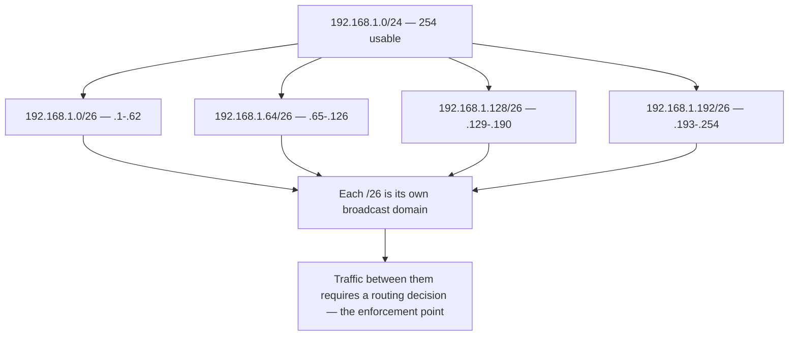

# ✂️ Subnetting & CIDR

> [!abstract] Note of [[Addressing & Subnetting]]
> Subnetting is binary arithmetic dressed up as a networking topic. This note teaches the mechanism rather than a lookup table, so that any prefix length can be computed from first principles in a few seconds, and then shows why the resulting boundaries are the primary containment control in a network.

## Parent Learning Order
IPv4 Addressing -> Subnetting & CIDR -> VLSM & Route Summarization -> IPv6 Addressing -> Address Assignment & DHCP -> NAT & Address Translation

## Start at Zero: The Mask Is a Boundary Marker

A **subnet mask** is 32 bits in which every network bit is 1 and every host bit is 0, and the ones are always contiguous and leading. `255.255.255.0` in binary is twenty-four 1s followed by eight 0s — which is why it is written `/24` in **CIDR (Classless Inter-Domain Routing)** notation. The number after the slash is simply the count of network bits.

```text
Address  192.168.10.24   11000000.10101000.00001010.00011000
Mask     255.255.255.0   11111111.11111111.11111111.00000000
                         └────── network ─────────┘└─ host ─┘
```

Two operations follow mechanically:

- **Network address**: keep the network bits, set every host bit to 0 → `192.168.10.0`
- **Broadcast address**: keep the network bits, set every host bit to 1 → `192.168.10.255`

Everything between those two, exclusive, is usable. Hence the formula:

```text
Total addresses = 2^(host bits)
Usable hosts    = 2^(host bits) - 2
```

The subtraction of two removes the network address (all host bits zero, which names the subnet itself) and the broadcast address (all host bits one, which addresses every host on it). Neither can be assigned to an interface.

> [!warning] The exception that trips people
> A `/31` has 2 addresses and would compute to 0 usable hosts. RFC 3021 permits `/31` on point-to-point links precisely because a link with exactly two endpoints needs no broadcast address. A `/32` is a single host route. Both are common in real configurations, so a formula applied without understanding produces nonsense on exactly the links you will meet most often in routing tables.

## The Reference Table You Should Be Able to Derive

| CIDR | Mask | Total | Usable | Typical use |
| --- | --- | --- | --- | --- |
| `/16` | `255.255.0.0` | 65,536 | 65,534 | Oversized; a segmentation failure in most designs |
| `/22` | `255.255.252.0` | 1,024 | 1,022 | Large campus VLAN |
| `/24` | `255.255.255.0` | 256 | 254 | Standard segment |
| `/25` | `255.255.255.128` | 128 | 126 | Split a /24 in half |
| `/26` | `255.255.255.192` | 64 | 62 | Departmental segment |
| `/27` | `255.255.255.224` | 32 | 30 | Small server group |
| `/28` | `255.255.255.240` | 16 | 14 | Appliance or DMZ block |
| `/30` | `255.255.255.252` | 4 | 2 | Classic point-to-point link |
| `/31` | `255.255.255.254` | 2 | 2 | Modern point-to-point (RFC 3021) |
| `/32` | `255.255.255.255` | 1 | 1 | Single host route |

Do not memorize this. Derive it: host bits are `32 - prefix`, total is `2^host bits`, and the mask's final non-zero octet is `256 - block size`.

## The Magic Number Method

The fastest manual technique works entirely in the octet where the mask changes from 1s to 0s — the **interesting octet**.

**Block size = 256 − (mask value in the interesting octet)**

Subnets then start at multiples of the block size within that octet.

### Worked example: split `192.168.1.0/24` into `/26` blocks

1. Prefix `/26` → mask `255.255.255.192`. The interesting octet is the fourth, value 192.
2. Block size = 256 − 192 = **64**.
3. Subnets start at multiples of 64: 0, 64, 128, 192.

| Subnet | Network | Usable range | Broadcast |
| --- | --- | --- | --- |
| 1 | `192.168.1.0/26` | `.1` – `.62` | `.63` |
| 2 | `192.168.1.64/26` | `.65` – `.126` | `.127` |
| 3 | `192.168.1.128/26` | `.129` – `.190` | `.191` |
| 4 | `192.168.1.192/26` | `.193` – `.254` | `.255` |

### Worked example: which subnet contains `10.14.203.77/20`?

1. `/20` → mask `255.255.240.0`. Interesting octet is the **third**, value 240.
2. Block size = 256 − 240 = **16**.
3. Third-octet boundaries: 0, 16, 32, … 192, **208**. Since 203 falls between 192 and 208, the network starts at 192.
4. Network `10.14.192.0`, broadcast `10.14.207.255`, usable `10.14.192.1` – `10.14.207.254`.

Note that a `/20` spans multiple third-octet values. The instinct that "the third octet identifies the network" is a classful reflex and it is wrong here — which is exactly why the arithmetic must be done rather than pattern-matched.

Verify with a tool, but only after computing it yourself:

```bash
ipcalc 10.14.203.77/20
```

Expected excerpt:

```text
Address:   10.14.203.77         00001010.00001110.1100 1011.01001101
Netmask:   255.255.240.0 = 20   11111111.11111111.1111 0000.00000000
=>
Network:   10.14.192.0/20       00001010.00001110.1100 0000.00000000
HostMin:   10.14.192.1
HostMax:   10.14.207.254
Broadcast: 10.14.207.255
Hosts/Net: 4094
```

The space in the binary column marks the prefix boundary. Everything left of it is fixed for the whole subnet; everything right of it varies per host. Reading that split is the entire skill.



The diagram's final node is the point of the whole topic. Splitting a range does not merely organize addresses; it creates boundaries that traffic must cross through a device where policy can be applied.

## Operational Use

Compute the block, then act on exactly that block:

```bash
nmap -sn 10.14.192.0/20
```

Expected excerpt:

```text
Nmap scan report for 10.14.192.1
Host is up (0.00095s latency).
Nmap scan report for 10.14.194.20
Host is up (0.0012s latency).
Nmap done: 4096 IP addresses (2 hosts up) scanned in 41.02 seconds
```

The value of prefix fluency here is concrete: one correctly computed sweep replaces guesswork, and the scan covers exactly the authorized scope — no more, no less. Scanning `10.14.203.0/24` because "the third octet is 203" would have missed most of the actual subnet and, worse, could have touched addresses outside the agreed boundary.

### Common errors and how they present

**Off-by-one on the boundary.** Assigning `192.168.1.64` to a host inside the second `/26` fails, because that address is the network identifier. The symptom is an interface that configures but cannot communicate.

**Overlapping subnets.** Defining both `10.0.0.0/16` and `10.0.5.0/24` on different interfaces creates an ambiguity resolved by longest-prefix match — traffic to `10.0.5.x` uses the `/24`, everything else the `/16`. This is legal and sometimes intentional, but when unintentional it produces traffic that vanishes down the wrong interface.

**Mask mismatch between neighbours.** Two hosts on one wire with different masks may each consider the other local or remote inconsistently, producing connectivity that works in one direction only. Always verify the mask on both ends, not just the addresses.

## Security Implications

Subnet size is the single most consequential containment decision in a network, and it is made long before any incident.

Every host inside a subnet shares a broadcast domain and is therefore exposed to the entire family of link-layer attacks from any other host in it — address resolution poisoning, rogue lease servers, name-resolution spoofing, discovery-protocol abuse. None of these cross a routed boundary. Consequently, the number of hosts in a subnet is a direct measure of how far one compromised endpoint reaches before it must pass a control.

A `/16` for a user population that needs 400 addresses is not merely wasteful; it places tens of thousands of potential neighbours in a single uncontrolled space. Right-sizing to a `/23` and routing between segments converts lateral movement from a link-layer certainty into a routed event that a firewall can deny and a sensor can observe.

Prefix precision also matters for the controls themselves. A firewall rule written for `10.0.0.0/8` when the intent was `10.0.5.0/24` silently authorizes 16 million addresses. Rule sets should be reviewed by expanding every prefix into its actual range, because the difference between intent and effect is invisible in the notation.

Finally, subnet boundaries shape evidence. Traffic that stays inside a segment may never pass a sensor, so intra-subnet activity is unobserved unless monitoring is deliberately placed there. Where you draw the lines determines what you can later prove.

All scanning must target only ranges inside an authorized scope. Because a mis-computed prefix can silently extend a sweep beyond an agreed boundary, verifying the computed range before running any active tool is part of staying in scope, not merely good practice.

## Authorized Lab: Segment a Range and Prove the Boundary

Use a router VM and two host VMs on isolated virtual switches you control.

1. Compute by hand the four `/26` subnets of `192.168.50.0/24`, listing network, usable range, and broadcast for each. Verify with `ipcalc` only after writing your answers.
2. Configure Host-A in the first `/26` and Host-B in the second, each with the correct `/26` mask and the router as gateway:

```bash
sudo ip addr add 192.168.50.10/26 dev eth0     # Host-A
sudo ip addr add 192.168.50.70/26 dev eth0     # Host-B
```

3. From Host-A, confirm the boundary is real:

```bash
ip route get 192.168.50.70
```

Expected excerpt:

```text
192.168.50.70 via 192.168.50.1 dev eth0 src 192.168.50.10
```

The `via` proves the host correctly classified its neighbour as off-segment despite the addresses appearing similar. Under a `/24` mask this would have been a direct delivery.

4. Verify connectivity through the router, then confirm that an ARP-based sweep from Host-A does **not** find Host-B:

```bash
nmap -sn -PR 192.168.50.64/26
```

Expect no results, because address resolution does not cross the routed boundary.

5. Now deliberately misconfigure Host-A with a `/24` mask. Repeat step 3 and observe the missing `via`, then observe the connectivity failure and a `FAILED` entry in `ip neigh show`.
6. Restore the `/26` mask on Host-A, confirm `ip route get` shows `via` again, and remove any addresses added during the lab.

Expected interpretation:

```text
Correct /26 -> neighbour is off-segment, routed, controllable, observable
Wrong /24   -> host attempts link-layer delivery across a boundary that exists, and fails silently
ARP sweep   -> confirms the broadcast domain ends exactly at the computed prefix
```

## Crook → Operator → Root Checkpoint

- **Crook:** Explain what a mask does in binary, compute network, broadcast, and usable range for any `/24` through `/30`, and state why two addresses are subtracted.
- **Operator:** Use the magic-number method to place any address in its subnet without a table; verify with `ipcalc`, scan exactly the computed block, and diagnose off-by-one, overlap, and mask-mismatch errors from their symptoms.
- **Root:** Explain why `/31` and `/32` break the usable-host formula and why that is correct; argue subnet sizing as a containment control by relating broadcast-domain size to lateral movement; and audit a rule set by expanding prefixes to reveal the gap between intended and authorized scope.

---
> 🔼 Up: [[Addressing & Subnetting]]
