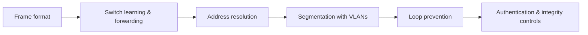

# 🔗 Switching & the Link Layer

> [!abstract] Switching branch
> The layer where frames are built, where switches learn who is where, and where almost every protocol was designed with no authentication whatsoever. Local-segment trust is assumed by default at Layer 2, which is why this branch ends with the controls that replace that assumption with evidence.

## 🗺️ Zero-to-Mastery Learning Path

1. [[Ethernet & Frame Structure]]
2. [[MAC Addressing & Switch Operation]]
3. [[ARP & Neighbor Discovery]]
4. [[VLANs & Trunking]]
5. [[Spanning Tree & Loop Prevention]]
6. [[Link Layer Security Controls]]

---
> 🔼 Up: [[Networking]]
