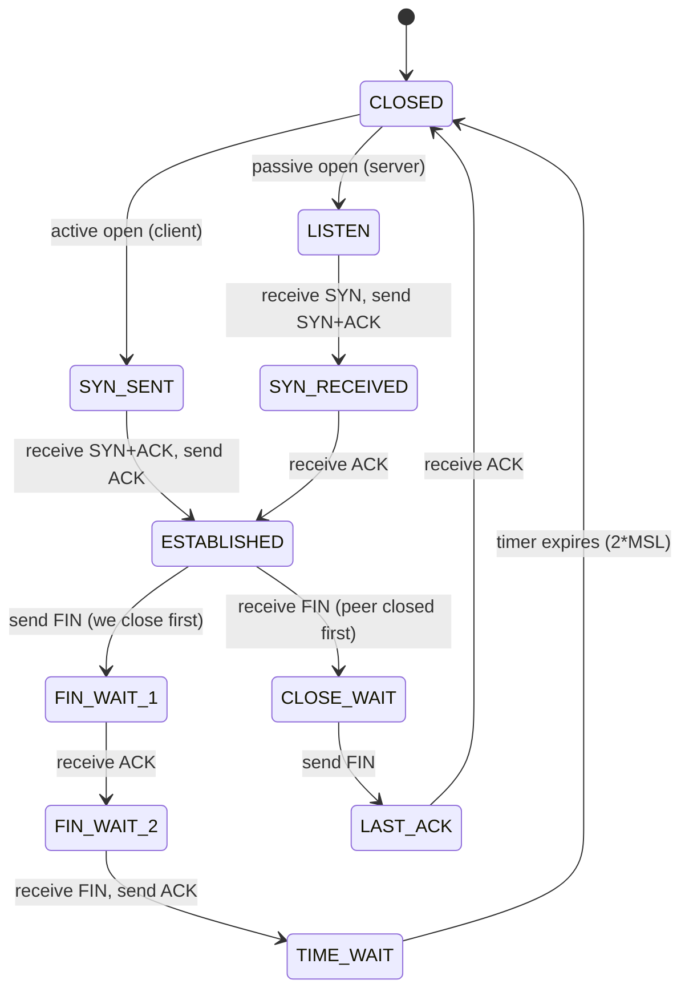

# 🤝 TCP Connections & State

> [!abstract] Note of [[Transport Layer & Sockets]]
> TCP invents the idea of a connection on top of a network that has none. This note traces the handshake that creates that shared fiction, the state machine both ends maintain, the teardown that is messier than the setup, and why every scanning technique and every exhaustion attack is really a statement about this state machine.

## Parent Learning Order
Ports & Sockets -> TCP Connections & State -> TCP Reliability & Congestion Control -> UDP & Connectionless Transport -> QUIC & Modern Transport -> Transport Layer Threats & Controls

## Start at Zero: A Connection Is an Agreement, Not a Wire

IP delivers individual packets independently, with no memory that one packet has anything to do with the next. **TCP (Transmission Control Protocol)** builds on that a **connection**: an agreement between two endpoints that they are engaged in one ordered, reliable conversation.

Nothing physical is created. A "connection" is simply matching state held at both ends — sequence numbers, buffers, and a current state value — plus the discipline to maintain it. If one side loses that state, the connection is broken even though nothing on the network changed.

The header fields that carry the agreement:

| Field | Purpose |
| --- | --- |
| Source / destination port | Which programs are talking |
| **Sequence number** | Position of this segment's first byte in the stream |
| **Acknowledgment number** | Next byte expected from the peer |
| **Flags** | SYN, ACK, FIN, RST, PSH, URG — control the state machine |
| Window | How much more data the sender may send unacknowledged |
| Checksum | Error detection over header and payload |

The flags that matter for state are four: **SYN** (synchronize — open), **ACK** (acknowledge), **FIN** (finish — graceful close), and **RST** (reset — abrupt abort).

## The Three-Way Handshake

Opening a connection takes three segments, and each has a specific job beyond "saying hello."

```mermaid
sequenceDiagram
    participant C as Client
    participant S as Server
    Note over C: State CLOSED -> SYN-SENT
    C->>S: SYN, seq=x
    Note over S: LISTEN -> SYN-RECEIVED (half-open state allocated)
    S-->>C: SYN+ACK, seq=y, ack=x+1
    Note over C: SYN-SENT -> ESTABLISHED
    C->>S: ACK, ack=y+1
    Note over S: SYN-RECEIVED -> ESTABLISHED
    Note over C,S: Both sides now have matching state; data may flow
```

Read it as an exchange of **initial sequence numbers**. The client proposes `x`; the server acknowledges `x+1` and proposes its own `y`; the client acknowledges `y+1`. Each direction of the stream is numbered independently, and both sides must confirm the other's starting point before data can be tracked reliably.

Two consequences follow immediately.

**Half-open state is allocated on the second step.** When the server sends SYN+ACK, it has committed memory to a connection that is not yet complete, and it waits for the final ACK. That waiting state, held for a client who may never respond, is a finite resource — and deliberately creating many such states is the SYN flood attack.

**Initial sequence numbers must be unpredictable.** If an attacker can guess the server's initial sequence number, they can forge segments that the server accepts as part of an existing connection, injecting data or resetting it without being on the path. Early implementations used predictable increments and were exploitable; modern stacks randomize initial sequence numbers specifically to make off-path injection impractical. This is one of the clearest examples of a security property retrofitted into a protocol's core mechanics.

## The State Machine

Both endpoints track a state, and transitions are driven by flags sent and received.



Observe the state distribution on a live host:

```bash
ss -tan | awk 'NR>1 {print $1}' | sort | uniq -c | sort -rn
```

Expected excerpt:

```text
    412 ESTAB
     87 TIME-WAIT
     14 LISTEN
      3 CLOSE-WAIT
```

This one command is a fast health check, because each state means something specific when it accumulates.

## Teardown, and the Two States That Worry Operators

Closing is a **four-way** exchange, not three, because TCP connections are full-duplex and each direction closes independently. One side sends FIN meaning "I have no more data," the peer acknowledges, and later the peer sends its own FIN, which is acknowledged in turn. A connection can therefore be half-closed — one direction finished while the other still transmits.

**TIME-WAIT** is normal and widely misunderstood. The side that closes *first* enters TIME-WAIT and remains there for twice the maximum segment lifetime. It exists for two reasons: to absorb any delayed duplicate segments from the connection just closed, so they cannot be misinterpreted as belonging to a new connection reusing the same five-tuple; and to ensure the final ACK can be retransmitted if lost. Thousands of TIME-WAIT entries on a busy server or proxy are expected, not a fault. They consume some memory and can, in extreme cases, contribute to ephemeral port exhaustion on a client making very many short outbound connections — but the reflex to "get rid of TIME-WAIT" usually trades a correctness guarantee for a marginal resource gain.

**CLOSE-WAIT** is the one that indicates a bug. It means the peer sent FIN, the kernel acknowledged it, and the connection is waiting for the **local application** to close its socket. Accumulating CLOSE-WAIT entries mean an application is not closing sockets it should — a file-descriptor leak that ends in the process being unable to accept new connections. Unlike TIME-WAIT, this state does not clear on a timer; it clears when the application acts, or when it dies.

```text
Many TIME-WAIT  -> usually normal for a busy client or proxy
Many CLOSE-WAIT -> application bug: sockets not being closed
Many SYN-RECV   -> half-open connections: load spike or SYN flood
```

## What Scanning Really Measures

Port scanning is entirely an exercise in provoking state-machine responses and reading the reply. This is why scan results carry the meanings they do:

| Probe result | Reply | Interpretation |
| --- | --- | --- |
| SYN → SYN+ACK | A listener accepted the opening | **open** |
| SYN → RST | Nothing is listening; the stack rejects immediately | **closed** |
| SYN → nothing | A device dropped the probe silently | **filtered** |

A **SYN scan** sends SYN and, on receiving SYN+ACK, sends RST rather than completing the handshake — learning the port is open without ever reaching ESTABLISHED. A **connect scan** completes the handshake fully, which is more visible in application logs because the service actually accepts a connection.

```bash
nmap -sS -p 22,80,3306 192.168.10.24
```

Expected excerpt:

```text
PORT     STATE    SERVICE
22/tcp   open     ssh
80/tcp   closed   http
3306/tcp filtered mysql
```

The three states are three different facts. `closed` proves a host is alive and reachable while nothing listens on that port — genuinely useful information. `filtered` means a policy device consumed the probe, so the port's true state is unknown. Reporting `filtered` as "closed" conflates "there is a control" with "there is no service," and they demand different responses.

## Security Implications

**Half-open state is a finite, attackable resource.** A SYN flood sends many SYNs with no final ACK, filling the server's queue of half-open connections until legitimate clients cannot connect. The defense, **SYN cookies**, is elegant: instead of allocating state on receiving SYN, the server encodes the necessary state into the sequence number it sends in the SYN+ACK, and reconstructs it from the client's final ACK. State is allocated only when the handshake completes, so an attacker who never completes it consumes nothing.

**RST injection terminates connections.** A forged RST that matches an existing connection's five-tuple and falls within the expected sequence window causes the endpoint to tear down the connection immediately. An on-path attacker can do this trivially; an off-path attacker must guess the sequence window, which sequence randomization and window checks make substantially harder. This mechanism has been used both for censorship and for disruption.

**Connection state is high-value telemetry.** Because TCP state is explicit, it is observable. Correlating established connections with owning processes, destinations, and timing distinguishes routine traffic from unexpected outbound sessions. Connection-state monitoring is one of the few network signals that directly implicates a specific local process.

**Stateful middleboxes inherit the resource limit.** Firewalls, load balancers, and NAT devices track the same state, so their tables are also finite and also exhaustible. A device that runs out of connection-tracking capacity drops new legitimate flows, converting a security control into an outage.

Scanning and flood testing described here must be confined to systems within an authorized scope. SYN flooding in particular affects availability for every user of the target and is destructive outside a controlled lab.

## Authorized Lab: Walk the State Machine

Use two lab VMs. Record a baseline of connection states before starting.

1. **Watch a handshake.** Start a capture, then make one connection:

```bash
sudo tcpdump -i eth0 -nn -c 8 'tcp port 8080' &
curl -s http://<server>:8080/ > /dev/null
```

Expected excerpt:

```text
IP client.52418 > server.8080: Flags [S], seq 1829304857, win 64240
IP server.8080 > client.52418: Flags [S.], seq 998172634, ack 1829304858
IP client.52418 > server.8080: Flags [.], ack 998172635
...
IP client.52418 > server.8080: Flags [F.], seq ..., ack ...
IP server.8080 > client.52418: Flags [F.], seq ..., ack ...
```

Confirm the acknowledgment numbers are each peer's sequence plus one, and identify the four teardown segments.

2. **Observe TIME-WAIT.** Immediately after the transfer, on the side that closed first:

```bash
ss -tan state time-wait '( sport = :8080 or dport = :8080 )'
```

Confirm the entry exists and disappears on its own after the timer. No action is needed or appropriate.

3. **Create CLOSE-WAIT deliberately.** Write or run a small server that accepts a connection and then never closes its socket. Connect and disconnect from the client, then check the server:

```bash
ss -tan state close-wait
```

Confirm the entry persists indefinitely — this is the application-bug signature, and note that it does **not** clear on a timer.

4. **Compare scan states.** From the client, scan three ports on the server: one with a listener, one with nothing listening, and one blocked by a firewall rule you add. Confirm you get `open`, `closed`, and `filtered` respectively, and articulate what each proves.

5. **Observe half-open state under load.** Generate a burst of connection attempts that do not complete, and watch `SYN-RECV` entries accumulate:

```bash
watch -n1 "ss -tan state syn-recv | wc -l"
```

Then enable SYN cookies and repeat, confirming the queue no longer grows the same way:

```bash
sudo sysctl -w net.ipv4.tcp_syncookies=1
```

6. **Cleanup.** Stop the test servers, remove the firewall rule, restore `tcp_syncookies` to its original value, and confirm the connection-state distribution matches your baseline.

Expected interpretation:

```text
Handshake     -> three segments exchange and confirm both initial sequence numbers
TIME-WAIT     -> normal, self-clearing, protects a reused five-tuple
CLOSE-WAIT    -> application never closed the socket; will not self-clear
open/closed/filtered -> a listener, a live host with no listener, and a policy device
SYN cookies   -> state allocated only on handshake completion, so floods consume nothing
```

## Crook → Operator → Root Checkpoint

- **Crook:** Explain that a connection is matching state rather than a physical path; describe the three-way handshake and what each segment accomplishes.
- **Operator:** Read connection-state distributions and correctly diagnose accumulating TIME-WAIT versus CLOSE-WAIT versus SYN-RECV; explain the difference between `closed` and `filtered` scan results and why conflating them misleads.
- **Root:** Explain why half-open state is exhaustible and how SYN cookies remove the resource without breaking the protocol; describe why initial sequence number randomization defeats off-path injection and RST attacks, and why stateful middleboxes inherit the same exhaustion risk.

---
> 🔼 Up: [[Transport Layer & Sockets]]
