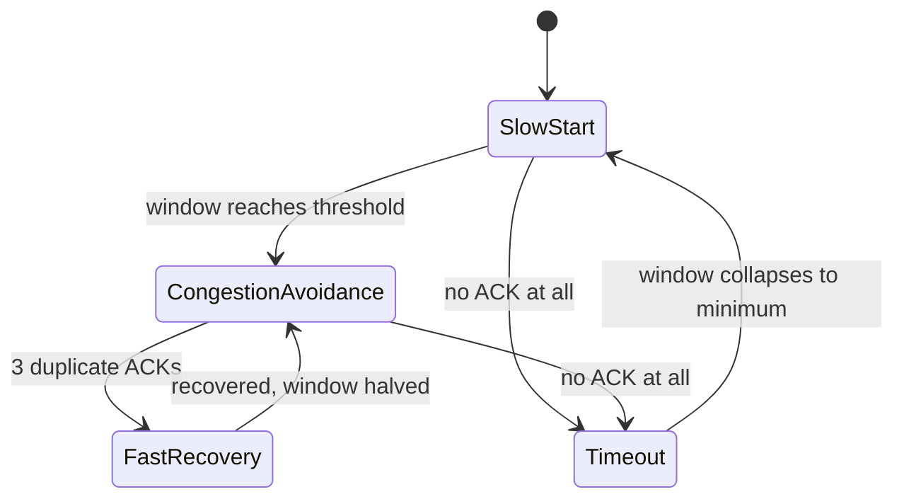

# 📶 TCP Reliability & Congestion Control

> [!abstract] Note of [[Transport Layer & Sockets]]
> TCP promises that bytes arrive, in order, without duplication, over a network that guarantees none of that. This note explains the machinery behind the promise — acknowledgments, retransmission, and two independent windows — and why understanding it turns "the network is slow" from a complaint into a measurable, attributable diagnosis.

## Parent Learning Order
Ports & Sockets -> TCP Connections & State -> TCP Reliability & Congestion Control -> UDP & Connectionless Transport -> QUIC & Modern Transport -> Transport Layer Threats & Controls

## Start at Zero: Building Certainty on an Unreliable Base

IP may drop, duplicate, delay, or reorder packets, and it never reports doing so. TCP delivers a byte stream that suffers none of these problems. The mechanism is conceptually simple and its consequences are subtle.

**Every byte is numbered.** The sequence number gives each byte a position in the stream. The receiver acknowledges the next byte it expects, which implicitly confirms everything before it — a **cumulative acknowledgment**.

From numbering plus acknowledgment, all four guarantees follow:

| Guarantee | Mechanism |
| --- | --- |
| **Delivery** | Unacknowledged data is retransmitted after a timeout |
| **Ordering** | The receiver buffers out-of-order segments and reassembles by sequence number |
| **De-duplication** | A byte range already received is discarded if it arrives again |
| **Integrity** | The checksum causes corrupted segments to be dropped and retransmitted |

The receiver never says "I did not get segment 5." It repeatedly says "I am still expecting byte 5000," and the sender infers loss. This distinction matters, because inference from acknowledgments is what makes TCP both robust and occasionally slow to react.

## Two Windows, Two Different Problems

The single most common misunderstanding of TCP is treating "the window" as one thing. There are two, they solve different problems, and the sender is limited by whichever is smaller.

**The receive window (flow control)** protects the *receiver*. It is advertised in every segment: "I have this much buffer space left." If the receiving application is slow to read, the buffer fills, the advertised window shrinks, and the sender must slow down. A window of zero halts transmission until the receiver advertises space again. This prevents a fast sender from overwhelming a slow receiver.

**The congestion window (congestion control)** protects the *network*. It is not advertised by anyone — the sender maintains it as an estimate of how much data the path can absorb without loss. It grows while things go well and shrinks sharply when loss occurs.

```text
Data in flight = min(receive window, congestion window)
```

Diagnostically this is powerful. If throughput is limited by the receive window, the receiving application or host is the bottleneck. If it is limited by the congestion window, the path is. These call for completely different remediation, and distinguishing them is the difference between tuning the right thing and guessing.

## How the Congestion Window Moves

The classic algorithm has distinct phases:

1. **Slow start.** Begin with a small window and grow it exponentially — roughly doubling each round trip — until reaching a threshold or encountering loss. Despite the name, this is the fastest growth phase; it is "slow" only relative to immediately blasting at full rate.
2. **Congestion avoidance.** Past the threshold, grow linearly (about one segment per round trip), probing cautiously for more capacity.
3. **Loss detected by triple duplicate ACK.** Three acknowledgments repeating the same expected byte suggest one segment was lost while later ones arrived. The sender halves its window and retransmits immediately — **fast retransmit and fast recovery**. This is the graceful case.
4. **Loss detected by timeout.** No acknowledgment arrives at all. This is treated as severe: the window collapses to its minimum and slow start begins again. Recovery is far more expensive than the duplicate-ACK path.



The asymmetry in the diagram is the practical lesson: loss detected by duplicate ACKs costs half the window, while loss detected by timeout costs nearly everything. A path with occasional isolated loss performs acceptably; a path with loss patterns that defeat fast retransmit — bursty loss, or loss of the final segments in a flow — performs terribly for the same overall loss percentage.

**The historical assumption** underlying all of this is that loss means congestion. That held on wired networks where corruption was rare. On wireless links, where loss frequently comes from interference rather than a full queue, TCP misreads corruption as congestion and needlessly reduces its rate. Modern congestion control algorithms — notably BBR, which models the path's bandwidth and round-trip time rather than reacting purely to loss — were designed partly to address this mismatch.

## Bandwidth-Delay Product and Long Fat Paths

Throughput is bounded by how much data can be in flight, divided by the round-trip time:

```text
Maximum throughput ≈ window size / round-trip time
```

The **bandwidth-delay product** is the amount of data needed in flight to keep a path fully utilized. A 1 Gbps path with 100 ms round-trip time requires about 12.5 MB in flight. The original TCP window field is 16 bits — a maximum of 65,535 bytes — which on that path caps throughput at roughly 5 Mbps regardless of the gigabit capacity.

**Window scaling**, negotiated during the handshake, multiplies the advertised window by a factor to lift this ceiling. It is why a modern high-latency, high-bandwidth transfer performs at all. When a middlebox strips or mangles the window-scale option during the handshake, throughput collapses to the unscaled ceiling — a genuinely confusing failure where a fast link delivers a few megabits and every simple test looks fine.

Inspect live per-connection transport state:

```bash
ss -tin
```

Expected excerpt:

```text
ESTAB 0 0  192.168.10.24:52418  93.184.216.34:443
    cubic wscale:7,7 rto:212 rtt:11.4/2.1 mss:1448 cwnd:42 ssthresh:31
    bytes_sent:1842910 bytes_acked:1842910 retrans:0/3 rcv_space:14480
```

Every field here is diagnostic:

- `cubic` — the congestion control algorithm in use.
- `wscale:7,7` — window scaling negotiated in both directions. Its absence on a high-latency path is a red flag.
- `rtt:11.4/2.1` — smoothed round-trip time and its variance. Rising variance indicates queueing.
- `cwnd:42` — the congestion window in segments. A window pinned small while `retrans` climbs means the path is lossy.
- `retrans:0/3` — currently retransmitting none, three total over the connection's life. A high ratio against `bytes_sent` is the objective measure of path quality.

### The diagnosis this enables

A user reports a slow transfer. Compare two cases:

```text
Case A: cwnd:8  ssthresh:8  retrans:184/912  rtt:48/31
Case B: cwnd:210 ssthresh:180 retrans:0/0    rtt:11/1   rcv_space:64240 (Send-Q large)
```

Case A shows heavy retransmission, a collapsed congestion window, and high RTT variance — the **path** is losing packets, and no server tuning will fix it. Case B shows a healthy path with no loss but data queued locally; the limit is the receive window or the peer application's read rate — the **endpoint** is the bottleneck. Same symptom, opposite causes, distinguished in one command.

## Security Implications

**Congestion control is voluntary, and that is a systemic risk.** TCP's fairness depends on endpoints implementing back-off honestly. A modified stack that ignores congestion signals gains bandwidth at the expense of every well-behaved flow sharing the path. At scale this is a denial-of-service vector: aggressive or non-responsive flows can starve legitimate traffic without sending an obviously malicious packet.

**Acknowledgment manipulation attacks the sender.** Because the sender's rate is driven by acknowledgments, a receiver that acknowledges data it has not received — or acknowledges in small increments to induce many small segments — can manipulate the sender into transmitting far faster than the path supports, or into consuming excessive CPU. These optimistic-acknowledgment and small-window attacks exploit the trust the sender places in the receiver's reports.

**Deliberately slow connections exhaust servers.** Holding many connections open while advertising a tiny receive window forces a server to keep each connection and its buffers alive for a long time with almost no data transferred. This consumes connection slots rather than bandwidth, which is why it evades volumetric defenses. Mitigation is per-connection timeouts, minimum-throughput requirements, and connection limits per source rather than bandwidth thresholds.

**Retransmission behaviour is a fingerprint.** Retransmission timing, congestion algorithm, window scaling, and option ordering differ between operating systems and stacks. Passively observing them identifies the remote platform and can distinguish a genuine client stack from a scripted one — useful defensively as telemetry, and available to an attacker as passive reconnaissance requiring no probes.

**Bufferbloat degrades everything.** Oversized buffers in network devices absorb congestion instead of signalling it, so loss is delayed and TCP keeps increasing its rate while latency climbs into seconds. The link looks fully utilized and every interactive application becomes unusable. Active queue management exists to restore the loss signal that congestion control depends on.

Any traffic generation or transport testing described here must remain within an authorized scope; saturating a shared path affects every user of it.

## Authorized Lab: Make the Bottleneck Visible

Use two lab VMs with a link whose characteristics you can manipulate. Record baseline transport metrics first.

1. **Baseline transfer.** Move a large file between the hosts and capture the transport state mid-transfer:

```bash
ss -tin '( dport = :22 or sport = :22 )'
```

Record `rtt`, `cwnd`, `retrans`, and whether `wscale` was negotiated.

2. **Introduce latency** on the sending host and repeat:

```bash
sudo tc qdisc add dev eth0 root netem delay 100ms
```

Confirm `rtt` rises, throughput falls, and `cwnd` must grow much larger to sustain the same rate — demonstrating the bandwidth-delay product directly.

3. **Introduce loss** instead of latency:

```bash
sudo tc qdisc change dev eth0 root netem loss 2%
```

Confirm `retrans` climbs and `cwnd` stays suppressed. Note that 2% loss costs far more than 2% of throughput — this is the nonlinearity that makes lossy paths feel broken.

4. **Combine both** and observe the compounding effect, the classic "long fat lossy path" that performs far worse than either impairment alone.

5. **Create a receiver-side bottleneck.** Run a receiving application that reads very slowly from its socket. Confirm on the sender that `Send-Q` grows while `retrans` stays at zero and `rtt` stays low — the signature of an endpoint bottleneck rather than a path problem.

6. **Contrast the two diagnoses** explicitly: write down which metrics distinguished step 3 from step 5.

7. **Cleanup.** Remove the traffic-control impairments and confirm baseline metrics return:

```bash
sudo tc qdisc del dev eth0 root
```

Expected interpretation:

```text
Added latency -> rtt up, throughput down, larger cwnd needed (bandwidth-delay product)
Added loss    -> retrans up, cwnd suppressed; small loss costs disproportionate throughput
Slow reader   -> Send-Q grows, retrans zero, rtt normal -> endpoint, not path
Cleanup       -> metrics return to baseline, confirming each impairment was the cause
```

## Crook → Operator → Root Checkpoint

- **Crook:** Explain how numbering and acknowledgment produce delivery, ordering, and de-duplication over an unreliable network.
- **Operator:** Read `ss -tin` output to distinguish a path bottleneck (loss, retransmission, suppressed congestion window) from an endpoint bottleneck (queued data, healthy path); explain why window scaling matters on high-latency links.
- **Root:** Explain why loss detected by timeout is far costlier than loss detected by duplicate acknowledgments, and why the loss-equals-congestion assumption misfires on wireless; describe how optimistic acknowledgments and tiny advertised windows attack a sender's rate control and connection capacity, and why bufferbloat breaks the signal congestion control depends on.

---
> 🔼 Up: [[Transport Layer & Sockets]]
