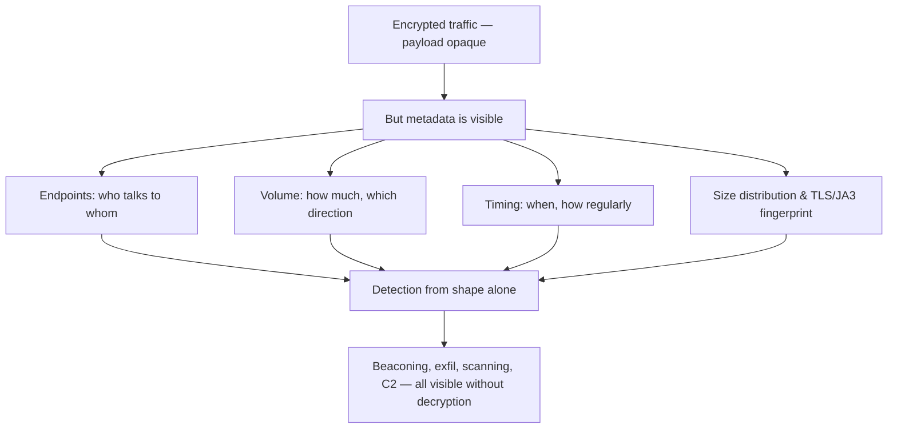

# 📈 Traffic Analysis & Flow Inspection

> [!abstract] Note of [[Network Analysis & Troubleshooting]]
> Individual packets are trees; traffic analysis is the forest. This note moves from single-packet inspection to reasoning about conversations and patterns — reassembling streams, following a flow, and reading the shape of traffic — and shows why the shape alone reveals attacks even when encryption hides every payload.

## Parent Learning Order
Packet Capture & Analysis -> Structured Network Troubleshooting -> Traffic Analysis & Flow Inspection -> Performance & Latency Analysis -> Connectivity Diagnostics -> Protocol Debugging & Deep Inspection

## Start at Zero: From Packets to Conversations

Capturing packets is the raw material; **traffic analysis** is making sense of them. A single packet rarely tells a story — the story is in the *conversation* it belongs to and the *pattern* those conversations form. Analysis operates at three widening scopes:

- **The packet** — one message, its headers and payload. Useful for a specific detail.
- **The flow / stream** — a full conversation between two endpoints, reassembled in order. This is where most troubleshooting lives, because problems are about exchanges, not lone packets.
- **The pattern** — the aggregate shape of many flows over time: who talks to whom, how much, how often. This is where security detection lives.

The move up these scopes is the skill. A beginner reads packets; an analyst reads conversations and patterns.

## Following a Stream

A single TCP conversation is scattered across many packets, interleaved with other traffic and possibly out of order. **Stream reassembly** collects a flow's packets and reconstructs the ordered byte stream — turning a pile of segments back into the request and response a human can read.

```bash
# extract and reassemble one TCP conversation from a capture
tshark -r capture.pcap -q -z follow,tcp,ascii,0
```

Expected excerpt:

```text
===================================================================
Follow: tcp,ascii
Filter: tcp.stream eq 0
Node 0: 10.0.5.22:52418
Node 1: 93.184.216.34:80
===================================================================
GET /login HTTP/1.1
Host: example.com
User-Agent: curl/8.4.0

HTTP/1.1 200 OK
Content-Type: text/html
...
```

Reassembly is what makes a capture *readable*. For cleartext protocols it reconstructs the entire exchange — the HTTP request and response, the SMTP conversation, the credentials in the clear. This is the concrete power of a capture position over unencrypted traffic, and the concrete argument for encryption: reassembling a TLS stream yields only ciphertext.

The essential idea for organizing analysis is the **conversation** view — a summary of every endpoint pair, with packet and byte counts:

```bash
tshark -r capture.pcap -q -z conv,tcp
```

Expected excerpt:

```text
                           |       <-      | |       ->      | |     Total     |
                           | Frames  Bytes | | Frames  Bytes | | Frames  Bytes |
10.0.5.22    <-> 93.184... |    412  512340 | |    288   28104 | |    700  540444 |
10.0.5.99    <-> 185.22... |  88291 14000000| |  44102  3200000| | 132393 17200000|
```

The second row jumps out: a host moving 17 MB in a conversation, heavily outbound, to an unfamiliar address. The conversation view surfaces the anomaly that packet-by-packet reading would never reveal — this is analysis at the pattern scope.

## Baselines: Knowing What Normal Looks Like

The recurring theme of the analysis branch, and of the whole domain: **you cannot recognize abnormal without a baseline of normal.** Traffic analysis for security depends on knowing your network's usual shape — which hosts talk to which, on what ports, at what volumes, at what times. Against that baseline, anomalies stand out:

- A workstation connecting to hundreds of internal hosts (scanning / lateral movement).
- A server suddenly talking to an external address it never contacted before (possible C2).
- A large outbound transfer at an unusual hour (possible exfiltration).
- Regular, identical small connections at fixed intervals (beaconing).

None of these require reading payloads. They are visible in the *metadata* — endpoints, ports, volumes, timing — which is exactly why this analysis survives encryption.

## Reading Encrypted Traffic Without Decrypting It

The defining reality of modern traffic analysis is that most payloads are encrypted. Content inspection is dead for TLS and QUIC; what remains is the **shape**, and the shape says a great deal.



Consider what each metadata dimension reveals even when content is opaque:

- **Beaconing** has a rhythm — a connection every N seconds, regardless of content — that stands out from human-driven traffic.
- **Exfiltration** has a volume and direction — large and outbound — regardless of what the bytes are.
- **The TLS handshake itself is partly cleartext** — the SNI (which host), the certificate, and the client's cipher ordering form a **fingerprint** (often called JA3) that can identify the *client software*, distinguishing a normal browser from a malware family even inside encryption.

This is why the management-protocols leaf called flow metadata "the visibility encryption does not remove," and why modern network detection is built on it. Traffic analysis in the encrypted era is behavioural analysis of metadata, and it is remarkably effective.

## Security Implications

**Analysis is where detection actually happens.** Firewalls and IDS generate events, but understanding whether those events are an attack requires analyzing the traffic in context — the flows, the patterns, the deviation from baseline. Traffic analysis is the analytical core of both troubleshooting and threat detection, and the same reassembly and conversation techniques serve both.

**Metadata analysis is the answer to encryption.** As content inspection fades, the security value of traffic analysis shifts entirely to metadata and behaviour. An organization that can only inspect content is going blind; one that analyzes flow patterns retains visibility. This is a strategic point, not a tactical one: detection capability must be built on the metadata that survives encryption.

**Baselines are the prerequisite, and they decay.** Every anomaly-based conclusion depends on an accurate baseline, and networks change, so baselines must be maintained. A baseline built while an attacker was already present bakes their activity into "normal" — which is why baselines should be established from known-clean periods and reviewed as the environment evolves.

**Attackers shape traffic to evade analysis.** Knowing that shape reveals them, sophisticated attackers mimic normal patterns — beaconing at irregular intervals, exfiltrating slowly to stay under volume thresholds, blending with legitimate cloud services. Each evasion costs them and constrains them (slow exfiltration buys the defender time), but it means analysis must look for subtle deviation, not just gross anomaly.

**Analysis evidence is authoritative and sensitive.** A reassembled stream or a flow record is strong evidence of what happened, valuable for incident response and, correspondingly, sensitive — it may contain the very data an attacker sought. Handling of captures and flow data is a data-protection concern, as noted in the capture leaf.

All analysis described here must be performed only on traffic you are authorized to inspect. Reassembling and analyzing others' communications without authorization is unlawful, and captures may contain sensitive data requiring careful handling.

## Authorized Lab: See the Shape

Use a capture from a lab network you control, containing a mix of normal traffic and some deliberately anomalous flows you generate.

1. **Follow a cleartext stream.** Reassemble an HTTP conversation from the capture and confirm you can read the full request and response — the power of analysis over unencrypted traffic.
2. **Contrast with encrypted.** Reassemble a TLS conversation and confirm you get only ciphertext, but that the handshake reveals the SNI and certificate — metadata visible despite encryption.
3. **Build a conversation view.** Generate the TCP conversation summary and identify the highest-volume and most unusual flows, practicing pattern-scope analysis.
4. **Establish a baseline.** Characterize the normal traffic — typical endpoints, ports, volumes — so you have a reference.
5. **Inject anomalies and detect them by shape.** Generate (in the lab) a beaconing pattern, a large outbound transfer, and an internal host scan. For each, confirm you can detect it from metadata alone — timing regularity, volume and direction, connection fan-out — without reading any payload.
6. **Fingerprint a client.** From two different client tools, capture the TLS handshakes and confirm their cipher/extension ordering differs, showing how the handshake fingerprints the client software.
7. **Cleanup.** Delete lab captures containing sensitive data.

Expected interpretation:

```text
Cleartext stream   -> full request/response reassembled and readable
TLS stream         -> ciphertext only, but SNI and certificate visible
Conversation view  -> surfaces the high-volume/unusual flow packets hide
Baseline           -> defines normal so anomalies stand out
Beacon/exfil/scan  -> all detectable from metadata shape, no payload needed
TLS fingerprint    -> handshake ordering identifies the client software
```

## Crook → Operator → Root Checkpoint

- **Crook:** Explain the three scopes of analysis (packet, flow, pattern) and what stream reassembly produces.
- **Operator:** Reassemble a conversation, build and read a conversation summary to find anomalous flows, and explain why a baseline is required to call anything abnormal.
- **Root:** Explain why traffic analysis in the encrypted era is behavioural analysis of metadata, what each metadata dimension reveals (endpoints, volume, timing, fingerprint), and why this is the visibility that survives encryption — and how attackers shape traffic to evade it.

---
> 🔼 Up: [[Network Analysis & Troubleshooting]]
