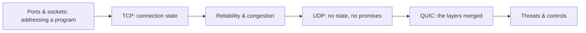

# 🔌 Transport Layer & Sockets

> [!abstract] Transport branch
> The layer that turns "this host" into "this program on this host," and that decides whether delivery is guaranteed or merely attempted. Connection state is created here, which makes this the layer where scanning gets its answers and where exhaustion attacks find a finite resource to consume.

## 🗺️ Zero-to-Mastery Learning Path

1. [[Ports & Sockets]]
2. [[TCP Connections & State]]
3. [[TCP Reliability & Congestion Control]]
4. [[UDP & Connectionless Transport]]
5. [[QUIC & Modern Transport]]
6. [[Transport Layer Threats & Controls]]

---
> 🔼 Up: [[Networking]]
