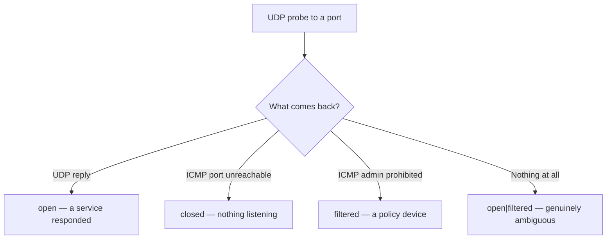
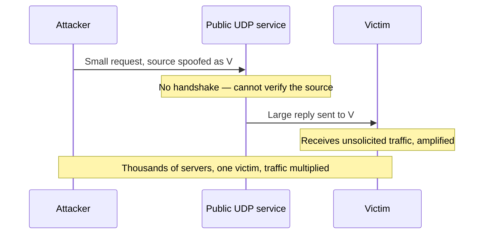

# 📨 UDP & Connectionless Transport

> [!abstract] Note of [[Transport Layer & Sockets]]
> UDP is TCP with everything removed: no handshake, no state, no ordering, no retransmission. That minimalism makes it the right choice for a large class of applications and makes it the engine of the largest denial-of-service attacks ever recorded. This note explains both consequences from the same eight-byte header.

## Parent Learning Order
Ports & Sockets -> TCP Connections & State -> TCP Reliability & Congestion Control -> UDP & Connectionless Transport -> QUIC & Modern Transport -> Transport Layer Threats & Controls

## Start at Zero: Eight Bytes and No Promises

**UDP (User Datagram Protocol)** provides exactly one service beyond raw IP: **demultiplexing to a port**, plus an optional checksum. Its entire header is eight bytes.

| Field | Size | Purpose |
| --- | --- | --- |
| Source port | 2 bytes | Where a reply should go (may be zero if none expected) |
| Destination port | 2 bytes | Which program receives this datagram |
| Length | 2 bytes | Header plus payload |
| Checksum | 2 bytes | Error detection; optional in IPv4, mandatory in IPv6 |

Compare with TCP's twenty-byte minimum header and its sequence numbers, acknowledgments, flags, and windows. Everything TCP uses to build reliability is absent, and its absence *is* the design:

| Property | TCP | UDP |
| --- | --- | --- |
| Connection setup | Three-way handshake | None — send immediately |
| Delivery guarantee | Retransmission until acknowledged | None |
| Ordering | Reassembled by sequence | Arrives in any order |
| Duplicate suppression | Yes | No |
| Flow / congestion control | Yes | **None** |
| Per-connection state | Both endpoints | None |
| Header overhead | 20+ bytes | 8 bytes |

A **datagram** is self-contained: it either arrives whole or does not arrive. There is no partial delivery and no relationship between one datagram and the next.

## Why Anyone Would Choose This

UDP is not a lesser TCP; it is the correct choice when TCP's guarantees are actively harmful.

**When late data is worthless.** In live voice or video, a segment that arrives 300 ms late is useless — the moment it described has passed. TCP would stall the entire stream retransmitting it, adding latency to everything behind it. UDP lets the application skip the loss and continue, which is why real-time media overwhelmingly uses UDP with application-level concealment.

**When the exchange is a single round trip.** A DNS query and its reply fit in one datagram each. A three-way handshake to exchange two small messages triples the latency and the packet count for no benefit.

**When the application knows better.** Retransmission, ordering, and pacing can be implemented above UDP with semantics tuned to the application. This is exactly what QUIC does — and it is why "UDP is unreliable" is a statement about the protocol, not about what runs on it.

**When broadcast or multicast is needed.** TCP is inherently point-to-point because a connection has exactly two endpoints. One-to-many delivery requires a connectionless transport.

Common UDP services: DNS (53), DHCP (67/68), NTP (123), SNMP (161), syslog (514), and QUIC/HTTP-3 (443).

## The Scanning Problem

TCP scanning is straightforward because the state machine answers: SYN+ACK means open, RST means closed. UDP has no such reply.



The bottom branch is the difficulty. Silence can mean the port is open but the service only answers a correctly formatted request, or that a firewall dropped the probe. Both produce identical observations, so scanners report `open|filtered` — an honest statement of ambiguity.

Worse, closed-port detection depends on ICMP port-unreachable messages, which hosts commonly rate-limit. A scan across many ports therefore receives only a fraction of the "closed" replies it should, and the scanner must slow down to avoid mistaking rate limiting for openness.

```bash
sudo nmap -sU -p 53,123,161 192.168.10.53
```

Expected excerpt:

```text
PORT    STATE         SERVICE
53/udp  open          domain
123/udp open|filtered ntp
161/udp closed        snmp
```

Three different epistemic positions in one output. `open` came from an actual service reply. `closed` came from an ICMP port unreachable. `open|filtered` means no evidence either way was obtained — and reporting it as "closed" would be a fabrication. This is why UDP scans are slow and why service-specific probes, which elicit a real reply, are far more reliable than empty datagrams.

## Amplification: The Structural Vulnerability

UDP's lack of a handshake creates the most consequential security property in this note. Because there is no connection setup, **a server cannot verify that the source address in a request is genuine.** It receives a request and sends a reply to whatever source address the request claimed.

An attacker exploits this in three steps:

1. Send a small request to a public UDP service, spoofing the **victim's** address as the source.
2. The service sends its reply to the victim, who never asked.
3. Choose a service whose reply is much larger than the request.



The **amplification factor** is the ratio of reply size to request size. Some UDP services have historically offered factors in the tens or even thousands, meaning an attacker with modest bandwidth can direct enormous traffic at a victim. Because the traffic genuinely originates from many legitimate servers, it is hard to filter by source and the true attacker is hidden.

TCP is structurally immune to this: the handshake requires a reply to reach the claimed source before any data is sent, so a spoofed source never completes a connection.

The defenses operate at three levels:

- **Ingress filtering** at the source network prevents spoofed packets from ever leaving — the root fix, though it depends on other networks' hygiene.
- **Service hardening**: restrict or disable high-amplification commands, require the reply to be no larger than the request where the protocol allows, and do not expose these services publicly without need.
- **Rate limiting** per source address at the service, so a single spoofed victim cannot be targeted repeatedly through you.

The recurring theme is that operators of UDP services must protect *third parties*, not just themselves. An open, amplifying UDP service is a weapon pointed at strangers.

## Security Implications

**Statelessness cuts both ways for defenders.** There is no connection state to inspect, so a firewall cannot rely on "this is a reply to a request we made" the way it can with TCP. Stateful devices approximate it by tracking recent outbound datagrams and permitting matching returns for a short window — a heuristic, not a guarantee, and one an attacker can sometimes time around.

**UDP is attractive for tunnelling and exfiltration.** Because DNS and NTP must generally be permitted outbound, encoding data into them passes controls that examine only the five-tuple. Detection is behavioural — volume, entropy, timing regularity, unusual record or message sizes — rather than port-based.

**Spoofing is trivial and attribution is weak.** A UDP datagram's source address is unverified and there is no handshake to expose the lie. Logs attributing activity to a UDP source address should be treated as a claim, not a fact, unless the exchange included a challenge the sender had to answer.

**Absence of congestion control means UDP does not back off.** A UDP flood or a poorly written UDP application will happily saturate a link while TCP flows sharing it politely reduce their rate — so UDP traffic can starve TCP traffic. Application-level pacing is the responsibility of whoever writes the UDP application, and many do not.

All scanning and traffic generation described here must be confined to systems within an authorized scope. Amplification techniques in particular direct traffic at third parties and must never be exercised outside a fully isolated lab.

## Authorized Lab: Ambiguity, Statelessness, and Amplification

Use two lab VMs on an isolated segment. The amplification portion must not have any path to a real network.

1. **Observe the eight-byte header.** Capture a DNS query and confirm the minimal header:

```bash
sudo tcpdump -i eth0 -nn -v -c 2 'udp port 53'
```

Note the absence of any handshake — the query is the first and only packet before the reply.

2. **Demonstrate scan ambiguity.** On the server, run a UDP service on one port, leave a second port with nothing listening, and firewall-drop a third. Scan all three:

```bash
sudo nmap -sU -p <open>,<closed>,<dropped> <server>
```

Confirm you receive `open`, `closed`, and `open|filtered`, and write down what evidence produced each.

3. **Prove the closed-port dependency on ICMP.** Block outbound ICMP port-unreachable on the server, rescan, and confirm the previously `closed` port now reports `open|filtered` — demonstrating that "closed" is an ICMP-derived inference, not a UDP observation.

4. **Show statelessness.** Send a single datagram to a port with no listener and confirm the sender receives no transport-level error; the only feedback is the ICMP message, which the application may never see.

5. **Demonstrate amplification safely.** In the isolated lab only, configure a UDP service that returns a response substantially larger than the request. From the attacker VM, send requests with the source address spoofed to the third VM. Confirm the third VM receives traffic it never requested, and measure the ratio.

6. **Apply the controls.** Enable reverse-path filtering on the attacker's segment and confirm the spoofed packets are dropped at the source. Then rate-limit the service per source address and confirm the amplification is bounded even if spoofing succeeded.

7. **Cleanup.** Remove the test service, firewall rules, spoofing configuration, and reverse-path filter changes; confirm the baseline scan results and connectivity return.

Expected interpretation:

```text
No handshake       -> the first packet is already the request; no source verification possible
open|filtered      -> honest ambiguity; silence is not evidence of closure
Blocking ICMP      -> "closed" detection disappears, proving it was never a UDP signal
Spoofed source     -> service replies to a victim that never asked
Ingress filtering  -> spoofed packets never leave; the root-cause fix
Rate limiting      -> bounds the damage a single service can contribute
```

## Crook → Operator → Root Checkpoint

- **Crook:** List what UDP omits compared to TCP and give two applications where those omissions are advantages rather than deficiencies.
- **Operator:** Interpret UDP scan results correctly, explain why `open|filtered` is honest rather than a tool failure, and why closed-port detection depends on ICMP and rate limiting distorts it.
- **Root:** Explain precisely why the absence of a handshake enables reflection and amplification while TCP is structurally immune; justify ingress filtering, service hardening, and rate limiting as complementary defenses, and explain why UDP's lack of congestion control lets it starve well-behaved TCP flows.

---
> 🔼 Up: [[Transport Layer & Sockets]]
